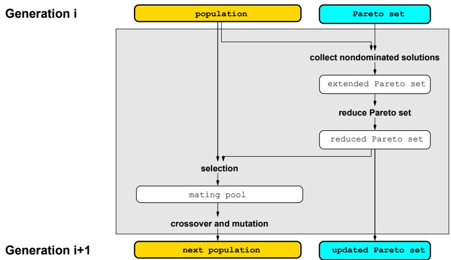
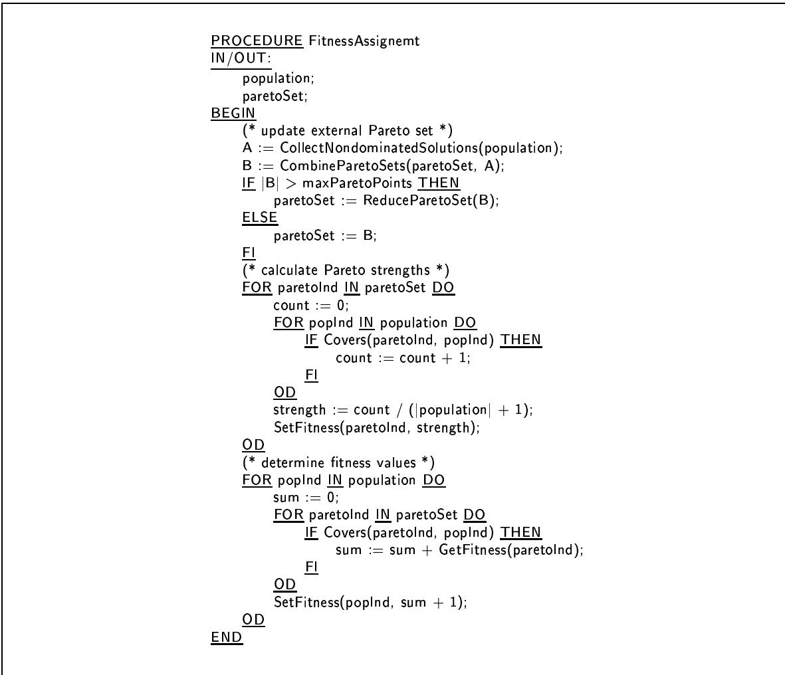
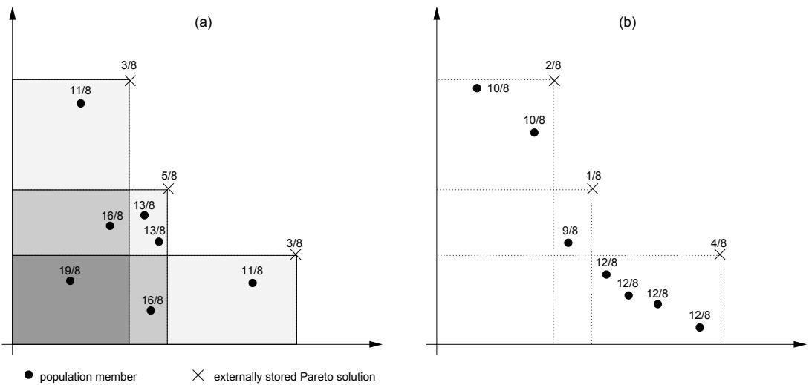
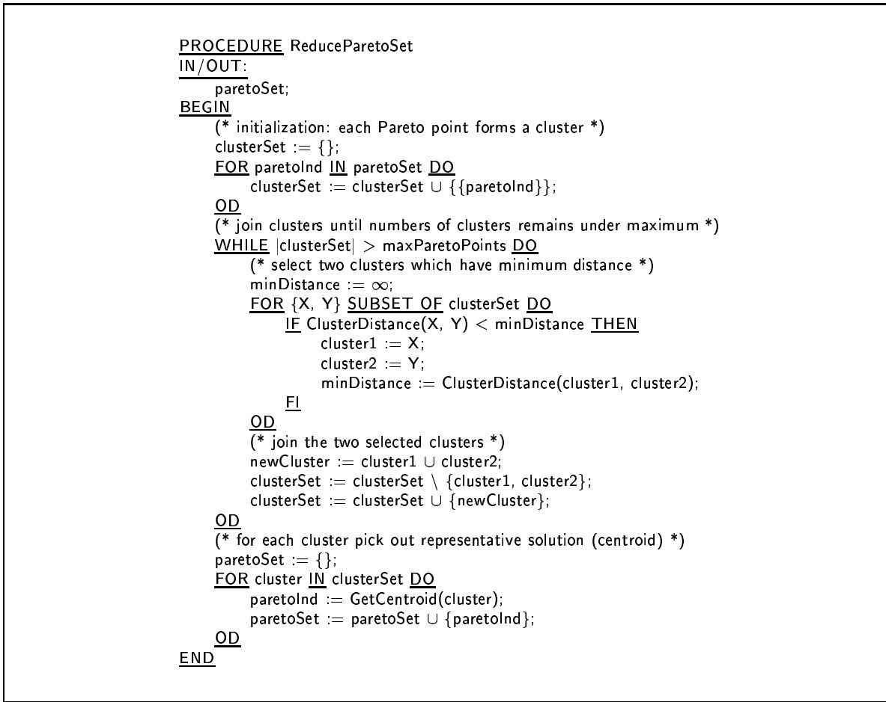
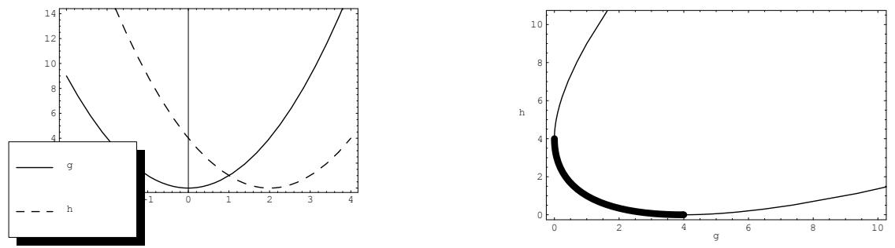
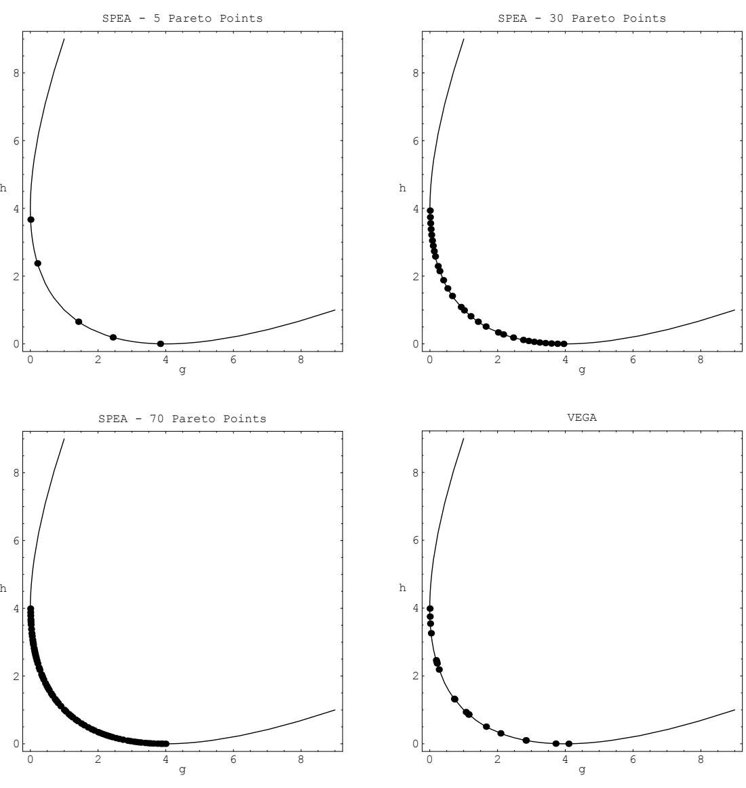
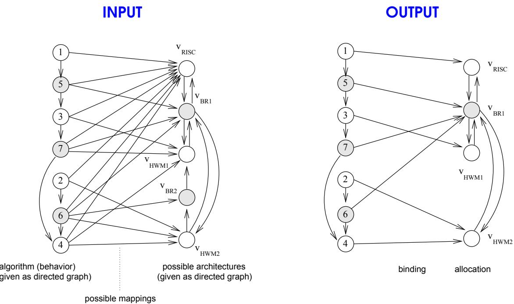
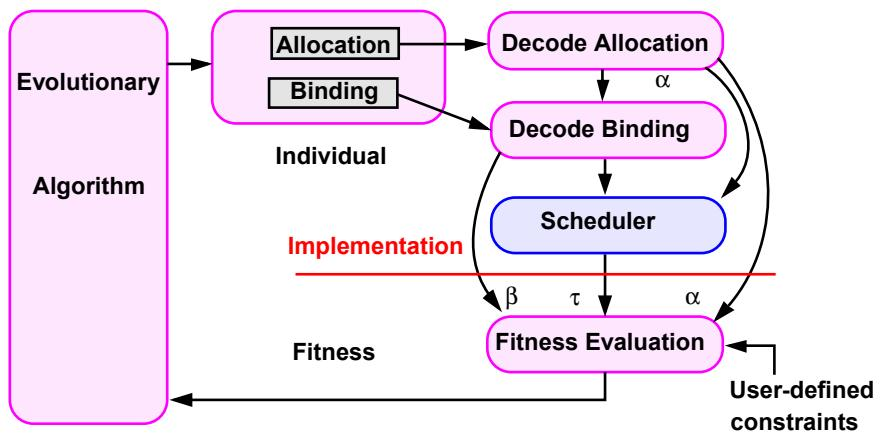
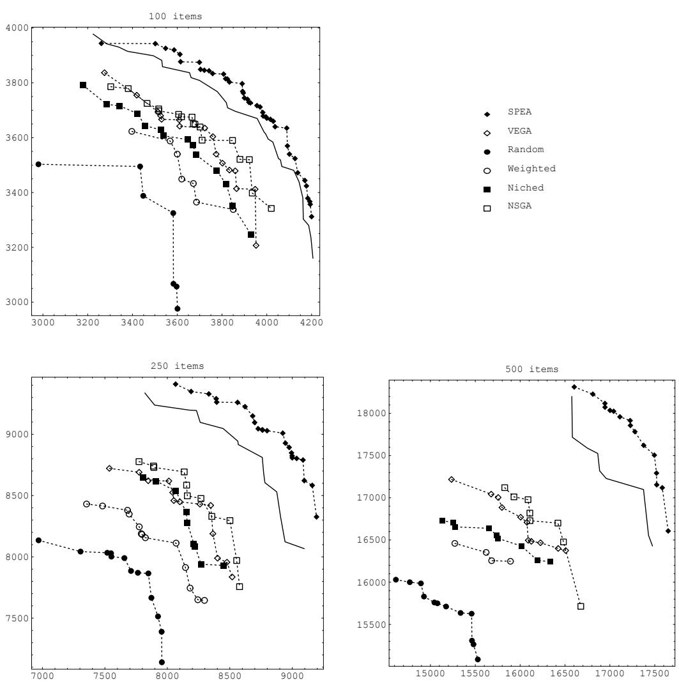
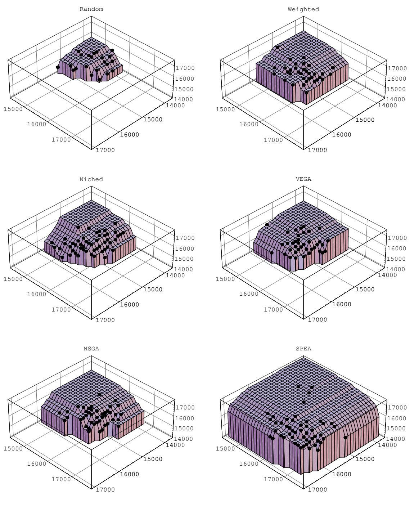

# An Evolutionary Algorithm for Multiobjective Optimization: The Strength Pareto Approach

Eckart Zitzler and Lothar Thiele Computer Engineering and Communication Networks Lab (TIK) Swiss Federal Institute of Technology (ETH) Gloriastrasse 35, CH-8092 Zurich Switzerland

TIK-Report No. 43, May 1998

# Contents

# 1 Introduction

# 2 Multiobjective Optimization Using Evolutionary Algorithms 3

2.1 Basic Definitions 3   
2.2 Classical Methods versus Evolutionary Algorithms 4   
2.3 Multimodal Search and Preservation of Diversity 5   
2.4 Fitness Assignment Strategies 6   
2.5 An Overview of Population-based Approaches 8

# 3 The Strength Pareto Evolutionary Algorithm (SPEA) 10

3.1 The Basic Algorithm . 11   
3.2 Reducing the Pareto Set by Clustering 14

# 4 Application to Two Problems 17

# 4.1 Schaffer's $f _ { 2 }$ .. 17

4.2 System-level Synthesis 19   
4.2.1 Problem description 19   
4.2.2 EA Implementation . 20   
4.2.3 Experimental Results . 21

# 5 Comparison to Other Multiobjective EAs 23

5.1 Application: The $0 / 1$ Knapsack Problem 23

5.1.1 Formulation As Multiobjective Optimization Problem . . 24   
5.1.2 Test Data . 24   
5.1.3 Implementation 25

5.2 Methodology 25

5.2.1 Performance Measures 26   
5.2.2 Selection and Mating Restrictions 26   
5.2.3 Parameter Settings 27

5.3 Experimental Results . 27

5.3.1 Comparing the Multiobjective EAs . . . 27   
5.3.2 Comparing SPEA to a Single-objective EA . . . 29

# Abstract

Evolutionary algorithms (EA) have proved to be well suited for optimization problems with multiple objectives. Due to their inherent parallelism they are able to capture a number of solutions concurrently in a single run. In this report, we propose a new evolutionary approach to multicriteria optimization, the Strength Pareto Evolutionary Algorithm (SPEA). It combines various features of previous multiobjective EAs in a unique manner and is characterized as follows: a) besides the population a set of individuals is maintained which contains the Pareto-optimal solutions generated so far; b) this set is used to evaluate the fitness of an individual according to the Pareto dominance relationship; c) unlike the commonly-used fitness sharing, population diversity is preserved on basis of Pareto dominance rather than distance; d) a clustering method is incorporated to reduce the Pareto set without destroying its characteristics. The proof-of-principle results on two problems suggest that SPEA is very effective in sampling from along the entire Pareto-optimal front and distributing the generated solutions over the tradeoff surface. Moreover, we compare SPEA with four other multiobjective EAs as well as a single-objective EA and a random search method in application to an extended $0 / 1$ knapsack problem. Regarding two complementary quantitative measures SPEA outperforms the other approaches at a wide margin on this test problem. Finally, a number of suggestions for extension and application of the new algorithm are discussed.

# Chapter 1

# Introduction

Many real-world problems involve simultaneous optimization of several incommensurable and often competing objectives. Usually, there is no single optimal solution, but rather a set of alternative solutions. These solutions are optimal in the wider sense that no other solutions in the search space are superior to them when all objectives are considered. They are known as Pareto-optimal solutions.

Consider, for example, the design of a complex hardware/software system. An optimal design might be an architecture that minimizes cost and power consumption while maximizing the overall performance. However, these goals are generally conflicting: one architecture may achieve high performance at high cost, another low-cost architecture might considerably increase power consumption—none of these solutions can be said to be superior if we donot include preference information (.. a ranking of the objectives). Thus, if no such information is available, it may be very helpful to get knowledge about those alternate architectures. A tool exploring the design space for Pareto-optimal solutions in reasonable time can essentially aid the decision maker to arrive at a final design.

Evolutionary algorithms (EAs) seem to be particularly suited for this task, because they process a set of solutions in parallel, eventually exploiting similarities of solutions by crossover. Some researcher suggest that multiobjective search and optimization might be a problem area where EAs do better than other blind search strategies [Fonseca and Fleming, 1995][Valenzuela-Rendón and Uresti-Charre, 1997].

Since the mid-eighties several multiobjective EAs have been developed, capable of searching for multiple Pareto-optimal solutions concurrently in a single run. In spite of this variety, it is difficult to determine the appropriate algorithm for a given problem because it lacks extensive, quantitative comparative studies. The few comparisons available to date are mostly qualitative and restricted to two different methods; quite often, the test problems considered are rather simple. As a consequence, it sometimes seems that every new application results in a new multiobjective EA.

In this study we have chosen another way. Firstly, we carried out an extensive comparison of different multiobjective EAs that bases on two complementary quantitative measures—the test problem was a NP-hard $0 / 1$ knapsack problem. The experience we gained from the experiments led to the development of a new approach, the Strength Pareto Evolutionary Algorithm (SPEA). SPEA integrates advantageous, established techniques used in existing EAs in a single unique algorithm; furthermore it is especially designed for search space exploration and manages with a minimal number of adjustable parameters. Then the comparison was repeated including SPEA in order to assess its performance in a meaningful and statistically sound way.

The paper is organized in the following way. Chapter 2 gives an overview of previous works in the field of evolutionary multicriteria optimization and introduces key concepts used in multiobjective EAs. The new algorithm is presented and described in detail in Chapter 3, while its application on two problems, an artificial and a real-world problem, is treated in the following chapter. Subsequently, the comparison with other multiobjective EAs is subject to Chapter 5 and the last chapter is devoted to concluding remarks and future perspectives.

# Chapter 2

# Multiobjective Optimization Using Evolutionary Algorithms

In this chapter we deal with the application of EAs for multiobjective optimization in general. The first section comprises the mathematical preliminaries concerning multiobjective optimization problems, particularly the definition of the concept of Pareto-optimality. After comparing classical optimization methods to EAs, we briefly discuss various techniques to maintain diversity in the population of an EA— preservation of diversity is crucial when multiple solutions have to be evolved in parallel. Subsequently, different fitness assignment strategies are presented which have been used in multiobjective EAs. Last not least we provide a short overview of evolutionary approaches to multiobjective optimization that are capable of generating the tradeoff surface of a given function in a single run.

# 2.1 Basic Definitions

The definitions and terms presented in this section correspond to the mathematical formulations most widespread in multiobjective EA literature (e.g., [Srinivas and Deb, 1994][Fonseca and Fleming, 1995]). For more detailed information we refer to Steuer [Steuer, 1986] and Ringuest [Ringuest, 1992].

A general multiobjective optimization problem can be described as a vector function $f$ that maps a tuple of $m$ parameters (decision variables) to a tuple of $n$ objectives, formally:

$$
{ \begin{array} { r l r l } & { { \mathrm { m i n i m i z e / m a x i m i z e } } } & & { \mathbf { y } = f ( \mathbf { x } ) = \left( f _ { 1 } ( \mathbf { x } ) , f _ { 2 } ( \mathbf { x } ) , \dots , f _ { n } ( \mathbf { x } ) \right) } \\ & { { \mathrm { s u b j e c t ~ t o } } } & & { \mathbf { x } = \left( x _ { 1 } , x _ { 2 } , \dots , x _ { m } \right) \in X } \\ & { } & & { \mathbf { y } = \left( y _ { 1 } , y _ { 2 } , \dots , y _ { n } \right) \in Y } \end{array} }
$$

where $\mathbf { x }$ is called decision vector and y objective vector.

The set of solutions of a multiobjective optimization problem consists of all decision vectors which cannot be improved in any objective without degradation in other objectives—these vectors are known as Pareto-optimal. Mathematically, the concept of Pareto-optimality is as follows: Assume, without loss of generality, a maximization problem and consider two decision vectors $a , b \in X$ . We say $a$ dominates $b$ (also written as ${ \bf a } \succ { \bf b }$ iff

$$
\forall i \in \{ 1 , 2 , \ldots , n \} : f _ { i } ( \mathbf { a } ) \geq f _ { i } ( \mathbf { b } ) \quad \wedge \quad \exists j \in \{ 1 , 2 , \ldots , n \} : f _ { j } ( \mathbf { a } ) > f _ { j } ( \mathbf { b } )
$$

Additionally, in this study we say a covers $\mathbf { b }$ $( \mathbf { a } ~ \succeq ~ \mathbf { b } )$ iff $\textbf { a } \succ \textbf { b }$ or $\textbf { a } = \textbf { b }$ . All decision vectors which are not dominated by any other decision vector are called nondominated or Pareto-optimal.1

The family of all nondominated alternate solutions is denoted as Pareto-optimal set (Pareto set for short) or Pareto-optimal front. It describes the tradeoff surface with respect to the $n$ objectives.

# 2.2 Classical Methods versus Evolutionary Algorithms

Any multiobjective optimization problem may be converted to a single-objective optimization problem by aggregating the objectives into a scalar function $s : X \to \Re$ ; that is the usual way how classical optimization techniques handle multiple objectives.

One scalarization method, known as weighted-sum approach, associates a real weight $w _ { i }$ with each objective $f _ { i }$ . Accumulating the weighted objective values yields the combined objective value:

$$
s ( \mathbf { x } ) = \sum _ { i = 1 } ^ { n } w _ { i } \cdot f _ { i } ( \mathbf { x } ) .
$$

The method of target vector optimization tries to minimize the distance to a given goal vector $\mathbf { y _ { g } } \in Y$ in the objective space:

$$
s ( \mathbf { x } ) = \parallel f ( \mathbf { x } ) - \mathbf { y _ { g } } \parallel
$$

where the metric $\| \cdot \|$ is normally defined as the Euclidean metric. This technique is strongly related to the field of goal programming [Steuer, 1986, Chapter 10].

Several analogous scalarization methods exist which, however, all require profound domain knowledge and preference information provided by the decision maker; for many practical problems this knowledge is not available. Furthermore, solving a multiobjective optimization problem by means of single-objective optimization techniques always results in a single-point solution. But often, for instance in the case of objective space exploration, there is a special interest in finding or approximating the Pareto-optimal set, mainly to gain deeper insight into the problem and knowledge about alternate solutions, respectively. Fonseca and Fleming [Fonseca and Fleming, 1995] remark in this context that

"Conventional optimization techniques, such as gradient-based and simplexbased methods, and also less conventional ones, such as simulated annealing, are difficult to extend to the true multiobjective case, because they were not designed with multiple solutions in mind."

On the other hand, it seems natural to use EAs to accomplish this task, since they work on a population of solutions. EAs are demonstrably capable of evolving a set of Pareto-optimal points simultaneously and may exploit similarities between regions of the search space by crossover. As we have already mentioned, some researchers even suggest that EAs might outperform other blind search strategies in this area [Fonseca and Fleming, 1995][Valenzuela-Rendón and Uresti-Charre, 1997]. Beyond it, the growing interest in applying EAs to problems with multiple objectives which has been observed recently speaks for itself.2

In this study we focus on finding the entire Pareto-optimal set. Although, there are many multiobjective applications where EAs have been used to optimize towards a single compromise solutions; thereby, the aforementioned scalarization techniques have been applied (see [Fonseca and Fleming, 1995] for an overview of this kind of multiobjective EAs).

# 2.3 Multimodal Search and Preservation of Diversity

When we consider the case of finding a set of nondominated solutions rather than a single-point solution, multiobjective EAs have to perform a multimodal search that samples the Pareto-optimal set uniformly. Unfortunately, a simple EA tends to converge towards a single solution and often loses solutions due to three effects [Mahfoud, 1995]: selection pressure, selection noise, and operator disruption. To overcome this problem, which is known as genetic drift, several methods have been developed that can be categorized into niching techniques and non-niching techniques [Mahfoud, 1995]. Both types aim at preserving diversity in the population (and therefore try to prevent from premature convergence), but in addition niching techniques are characterized by their capability of promoting the formulation and maintenance of stable subpopulations (niches). In the following we will briefly review the methods used in multiobjective EAs.

Fitness sharing [Goldberg and Richardson, 1987] is a niching technique which bases on the idea that individuals in a particular niche have to share the resources available, similar to nature. Thus, the fitness value of a certain individual is the more degraded the more individuals are located in its neighborhood—neighborhood is defined in terms of a distance measure $d ( i , j )$ and specified by the so-called niche radius $\sigma _ { \mathrm { s h a r e } }$ . Mathematically, the shared fitness $s _ { i }$ of an individual $i$ is equal to its

old fitness $f _ { i }$ divided by its niche count:

$$
s _ { i } = \frac { f _ { i } } { \sum _ { j = 1 } ^ { n } s h ( d ( i , j ) ) }
$$

An individual's niche count is the sum of sharing function $( s h )$ values between itself and the individuals in the population. Commonly-used are sharing functions of the form

$$
s h ( d ( i , j ) ) = \left\{ \begin{array} { l l } { 1 - \left( \frac { d ( i , j ) } { \sigma _ { \mathrm { s h a r e } } } \right) ^ { \alpha } } & { \mathrm { i f ~ } d ( i , j ) < \sigma _ { \mathrm { s h a r e } } } \\ { 0 } & { \mathrm { o t h e r w i s e } } \end{array} \right.
$$

Furthermore, depending whether the distance function $d ( i , j )$ works on the genotypes or the phenotypes, one distinguishes genotypic sharing and phenotypic sharing; phenotypic sharing can be performed on the decision vectors or the objective vectors. Nowadays, the most multiobjective EAs make use of fitness sharing (e.g., [Hajela and Lin, 1992][Fonseca and Fleming, 1993][Horn and Nafpliotis, 1993][Srinivas and Deb, 1994][Greenwood et al., 1996][Todd and Sen, 1997][Cunha et al., 1997]).

According to our knowledge other niching techniques like crowding [De Jong, 1975] and its derivatives have hardly ever been applied to EAs with multiple objectives (an exception is Blickle's EA [Blickle, 1996], cf. Section 4.2).

Among the non-niching techniques restricted mating is the most common in multicriteria function optimization. Basically, two individuals are only allowed to mate if they are in a certain distance to each other. This mechanism may avoid the formation of lethal individuals and therefore improve the on-line performance. Nevertheless, as mentioned by Fonseca and Fleming [Fonseca and Fleming, 1995], it does not appear to be very widespread in the field of multiobjective EAs, although it has been incorporated sometimes (e.g., [Hajela and Lin, 1992][Fonseca and Fleming, 1993][Loughlin and Ranjithan, 1997]).

The principle of isolation by distance, another class of non-niching techniques which embodies island models and spatial mating [Ryan, 1995], has not been introduced in multiobjective EAs, as far as we know.

# 2.4 Fitness Assignment Strategies

Selection is the mechanism in evolutionary computation that focuses the search on promising regions in the search space; it relies on the fitness function. In the case of multiple objectives, the selection operator should steer the search in direction of the nondominated front. On the other hand, this proposes that the individual's fitness value reflects its utility with respect to Pareto-optimality. Therefore, fitness assignment is the main issue in multiobjective optimization.

We have identified three general fitness assignment strategies used in multicriteria EAs (the list does not claim to be complete):

scalarization with changing parameters, fitness evaluation by changing objectives, and

Pareto-based fitness assignment.

The first strategy uses the conventional scalarization techniques presented in Section 2.2. A parameterized scalar function forms the base of fitness evaluation and is applied with various parameters leading to changing fitness functions. Some approaches [Hajela and Lin, 1992][Ishibuchi and Murata, 1996], for instance, rely on the weighted-sum approach to scalarization. Since each individual is assessed using a particular weight combination (either encoded in the chromosome or chosen at random), all individuals are evaluated by a different fitness function—optimization is done in multiple directions simultaneously. Though, it must be mentioned that this class of fitness assignment procedures, particularly weighted-sum scalarization, is sensitive to the non-convexity of Pareto sets. In fact, points located in concave sections of the tradeoff surface cannot be generated by optimizing weighted linear combinations of the objectives [Fonseca and Fleming, 1995].

Another class of multiobjective EAs [Schaffer, 1985][Fourman, 1985] does not aggregate the objectives into a single scalar but changes between objectives. Schaffer's VEGA [Schaffer, 1984][Schaffer, 1985] selects for each objective separately a fraction of the population according to this particular objective. Fourman [Fourman, 1985] implemented a selection scheme where individuals are compared with regard to a specific (or random) order of the objectives. This kind of fitness assignment is often also sensitive to concave Pareto fronts [Fonseca and Fleming, 1995].

Pareto-based fitness was proposed by Goldberg [Goldberg, 1989]; it bases directly on the concept of Pareto dominance and assigns all nondominated equal reproduction probabilities. In Goldberg's method the individuals are ranked iteratively: first all nondominated solutions are assigned rank 1 and eliminated from the population, then, the next nondominated solutions are assigned rank 2 and so forth. A slightly different scheme was introduced by Fonseca and Fleming [Fonseca and Fleming, 1993]: an individual's rank corresponds to the number of solutions in the population by which it is dominated. Other Pareto-based approaches are, e.g., the Nondominated Sorting Genetic Algorithm proposed by Srinivas and Deb [Srinivas and Deb, 1994] and the Niched Pareto Genetic Algorithm proposed by Horn and Nafpliotis [Horn and Nafpliotis, 1993][Horn et al., 1994]. Although EAs based on Pareto ranking are independent of the convexity or concavity of a tradeoff surface and do not require any preference information, the dimensionality of the search space influences their performance, as noted in [Fonseca and Fleming, 1995]:

" [. . .] pure Pareto EAs cannot be expected to perform well on problems involving many competing objectives and may simply fail to produce satisfactory solutions due to the large dimensionality and the size of the trade-off surface."

Finally, some multiobjective EAs use combinations of the presented fitness assignment strategies (e.g., [Fonseca and Fleming, 1993][Greenwood et al., 1996]).

# 2.5 An Overview of Population-based Approaches

In their excellent review of evolutionary approaches to multiobjective optimization Fonseca and Fleming [Fonseca and Fleming, 1995] categorized several EAs and compared different fitness assignment strategies—the interested reader is referred to this profound source for detailed information in this field. Here we present a selection of multicriteria EAs up to 1995 and briefly discuss some recent approaches.

Probably the first who recognized EAs to be applicable in multiobjective optimization was Schaffer [Schaffer, 1985]. He presented a multimodal EA called Vector Evaluated Genetic Algorithm (VEGA) which carries out selection for each objective separately. In detail, the mating pool is divided in $n$ parts of equal size; part $i$ is filled with individuals that are chosen at random from the current population according to objective $i$ . Afterwards, the mating pool is shuffled and crossover and mutation are performed as usual. Schaffer implemented this method in combination with fitness proportionate selection. Although some serious drawbacks are known, this algorithm has been a strong point of reference up to now.

Another approach which is based on weighted-sum-scalarization was introduced by Hajela and Lin [Hajela and Lin, 1992]. To search for multiple solutions in parallel, the weights are not fixed but coded in the genotype. The diversity of the weight combinations is promoted by phenotypic fitness sharing. As a consequence, the EA evolves solutions and weight combinations simultaneously. Finally, the authors emphasize mating restrictions to be necessary in order to "both speed convergence and impart stability to the genetic search" [Hajela and Lin, 1992, p. 102].

The Niched Pareto Genetic Algorithm (Niched Pareto GA) proposed by Horn and Nafpliotis [Horn and Nafpliotis, 1993][Horn et al., 1994] combines tournament selection and the concept of Pareto dominance. Two competing individuals and a comparison set of other individuals are picked at random from the population; the size of the comparison set is given by the parameter $t _ { \mathrm { d o m } }$ . If one of the competing individuals is dominated by any member of the set, and the other is not, then the latter is chosen as winner of the tournament. If both individuals are dominated or not dominated, the result of the tournament is decided by sharing: The individual which has the least individuals in its niche (defined by $\sigma _ { \mathrm { s h a r e , } }$ is selected for reproduction. Horn and Nafpliotis used phenotypic sharing on the objective vector $( f _ { 1 } ( \mathbf { x } ) , f _ { 2 } ( \mathbf { x } ) , \ldots , f _ { n } ( \mathbf { x } ) )$ in their study.

Srinivas and Deb [Srinivas and Deb, 1994] also developed an approach based on Goldberg's suggestions [Goldberg, 1989], they called Nondominated Sorting Genetic Algorithm (NSGA). Analogous to Goldberg, the fitness assignment is carried out in several steps. In each step, the nondominated solutions constituting a nondominated front are assigned the same dummy fitness value. These solutions are shared with their dummy fitness values (phenotypic sharing on the decision vector $( x _ { 1 } , x _ { 2 } , \ldots , x _ { n } ) )$ and ignored in the further classification process. Finally, the dummy fitness is set to a value less than the smallest shared fitness value in the current nondominated front. Then the next front is extracted. This procedure is repeated until all individuals in the population are classified. In the original study [Srinivas and Deb, 1994], this fitness assignment method was combined with

a stochastic remainder selection.

A variety of other approaches has been published since 1995. Ishibuchi and Murata [Ishibuchi and Murata, 1996] introduced a combination of a weighted-sumbased EA and a local search algorithm which prevents from losing nondominated solutions by storing them externally. In the selection phase, after updating the external Pareto set, pairs of individuals are chosen according to randomly generated weights; then crossover and mutation are performed and an elitist strategy is applied where a fraction of the external Pareto set is injected into the population; finally, a local search is carried out for each individual in order to improve the current solutions.

Greenwood, Hu, and D'Ambrosio [Greenwood et al., 1996] proposed a compromise between no preference information (in the case of pure Pareto rankings) and aggregation methods like weighted-sum. They extended the concept of Pareto dominance by elements of imprecisely specified multi-attribute value theory in order to incorporate preference in the search process.

A multisexual genetic algorithm to multicriteria optimization was proposed by Lin and Eiben [Lis and Eiben, 1997]. In contrast to conventional EAs, each individual has its own sex or gender which is related to a particular objective; the number of sexes corresponds to the number of objectives. While selection is performed for each distinct sex (objective), the crossover operator generates offspring of parents belonging to all different sexes (multi-parent crossover). The final Pareto set is obtained by monitoring the population for nondominated solutions during the execution of the EA.

Taking the Niched Pareto GA as a starting point, Valenzuela-Rendón and UrestiCharre [Valenzuela-Rendón and Uresti-Charre, 1997] developed a non-generational EA which incorporates Pareto-based selection and fitness sharing. In detail, an individual's fitness is composed of two figures of merit: the domination count and the moving niche count. The domination count reflects the running weighted average number of individuals by which a individual is dominated. The second parameter, the moving niche count, represents the running weighted number of individuals that lie close to a certain individual. In each evolutionary step both values are adjusted according to changes in the population.

Last not least, Cunha, Oliviera, and Covas addressed the problem of extremely large Pareto sets. They presented an Pareto-based EA which applies clustering in order to reduce and rank solutions of the nondominated set (cf. Section 3.2).

# Chapter 3

# The Strength Pareto Evolutionary Algorithm (SPEA)

We propose an new approach to multiobjective optimization, the Strength Pareto Evolutionary Algorithm (SPEA). SPEA uses a mixture of established techniques and new techniques in order to find multiple Pareto-optimal solutions in parallel. On the one hand, similar to other multiobjective EAs it

stores the Pareto-optimal solutions found so far externally, uses the concept of Pareto dominance in order to assign scalar fitness values to individuals, and performs clustering to reduce the number of nondominated solutions stored without destroying the characteristics of the Pareto-optimal front.

On the other hand, SPEA is unique in four respects:

It combines the above three techniques in a single algorithm.   
The fitness of an individual is determined from the solutions stored in the external Pareto set only; whether members of the population dominate each other is irrelevant.   
All solutions in the external Pareto set participate in selection.   
A new niching method is provided in order to preserve diversity in the population; this method is Pareto-based and does not require any distance parameter (like the niche radius for sharing).

The algorithm is outlined in Figure 3.1. First of all, the external Pareto set is updated: all nondominated individuals in the population are copied to the Pareto set and, subsequently, possibly dominated solutions are removed from it. If the number of externally stored Pareto solutions exceeds a given maximum, a reduced representation is computed by clustering. After fitness assignment individuals randomly picked out of the union of population and Pareto set hold binary tournaments in order to fill the mating pool. Finally, crossover and mutation are applied to the population as usual.

  
Figure 3.1: Outline of the Strength Pareto Evolutionary Algorithm.

In the next section we will describe the fitness assignment procedure of SPEA, whereas Section 3.2 deals with clustering and the reduction of the Pareto set.

# 3.1 The Basic Algorithm

SPEA stores the Pareto-optimal solutions externally. At each point of time the external Pareto set contains the nondominated solutions of the search space sampled so far. This ensures that Pareto-optimal solutions cannot get lost, yet, the population size does not restrict the number of Pareto-optimal solutions produced. Some multiobjective EAs make use of this technique (e.g., [Ishibuchi and Murata, 1996][Todd and Sen, 1997]).

Furthermore, the external Pareto set is used to evaluate the individuals in the population. This fitness assignment method, where one population serves as basis for the evaluation of another population, is, inter alia, inspired by works in the field of immune systems for adaptive problem solving ([Forrest and Perelson, 1991][Smith and Forrest, 1992][Smith et al., 1993][Forrest et al., 1993]). In their immune system model [Forrest and Perelson, 1991], Forrest and Perelson provide two populations, the antibody and the antigen population (where the former is relatively small in contrast to the latter); a genetic algorithm they applied for simulation purposes aims at evolving a set of antibodies which matches (recognizes) as many antigens as possible. Thereby, antibodies are assessed with regard to the antigen population.

Since our goal is to find new nondominated solutions, individuals are evaluated in dependence of the number of Pareto points by which they are covered ( $\preceq$ relationship). One way might be to take this "coverage" number as fitness value for a particular individual. That would be very similar to the Pareto ranking method proposed by Fleming and Fonseca [Fonseca and Fleming, 1993], although dominance within the population is not considered here. But how to promote diversity in the population?

  
Figure 3.2: Fitness assignment procedure.

Contrary to other multiobjective EAs which solve the diversity problem mostly through fitness sharing, we do not define neighborhood by means of a distance metric on the genotypic or phenotypic space. Instead, our approach relies on Paretodominance in order to maintain multiple stable niches. It aims at distributing the population uniformly near the Pareto-optimal front such that all Pareto solutions cover the same amount of individuals.

The principle is the following: In a first step each solution in the Pareto set is assigned a (real) value $s \in [ 0 , 1 )$ , called strength1; $s$ is proportional to the number of population members covered. The strength of a Pareto solution is at the same time its fitness. Subsequently, in the second step, the individuals in the population are ranked in the aforementioned manner, though with respect to the calculated strengths. That is, for each individual the strengths of all external Pareto solutions by which it is covered are summed up. We add one to the resulting value (in order to guarantee that Pareto solutions are most likely to be reproduced) and obtain the fitness value $f$ , where $f \in [ 1 , N )$ and $N$ denotes the population size. The details of the fitness assignment procedure are given in Figure 3.2.

If all Pareto solutions have equal strengths, the fitness of an individual is completely determined by the number of Pareto points that cover it—that is identical to the Pareto ranking procedure we considered before. However, in the case the population is unbalanced the strengths come into play: the stronger a Pareto point the less fitter the covered individuals. To make the effect of this ranking method clear, imagine the objective space divided into subspaces which are defined by the Pareto set; individuals belonging to one subspace are exactly covered by the same Pareto points. Figure 3.3 a) shows an example for the two-dimensional case: the three rectangles in light grey represent areas which are dominated by one Pareto point, the subspaces defined by the two grey rectangles are covered by two Pareto points, the remaining area is covered by all three Pareto points. Obviously, individuals located in brighter rectangles have better fitness than those in darker ones. Additionally, individuals lying in rectangles containing many population members are decreased in fitness in contrast to rather isolated individuals. Altogether, SPEA tries to distribute the individuals such that a) rectangles equally shaded comprise the same number of solutions and b) brighter rectangles contain more individuals than darker ones.

Example 3.1 Assume a maximization problem with two objectives and consider the two scenarios presented in Figure 3.3. The population contains seven individuals, the external Pareto set consists of three solutions. In scenario a) the fitness of the individuals strongly depends on the number of Pareto points by which they are cov$\frac { 1 9 } { 8 }$   
However, the proposed niching technique also distinguishes between points which are equal with respect to the dominance criterion. Scenario b) illustrates this fact: all individuals are only dominated by one Pareto point, though they obtained different assessments.

Again in the context of immune system models, Smith, Forrest and Perelson also applied two cooperative populations to maintain diversity within the population [Smith et al., 1993]. In their approach several tournaments are hold in order to evaluate the antibodies. For each tournament an antigen as well as set of antibodies is chosen by random; the winner of the tournament, the antibody which matches the selected antigen at highest degree, is paid off by adding a constant value to its fitness. As the authors have shown in their paper, this method is capable of evolving diverse, cooperative populations and has emergent properties that are similar to fitness sharing.

Finally, the selection scheme used throughout this study is binary tournament selection. As mentioned before, both population and external Pareto set are considered for reproduction: the smaller the fitness of an individual the higher the probability to be selected.

  
Figure 3.3: Two scenarios for a maximization problem with two objectives. The number associated with each solution gives its fitness (and strength in case of Pareto points).

# 3.2 Reducing the Pareto Set by Clustering

In certain problems, the Pareto-optimal set can be extremely large or even contain an infinite number of solutions. In this case, pruning the set of nondominated solutions might be necessary due to the following reasons:

1. From the decision maker's point of view, presenting all Pareto solutions found is useless when their number exceeds reasonable bounds—independent whether he wants to explore the objective space or to arrive at a final solution.   
2. Maybe, e.g., in the case of continuous Pareto fronts, it is not physically possible nor necessarily desirable to keep all generated nondominated solutions in main or secondary storage.   
3. The size of the external Pareto set can increase up to multiples of the population size. In this situation, nearly all Pareto solutions stored will be ranked equally, resulting in reduced selection pressure. Due to this needle-in-thehaystack search, the optimization process is substantially slowed down.   
4. As we mentioned before, the objective space which is covered by the external Pareto set can be subdivided into subspaces; each subspace is associated with a unique subset of the set of nondominated solutions. Naturally, the effectiveness of the proposed niching mechanism depends on the granularity of these subspaces. In an optimal scenario all subspaces are equal in size yielding a uniform distribution of the individuals. However, when the external Pareto set itself is not distributed very well, high variations concerning the size of the subspaces may occur. As a consequence, the fitness assignment method

is eventually biased towards certain regions of the search space, leading to an unbalanced distribution in the population.

In literature some methods have been proposed to reduce a Pareto set to a manageable size. However, the goal is not only to prune a given set, but rather to generate a representative subset which maintains the characteristics of the original set. Cluster analysis demonstrably fits these requirements and has been successfully applied to this problem (see, e.g., [Morse, 1980][Rosenman and Gero, 1985]).

In general, cluster analysis partitions a collection of $p$ elements into $q$ groups of relatively homogeneous elements, where $q < p$ . Dependent on the working mechanism of the algorithm two forms of clustering are distinguished: direct clustering and hierarchical clustering [Morse, 1980]. While the first approach sorts the $p$ elements into $q$ groups in one step, the latter works iteratively by joining adjacent clusters until the required number of groups is obtained.

Based on numerical experiments Morse [Morse, 1980] compared clustering algorithms of both types in application to the problem of reducing nondominated sets. He has recommended hierarchical methods over direct clustering, and, in particular, three hierarchical algorithms proved to perform well on this problem. One of these is the average linkage method which is used by SPEA.

  
Figure 3.4: Clustering procedure.

At the beginning each element of the original Pareto set forms a basic cluster. Then, in each step two clusters are chosen to amalgamate into a larger cluster until the given number of clusters is reached. The two clusters are selected according to the nearest neighbor criterion, where the distance between two clusters is given as the average distance between pairs of individuals across the two clusters. Finally, when the partitioning procedure is finished, the reduced Pareto set is formed by selecting a representative individual for each cluster. We consider the centroid (the point with minimal average distance to all other points in the cluster) as representative solution. The Pseudo-code of this clustering method is presented in Figure 3.4.

Cunha, Oliviera, and Covas [Cunha et al., 1997] also combined a multiobjective EA with a form of hierarchical clustering in order to achieve reasonably sized Pareto sets. Their algorithm, though, uses a different clustering method which has been proposed by Roseman and Gero [Rosenman and Gero, 1985]; thereby, for each objective a tolerance value has to be specified. Moreover, it differs from SPEA with regard to the following two aspects: a) the nondominated solutions are not stored externally, and b) fitness sharing is incorporated to preserve diversity in the population.

# Chapter 4

# Application to Two Problems

# 4.1 Schaffer's $f _ { 2 }$

A very simple test function for multiobjective optimizers is the function $f _ { 2 }$ used by Schaffer in his dissertation [Schaffer, 1984]. Although this is an easy problem for an EA, it has been often a point of reference, mainly to investigate the distribution of the population along the Pareto front. Almost every multiobjective EA has been tested on this problem.

The function is defined as follows:

$$
f _ { 2 } ( x ) = ( g ( x ) , h ( x ) ) \mathrm { w h e r e } g ( x ) = x ^ { 2 } , h ( x ) = ( x - 2 ) ^ { 2 }
$$

The goal is to minimize $g$ and $h$ simultaneously. Both functions are plotted in Figure 4.1 on the left-hand side. Obviously, the Pareto-optimal points are located in the range where $x \in [ 0 , 2 ]$ . Outside this interval $g$ as well as $h$ are increasing, while within the interval there is a trade-off between the two functions (one is increasing, the other is decreasing). The Pareto front is emphasized in the parametric plot of $f _ { 2 }$ in Figure 4.1 on the right.

  
Figure 4.1: Schaffer's $f _ { 2 }$ : On the left $g$ and $h$ are plotted over the range $- 3 \leq x \leq 4$ . On the right $f _ { 2 }$ is shown as a parametric plot; the nondominated points are located at the elbow of the curve.

To test SPEA on $f _ { 2 }$ we used a 14-bit chromosome which is decoded to a real number between $- 6$ and 6. In detail, the bit string is interpreted as a unsigned integer-value $i$ , and the resulting real value for $x$ is calculated by the equation:

  
Figure 4.2: Performance of SPEA and VEGA on Schaffer's $f _ { 2 }$ .

$$
x = - 6 + i \cdot { \frac { | - 6 - 6 | } { 2 ^ { 1 4 } - 1 } } .
$$

Thus, the bit string 00000000000000 encodes $x = - 6$ and 11111111111111 stands for $x = 6$ . Furthermore, the following parameters were used for SPEA:

Population size: 95/70/30   
Size of external Pareto set: 5/30/70   
Crossover probability: 1.0   
Mutation probability: 0.0   
Number of generations: 100

Altogether, we tried three different combinations of the sizes of population and external Pareto set, where the sum of the sizes yielded 100 in each case. In order to examine the effectiveness of SPEA alone, no mutation operator was applied to the individuals. Instead, we used a crossover probability of 1.0.

The results of three runs on the same initial population are shown in Figure 4.2. It can be observed that SPEA is able to approximate the Pareto front very well, dependent on the size of the external Pareto set. The produced Pareto sets are uniformly distributed along the set of all nondominated solutions. Additionally, VEGA was executed on the same initial population with identical parameters (population size $= ~ 1 0 0$ ). In order to guarantee a fair comparison, the off-line performance of VEGA is considered here. In other words: the Pareto set shown in Figure 4.2 consists of all nondominated solutions found during the whole run, not only of the Pareto-optimal points in generation 100.

# 4.2 System-level Synthesis

The second application is a real-world problem in the domain of computer engineering that is concerned with computer-based system-level synthesis. Blickle, Teich, and Thiele [Blickle et al., 1996][Blickle, 1996][Blickle et al., 1997][Blickle et al., 1998] have presented an evolutionary approach to this problem which we use as a base for the SPEA implementation.

# 4.2.1 Problem description

In [Blickle et al., 1998] system-level synthesis is considered as the problem of optimally mapping a task-level specification onto a heterogeneous hardware/software architecture. The input consists of three parts:

1. A behavioral description of a hardware/software system to synthesize. The behavior is defined in terms of functional objectives like algorithms, tasks, procedures, or processes together with their interdependencies.   
2. A structural specification of the system ( $\mathit { \check { \Psi } } = \mathit { \Psi } \mathrm { a }$ class of possible architectures) where structural objects are general or special purpose processors, ASICs, buses, and memories. With each structural object fixed cost are associated that arise when the particular resource is realized.   
3. A boolean function $m$ of the set of functional objects to the set of structural objects that defines the space of possible mappings; when $m ( a , b ) = 1$ , the task a can be mapped to the resource $b$ , otherwise not. Additionally, a latency function $l$ gives the estimated time $l ( a , b )$ that is necessary to execute task $a$ on resource $b$ .

The optimization goal is to find an implementation which simultaneously minimizes cost and execution time; thereby, an implementation is described by

1he e  theselectereur antructuraljects repectivey allin),

  
Figure 4.3: System-level synthesis: input and output (example from [Blickle, 1996]).

2. the mapping of the algorithm onto the selected architecture (binding), and

3. the schedule which defines the start times of the tasks on the selected resources

In Figure 4.3 the relations between input and output are visualized: both behavioral and structural specification are described by means of directed graphs, the function $m$ is represented by edges between nodes of the two graphs. For further details we refer to Blickle's dissertation [Blickle, 1996].

# 4.2.2 EA Implementation

The overall picture of the evolutionary algorithm is depicted in Figure 4.4. Each individual encodes both allocation and binding, whereas the schedule is computed deterministically by a heuristic list scheduling algorithm. An allocation is intuitively represented as a binary string, the length of which corresponds to the number of specified resources in the set of possible architectures. In order to reduce the number of infeasible solutions, allocations are partially repaired by a heuristic whenever an individual is decoded. Due to the same reason, bindings are encoded in a very sophisticated way: one chromosome including a permutation of all tasks in the behavioral description determines the order in which the tasks are mapped to the resources with respect to the repaired allocation; further lists, permutations of the set of resources, define for each task separately which resource is checked next to map the task to.1

  
Figure 4.4: An evolutionary algorithm for system-level synthesis (picture taken from [Blickle, 1996, p. 174]).

To obtain the entire Pareto-optimal front (design space exploration), Blickle used the same Pareto ranking method that has been proposed by Fonseca and Fleming [Fonseca and Fleming, 1993]. For the purpose of a diverse population, he incorporated a niching technique which has been rather seldom used: restricted tournament selection (RTS) [Harik, 1994][Harik, 1995]. RTS is a special binary tournament selection for steady state EAs where two individuals hold tournament with the most similar individual of a randomly chosen group; the winner replace the inferior individuals in the population.

# 4.2.3 Experimental Results

The presented EA has been implemented with the Strength Pareto approach for multiobjective optimization and compared both to a single-objective EA and to Blickle's algorithm. The synthesis of a video codec, based on the H.261 standard (cf. [Blickle, 1996, Chapter 9]), was chosen as test problem; the search space of this problem contains about $1 . 9 \cdot 1 0 ^ { 2 7 }$ possible bindings.

All algorithms used a population size of 30 (SPEA: 20 with 10 externally stored Pareto solutions), a crossover probability of 0.5 and a mutation probability of 0.2. In case of the two multiobjective EAs the performance over five independent runs with 100 generations each was considered. Several optimizations with different values for maximum cost and maximum execution time were performed regarding the single-objective EA; altogether, 11 cost constraints and 11 latency constraints were examined, for each constraint the best result out of ten independent runs (100 generations each) was taken. The outcomes concerning the Pareto solutions found by the single-objective EA are taken from [Blickle, 1996, p. 203].

SPEA clearly outperforms the combination of RTS and Pareto ranking as can be seen in Table 4.1. Although, Blickle ran his algorithm with a population size of 100 and a maximum number of 200 generations, the results he reported on are the same as generated by the single-objective EA (Table 4.1, second column). Moreover, in spite of significantly higher computational effort the single-objective EA does not achieve the performance of SPEA.

<table><tr><td>SPEA</td><td>single-objective EA</td><td>RTS + Pareto ranking</td></tr><tr><td>(180,166)</td><td>(180,166)</td><td>(180,166)</td></tr><tr><td>(230,114)</td><td>(230,114)</td><td>(230,114)</td></tr><tr><td>(280,78)</td><td>(280,78)</td><td>(280,105)</td></tr><tr><td>(330,48)</td><td>(330,54)</td><td>(290,97)</td></tr><tr><td>(340,36)</td><td>(340,42)</td><td>(300,78)</td></tr><tr><td>(350,22)</td><td>(350,22)</td><td>(330,54)</td></tr><tr><td></td><td></td><td>(370,24)</td></tr></table>

Table 4.1: Video Codec: Pareto-optimal solutions found by the three different methods. In each column the pairs set in italic mark points that are inferior to any point in the other two columns.

# Chapter 5

# Comparison to Other Multiobjective EAs

Many evolutionary approaches to multiobjective optimization are available to date, capable of searching for multiple Pareto-optimal solutions in parallel. But up to now, no extensive, quantitative comparison of different methods has been reported in literature. The few comparative studies published are at most qualitative and restricted to two different methods; quite often, the test problems are rather simple.

Here, we bring SPEA in relation with other multiobjective EAs. In contrast to similar studies, we provide an extensive comparison which

1. uses two complementary quantitative measures to evaluate the performance of the EAs,   
2. bases on a NP-hard test problem ( $[ 0 / 1$ knapsack problem), which represents an important class of real-world problems, and   
3. includes five different multiobjective EAs, namely SPEA, VEGA [Schaffer, 1985], the population-based, weighted-sum EA proposed by Hajela and Lin [Hajela and Lin, 1992], the Niched Pareto GA [Horn and Nafpliotis, 1993][Horn et al., 1994], and NSGA [Srinivas and Deb, 1994]; additionally, a pure random search algorithm as well as a single-objective EA are considered in this context.

The comparison focuses on the effectiveness in finding multiple Pareto-optimal solutions, disregarding its number. Nevertheless, in the case the trade-off surface is continuous or contains many points, the distribution of the nondominated solutions achieved is also an important aspect. Although, we do not consider the distribution explicitly, it indirectly influences the performance of the EA.

# 5.1 Application: The 0/1 Knapsack Problem

A test problem for a comparative investigation like this has to be chosen carefully. On the one hand, the problem should be understandable and easy to formulate so that the experiments are repeatable and verifiable. On the other hand, it should be a rather general problem and ideally represent a certain class of real-world problems. Both applies to the knapsack problem: the problem description is simple, yet, the problem itself is difficult to solve (NP-hard). Moreover, due to its practical relevance it has been subject to several investigations in various fields. In particular, there are some publications in the domain of evolutionary computation related to the knapsack problem ([Khuri et al., 1994][Michalewicz and Arabas, 1994][Spillman, 1995]), even in conjunction with multiobjective optimization ([Sakawa et al., 1996]).

# 5.1.1 Formulation As Multiobjective Optimization Problem

Generally, a $0 / 1$ knapsack problem consists of a set of items, weights and profits associated with each item, and an upper bound for the capacity of the knapsack. The task is to find a subset of all items which maximizes the total of the profits in the subset, yet, all selected items fit into the knapsack, i.e. the total weight does not exceed the given capacity [Martello and Toth, 1990].

This single-objective problem can be extended straight forward for the multiobjective case by allowing an arbitrary number of knapsacks. Formally, the multiobjective $0 / 1$ knapsack problem considered here is defined in the following way1: Given a set of $m$ items and a set of $n$ knapsacks, with

$$
\begin{array} { r c l } { { p _ { i , j } } } & { { = } } & { { \mathrm { p r o f i t ~ o f ~ i t e m ~ } j \mathrm { ~ a c c o r d i n g ~ t o ~ k n a p s a c k ~ } i } } \\ { { w _ { i , j } } } & { { = } } & { { \mathrm { w e i g h t ~ o f ~ i t e m ~ } j \mathrm { ~ a c c o r d i n g ~ t o ~ k n a p s a c k ~ } i } } \\ { { c _ { i } } } & { { = } } & { { \mathrm { c a p a c i t y ~ o f ~ k n a p s a c k ~ } i , } } \end{array}
$$

find a vector $\mathbf { x } = ( x _ { 1 } , x _ { 2 } , \ldots , x _ { m } ) \in \{ 0 , 1 \} ^ { m }$ , such that

$$
\forall i \in \{ 1 , 2 , \ldots , n \} : \sum _ { j = 1 } ^ { m } w _ { i , j } \cdot x _ { j } \leq c _ { i }
$$

and for which $f ( \mathbf { x } ) = ( f _ { 1 } ( \mathbf { x } ) , f _ { 2 } ( \mathbf { x } ) , \ldots , f _ { n } ( \mathbf { x } ) )$ is maximum, where

$$
f _ { i } ( \mathbf { x } ) = \sum _ { j = 1 } ^ { m } p _ { i , j } \cdot x _ { j }
$$

and $x _ { j } = 1$ iff item $j$ is selected.

# 5.1.2 Test Data

In order to obtain reliable and sound results, we used nine different test problems, where both number of knapsacks and number of items were varied. Two, three, and four objectives were taken under consideration, in combination with 100, 250, and 500 items.

Following suggestions in [Martello and Toth, 1990], uncorrelated profits and weights were chosen, where $p _ { i , j }$ and $w _ { i , j }$ are random integers in the interval [10, 100].

The knapsack capacities were set to half the total weight regarding the corresponding knapsack:

$$
c _ { i } = 0 . 5 \sum _ { j = 1 } ^ { m } w _ { i , j }
$$

As reported in [Martello and Toth, 1990], about half of the items are expected to be in the optimal solution (of the single-objective problem), when this type of knapsack capacities is used.2

# 5.1.3 Implementation

Concerning the chromosome coding as well as the constraint handling, we draw upon results published by Michalewicz and Arabas [Michalewicz and Arabas, 1994]. They examined EAs with different representation mappings and constraint handling techniques on the (single) $0 / 1$ knapsack problem. Concluding from their experiments, an approach using a vector representation and a greedy repair algorithm to correct infeasible solutions appears to be most appropriate for various kinds of knapsack capacities. We adopted this approach with a slightly modified repair mechanism.

In detail, a binary string s of length $m$ is used to encode the solution $\mathbf { x } \in \{ 0 , 1 \} ^ { m }$ . Since many codings lead to infeasible solutions, a simple repair method $r$ is applied to the genotype s: $\mathbf { x } = r ( \mathbf { s } )$ . The repair algorithm step by step removes items from the solution coded by s until all capacity constraints are fulfilled. The order in which the items are deleted is determined by the maximum profit/weight ratio per item; for item $j$ the maximum profit/weight ratio $q _ { j }$ is given by the equation³3

$$
q _ { j } = \operatorname* { m a x } _ { i = 1 } ^ { n } \left\{ { \frac { p _ { i , j } } { w _ { i , j } } } \right\}
$$

The items are considered in increasing order f the $q _ { j }$

# 5.2 Methodology

In the context of this comparison several questions arise: What quantitative measures should be used to express the quality of the outcomes so that the EAs can be compared in a meaningful way? What is the outcome of an multiobjective EA regarding a set of runs? How can side effects caused by different selection schemes or mating restrictions be precluded, such that the comparison is not falsified? What is the outcome of an multiobjective EA regarding a set of runs? How can the parameters of the EA, particularly the niche radius, be set appropriately? In the following we treat these problems.

# 5.2.1 Performance Measures

We used two complementary measures to evaluate the Pareto fronts produced by the various EAs. The first concerns the size of the objective value space which is covered by a set of nondominated solutions. In the two dimensional case each Pareto-optimal solution x covers an area, a rectangle, defined by the points $( 0 , 0 )$ and $( f _ { 1 } ( \mathbf { x } ) , f _ { 2 } ( \mathbf { x } ) )$ . The union of all rectangles covered by the Pareto-optimal solutions constitutes the space totally covered, its size is used as measure. This concept may be canonically extended to multiple dimensions. An advantage of this measure is that each EA can be evaluated independent of the other EAs. On the other side, convex regions may be preferred to concave regions, possibly leading to overrating of certain solutions.4 Therefore, we additionally compared the outcomes of the EAs directly by using the coverage relationship (cf. Section 2.1). Given two sets of nondominated solutions, we computed for each set the fraction of the solutions which are covered by solutions in the other set.

Since in this comparison the focus is on finding the Pareto-optimal set rather than obtaining a uniform distribution along the trade-off surface, we did not consider the on-line performance of the EAs but the off-line performance. Thus, the Pareto-optimal set regarding all individuals generated over all generations is taken as output of an EA. Additionally, to restrict the influence of random effects, the experiments were repeated ten times per test problem, always using a different randomly generated initial population (per experiment all EAs ran on the same initial population). The performance of a particular EA on a given test problem was calculated by averaging its performances over all ten experiments.

# 5.2.2 Selection and Mating Restrictions

Actually, each multiobjective EA should be combined with the selection scheme originally applied. But the influence of the selection scheme on the outcome of an EA cannot be neglected, e.g., fitness proportionate selection, which is used in VEGA, is well-known to have serious disadvantages. In order to guarantee a fair comparison, all EAs considered were implemented with the same selection scheme, binary tournament selection. This selection method turned out to be superior to both stochastic remainder selection (used in [Srinivas and Deb, 1994]) and linear ranking selection on our test problems - that has been confirmed experimentally. Moreover, Srinivas and Deb themselves proposed to apply the combination of tournament selection and sharing to NSGA, which we used here [Srinivas and Deb, 1994].

Unfortunately, a conventional combination of fitness sharing and tournament selection may lead to chaotic behavior of the EA, as reported by Oei, Goldberg and Chang [Oei et al., 1991]. Therefore, NSGA as well as Hajela's and Lin's approach were implemented using a slightly modified version of sharing, called continuously updated sharing, which was proposed by the same researchers. Thereby, not the current generation but rather the partly filled next generation is used to calculate the niche count. Horn and Nafpliotis introduced this concept in the Niched Pareto GA, too.

Furthermore, mating was not restricted. However, Hajela and Lin found it necessary to use mating restrictions in their evolutionary approach to multiobjective optimization. Therefore, their algorithm ran also with mating restrictions, where we tried several mating radii $\sigma _ { \mathrm { m a t } }$ and niche radii $\sigma _ { \mathrm { s h a r e } }$ (following the common practice of setting $\sigma _ { \mathrm { m a t } } = \sigma _ { \mathrm { s h a r e } }$ ). On all test problems no improvement of the results could be observed.5

# 5.2.3 Parameter Settings

On all test problems the population size was set to 100, where for SPEA three different divisions in normal population and external Pareto set were used: 80/20 in the case of two knapsacks, 70/30 in the case of three knapsacks, and $6 0 / 4 0$ in the case of four knapsacks (the latter number refers to the maximum size of the externally stored Pareto set). Furthermore, the probabilities of crossover and mutation were fixed (0.65 and $0 . 0 5 ^ { 6 }$ , respectively), and the crossover operator used was one-point crossover. Each single EA run was aborted after 500 generations.7 The niche radii were determined experimentally, for each EA and test problem separately: First, and based on experiments, we sized the range of meaningful values for $\sigma _ { \mathrm { s h a r e } }$ . Then, we chose five different niche radii and ran the EA on the test problem for each single niche radius. Afterwards, the niche radius which yielded the best result regarding the size of the space covered was selected. Finally, an analogous procedure was applied in order to find the appropriate values for $t _ { \mathrm { d o m } }$ , a parameter used by the Niched Pareto GA. On each test problem, we tried six different values $( 1 , 5 , 1 0 , 1 5 , 2 0 , 2 5 )$ and chose the one providing the best results concerning the space covered. Thereby, the niche radii were determined in the aforementioned manner for each value separately.

# 5.3 Experimental Results

# 5.3.1 Comparing the Multiobjective EAs

The results concerning the size of the space covered are shown in Table 5.1, where Niched stands for the Niched Pareto GA, Weighted stands for Hajela's and Lin's weighted-sum approach and the column titled Random is related to the outcomes produced by a simple random search algorithm. This probabilistic algorithm, which serves as additional point of reference, randomly generates a certain number of

<table><tr><td rowspan=2 colspan=1>no. ofknap.</td><td rowspan=2 colspan=1>no. ofitems</td><td rowspan=1 colspan=6>algorithm</td></tr><tr><td rowspan=1 colspan=1>Random</td><td rowspan=1 colspan=1>Weighted</td><td rowspan=1 colspan=1>Niched</td><td rowspan=1 colspan=1>VEGA</td><td rowspan=1 colspan=1>NSGA</td><td rowspan=1 colspan=1>SPEA</td></tr><tr><td rowspan=3 colspan=1>2</td><td rowspan=1 colspan=1>100</td><td rowspan=1 colspan=1>1.2237 · 107</td><td rowspan=1 colspan=1>1.3303 · 107</td><td rowspan=1 colspan=1>1.4002 ·107</td><td rowspan=1 colspan=1>1.4325 · 107</td><td rowspan=1 colspan=1>1.4559 · 107</td><td rowspan=1 colspan=1>1.6094·107</td></tr><tr><td rowspan=1 colspan=1>250</td><td rowspan=1 colspan=1>6.2888 · 107</td><td rowspan=1 colspan=1>6.7418 ·107</td><td rowspan=1 colspan=1>7.0643 · 107</td><td rowspan=1 colspan=1>7.1992 · 107</td><td rowspan=1 colspan=1>7.3624 ·107</td><td rowspan=1 colspan=1>8.4446 · 107</td></tr><tr><td rowspan=1 colspan=1>500</td><td rowspan=1 colspan=1>2.4466  108</td><td rowspan=1 colspan=1>2.5712 · 108</td><td rowspan=1 colspan=1>2.6771 108</td><td rowspan=1 colspan=1>2.7681 · 108</td><td rowspan=1 colspan=1>2.7831 · 108</td><td rowspan=1 colspan=1>3.1502 ·108</td></tr><tr><td rowspan=3 colspan=1>3</td><td rowspan=1 colspan=1>100</td><td rowspan=1 colspan=1>4.0641 · 1010</td><td rowspan=1 colspan=1>4.7860 · 1010</td><td rowspan=1 colspan=1>4.7068 ·1010</td><td rowspan=1 colspan=1>4.7965 · 1010</td><td rowspan=1 colspan=1>4.8997 · 1010</td><td rowspan=1 colspan=1>5.4436 · 1010</td></tr><tr><td rowspan=1 colspan=1>250</td><td rowspan=1 colspan=1>4.9232 · 1010</td><td rowspan=1 colspan=1>5.6527 · 1011</td><td rowspan=1 colspan=1>5.5859 · 1011</td><td rowspan=1 colspan=1>5.6530 · 1011</td><td rowspan=1 colspan=1>5.8229 · 1011</td><td rowspan=1 colspan=1>6.9655 · 1011</td></tr><tr><td rowspan=1 colspan=1>500</td><td rowspan=1 colspan=1>3.6504 · 1011</td><td rowspan=1 colspan=1>4.1189 · 1013</td><td rowspan=1 colspan=1>4.0743 · 1013</td><td rowspan=1 colspan=1>4.1127 · 1013</td><td rowspan=1 colspan=1>4.2111 ·1013</td><td rowspan=1 colspan=1>5.0880 · 1013</td></tr><tr><td rowspan=3 colspan=1>4</td><td rowspan=1 colspan=1>100</td><td rowspan=1 colspan=1>1.0338 · 1014</td><td rowspan=1 colspan=1>1.1897 · 1014</td><td rowspan=1 colspan=1>1.2335 · 1014</td><td rowspan=1 colspan=1>1.1871 · 1014</td><td rowspan=1 colspan=1>1.2464 · 1014</td><td rowspan=1 colspan=1>1.3664 · 1014</td></tr><tr><td rowspan=1 colspan=1>250</td><td rowspan=1 colspan=1>3.4600 · 1015</td><td rowspan=1 colspan=1>4.0347 · 1015</td><td rowspan=1 colspan=1>4.0497 · 1015</td><td rowspan=1 colspan=1>4.0464 · 1015</td><td rowspan=1 colspan=1>4.2122 · 1015</td><td rowspan=1 colspan=1>4.9756 · 1015</td></tr><tr><td rowspan=1 colspan=1>500</td><td rowspan=1 colspan=1>5.0967·1016</td><td rowspan=1 colspan=1>5.9123 ·1016</td><td rowspan=1 colspan=1>5.8055· 1016</td><td rowspan=1 colspan=1>5.8651 · 1016</td><td rowspan=1 colspan=1>5.9959 · 1016</td><td rowspan=1 colspan=1>7.0629 ·1016</td></tr></table>

Table 5.1: Results of the experiments concerning the size of the space covered by the nondominated solutions (average size over ten independent runs); the numbers set in bold face mark the best value achieved per test problem.

<table><tr><td rowspan=1 colspan=12>Coverage(AB)</td></tr><tr><td rowspan=1 colspan=1>algorithm</td><td rowspan=1 colspan=1></td><td rowspan=1 colspan=7>test problem (no. of knapsacksno. of items)</td><td rowspan=1 colspan=2></td><td rowspan=2 colspan=1>mean</td></tr><tr><td rowspan=1 colspan=1>A</td><td rowspan=1 colspan=1>B</td><td rowspan=1 colspan=1>2/100</td><td rowspan=1 colspan=1>2/250</td><td rowspan=1 colspan=1>2/500</td><td rowspan=1 colspan=1>3/100</td><td rowspan=1 colspan=1>3/250</td><td rowspan=1 colspan=1>3/500</td><td rowspan=1 colspan=1>4/100</td><td rowspan=1 colspan=1>4/250</td><td rowspan=1 colspan=1>4/500</td></tr><tr><td rowspan=5 colspan=1>Random</td><td rowspan=1 colspan=1>Weighted</td><td rowspan=1 colspan=1>1,1%</td><td rowspan=1 colspan=1>0%</td><td rowspan=1 colspan=1>0%</td><td rowspan=1 colspan=1>0%</td><td rowspan=1 colspan=1>0%</td><td rowspan=1 colspan=1>0%</td><td rowspan=1 colspan=1>0%</td><td rowspan=1 colspan=1>0%</td><td rowspan=1 colspan=1>0%</td><td rowspan=1 colspan=1>0.1%</td></tr><tr><td rowspan=1 colspan=1>Niched</td><td rowspan=1 colspan=1>0%</td><td rowspan=1 colspan=1>0%</td><td rowspan=1 colspan=1>0%</td><td rowspan=1 colspan=1>0%</td><td rowspan=1 colspan=1>0%</td><td rowspan=1 colspan=1>0%</td><td rowspan=1 colspan=1>0%</td><td rowspan=1 colspan=1>0%</td><td rowspan=1 colspan=1>0%</td><td rowspan=1 colspan=1>0%</td></tr><tr><td rowspan=1 colspan=1>VEGA</td><td rowspan=1 colspan=1>0%</td><td rowspan=1 colspan=1>0%</td><td rowspan=1 colspan=1>0%</td><td rowspan=1 colspan=1>0%</td><td rowspan=1 colspan=1>0%</td><td rowspan=1 colspan=1>0%</td><td rowspan=1 colspan=1>0%</td><td rowspan=1 colspan=1>0%</td><td rowspan=1 colspan=1>0%</td><td rowspan=1 colspan=1>0%</td></tr><tr><td rowspan=1 colspan=1>NSGA</td><td rowspan=1 colspan=1>0%</td><td rowspan=1 colspan=1>0%</td><td rowspan=1 colspan=1>0%</td><td rowspan=1 colspan=1>0%</td><td rowspan=1 colspan=1>0%</td><td rowspan=1 colspan=1>0%</td><td rowspan=1 colspan=1>0%</td><td rowspan=1 colspan=1>0%</td><td rowspan=1 colspan=1>0%</td><td rowspan=1 colspan=1>0%</td></tr><tr><td rowspan=1 colspan=1>SPEA</td><td rowspan=1 colspan=1>0%</td><td rowspan=1 colspan=1>0%</td><td rowspan=1 colspan=1>0%</td><td rowspan=1 colspan=1>0%</td><td rowspan=1 colspan=1>0%</td><td rowspan=1 colspan=1>0%</td><td rowspan=1 colspan=1>0%</td><td rowspan=1 colspan=1>0%</td><td rowspan=1 colspan=1>0%</td><td rowspan=1 colspan=1>0%</td></tr><tr><td rowspan=5 colspan=1>Weighted</td><td rowspan=1 colspan=1>Random</td><td rowspan=1 colspan=1>98%</td><td rowspan=1 colspan=1>100%</td><td rowspan=1 colspan=1>100%</td><td rowspan=1 colspan=1>100%</td><td rowspan=1 colspan=1>100%</td><td rowspan=1 colspan=1>100%</td><td rowspan=1 colspan=1>99.3%</td><td rowspan=1 colspan=1>99.9%</td><td rowspan=1 colspan=1>100%</td><td rowspan=1 colspan=1>99.7%</td></tr><tr><td rowspan=1 colspan=1>Niched</td><td rowspan=1 colspan=1>2.5%</td><td rowspan=1 colspan=1>1.5%</td><td rowspan=1 colspan=1>0%</td><td rowspan=1 colspan=1>72.7%</td><td rowspan=1 colspan=1>72.6%</td><td rowspan=1 colspan=1>75.7%</td><td rowspan=1 colspan=1>30.8%</td><td rowspan=1 colspan=1>49.5%</td><td rowspan=1 colspan=1>79.2%</td><td rowspan=1 colspan=1>42.7%</td></tr><tr><td rowspan=1 colspan=1>VEGA</td><td rowspan=1 colspan=1>0%</td><td rowspan=1 colspan=1>0%</td><td rowspan=1 colspan=1>0%</td><td rowspan=1 colspan=1>41.4%</td><td rowspan=1 colspan=1>32.9%</td><td rowspan=1 colspan=1>30.6%</td><td rowspan=1 colspan=1>38%</td><td rowspan=1 colspan=1>30%</td><td rowspan=1 colspan=1>40.9%</td><td rowspan=1 colspan=1>23.8%</td></tr><tr><td rowspan=1 colspan=1>NSGA</td><td rowspan=1 colspan=1>0%</td><td rowspan=1 colspan=1>0%</td><td rowspan=1 colspan=1>0%</td><td rowspan=1 colspan=1>23.2%</td><td rowspan=1 colspan=1>22%</td><td rowspan=1 colspan=1>14.1%</td><td rowspan=1 colspan=1>24.1%</td><td rowspan=1 colspan=1>11.7%</td><td rowspan=1 colspan=1>27%</td><td rowspan=1 colspan=1>13.6%</td></tr><tr><td rowspan=1 colspan=1>SPEA</td><td rowspan=1 colspan=1>0%</td><td rowspan=1 colspan=1>0%</td><td rowspan=1 colspan=1>0%</td><td rowspan=1 colspan=1>0%</td><td rowspan=1 colspan=1>0%</td><td rowspan=1 colspan=1>0%</td><td rowspan=1 colspan=1>0.1%</td><td rowspan=1 colspan=1>0%</td><td rowspan=1 colspan=1>0%</td><td rowspan=1 colspan=1>0.01%</td></tr><tr><td rowspan=5 colspan=1>Niched</td><td rowspan=1 colspan=1>Random</td><td rowspan=1 colspan=1>100%</td><td rowspan=1 colspan=1>100%</td><td rowspan=1 colspan=1>100%</td><td rowspan=1 colspan=1>100%</td><td rowspan=1 colspan=1>99.6%</td><td rowspan=1 colspan=1>100%</td><td rowspan=1 colspan=1>99.6%</td><td rowspan=1 colspan=1>99.9%</td><td rowspan=1 colspan=1>100%</td><td rowspan=1 colspan=1>99.9%</td></tr><tr><td rowspan=1 colspan=1>Weighted</td><td rowspan=1 colspan=1>92.5%</td><td rowspan=1 colspan=1>95%</td><td rowspan=1 colspan=1>100%</td><td rowspan=1 colspan=1>12.9%</td><td rowspan=1 colspan=1>20.1%</td><td rowspan=1 colspan=1>14.6%</td><td rowspan=1 colspan=1>40.8%</td><td rowspan=1 colspan=1>26.5%</td><td rowspan=1 colspan=1>4.5%</td><td rowspan=1 colspan=1>45.2%</td></tr><tr><td rowspan=1 colspan=1>VEGA</td><td rowspan=1 colspan=1>0.9%</td><td rowspan=1 colspan=1>10.3%</td><td rowspan=1 colspan=1>0%</td><td rowspan=1 colspan=1>12.4%</td><td rowspan=1 colspan=1>14.2%</td><td rowspan=1 colspan=1>7.6%</td><td rowspan=1 colspan=1>47.8%</td><td rowspan=1 colspan=1>23.3%</td><td rowspan=1 colspan=1>8.6%</td><td rowspan=1 colspan=1>13.9%</td></tr><tr><td rowspan=1 colspan=1>NSGA</td><td rowspan=1 colspan=1>0.7%</td><td rowspan=1 colspan=1>4.4%</td><td rowspan=1 colspan=1>2.2%</td><td rowspan=1 colspan=1>7.7%</td><td rowspan=1 colspan=1>5.6%</td><td rowspan=1 colspan=1>0.8%</td><td rowspan=1 colspan=1>27.1%</td><td rowspan=1 colspan=1>8.8%</td><td rowspan=1 colspan=1>3.6%</td><td rowspan=1 colspan=1>6.8%</td></tr><tr><td rowspan=1 colspan=1>SPEA</td><td rowspan=1 colspan=1>0%</td><td rowspan=1 colspan=1>0%</td><td rowspan=1 colspan=1>0%</td><td rowspan=1 colspan=1>0%</td><td rowspan=1 colspan=1>0%</td><td rowspan=1 colspan=1>0%</td><td rowspan=1 colspan=1>1.1%</td><td rowspan=1 colspan=1>0%</td><td rowspan=1 colspan=1>0%</td><td rowspan=1 colspan=1>0.1%</td></tr><tr><td rowspan=5 colspan=1>VEGA</td><td rowspan=1 colspan=1>Random</td><td rowspan=1 colspan=1>100%</td><td rowspan=1 colspan=1>100%</td><td rowspan=1 colspan=1>100%</td><td rowspan=1 colspan=1>100%</td><td rowspan=1 colspan=1>100%</td><td rowspan=1 colspan=1>100%</td><td rowspan=1 colspan=1>99.4%</td><td rowspan=1 colspan=1>100%</td><td rowspan=1 colspan=1>100%</td><td rowspan=1 colspan=1>99.9%</td></tr><tr><td rowspan=1 colspan=1>Weighted</td><td rowspan=1 colspan=1>100%</td><td rowspan=1 colspan=1>98.8%</td><td rowspan=1 colspan=1>100%</td><td rowspan=1 colspan=1>43.8%</td><td rowspan=1 colspan=1>54.6%</td><td rowspan=1 colspan=1>47.4%</td><td rowspan=1 colspan=1>34.3%</td><td rowspan=1 colspan=1>48.3%</td><td rowspan=1 colspan=1>34.7%</td><td rowspan=1 colspan=1>62.4%</td></tr><tr><td rowspan=1 colspan=1>Niched</td><td rowspan=1 colspan=1>86.5%</td><td rowspan=1 colspan=1>87.9%</td><td rowspan=1 colspan=1>92%</td><td rowspan=1 colspan=1>73.2%</td><td rowspan=1 colspan=1>77.6%</td><td rowspan=1 colspan=1>80%</td><td rowspan=1 colspan=1>31.7%</td><td rowspan=1 colspan=1>59.7%</td><td rowspan=1 colspan=1>79.6%</td><td rowspan=1 colspan=1>74.2%</td></tr><tr><td rowspan=1 colspan=1>NSGA</td><td rowspan=1 colspan=1>25.8%</td><td rowspan=1 colspan=1>16.9%</td><td rowspan=1 colspan=1>20.5%</td><td rowspan=1 colspan=1>20.8%</td><td rowspan=1 colspan=1>23.8%</td><td rowspan=1 colspan=1>16%</td><td rowspan=1 colspan=1>22.4%</td><td rowspan=1 colspan=1>16.9%</td><td rowspan=1 colspan=1>26%</td><td rowspan=1 colspan=1>21%</td></tr><tr><td rowspan=1 colspan=1>SPEA</td><td rowspan=1 colspan=1>0%</td><td rowspan=1 colspan=1>0%</td><td rowspan=1 colspan=1>0%</td><td rowspan=1 colspan=1>0%</td><td rowspan=1 colspan=1>0%</td><td rowspan=1 colspan=1>0%</td><td rowspan=1 colspan=1>0.5%</td><td rowspan=1 colspan=1>0%</td><td rowspan=1 colspan=1>0%</td><td rowspan=1 colspan=1>0.1%</td></tr><tr><td rowspan=5 colspan=1>NSGA</td><td rowspan=1 colspan=1>Random</td><td rowspan=1 colspan=1>100%</td><td rowspan=1 colspan=1>100%</td><td rowspan=1 colspan=1>100%</td><td rowspan=1 colspan=1>100%</td><td rowspan=1 colspan=1>100%</td><td rowspan=1 colspan=1>100%</td><td rowspan=1 colspan=1>99.5%</td><td rowspan=1 colspan=1>100%</td><td rowspan=1 colspan=1>100%</td><td rowspan=1 colspan=1>99.9%</td></tr><tr><td rowspan=1 colspan=1>Weighted</td><td rowspan=1 colspan=1>100%</td><td rowspan=1 colspan=1>100%</td><td rowspan=1 colspan=1>100%</td><td rowspan=1 colspan=1>59.7%</td><td rowspan=1 colspan=1>67.2%</td><td rowspan=1 colspan=1>72.7%</td><td rowspan=1 colspan=1>49.9%</td><td rowspan=1 colspan=1>72.8%</td><td rowspan=1 colspan=1>49.7%</td><td rowspan=1 colspan=1>74.7%</td></tr><tr><td rowspan=1 colspan=1>Niched</td><td rowspan=1 colspan=1>93.8%</td><td rowspan=1 colspan=1>97.5%</td><td rowspan=1 colspan=1>98.8%</td><td rowspan=1 colspan=1>88%</td><td rowspan=1 colspan=1>89.7%</td><td rowspan=1 colspan=1>95.2%</td><td rowspan=1 colspan=1>51.1%</td><td rowspan=1 colspan=1>84.4%</td><td rowspan=1 colspan=1>91%</td><td rowspan=1 colspan=1>87.7%</td></tr><tr><td rowspan=1 colspan=1>VEGA</td><td rowspan=1 colspan=1>58%</td><td rowspan=1 colspan=1>76.3%</td><td rowspan=1 colspan=1>67.4%</td><td rowspan=1 colspan=1>62.5%</td><td rowspan=1 colspan=1>58.7%</td><td rowspan=1 colspan=1>72.7%</td><td rowspan=1 colspan=1>60.5%</td><td rowspan=1 colspan=1>72.4%</td><td rowspan=1 colspan=1>58%</td><td rowspan=1 colspan=1>65.2%</td></tr><tr><td rowspan=1 colspan=1>SPEA</td><td rowspan=1 colspan=1>0%</td><td rowspan=1 colspan=1>0%</td><td rowspan=1 colspan=1>0%</td><td rowspan=1 colspan=1>0%</td><td rowspan=1 colspan=1>0%</td><td rowspan=1 colspan=1>0%</td><td rowspan=1 colspan=1>1.7%</td><td rowspan=1 colspan=1>0%</td><td rowspan=1 colspan=1>0%</td><td rowspan=1 colspan=1>0.2%</td></tr><tr><td rowspan=5 colspan=1>SPEA</td><td rowspan=1 colspan=1>Random</td><td rowspan=1 colspan=1>100%</td><td rowspan=1 colspan=1>100%</td><td rowspan=1 colspan=1>100%</td><td rowspan=1 colspan=1>100%</td><td rowspan=1 colspan=1>100%</td><td rowspan=1 colspan=1>100%</td><td rowspan=1 colspan=1>100%</td><td rowspan=1 colspan=1>100%</td><td rowspan=1 colspan=1>100%</td><td rowspan=1 colspan=1>100%</td></tr><tr><td rowspan=1 colspan=1>Weighted</td><td rowspan=1 colspan=1>100%</td><td rowspan=1 colspan=1>100%</td><td rowspan=1 colspan=1>100%</td><td rowspan=1 colspan=1>100%</td><td rowspan=1 colspan=1>100%</td><td rowspan=1 colspan=1>100%</td><td rowspan=1 colspan=1>87.5%</td><td rowspan=1 colspan=1>99.9%</td><td rowspan=1 colspan=1>100%</td><td rowspan=1 colspan=1>98.6%</td></tr><tr><td rowspan=1 colspan=1>Niched</td><td rowspan=1 colspan=1>100%</td><td rowspan=1 colspan=1>100%</td><td rowspan=1 colspan=1>100%</td><td rowspan=1 colspan=1>100%</td><td rowspan=1 colspan=1>100%</td><td rowspan=1 colspan=1>100%</td><td rowspan=1 colspan=1>88.6%</td><td rowspan=1 colspan=1>100%</td><td rowspan=1 colspan=1>100%</td><td rowspan=1 colspan=1>98.7%</td></tr><tr><td rowspan=1 colspan=1>VEGA</td><td rowspan=1 colspan=1>100%</td><td rowspan=1 colspan=1>100%</td><td rowspan=1 colspan=1>100%</td><td rowspan=1 colspan=1>99.5%</td><td rowspan=1 colspan=1>100%</td><td rowspan=1 colspan=1>100%</td><td rowspan=1 colspan=1>90.4%</td><td rowspan=1 colspan=1>100%</td><td rowspan=1 colspan=1>100%</td><td rowspan=1 colspan=1>98.9%</td></tr><tr><td rowspan=1 colspan=1>NSGA</td><td rowspan=1 colspan=1>100%</td><td rowspan=1 colspan=1>100%</td><td rowspan=1 colspan=1>100%</td><td rowspan=1 colspan=1>99.2%</td><td rowspan=1 colspan=1>100%</td><td rowspan=1 colspan=1>100%</td><td rowspan=1 colspan=1>82.5%</td><td rowspan=1 colspan=1>99.8%</td><td rowspan=1 colspan=1>100%</td><td rowspan=1 colspan=1>97.9%</td></tr></table>

Table 5.2: Direct Comparison of the outcomes achieved by the different multiobjective EAs; each cell gives the fraction of nondominated solutions evolved by method B, which are covered by the nondominated points achieved by method A in average; the last column comprises the mean values for each row.

individuals per generation, according to the rate of crossover and mutation (but neither crossover and mutation nor selection are performed). Hence, the number of fitness evaluations is the same as for the EAs. The output of the algorithm is the Pareto-optimal set of all solutions generated.

On all test problems SPEA outperformed the other approaches by a wide margin regarding this quality measure. It is followed by NSGA which obtained better results than the remaining algorithms. Furthermore, all EAs achieved higher values than the pure random search strategy. Although the absolute values must not be overrated, the ranking of performance is very well reflected by the Pareto fronts depicted in Figure 5.1. This holds also for the three-dimensional test problems; exemplary, the nondominated surfaces for the case of three knapsacks and 500 items are shown in Figure 5.2.

The direct comparison of the multiobjective optimization methods is given in Table 5.2. Again, the superiority of SPEA on these test problems becomes evident. In average, SPEA covers more than $9 7 \%$ of the Pareto points found by the other algorithms—Figure 5.1 and 5.2 illustrate this experimental result. Among the remaining approaches NSGA comes up with the best coverage rates, similar to the results concerning the absolute size of the space covered. In the case of two objectives VEGA has third best performance in this comparison, also when the first quality measure is considered. On the three- and four-dimensional test problems, VEGA and the weighted-sum approach show almost equal performance.

Comparing the Niched Pareto GA with the weighted-sum based approach, it can be observed that the former outperformed the latter in the two-objective case, while the latter performed better in the three-objective case. Considering the problems with four objectives, neither can be said to be superior.

The bad performance of the Niched Pareto GA in the three-objective case may be explained by suboptimal parameter settings for $t _ { \mathrm { d o m } }$ . However, for these test problems $t _ { \mathrm { d o m } }$ was set to 10, which corresponds to guidelines given in [Horn and Nafpliotis, 1993] ( $1 0 \%$ of the population size); all other five $t _ { \mathrm { d o m } }$ -settings lead to worse results. As stated by Horn and Nafpliotis, the value of $t _ { \mathrm { d o m } }$ is critical to the convergence of the Niched Pareto GA, and to our experience, it seems to be rather difficult to find the optimal $t _ { \mathrm { d o m } }$ .

# 5.3.2 Comparing SPEA to a Single-objective EA

Since the optimal Pareto set is unknown, we ran a single-objective EA in order to evaluate the performance of SPEA more precisely—this single-objective EA (in the following SOEA for short) is based on weighted-sum scalarization. By carrying out several runs with different weight-combinations, SOEA can be used to approximate the Pareto-optimal front. Altogether, on each test problem 100 randomly chosen weight combinations were considered, where each run terminated after 500 generations. The population size was set to 100. The outcome of SOEA is the Pareto set of all solutions generated during the 100 runs.

Additionally, two slightly modified versions of SPEA are included in this comparison. In the first version (SPEA-WC), the size of the external Pareto set is not bounded (implying that no clustering is performed) and the population size is set to 100. In the second version the externally stored Pareto points do not participate in the selection phase (SPEA-RS).

  
Figure 5.1: Nondominated fronts for two objectives; for each method the nondominated solutions regarding all ten runs are plotted; for better visualization the points achieved by a particular method are connected by dashed lines. The solid curves represent the Pareto sets achieved by a single-objective EA over 100 independent runs; in each run another objective-weighting was chosen (cf. Section 5.3.2).

The results of the experiments can be found in Table 5.3 (size of the space covered) and in Table 5.4 (direct comparison of the Pareto sets achieved), respectively. Concerning the SPEA variants, the performance measures are not averaged over the ten independent runs as in the previous section. Instead, the union of all Pareto sets produced in the ten runs is taken as outcome. Therefore, the performance evaluations relate to these "best-of-ten-runs" solutions. This allows for the fact that jOEA is assessed by the Pareto front produced during a set of runs.

  
Figure 5.2: Nondominated fronts for three objectives and 500 items. The plotted points constitute the Pareto set regarding all ten independent runs.

The main observations can be summarized as follows • Best evaluations on all test problems were obtained by the SPEA variant with unbounded external Pareto set (SPEA-WC). Though, the size of the external Pareto set may exceed the population size significantly. Since the nondominated solutions take part in the selection, this corresponds to an implicit increase of the population. Hence, one must be careful when comparing SPEA-WC to the other algorithms.

• SPEA outperforms SOEA on the two- and three-dimensional test problems, although the computational effort regarding the number of fitness calculations is ten times smaller (the Pareto fronts shown in Figure 5.1 illustrate this result). Concerning four objectives, the performance measures give no clear evidence that one algorithm is better than the other, although SPEA achieves higher coverage rates.8

An explanation why SPEA does not clearly outperform SOEA on the fourdimensional test problems (while it does for two and three objectives) might be the rather small population size. As stated by Fonseca and Fleming [Fonseca and Fleming, 1995], the more the number of competing objectives increases the more solutions confirm to the concept of Pareto-optimality. Thus, the number of nondominated solutions can be expected to be substantially greater in the four-dimensional case than in other cases. Experiments with larger populations and Pareto sets (200 each) give evidence for this hypothesis, the performance of SPEA could be improved.9

•Incorporating the externally stored nondominated solutions in the selection process is essential to our Strength Pareto Approach. The performance of SPEA-RS is substantially worse than the performance of the regular SPEA. Nevertheless, it is remarkable that SPEA-RS achieves better evaluations than VEGA, the Niched Pareto GA, and Hajela's and Lin's approach with regard to the size of the space covered (note that this comparison is related to the average performance and the average results of SPEA-RS deviate from those presented in Table 5.3).

Concluding from the experiments, it may be said that SPEA is capable of exploiting similarities between regions of the search space. With smaller computational effort it achieves better results than a single-objective EA optimizing towards different directions in multiple runs. In other words: independent of the direction, a solution produced by the single-objective EA is very likely to be dominated by a solution found in a single SPEA run.

<table><tr><td rowspan=2 colspan=1>no. ofknap.</td><td rowspan=2 colspan=1>no. ofitems</td><td rowspan=1 colspan=4>algorithm</td></tr><tr><td rowspan=1 colspan=1>SPEA(regular)</td><td rowspan=1 colspan=1>SPEA-WC(without clustering)</td><td rowspan=1 colspan=1>SPEA-RS(restr. selection)</td><td rowspan=1 colspan=1>SOEA(single-objective EA)</td></tr><tr><td rowspan=3 colspan=1>2</td><td rowspan=1 colspan=1>100</td><td rowspan=1 colspan=1>1.6427 · 107</td><td rowspan=1 colspan=1>1.6522 ·107</td><td rowspan=1 colspan=1>1.4936 · 107</td><td rowspan=1 colspan=1>1.6492 · 107</td></tr><tr><td rowspan=1 colspan=1>250</td><td rowspan=1 colspan=1>8.6146 · 107</td><td rowspan=1 colspan=1>8.6206·10&#x27;</td><td rowspan=1 colspan=1>7.4236 · 107</td><td rowspan=1 colspan=1>8.4306 ·107</td></tr><tr><td rowspan=1 colspan=1>500</td><td rowspan=1 colspan=1>3.2268 · 108</td><td rowspan=1 colspan=1>3.2333·108</td><td rowspan=1 colspan=1>2.7764·108</td><td rowspan=1 colspan=1>3.1716 ·108</td></tr><tr><td rowspan=3 colspan=1>3</td><td rowspan=1 colspan=1>100</td><td rowspan=1 colspan=1>5.6226:1010</td><td rowspan=1 colspan=1>5.88821010</td><td rowspan=1 colspan=1>5.0881•.1010</td><td rowspan=1 colspan=1>5.6772 · 1010</td></tr><tr><td rowspan=1 colspan=1>250</td><td rowspan=1 colspan=1>7.2653:1010</td><td rowspan=1 colspan=1>7.4291 · 1011</td><td rowspan=1 colspan=1>6.09051011</td><td rowspan=1 colspan=1>7.0413 · 1011</td></tr><tr><td rowspan=1 colspan=1>500</td><td rowspan=1 colspan=1>5.25721011</td><td rowspan=1 colspan=1>5.3817 · 1013</td><td rowspan=1 colspan=1>4.35691013</td><td rowspan=1 colspan=1>5.1057 · 1013</td></tr><tr><td rowspan=3 colspan=1>4</td><td rowspan=1 colspan=1>100</td><td rowspan=1 colspan=1>1.4668 · 1014</td><td rowspan=1 colspan=1>1.5790 · 1014</td><td rowspan=1 colspan=1>1.2792 · 1014</td><td rowspan=1 colspan=1>1.5666 · 1014</td></tr><tr><td rowspan=1 colspan=1>250</td><td rowspan=1 colspan=1>5.2333·1015</td><td rowspan=1 colspan=1>5.5839 · 1015</td><td rowspan=1 colspan=1>4.3374 · 1015</td><td rowspan=1 colspan=1>5.3820 · 1015</td></tr><tr><td rowspan=1 colspan=1>500</td><td rowspan=1 colspan=1>7.4292 · 1016</td><td rowspan=1 colspan=1>7.9396 · 1016</td><td rowspan=1 colspan=1>6.1903 · 1016</td><td rowspan=1 colspan=1>7.3739 · 1016</td></tr></table>

Table 5.3: SPEA versus single-objective EA: results of the experiments concerning the size of the space covered by the nondominated solutions (average size over ten independent runs). The numbers in bold mark the best values per row.

<table><tr><td rowspan=1 colspan=12>Coverage(AB)</td></tr><tr><td rowspan=1 colspan=1></td><td rowspan=1 colspan=1></td><td rowspan=1 colspan=9>test problem (no. of knapsacks /no. of items)</td><td rowspan=2 colspan=1>mean</td></tr><tr><td rowspan=1 colspan=1>A</td><td rowspan=1 colspan=1>B</td><td rowspan=1 colspan=1>2/100</td><td rowspan=1 colspan=1>2/250</td><td rowspan=1 colspan=1>2/500</td><td rowspan=1 colspan=1>3/100</td><td rowspan=1 colspan=1>3/250</td><td rowspan=1 colspan=1>3/500</td><td rowspan=1 colspan=1>4/100</td><td rowspan=1 colspan=1>4/250</td><td rowspan=1 colspan=1>4/500</td></tr><tr><td rowspan=3 colspan=1>SPEA(regular)</td><td rowspan=1 colspan=1>SPEA-WC</td><td rowspan=1 colspan=1>30.4%</td><td rowspan=1 colspan=1>36%</td><td rowspan=1 colspan=1>41.2%</td><td rowspan=1 colspan=1>3.5%</td><td rowspan=1 colspan=1>0.9%</td><td rowspan=1 colspan=1>5.2%</td><td rowspan=1 colspan=1>7%</td><td rowspan=1 colspan=1>2.5%</td><td rowspan=1 colspan=1>1.7%</td><td rowspan=1 colspan=1>14.3%</td></tr><tr><td rowspan=1 colspan=1>SPEA-RS</td><td rowspan=1 colspan=1>100%</td><td rowspan=1 colspan=1>100%</td><td rowspan=1 colspan=1>100%</td><td rowspan=1 colspan=1>100%</td><td rowspan=1 colspan=1>100%</td><td rowspan=1 colspan=1>100%</td><td rowspan=1 colspan=1>97.7%</td><td rowspan=1 colspan=1>100%</td><td rowspan=1 colspan=1>100%</td><td rowspan=1 colspan=1>99.7%</td></tr><tr><td rowspan=1 colspan=1>SOEA</td><td rowspan=1 colspan=1>93.3%</td><td rowspan=1 colspan=1>100%</td><td rowspan=1 colspan=1>100%</td><td rowspan=1 colspan=1>40.3%</td><td rowspan=1 colspan=1>96%</td><td rowspan=1 colspan=1>97.5%</td><td rowspan=1 colspan=1>18.3%</td><td rowspan=1 colspan=1>42.7%</td><td rowspan=1 colspan=1>58.2%</td><td rowspan=1 colspan=1>71.8%</td></tr><tr><td rowspan=3 colspan=1>SPEA-WC(withoutclustering)</td><td rowspan=1 colspan=1>SPEA</td><td rowspan=1 colspan=1>64.3%</td><td rowspan=1 colspan=1>66.7%</td><td rowspan=1 colspan=1>31.3%</td><td rowspan=1 colspan=1>86.7%</td><td rowspan=1 colspan=1>93%</td><td rowspan=1 colspan=1>80.3%</td><td rowspan=1 colspan=1>75.3%</td><td rowspan=1 colspan=1>90.9%</td><td rowspan=1 colspan=1>93.6%</td><td rowspan=1 colspan=1>75.8%</td></tr><tr><td rowspan=1 colspan=1>SPEA-RS</td><td rowspan=1 colspan=1>100%</td><td rowspan=1 colspan=1>100%</td><td rowspan=1 colspan=1>100%</td><td rowspan=1 colspan=1>100%</td><td rowspan=1 colspan=1>100%</td><td rowspan=1 colspan=1>100%</td><td rowspan=1 colspan=1>100%</td><td rowspan=1 colspan=1>100%</td><td rowspan=1 colspan=1>100%</td><td rowspan=1 colspan=1>100%</td></tr><tr><td rowspan=1 colspan=1>SOEA</td><td rowspan=1 colspan=1>93.3%</td><td rowspan=1 colspan=1>100%</td><td rowspan=1 colspan=1>88.9%</td><td rowspan=1 colspan=1>87.1%</td><td rowspan=1 colspan=1>100%</td><td rowspan=1 colspan=1>100%</td><td rowspan=1 colspan=1>43.3%</td><td rowspan=1 colspan=1>85.3%</td><td rowspan=1 colspan=1>90.9%</td><td rowspan=1 colspan=1>87.6%</td></tr><tr><td rowspan=2 colspan=1>SPEA-RS(restricted</td><td rowspan=1 colspan=1>SPEA</td><td rowspan=1 colspan=1>0%</td><td rowspan=1 colspan=1>0%</td><td rowspan=1 colspan=1>0%</td><td rowspan=1 colspan=1>0%</td><td rowspan=1 colspan=1>0%</td><td rowspan=1 colspan=1>0%</td><td rowspan=1 colspan=1>0%</td><td rowspan=1 colspan=1>0%</td><td rowspan=1 colspan=1>0%</td><td rowspan=1 colspan=1>0%</td></tr><tr><td rowspan=1 colspan=1>SPEA-WC</td><td rowspan=1 colspan=1>0%</td><td rowspan=1 colspan=1>0%</td><td rowspan=1 colspan=1>0%</td><td rowspan=1 colspan=1>0%</td><td rowspan=1 colspan=1>0%</td><td rowspan=1 colspan=1>0%</td><td rowspan=1 colspan=1>0%</td><td rowspan=1 colspan=1>0%</td><td rowspan=1 colspan=1>0%</td><td rowspan=1 colspan=1>0%</td></tr><tr><td rowspan=1 colspan=1>selection)</td><td rowspan=1 colspan=1>SOEA</td><td rowspan=1 colspan=1>0%</td><td rowspan=1 colspan=1>0%</td><td rowspan=1 colspan=1>0%</td><td rowspan=1 colspan=1>0%</td><td rowspan=1 colspan=1>0%</td><td rowspan=1 colspan=1>0%</td><td rowspan=1 colspan=1>0%</td><td rowspan=1 colspan=1>0%</td><td rowspan=1 colspan=1>0%</td><td rowspan=1 colspan=1>0%</td></tr><tr><td rowspan=3 colspan=1>SOEA(single-obj.EA)</td><td rowspan=1 colspan=1>SPEA</td><td rowspan=1 colspan=1>0%</td><td rowspan=1 colspan=1>0%</td><td rowspan=1 colspan=1>0%</td><td rowspan=1 colspan=1>12.9%</td><td rowspan=1 colspan=1>1%</td><td rowspan=1 colspan=1>0%</td><td rowspan=1 colspan=1>29.3%</td><td rowspan=1 colspan=1>4.9%</td><td rowspan=1 colspan=1>8.3%</td><td rowspan=1 colspan=1>6.3%</td></tr><tr><td rowspan=1 colspan=1>SPEA-WC</td><td rowspan=1 colspan=1>0%</td><td rowspan=1 colspan=1>0%</td><td rowspan=1 colspan=1>0%</td><td rowspan=1 colspan=1>0.4%</td><td rowspan=1 colspan=1>0%</td><td rowspan=1 colspan=1>0%</td><td rowspan=1 colspan=1>5.8%</td><td rowspan=1 colspan=1>0.3%</td><td rowspan=1 colspan=1>1.3%</td><td rowspan=1 colspan=1>0.9%</td></tr><tr><td rowspan=1 colspan=1>SPEA-RS</td><td rowspan=1 colspan=1>100%</td><td rowspan=1 colspan=1>100%</td><td rowspan=1 colspan=1>100%</td><td rowspan=1 colspan=1>95.9%</td><td rowspan=1 colspan=1>100%</td><td rowspan=1 colspan=1>100%</td><td rowspan=1 colspan=1>83.7%</td><td rowspan=1 colspan=1>100%</td><td rowspan=1 colspan=1>100%</td><td rowspan=1 colspan=1>97.7%</td></tr></table>

Table 5.4: Direct Comparison of SPEA and a single-objective EA; each cell gives the fraction of nondominated solutions evolved by method B, which are covered by the nondominated points achieved by method A in average; the last column comprises the mean values for each row.

# Chapter 6

# Summary and Conclusions

We have presented a new evolutionary algorithm, called SPEA, for multiobjective optimization problems that is very efficient in finding and approximating, respectively, the set of nondominated solutions. It contrasts to existing multicriteria EAs in the kind of fitness assignment leaning on principles of coevolution and the niching technique that bases on the concept of Pareto dominance. An extensive, quantitative comparison on the $0 / 1$ knapsack problem showed that in using SPEA an substantial increase in efficiency might be achieved as against other multiobjective EAs—on the test problem we considered SPEA also outperformed a single-objective EA at significant smaller computational effort.

SPEA has been designed with search space exploration in mind and a major design goal was to minimize the requirements regarding preference information and the number of additional parameters. In contrast to many other algorithms, that use fitness sharing to maintain a diverse population, niches do not have to be specified in size by the niche radius $\sigma _ { \mathrm { s h a r e } }$ .1 The concept of strengths is (in conjunction with the clustering procedure) capable of forming niches automatically only depending how the individuals are located in relation to each other. Nevertheless, the user must set the maximum size of the external Pareto appropriately, but to our experience gained from the experiments, this parameter may be easier to adjust and does probably not have such influence on the final population as the niche radius in the case of fitness sharing. However, to arrive at more profound and precise statements further investigations are necessary.

Furthermore, SPEA is a Pareto-based method that brings with it the drawbacks of Pareto rankings mentioned in Section 2.4. Some researchers consider embedding domain knowledge or preference information in the search process as a crucial point [Greenwood et al., 1996] , while others stress that relying on a priori information is unrealistic in the total absence of problem knowledge. We think the choice of the algorithm depends on the application itself as well as on the particular needs of the decision maker. The goal should be to find the specific application domains for the different multiobjective approaches.

Concerning the maximum size of the external Pareto set, the limited experiments do not allow to give precise, definite guidelines to set this parameter. However, based on our experience, we can provide some recommendations:

• In case of low dimensionality or naturally bounded Pareto sets, the basic algorithm without clustering presented in Section 3.1 might be sufficient as we have shown for the $0 / 1$ knapsack problem (Section 5.3.2). • When the problem requires clustering, a ratio of population size to Pareto set size in the interval [1/2, 2] seems to be most promising, although other ratios might work well too. Problems calling for large population sizes might require a two-level clustering procedure: to evolve the entire Pareto set a rather large set size is chosen; at the end, the final Pareto set is pruned a second time according to the specified demands—the obtained set is presented to the decision maker.

With regard to future perspectives it may be worthwhile to investigate the following issues:

• Cover preference information as suggested by Fonseca and Fleming [Fonseca and Fleming, 1993][Fonesca and Fleming, 1995] and Greenwood, Hu, and D'Ambrosio [Greenwood et al., 1996]; in this case the dominance relationship has to be substituted by a slightly modified relationship. Also interaction with the user might be incorporated.   
• A mathematical analysis of the proposed niching mechanism to assess its effectiveness in comparison to other niching techniques like fitness sharing.   
• A comparison of SPEA to other multiobjective EAs considering further aspects as distribution of the obtained Pareto set, concavity of the tradeoff space, and scaling.   
• A comparison of SPEA to other probabilistic search algorithms like simulated annealing, hill climbing, tabu search, etc. Also, if possible, it might be very interesting to examine the performance of SPEA in relation to both "exact" methods (e.g., integer linear programming, branch-and-bound) and deterministic heuristics (cf. [Martello and Toth, 1990]).

Finally, as stated in [Fonseca and Fleming, 1995] a theory of evolutionary multiobjective optimization is much needed, examining different fitness assignment methods in combination with different selections schemes.

# Bibliography

[Blickle et al., 1996] Tobias Blickle, Jürgen Teich, and Lothar Thiele. System-level synthesis using evolutionary algorithms. Technical Report 16, Computer Engineering and Communication Networks Lab (TIK), Swiss Federal Institute of Technology (ETH) Zurich, Gloriastrasse 35, CH-8092 Zurich, April 1996.

[Blickle et al., 1997] Tobias Blickle, Jürgen Teich, and Lothar Thiele. An evolutionary approach to system-synthesis. pages 167-172, March 1997.

[Blickle et al., 1998] Tobias Blickle, Jürgen Teich, and Lothar Thiele. System-level synthesis using evolutionary algorithms. Design Automation for Embedded Systems, pages 2358, 1998.

[Blickle, 1996] Tobias Blickle. Theory of Evolutionary Algorithms and Application to System-Synthesis. PhD thesis, Swiss Federal Institute of Technology (ETH), Zurich, Switzerland, 1996. ETH diss no. 11894.

[Cunha et al., 1997] A. Gaspar Cunha, Pedro Oliviera, and José Covas. Use of genetic algorithms in multicriteria optimization to solve industrial problems. In Proceedings of the Seventh International Conference on Genetic Algorithms, pages 682688, San Francisco, California, 1997. Morgan Kaufmann.

[De Jong, 1975] Kenneth Alan De Jong. An analysis of the bevavior of a class of genetic adaptive systems. PhD thesis, University of Michigan, 1975.

[Deb and Goldberg, 1989] Kalyanmoy Deb and David E. Goldberg. An investigation of niche and species formation in genetic function optimization. In J. David Schaffer, editor, Proceedings of the Third International Conference on Genetic Algorithms, pages 4250. Morgan Kaufmann, 1989.

[Fonesca and Fleming, 1995] Carlos M. Fonesca and Peter J. Fleming. Multiobjective genetic algorithms made easy: Selection, sharing and mating restrictions. In First International Conference on Genetic Algorithms in Engineering Systems: Innovations and Applications (GALESIA 95), pages 45-52. The Institution of Electrical Engineers, 1995.

[Fonseca and Fleming, 1993] Carlos M. Fonseca and Peter J. Fleming. Genetic algorithms for multiobjective optimization: Formulation, discussion and generalization. In Stephanie Forrest, editor, Proceedings of the Fifth International Conference on Genetic Algorithms, pages 416423, San Mateo, California, 1993. Morgan Kaufmann.

[Fonseca and Fleming, 1995] Carlos M. Fonseca and Peter J. Fleming. An overview of evolutionary algorithms in multiobjective optimization. Evolutionary Computation, 3(1):116, 1995.

[Forrest and Perelson, 1991] Stephanie Forrest and Alan S. Perelson. Genetic algorithms and the immune system. In H.-P. Schwefel and R. Männer, editors, Parallel Problem Solving from Nature (PPSN I), pages 320325, Berlin, 1991. Springer.

[Forrest et al., 1993] Stephanie Forrest, Brenda Javornik, Robert E. Smith, and Alan S. Perelson. Using genetic algorithms to explore pattern recognition in the immune system. Evolutionary Computation, 1(3):191-211, 1993.

[Fourman, 1985] Michael P. Fourman. Compaction of symbolic layout using genetic algorithms. In John J. Grefenstette, editor, Proceedings of an International Conference on Genetic Algorithms and Their Applications, pages 141-153, 1985.

[Goldberg and Richardson, 1987] D. E. Goldberg and J. Richardson. Genetic algorithms with sharing for multimodal function optimization. In Genetic Algorithms and their Applications: Proceedings of the Second International Conference on Genetic Algorithms, pages 4149, Hillsdale, NJ, 1987. Lawrence Erlbaum.

[Goldberg, 1989] David E. Goldberg. Genetic Algorithms in Search, Optimization, and Machine Learning. Addison-Wesley, Reading, Massachusetts, 1989.

[Greenwood et al., 1996] Garrison W. Greenwood, Xiaobo (Sharon) Hu, and Joseph G. D'Ambrosio. Fitness functions for multiple objective optimization problems: Combining preferences with pareto rankings. In Foundations of Genetic Algorithms 4 (FOGA-96), pages 437-455. Morgan Kaufmann, 1996.

[Hajela and Lin, 1992] P. Hajela and C.-Y. Lin. Genetic search strategies in multicriterion optimal design. Structural Optimization, 4:99-107, 1992.

[Harik, 1994] Georges R. Harik. Finding multiple solutions in problems of bounded difficulty. IlliGAL Report 94002, Illinois Genetic Algorithms Laboratory, University of Illinois, Urbana, Champaign, May 1994.

[Harik, 1995] Georges R. Harik. Finding multimodal solutions using restricted tournament selection. In Larry J. Eshelman, editor, Proceedings of the Sixth International Conference on Genetic Algorithms, pages 24-31. Morgan Kaufmann, 1995.

[Holland, 1975] John H. Holland. Adaption in Natural and Artificial Systems. The University of Michigan Press, Ann Arbor, 1975.

[Holland, 1992] John H. Holland. Adaption in Natural and Artificial Systems. MIT Press, Cambridge, MA, 1992.

[Horn and Nafpliotis, 1993] Jeffrey Horn and Nicholas Nafpliotis. Multiobjective optimization using the niched pareto genetic algorithm. IlliGAL Report 93005, Illinois Genetic Algorithms Laboratory, University of Illinois, Urbana, Champaign, July 1993.

[Horn et al., 1994] Jeffrey Horn, Nicholas Nafpliotis, and David E. Goldberg. A niched pareto genetic algorithm for multiobjective optimization. In Proceedings of the First IEEE Conference on Evolutionary Computation, IEEE World Congress on Computational Computation, volume 1, pages 8287, Piscataway, NJ, 1994. IEEE Service Center.

[ICG, 1997] Proceedings of the Seventh International Conference on Genetic Algorithms, Michigan State University, East Lansing, MI, 1997. Morgan Kaufmann.

[Ishibuchi and Murata, 1996] Hisao Ishibuchi and Tadahiko Murata. Multiobjective genetic local search algorithm. In Proceedings of 1996 IEEE International Conference on Evolutionary Computation (ICEC'96), pages 119-124, 1996.

[Khuri et al., 1994] S. Khuri, T. Bäck, and J. Heitkötter. The zero/one multiple knapsack problem and genetic algorithms. In Proceedings of the 1994 ACM Symposium on Applied Computing, pages 188-193, New York, 1994. ACM-Press.

[Lis and Eiben, 1997] Joanna Lis and A. E. Eiben. A multi-sexual genetic algorithm for multiobjective optimization. In Proceedings of 1997 IEEE International Conference on Evolutionary Computation (ICEC'97), pages 59-64, 1997.

[Loughlin and Ranjithan, 1997] Daniel H. Loughlin and S. Ranjithan. The neighborhood constraint-method: A genetic algorithm-based multiobjective optimization technique. In Proceedings of the Seventh International Conference on Genetic Algorithms, pages 666673, San Francisco, California, 1997. Morgan Kaufmann.

[Mahfoud, 1995] Samir W. Mahfoud. Niching Methods for Genetic Algorithms. PhD thesis, University of Illinois at Urbana-Champaign, 1995. IliGAL Report No. 95001.

[Martello and Toth, 1990] Silvano Martello and Paolo Toth. Knapsack Problems: Algorithms and Computer Implementations. Wiley, Chichester, 1990.

[Michalewicz and Arabas, 1994] Zbigniew Michalewicz and Jaroslaw Arabas. Genetic algorithms for the $0 / 1$ knapsack problem. In Methodologies for Intelligent Systems (ISMIS'94), pages 134143, Berlin, 1994. Springer.

[Morse, 1980] J. N. Morse. Reducing the size of the nondominated set: Pruning by clustering. Computers and Operations Research, 7(1-2):5566, 1980.

[Oei et al., 1991] Christopher K. Oei, David E. Goldberg, and Shau-Jin Chang. Tournament selection, niching, and the preservation of diversity. IlliGAL Report 91011, University of Illinois at Urbana-Champaign, Urbana, IL 61801, December 1991.

[Ringuest, 1992] Jeffrey L. Ringuest. Multiobjective Optimization: Behavioral and Computational Considerations. Kluwer, Boston, 1992.

[Rosenman and Gero, 1985] M. A. Rosenman and J. S. Gero. Reducing the pareto optimal set in multicriteria optimization. Engineering Optimization, 8:189-206, 1985.

[Ryan, 1995] Conor Ryan. Niche and species formation in genetic algorithms. In Lance Chambers, editor, Practical Handbook of Genetic Algorithms, volume 1, chapter 2, pages 57-74. CRC Press, Boca Raton, 1995.

[Sakawa et al., 1996] Masatoshi Sakawa, Kosuke Kato, and Toshihiro Shibano. An interactive fuzzy satisficing method for multiobjective multidimensional 0-1 knapsack problems through genetic algorithms. In Proceedings of 1996 IEEE International Conference on Evolutionary Computation (ICEC'96), pages 243246, 1996.

[Schaffer, 1984] J. D. Schaffer. Multiple Objective Optimization with Vector Evaluated Genetic Algorithms. PhD thesis, Vanderbilt University, 1984. Unpublished.

[Schaffer, 1985] J. David Schaffer. Multiple objective optimization with vector evaluated genetic algorithms. In John J. Grefenstette, editor, Proceedings of an International Conference on Genetic Algorithms and Their Applications, pages 93-100, 1985.

[Smith and Forrest, 1992] Robert E. Smith and Stephanie Forrest. Population diversity in an immune system model: Implications for genetic search. In L. Darrell Whitley, editor, Foundations of Genetic Algorithms 2 (FOGA-92), San Mateo, California, 1992. Morgan Kaufmann.

[Smith et al., 1993] Robert E. Smith, Stephanie Forrest, and Alan S. Perelson. Searching for diverse, cooperative populations with genetic algorithms. Evolutionary Computation, 1(2):127149, 1993.

[Spillman, 1995] Richard Spillman. Solving large knapsack problems with a genetic algorithm. In IEEE International Conference on Systems, Man and Cybernetics, volume 1, pages 632637, 1995.

[Srinivas and Deb, 1994] N. Srinivas and Kalyanmoy Deb. Multiobjective optimization using nondominated sorting in genetic algorithms. Evolutionary Computation, 2(3):221248, 1994.

[Steuer, 1986] Ralph E. Steuer. Multiple Criteria Optimization: Theory, Computation, and Application. Wiley, New York, 1986.

[Todd and Sen, 1997] David S. Todd and Pratyush Sen. A multiple criteria genetic algorithm for containership loading. In Proceedings of the Seventh International Conference on Genetic Algorithms, pages 674-681, San Francisco, California, 1997. Morgan Kaufmann.

[Valenzuela-Rendón and Uresti-Charre, 1997] Manuel Valenzuela-Rendón and Eduardo Uresti-Charre. A non-generational genetic algorithm for multiobjective optimization. In Proceedings of the Seventh International Conference on Genetic Algorithms, pages 658665, San Francisco, California, 1997. Morgan Kaufmann.