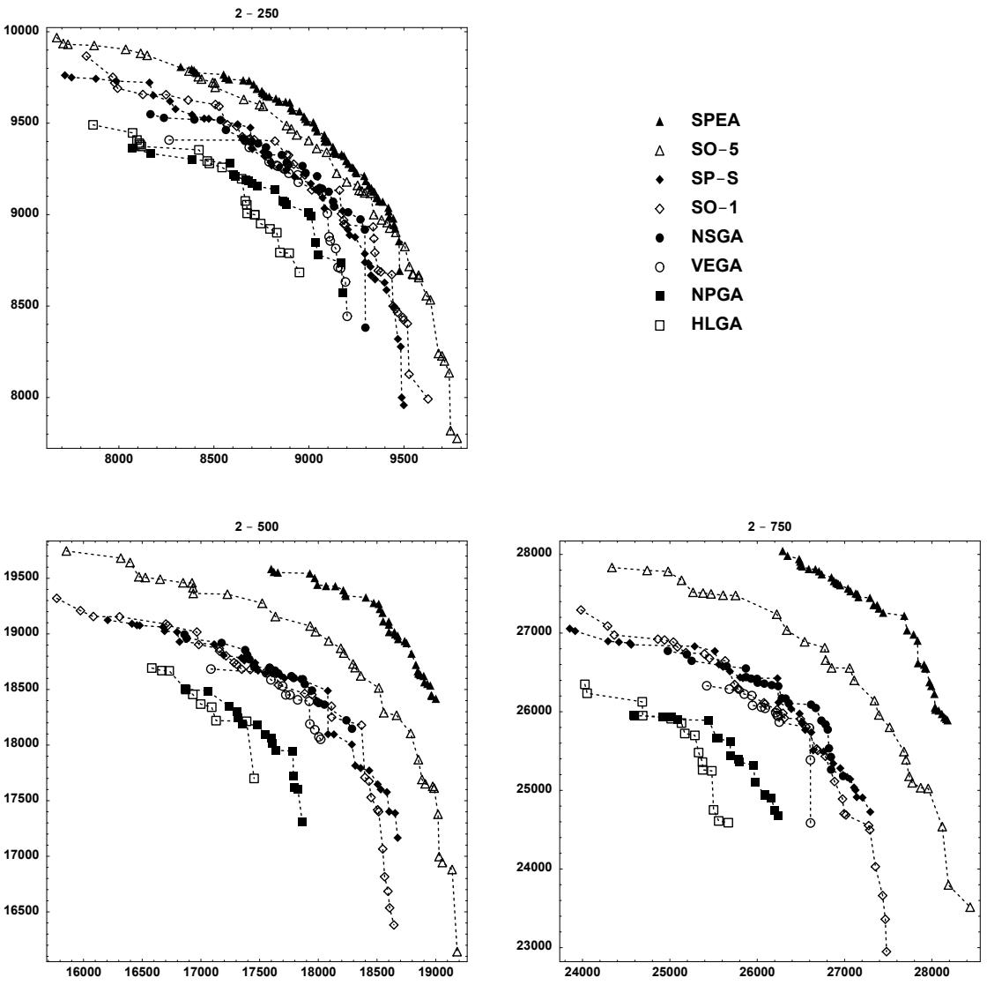
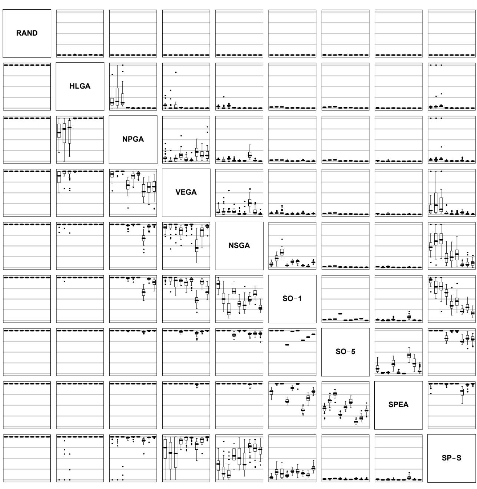
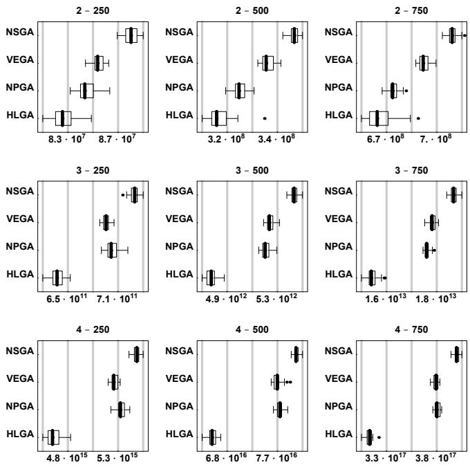
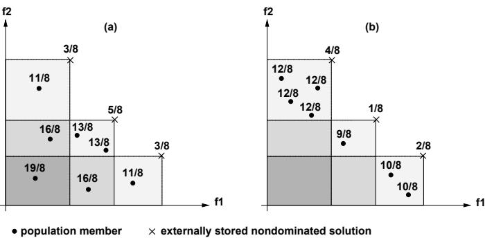
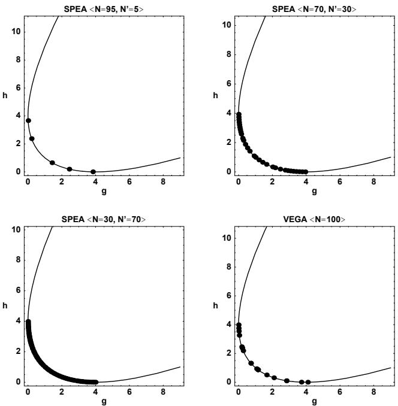
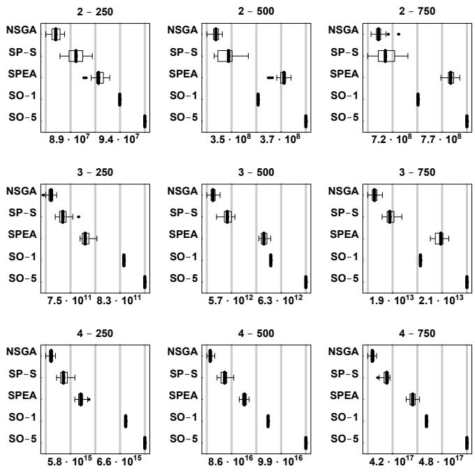
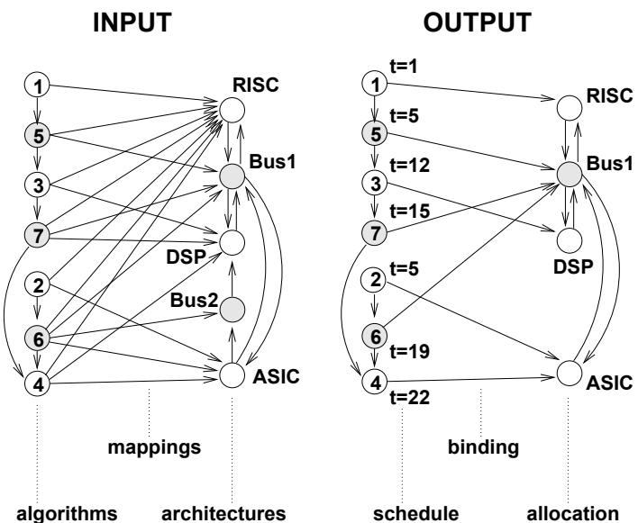
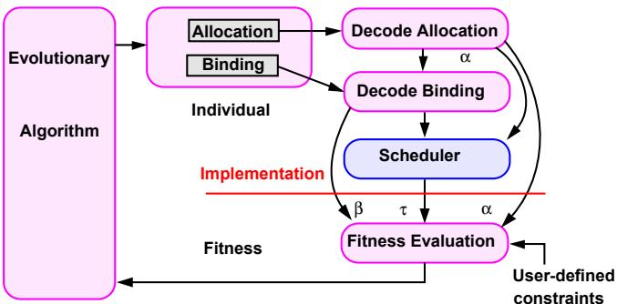

# Multiobjective Evolutionary Algorithms: A Comparative Case Study and the Strength Pareto Approach

Eckart Zitzler and Lothar Thiele

Abstract— Evolutionary algorithms (EAs) are often wellsuited for optimization problems involving several, often conflicting objectives. Since 1985, various evolutionary approaches to multiobjective optimization have been developed that are capable of searching for multiple solutions concurrently in a single run. However, the few comparative studies of different methods presented up to now remain mostly qualitative and are often restricted to a few approaches. In this paper, four multiobjective EAs are compared quantitatively where an extended $\mathbf { 0 / 1 }$ knapsack problem is taken as a basis. Furthermore, we introduce a new evolutionary approach to multicriteria optimization, the Strength Pareto EA (SPEA), that combines several features of previous multiobjective EAs in a unique manner. It is characterized by (a) storing nondominated solutions externally in a second, continuously updated population, (b) evaluating an individual's fitness dependent on the number of external nondominated points that dominate it, (c) preserving population diversity using the Pareto dominance relationship, and (d) incorporating a clustering procedure in order to reduce the nondominated set without destroying its characteristics. The proof-of-principle results obtained on two artificial problems as well as a larger problem, the synthesis of a digital hardware-software multiprocessor system, suggest that SPEA can be very effective in sampling from along the entire Pareto-optimal front and distributing the generated solutions over the trade-off surface. Moreover, SPEA clearly outperforms the other four multiobjective EAs on the $\mathbf { 0 / 1 }$ knapsack problem.

Keywords— Multiobjective optimization, Pareto optimality, evolutionary algorithm, knapsack problem, niching, clustering.

# I. INTRODuCTION

M NY tion, but rather a set of alternative solutions. These solutions are optimal in the wider sense that no other solutions in the search space are superior to them when all objectives are considered. They are known as Pareto-optimal solutions.

Consider, for example, the design of a complex hardware/software system. An optimal design might be an architecture that minimizes cost and power consumption while maximizing the overall performance. However, these goals are generally conflicting: one architecture may achieve high performance at high cost, an alternative low-cost architecture might considerably increase power consumption—none of these solutions can be said to be superior if we do not include preference information (e.g., a ranking of the objectives). Thus, if no such information is available, it may be useful to have knowledge about those alternative architectures. A tool exploring the design space for Pareto-optimal solutions in reasonable time can essentially aid the decision maker to arrive at a final design.

Evolutionary algorithms (EAs) seem to be particularly suited for this task because they process a set of solutions in parallel, possibly exploiting similarities of solutions by recombination. Some researchers suggest that multiobjective search and optimization might be a problem area where EAs do better than other blind search strategies [1][2]. Although this statement must be qualified with regard to the "no free lunch" theorems [3], up to now there are few if any alternatives to EA-based multiobjective optimization [4].

Since the mid-1980s, there has been a growing interest in solving multicriteria optimization problems using evolutionary approaches. In the meantime, several multiobjective EAs are available that are capable of searching for multiple Pareto-optimal solutions concurrently in a single run. They differ mainly in the fitness assignment, but the question of which of these methods is better on what type of problem is mostly unsettled. The few comparative studies that have been published up to now remain mostly qualitative and are often restricted to a few algorithms. Therefore, extensive quantitative comparisons are needed in order to assess the performance of the EAs in a greater context. Previous effort in this direction has been reported in [5].

In the present study, we provide a comparison of five multicriteria EAs, four previously existing and one new, by solving a multiobjective $0 / 1$ knapsack problem. Thereby, two complementary quantitative measures are considered in order to assess the performance of the algorithms concerning the trade-off surfaces produced. A random search strategy as well as a single-objective EA serve as additional points of reference. The Strength Pareto Evolutionary Algorithm (SPEA), the new multiobjective approach proposed in this paper, has been developed on the basis of a comparative study previously carried out [5]; it integrates established techniques used in existing EAs in a single unique algorithm. We show that SPEA can have advantages over the other algorithms under consideration in convergence to the Pareto-optimal front.

The paper is organized as follows. Section II introduces key concepts used in the field of evolutionary multicriteria optimization and gives an overview of the multiobjective EAs considered in this investigation. The comparison of the four multiobjective EAs on the $0 / 1$ knapsack problem is the subject of Section III, which itself is divided into three parts: description of the test problem, methodology of the comparison, and experimental results. Section IV is devoted to SPEA and describes both underlying principles and the application to three problems (Schaffer's $f _ { 2 }$ , knapsack problem, and system-level synthesis). The last section offers concluding remarks and future perspectives.

# II. MULTIOBJECTIvE OPTIMIZATION USING Evolutionary Algorithms

# A. Definitions

A general multiobjective optimization problem can be described as a vector function $f$ that maps a tuple of $m$ parameters (decision variables) to a tuple of $n$ objectives. Formally:

$$
\begin{array} { l l } { \operatorname* { m i n } . / \mathrm { m a x } . } & { \mathbf { y } = f ( \mathbf { x } ) = \left( f _ { 1 } ( \mathbf { x } ) , f _ { 2 } ( \mathbf { x } ) , \dots , f _ { n } ( \mathbf { x } ) \right) } \\ { \mathrm { s u b j e c t ~ t o } } & { \mathbf { x } = \left( x _ { 1 } , x _ { 2 } , \dots , x _ { m } \right) \in X } \\ & { \mathbf { y } = \left( y _ { 1 } , y _ { 2 } , \dots , y _ { n } \right) \in Y } \end{array}
$$

where $\mathbf { x }$ is called the decision vector, $X$ is the parameter space, $\mathbf { y }$ is the objective vector, and $Y$ is the objective space.1

The set of solutions of a multiobjective optimization problem consists of all decision vectors for which the corresponding objective vectors cannot be improved in any dimension without degradation in another——these vectors are known as Pareto optimal. Mathematically, the concept of Pareto optimality is as follows: Assume, without loss of generality, a maximization problem and consider two decision vectors $a , b \in X$ . Then, $a$ is said to dominate $b$ (also written as $\mathbf { a } \succ \mathbf { b }$ )iff

$$
\begin{array} { r l } { \forall i \in \{ 1 , 2 , \ldots , n \} : f _ { i } ( \mathbf { a } ) \geq f _ { i } ( \mathbf { b } ) } & { { } \land } \\ { \exists j \in \{ 1 , 2 , \ldots , n \} : f _ { j } ( \mathbf { a } ) > f _ { j } ( \mathbf { b } ) } & { { } } \end{array}
$$

Additionally, in this study a is said to cover b $( \mathbf { a }   \succeq \mathbf { b } )$ iff $\mathbf { a } \succ \mathbf { b }$ or $f ( \mathbf { a } ) = f ( \mathbf { b } )$ . All decision vectors which are not dominated by any other decision vector of a given set are called nondominated regarding this set. If it is clear from the context which set is meant, we simply leave it out. The decision vectors that are nondominated within the entire search space are denoted as Pareto optimal and constitute the so-called Pareto-optimal set or Pareto-optimal front.

# B. Fitness Assignment Strategies

In their excellent review of evolutionary approaches to multiobjective optimization, Fonseca and Fleming [1] categorize several multicriteria EAs and compare different fitness assignment strategies. In particular, they distinguish plain aggregating approaches, population-based nonPareto approaches, and Pareto-based approaches.

Aggregation methods combine the objectives into a higher scalar function that is used for fitness calculation.

Scalarization is mandatory when applying an EA, but aggregation approaches have the advantage of producing one single solution. On the other hand, defining the goal function in this way requires profound domain knowledge that is often not available. Popular aggregation methods are the weighted-sum approach, target vector optimization, and the method of goal attainment [1][6]. Nevertheless, pure aggregation methods are not considered here because they are not designed for finding a family of solutions.

Population-based nonPareto approaches, however, are able to evolve multiple nondominated solutions concurrently in a single simulation run. By changing the selection criterion during the reproduction phase, the search is guided in several directions at the same time. Often, fractions of the mating pool are selected according to one of the $n$ objectives [9][10]. Other nonPareto algorithms use multiple linear combinations of the objectives in parallel [11][12].

Pareto-based fitness assignment was first proposed in [13]. All approaches of this type explicitly use Pareto dominance in order to determine the reproduction probability of each individual. While nonPareto EAs are often sensitive to the nonconvexity of Pareto-optimal sets, this is not the case for Pareto-based EAs [1].

Finally, some multiobjective EAs also make use of combinations of the presented fitness assignment strategies (e.g., [14][15]).

# C. Multimodal Optimization and Preservation of Diversity

When we consider the case of finding a set of nondominated solutions rather than a single-point solution, multiobjective EAs have to perform a multimodal search that samples the Pareto-optimal set uniformly. Unfortunately, a simple (elitist) EA tends to converge towards a single solution and often loses solutions due to three effects [16]: selection pressure, selection noise, and operator disruption. To overcome this problem, several methods have been developed that can be divided into niching techniques and non-niching techniques [16]. Both types aim at preserving diversity in the population (and therefore try to prevent from premature convergence), but in addition niching techniques are characterized by their capability of promoting the formulation and maintenance of stable subpopulations (niches).

Fitness sharing [17] is used most frequently, which is a niching technique based on the idea that individuals in a particular niche have to share the available resources. The more individuals are located in the neighborhood of a certain individual, the more its fitness value is degraded. The neighborhood is defined in terms of a distance measure $d ( i , j )$ and specified by the so-called niche radius $\sigma _ { \mathrm { s h a r e } }$ Depending on whether the distance function $d ( i , j )$ operates on the genotypes or the phenotypes, one distinguishes between genotypic sharing and phenotypic sharing; phenotypic sharing can be performed on the decision vectors or the objective vectors. Currently, most multiobjective EAs implement fitness sharing (e.g., [11][14][18][6][15][19][20]].

Among the non-niching techniques, restricted mating is the most common in multicriteria function optimization.

Basically, two individuals are allowed to mate only if they are within a certain distance (given by the parameter $\sigma _ { \mathrm { m a t e } } )$ to each other. This mechanism may avoid the formation of lethal individuals and therefore improve the online performance. Nevertheless, as mentioned in [1], it does not appear to be widespread in the field of multiobjective EAs (e.g., [11][14][21]).

To our knowledge, other niching methods like crowding [22] and its derivatives as well as non-niching techniques as isolation by distance [23] have never been applied to EAs with multiple objectives (an exception is offered in [24], cf. Section IV-D 'Application to System-level Synthesis').

# D. Four Population-based Approaches

In the following we present the multiobjective EAs applied to the knapsack problem in our comparison. For a thorough discussion of other evolutionary approaches, we refer to [1][25][4].

# D.1 Vector Evaluated Genetic Algorithm

Schaffer [9] presented a multimodal EA called vector evaluated genetic algorithm (VEGA) that carries out selection for each objective separately. In detail, the mating pool is divided into $n$ parts of equal size; part $i$ is filled with individuals that are chosen at random from the current population according to objective $i$ . Afterwards, the mating pool is shuffled and crossover and mutation are performed as usual. Schaffer implemented this method in combination with fitness proportionate selection.

Although some serious drawbacks are known, this algorithm has been a strong point of reference up to now. Therefore, it was included in this investigation.

# D.2 Aggregation by Variable Objective Weighting

Another nonPareto approach was introduced in [11] (in the following referred to as HLGA—Hajela's and Lin's genetic algorithm), that used the weighted-sum method for fitness assignment. Thereby, each objective is assigned a weight $w _ { i } ~ \in ~ ] 0 , 1 [$ , such that $\textstyle \sum w _ { i } \ = \ 1$ , and the scalar fitness value is calculated by summing up the weighted objective values $w _ { i } \cdot f _ { i } ( \mathbf { x } )$ . To search for multiple solutions in parallel, the weights are not fixed but instead encoded in the genotype. The diversity of the weight combinations is promoted by phenotypic fitness sharing. As a consequence, the EA evolves solutions and weight combinations simultaneously. Finally, [11, p.102] emphasized mating restrictions to be necessary in order to 'both speed convergence and impart stability to the genetic search'.

Several other multiobjective EAs make use of weightedsum aggregation (e.g. [12]). We have chosen HLGA to represent this class of multiobjective EAs.

# D.3 Niched Pareto Genetic Algorithm

The niched Pareto genetic algorithm (NPGA) proposed in [18][26] combines tournament selection and the concept of Pareto dominance. Two competing individuals and a comparison set of other individuals are picked at random from the population; the size of the comparison set is given by the parameter $t _ { \mathrm { d o m } }$ . If one of the competing individuals is dominated by any member of the set and the other is not, then the latter is chosen as winner of the tournament. If both individuals are dominated (or not dominated), the result of the tournament is decided by sharing: The individual that has the least individuals in its niche (defined by $\sigma _ { \mathrm { s h a r e . } }$ ) is selected for reproduction. Horn and Nafpliotis [18][26] used phenotypic sharing on the objective vectors.

This algorithm seems to be widespread and is often taken as reference in recent publications [2][21][20], hence, it is also examined here.

# D.4 Nondominated Sorting Genetic Algorithm

Srinivas and Deb [6] also developed an approach based on [13], called nondominated sorting genetic algorithm (NSGA). Analogous to [13], the fitness assignment is carried out in several steps. In each, the nondominated solutions constituting a nondominated front are assigned the same dummy fitness value. These solutions are shared with their dummy fitness values (phenotypic sharing on the decision vectors) and ignored in the further classification process. Finally, the dummy fitness is set to a value less than the smallest shared fitness value in the current nondominated front. Then the next front is extracted. This procedure is repeated until all individuals in the population are classified. In the original study [6], this fitness assignment method was combined with a stochastic remainder selection.

We have selected NSGA as the second Pareto-based EA, although there are also other Pareto-based approaches that may be under consideration for the comparison, e.g., the multiobjective EA presented in [14].

# III. PERFORMANCE COMPARISON

In the following, the case study is described that has been carried out using the above four multiobjective EAs for solving an extended $0 / 1$ knapsack problem. The comparison focuses on the effectiveness in finding multiple Paretooptimal solutions, disregarding their number. Nevertheless, in the case that the trade-off surface is continuous or contains many points, the distribution of the nondominated solutions achieved is also important. Although we do not consider the distribution explicitly, it influences the performance of the EA indirectly.

# A. The Multiobjective 0/1 Knapsack Problem

A test problem for a comparative investigation like this has to be chosen carefully. The problem should be understandable and easy to formulate so that the experiments are repeatable and verifiable. It should also be a rather general problem and ideally represent a certain class of realworld problems. Both applies to the knapsack problem: the problem description is simple, yet the problem itself is difficult to solve (NP-hard). Moreover, due to its practical relevance it has been subject to several investigations in various fields. In particular, there are some publications in the domain of evolutionary computation related to the knapsack problem [27][28][29], even in conjunction with multiobjective optimization [30].

# A.1 Formulation As Multiobjective Optimization Problem

Generally, a $0 / 1$ knapsack problem consists of a set of items, weight and profit associated with each item, and an upper bound for the capacity of the knapsack. The task is to find a subset of items which maximizes the total of the profits in the subset, yet all selected items fit into the knapsack, i.e., the total weight does not exceed the given capacity [31].

This single-objective problem can be extended directly to the multiobjective case by allowing an arbitrary number of knapsacks. Formally, the multiobjective $0 / 1$ knapsack problem considered here is defined in the following way: Given a set of $m$ items and a set of $n$ knapsacks, with

$$
\begin{array} { r c l } { p _ { i , j } } & { = } & { \mathrm { p r o f t ~ o f ~ i t e m ~ } j \mathrm { ~ a c c o r d i n g ~ t o ~ k n a p s a c k ~ } i , } \\ { w _ { i , j } } & { = } & { \mathrm { w e i g h t ~ o f ~ i t e m ~ } j \mathrm { ~ a c c o r d i n g ~ t o ~ k n a p s a c k ~ } i } \\ { c _ { i } } & { = } & { \mathrm { c a p a c i t y ~ o f ~ k n a p s a c k ~ } i , } \end{array}
$$

find a vector $\mathbf { x } = ( x _ { 1 } , x _ { 2 } , \ldots , x _ { m } ) \in \{ 0 , 1 \} ^ { m }$ ,such that

$$
\forall i \in \{ 1 , 2 , \ldots , n \} : \sum _ { j = 1 } ^ { m } w _ { i , j } \cdot x _ { j } \leq c _ { i }
$$

and for which $f ( \mathbf { x } ) \ = \ ( f _ { 1 } ( \mathbf { x } ) , f _ { 2 } ( \mathbf { x } ) , \ldots , f _ { n } ( \mathbf { x } ) )$ is maximum, where

$$
f _ { i } ( \mathbf { x } ) = \sum _ { j = 1 } ^ { m } { p _ { i , j } \cdot x _ { j } }
$$

and $x _ { j } = 1$ iff item $j$ is selected.

# A.2 Test Data

In order to obtain reliable and sound results, we used nine different test problems where both the number of knapsacks and the number of items were varied.2 Two, three, and four objectives were taken under consideration, in combination with 250, 500, and 750 items.

Following suggestions in [31], uncorrelated profits and weights were chosen, where $p _ { i , j }$ and $w _ { i , j }$ are random integers in the interval [10, 100]. The knapsack capacities were set to half the total weight regarding the corresponding knapsack:

$$
c _ { i } = 0 . 5 \sum _ { j = 1 } ^ { m } w _ { i , j }
$$

As reported in [31], about half of the items are expected to be in the optimal solution (of the single-objective problem) when this type of knapsack capacity is used. We also examined more restrictive capacities ${ \bf \zeta } _ { c _ { i } } = 2 0 0 $ where the solutions contain only a few items. As this had no significant influence on the relative performance of the EAs, we only present the results concerning the former type of knapsack capacity in the following.

# A.3 Implementation

Concerning the chromosome coding as well as the constraint handling, we drew upon results published in [28], which examined EAs with different representation mappings and constraint handling techniques on the (singleobjective) $0 / 1$ knapsack problem. Concluding from the experiments in [28], penalty functions achieve best results on data sets with capacities of half the total weight; however, they fail on problems with more restrictive capacities. Since the experiments should be performed on both kinds of knapsack capacities, we decided to implement a greedy repair method that produced the best outcomes among all algorithms under consideration when both capacity types are regarded. This method is based on a vector representation and repairs infeasible solutions according to a predefined scheme. We adopted this approach with a slightly modified repair mechanism.

In particular, a binary string s of length $m$ is used to encode the solution $\mathbf { x } \in \{ 0 , 1 \} ^ { m }$ . Since many codings lead to infeasible solutions, a simple repair method $r$ is applied to the genotype s: $\mathbf { x } = r ( \mathbf { s } )$ . The repair algorithm removes items from the solution coded by s step by step until all capacity constraints are fulfilled. The order in which the items are deleted is determined by the maximum profit/weight ratio per item; for item $j$ the maximum profit/weight ratio $q _ { j }$ is given by the equation3

$$
q _ { j } = \operatorname* { m a x } _ { i = 1 } ^ { n } \left\{ { \frac { p _ { i , j } } { w _ { i , j } } } \right\}
$$

The items are considered in increasing order of the $q _ { j }$ , i.e., those achieving the lowest profit per weight unit are removed first. This mechanism intends to fulfill the capacity constraints while diminishing the overall profit as little as possible.

# B. Methodology

In the context of this comparison, several questions arise: What quantitative measures should be used to express the quality of the results so that the EAs can be compared in a meaningful way? What is the outcome of a multiobjective EA regarding a set of runs? How can side effects caused by different selection schemes or mating restrictions be precluded, such that the comparison is not falsified? How can the parameters of the EA, particularly the niche radius, be set appropriately? In the following, we treat these problems.

# B.1 Performance Measures

Two complementary measures were used to evaluate the trade-off fronts produced by the various EAs:

Size of the space covered: Let $X ^ { \prime } = ( \mathbf { x _ { 1 } } , \mathbf { x _ { 2 } } , \ldots , \mathbf { x _ { k } } ) \subseteq X$ be a set of $k$ decision vectors. The function $\mathcal { S } ( \mathcal { X } ^ { \prime } )$ gives the volume enclosed by the union of the polytopes $p _ { 1 } , p _ { 2 } , \ldots p _ { k }$ where each $p _ { i }$ is formed by the intersections of the following hyperplanes arising out of $\mathbf { x _ { i } }$ , along with the axes: for each axis in the objective space, there exists a hyperplane perpendicular to the axis and passing through the point $( f _ { 1 } ( \mathbf { x _ { i } } ) , f _ { 2 } ( \mathbf { x _ { i } } ) , \ldots , f _ { n } ( \mathbf { x _ { i } } ) )$ . In the two-dimensional case, each $p _ { i }$ represents a rectangle defined by the points $( 0 , 0 )$ and $\left( f _ { 1 } ( \mathbf { x _ { i } } ) , f _ { 2 } ( \mathbf { x _ { i } } ) \right)$ .

Coverage of two sets: Let $X ^ { \prime } , X ^ { \prime \prime } \subseteq X$ be two sets of decision vectors. The function $\mathcal { C }$ maps the ordered pair $\mathrm { ( X ^ { \prime } , X ^ { \prime } ) }$ to the interval [0,1]:

$$
{ \mathcal { C } } ( X ^ { \prime } , X ^ { \prime \prime } ) : = { \frac { | \{ \mathbf { a } ^ { \prime \prime } \in X ^ { \prime \prime } ; \exists \mathbf { a } ^ { \prime } \in X ^ { \prime } : \mathbf { a } ^ { \prime } \succeq \mathbf { a } ^ { \prime \prime } \} | } { | X ^ { \prime \prime } | } }
$$

The value ${ \mathcal C } ( X ^ { \prime } , X ^ { \prime \prime } ) = 1$ means that all points in $X ^ { \prime \prime }$ are dominated by or equal to points in $X ^ { \prime }$ . The opposite, $\mathcal { C } ( X ^ { \prime } , X ^ { \prime \prime } ) = 0$ , represents the situation when none of the points in $X ^ { \prime \prime }$ are covered by the set $X ^ { \prime }$ . Note that both ${ \mathcal { C } } ( X ^ { \prime } , X ^ { \prime \prime } )$ and $\mathcal { C } ( X ^ { \prime \prime } , X ^ { \prime } )$ have to be considered, since ${ \mathcal { C } } ( X ^ { \prime } , X ^ { \prime \prime } )$ is not necessarily equal to $\mathcal { C } ( X ^ { \prime \prime } , X ^ { \prime } )$ (e.g., if $X ^ { \prime }$ dominates $X ^ { \prime \prime }$ then $\mathcal { C } ( X ^ { \prime } , X ^ { \prime \prime } ) = 1$ and $\mathcal { C } ( X ^ { \prime \prime } , X ^ { \prime } ) = 0 )$ .

The first measure $\mathcal { S }$ has the advantage that each EA can be evaluated independently of the other EAs; however, convex regions may be preferred to concave regions, possibly overrating certain solutions. The second measure $\mathcal { C }$ overcomes this drawback and can be used to show that the outcomes of one algorithm dominate the outcomes of another algorithm, although it does not tell how much better it is.

Since in this comparison the focus is on finding the Pareto-optimal set rather than obtaining a uniform distribution along the trade-off surface, we did not consider the online performance of the EAs but rather the offline performance. Thus, the nondominated set regarding all individuals generated over all generations was taken as the output of an optimization run. Altogether 30 independent runs were performed per EA and test problem in order to restrict the influence of random effects. Another randomly created initial population was taken each time, and for each test problem all EAs operated on the same 30 initial populations.

# B.2 Selection and Mating Restrictions

Actually, each multiobjective EA should be combined with the selection scheme originally applied. But the influence of the selection scheme on the outcome of an EA cannot be neglected, e.g., fitness proportionate selection, which is used in VEGA, is well known to have serious disadvantages [32]. In order to guarantee a fair comparison, all EAs considered were implemented with the same selection scheme: binary tournament selection with replacement. This selection method turned out to be superior to both stochastic remainder selection (used in [6]) and linear ranking selection on our test problems—that has been confirmed experimentally.

Unfortunately, a conventional combination of fitness sharing and tournament selection may lead to chaotic behavior of the EA [33]. Therefore, both NSGA and HLGA were implemented using a slightly modified version of sharing, called continuously updated sharing, which was proposed by the same researchers. Thereby, the partly filled next generation is used to calculate the niche count rather than the current generation. Horn and Nafpliotis [18][26] introduced this concept in NPGA as well.

Another problem is the influence of mating restrictions. While Hajela and Lin [11] found it necessary to restrict mating, the other EAs under consideration do not explicitly incorporate this concept. We decided not to use mating restrictions in this study, since the effectiveness of the different fitness assignment and niching methods should be compared. In addition, it was experimentally verified that no significant improvement could be observed when running HLGA with mating restrictions.

# B.3 Parameter Settings

On all test problems, 500 generations were simulated per optimization run, the probabilities of crossover (one-point) and mutation were fixed (0.8 and 0.01, respectively). The population size $N$ was chosen to be dependent on the complexity of the test problem, as can be seen in Table I: the more knapsacks and items involved, the greater the value for $N$ . Following the guidelines in [34], the niche radius was calculated based on normalized distance, assuming the formation of 10 (15 and 20, respectively) independent niches in the case of 2 (3 and 4, respectively) knapsacks. In Tabhe h $\sigma _ { \mathrm { s h a r e } } ^ { * }$ relates t ng on the eter aceae $\sigma _ { \mathrm { s h a r e } }$ the niche radii used by HLGA and NPGA. Finally, the domination pressure $t _ { \mathrm { d o m } }$ , a parameter of NPGA, was determined experimentally. All NPGA simulations were carried out five times, each time using another value for $\scriptstyle t _ { \mathrm { d o m } }$ $( 5 \%$ , $1 0 \%$ , $1 5 \%$ , $2 0 \%$ , and $2 5 \%$ of the population size). At the end, the parameter value which achieved the best results for the $\mathcal { S }$ measure was chosen per test problem (cf. Table I).

TABLE I PARAMETERS THAT WERE ADJUSTED TO THE PROBLEM COMPLEXITY: POPULATION SIZE $( N )$ , NICHE RADIUS (OBJECTIVE SPACE: σshare! PARAMETER SPACE: $\sigma _ { \mathrm { s h a r e } } ^ { * } ,$ , AND DOMINATION PRESSURE $\left( t _ { \mathrm { d o m } } \right)$ .   

<table><tr><td rowspan=2 colspan=1>number ofknapsacks</td><td rowspan=2 colspan=1>parameters</td><td rowspan=1 colspan=3>number of items</td></tr><tr><td rowspan=1 colspan=1>250</td><td rowspan=1 colspan=1>500</td><td rowspan=1 colspan=1>750</td></tr><tr><td rowspan=4 colspan=1>2</td><td rowspan=1 colspan=1>N</td><td rowspan=1 colspan=1>150</td><td rowspan=1 colspan=1>200</td><td rowspan=1 colspan=1>250</td></tr><tr><td rowspan=1 colspan=1>σshare</td><td rowspan=1 colspan=1>0.4924</td><td rowspan=1 colspan=1>0.4943</td><td rowspan=1 colspan=1>0.4954</td></tr><tr><td rowspan=1 colspan=1>hare</td><td rowspan=1 colspan=1>115</td><td rowspan=1 colspan=1>236</td><td rowspan=1 colspan=1>357</td></tr><tr><td rowspan=1 colspan=1>tdom</td><td rowspan=1 colspan=1>7</td><td rowspan=1 colspan=1>10</td><td rowspan=1 colspan=1>12</td></tr><tr><td rowspan=4 colspan=1>3</td><td rowspan=1 colspan=1>N</td><td rowspan=1 colspan=1>200</td><td rowspan=1 colspan=1>250</td><td rowspan=1 colspan=1>300</td></tr><tr><td rowspan=1 colspan=1>σshare</td><td rowspan=1 colspan=1>0.4933</td><td rowspan=1 colspan=1>0.4946</td><td rowspan=1 colspan=1>0.4962</td></tr><tr><td rowspan=1 colspan=1></td><td rowspan=1 colspan=1>113</td><td rowspan=1 colspan=1>233</td><td rowspan=1 colspan=1>354</td></tr><tr><td rowspan=1 colspan=1>tdom</td><td rowspan=1 colspan=1>30</td><td rowspan=1 colspan=1>25</td><td rowspan=1 colspan=1>15</td></tr><tr><td rowspan=4 colspan=1>4</td><td rowspan=1 colspan=1>N</td><td rowspan=1 colspan=1>250</td><td rowspan=1 colspan=1>300</td><td rowspan=1 colspan=1>350</td></tr><tr><td rowspan=1 colspan=1>σshare</td><td rowspan=1 colspan=1>0.4940</td><td rowspan=1 colspan=1>0.4950</td><td rowspan=1 colspan=1>0.4967</td></tr><tr><td rowspan=1 colspan=1>σsare</td><td rowspan=1 colspan=1>112</td><td rowspan=1 colspan=1>232</td><td rowspan=1 colspan=1>352</td></tr><tr><td rowspan=1 colspan=1>tdom</td><td rowspan=1 colspan=1>50</td><td rowspan=1 colspan=1>75</td><td rowspan=1 colspan=1>35</td></tr></table>

# C. Experimental Results

As additional points of reference, two further methods were considered in this comparison: random sampling and multiple independent sampling. The first algorithm (RAND) randomly generates a certain number of individuals per generation, according to the rate of crossover and mutation (though neither crossover, mutation nor selection are performed). Hence the number of fitness evaluations was the same as for the EAs. The second algorithm is an elitist single-objective EA using weighted-sum aggregation. In contrast to the other algorithms under consideration, 100 independent runs were performed per test problem, each run optimizing towards another randomly chosen linear combination of the objectives. The nondominated solutions among all solutions generated in the 100 runs form the trade-off front achieved on a particular test problem. Furthermore, two versions of the single-objective EA were investigated: one with 100 generations per linear combination (SO-1) and another one that terminated after 500 generations in every single optimization run (SO-5).

  
SP-S are described later.

The results concerning the $\mathcal { S }$ measure (size of the space covered) are shown in Figure 3, the direct comparison of the different algorithms based on the $\mathcal { C }$ measure (coverage) is depicted in Figure 2. For each algorithm and ordered pair of algorithms, respectively, there is a sample of $3 0 ~ S$ respectively $\mathcal { C }$ values per test problem according to the 30 runs performed. Here, box plots [35] are used to visualize the distribution of these samples. A box plot consists of a box summarizing $5 0 \%$ of the data. The upper and lower ends of the box are the upper and lower quartiles, while a thick line within the box encodes the median. Dashed appendages summarize the spread and shape of the distribution, and dots represent outside values.

Generally, the simulation results prove that all multiobjective EAs do better than the random search strategy. Figure 2 shows that the trade-off fronts achieved by RAND are entirely dominated by the fronts evolved by HLGA,

  
Fig. 2. Box plots based on the $c$ measure. Each rectangle contains nine box plots representing the distribution of the $c$ values for a correspondingly the three middle box plots relate to $3 ~ \mathrm { k n }$ apsacks and the three to the right to 4 knapsacks. The scale is 0 at the bottom and 1 at the top per rectangle. Furthermore, each rectangle refers to algorithm $A$ associated with the corresponding row and algorithm $B$ associated with the corresponding column and gives the fraction of $B$ covered by $A$ $( \mathcal { C } ( A , B ) )$ . Note that SPEA and SP-S are introduced later.

NPGA, and NSGA (with regard to the same population). Concerning the $\mathcal { S }$ distributions, the RAND median is less by more than 20 quartile deviations than the medians associated with the EAs when the maximum quartile deviation of all samples is considered.

Among the multiobjective EAs, NSGA seems to provide the best performance. The median of the $\mathcal { S }$ values is for each test problem greater than the corresponding medians of the other three EAs by more than 5 quartile deviations. In addition, on eight of the nine test problems NSGA covers more than $7 0 \%$ of the fronts computed by HLGA, NPGA, and VEGA in more than $7 5 \%$ of the runs; in $9 9 \%$ of the runs it covers more than $5 0 \%$ . In contrast, those three EAs cover less than $1 0 \%$ of the NSGA outcomes in $7 5 \%$ of all runs and less than $2 5 \%$ in $9 9 \%$ of the runs (on eight of the nine problems). For 4 knapsacks and 250 items, the coverage rates scatter more, however, NSGA achieves higher $\mathcal { C }$ values in comparison with the other multiobjective EAs.

Comparing NPGA and VEGA, there is no clear evidence that one algorithm outperforms the other, although VEGA seems to be slightly superior to NPGA. Only on two of the test problems (2 knapsack, 500 and 750 items) do the medians of the $\mathcal { S }$ distributions of the two EAs deviate by more than 3 quartile deviations (in favor of VEGA). In the direct comparison based on the $\mathcal { C }$ measure, VEGA covers more than $5 0 \%$ of the NPGA outcomes on average, while NPGA achieves less than $2 5 \%$ coverage regarding VEGA on average. Furthermore, both algorithms generate better assessments in comparison with HLGA. With 3 and 4 knapsacks, the fronts produced by HLGA are dominated by the NPGA and VEGA fronts by $9 9 \%$ (cf. Figure 2), and the medians of the $\mathcal { S }$ values associated with HLGA are more than 10 quartile deviations less than the $\mathcal { S }$ medians related to NPGA and VEGA. For 2 knapsacks, the $\mathcal { S }$ distributions are closer together; however, the $\mathcal { C }$ measure indicates clear advantages of NPGA and VEGA over HLGA.

  
Fig. 3. Distribution of the $s$ values for the nine test problems. Note that RAND, SO-1, and SO-5 are not considered in this figure, since the focus is on the four multiobjective EAs and otherwise the differences between those algorithms would be blurred.

Finally, the fact that SO-5 covers on average more than $9 0 \%$ of the nondominated solutions computed by HLGA, NPGA, VEGA, and NSGA and achieves significantly greater $\mathcal { S }$ values (the median is greater by more than 21 quartile deviations than the other medians per test problem) suggests that none of the multiobjective EAs converge to the Pareto-optimal front using the chosen parameter settings. This can also be observed in Figure 1, where the trade-off fronts obtained in 5 runs are plotted for the two-dimensional problems. Note that the computational effort needed by SO-5 to produce the depicted fronts is 20 times higher than the one for the multiobjective EAs.

# IV. The StrengtH Pareto Approach

We propose a new approach to multiobjective optimization, the Strength Pareto Evolutionary Algorithm (SPEA). SPEA uses a mixture of established and new techniques in order to find multiple Pareto-optimal solutions in parallel. On one hand, similarly to other multiobjective EAs, it

• Stores the nondominated solutions found so far externally (e.g., [10][12][19]),   
Uses the concept of Pareto dominance in order to assign scalar fitness values to individuals, and   
Performs clustering to reduce the number of nondominated solutions stored without destroying the characteristics of the trade-off front [20].   
On the other hand, SPEA is unique in four respects: • It combines the above three techniques in a single algorithm.   
The fitness of an individual is determined only from the solutions stored in the external nondominated set; whether members of the population dominate each other is irrelevant.   
• All solutions in the external nondominated set participate in selection.   
• A new niching method is provided in order to preserve diversity in the population; this method is Pareto-based and does not require any distance parameter (like the niche radius for sharing).

# A. Algorithm

The flow of the algorithm is as follows.

Step 1: Generate an initial population $P$ and create the empty external nondominated set $P ^ { \prime }$ .   
Step 2: Copy nondominated members of $P$ to $P ^ { \prime }$ .   
Step 3: Remove solutions within $P ^ { \prime }$ which are covered by any other member of $P ^ { \prime }$ .   
Step 4: If the number of externally stored nondominated solutions exceeds a given maximum $N ^ { \prime }$ , prune $P ^ { \prime }$ by means of clustering.   
Step 5: Calculate the fitness of each individual in $P$ as well as in $P ^ { \prime }$ .   
Step 6: Select individuals from $P + P ^ { \prime }$ (multiset union), until the mating pool is filled. In this study, binary tournament selection with replacement is used.   
Step 7: Apply problem-specific crossover and mutation operators as usual.   
Step 8: If the maximum number of generations is reached, then stop, else go to Step 2.

In the next two sections, the fitness assignment as well as the clustering procedure are described in detail.

# A.1 Fitness Assignment

The fitness assignment procedure is a two-stage process. First, the individuals in the external nondominated set $P ^ { \prime }$ are ranked. Afterwards, the individuals in the population $P$ are evaluated.

Step 1: Each solution $i \in P ^ { \prime }$ is assigned a real value $s _ { i } \in$ $[ 0 , 1 )$ , called strength4; $s _ { i }$ is proportional to the number of population members $j \in P$ for which $i \succeq j$ . Let $n$ denote the number of individuals in $P$ that are covered by $i$ and assume $N$ is the size of $P$ Then $s _ { i }$ is defined as $\begin{array} { r } { s _ { i } = \frac { n } { N + 1 } } \end{array}$ The fitness $f _ { i }$ of $i$ is equal to its strength: $f _ { i } \doteq s _ { i }$ .

Step 2: The fitness of an individual $j \in P$ is calculated by summing the strengths of all external nondominated solutions $i \in P ^ { \prime }$ that cover $j$ . We add one to the total in order to guarantee that members of $P ^ { \prime }$ have better fitness than members of $P$ (note that fitness is to be minimized, i.e., small fitness values correspond to high reproduction probabilities):

$$
f _ { j } = 1 + \sum _ { i , i \succeq j } s _ { i } \quad \mathrm { w h e r e } \ f _ { j } \in [ 1 , N ) .
$$

To make the effect of this ranking method clear, take a look at Figure 4. The objective space which is covered by the three nondominated solutions is divided into distinct rectangles. Each subset of $P ^ { \prime }$ defines one such area that all members of the subset cover in common. For instance, the dark-shaded rectangle in the lower-left corner is covered by all three nondominated points, while the upper-left bright-shaded rectangle is only covered by one nondominated point. We consider these areas as niches, and the goal is to distribute the individuals over this 'grid' such that (a) (brighter-shaded) areas covered by only a few nondominated points contain more individuals than (darkershaded) rectangles that are covered by many nondominated points, and (b) an area comprises as many individuals as the other (equally-shaded) rectangles that are covered by the same number of nondominated points.

This mechanism intuitively reflects the idea of preferring individuals near the Pareto-optimal front and distributing them at the same time along the trade-off surface. In Figure 4a), the first aspect is illustrated: Individuals located in the bright areas achieve better fitness values than the remaining population members. Figure 4b) provides an example for the second aspect and directly visualizes the strength principle: Individuals having many neighbors in their niche are penalized due to the high strength value of the associated nondominated point; the 'stronger' a nondominated solution, the less 'fitter' are the covered individuals.

The main difference to fitness sharing is that niches are not defined in terms of distance but Pareto dominance. This renders the setting of a distance parameter superfuous, although the parameter $N ^ { \prime }$ influences the niching capability as we will discuss in the next section. Furthermore, it has to be mentioned that this kind of fitness assignment using two interacting populations has been inspired by [37][38][39][40][41]. Paredis [41] studied the use of cooperating populations in EAs and showed that symbiotic evolution can speed up the search process. In [37][38][39][40], a similar concept was applied to immune system models where two cooperative populations were used to maintain population diversity; [39] reported that this method has emergent properties that are similar to fitness sharing.

  
Fig. 4. Two scenarios for a maximization problem with two objectives. The number associated with each solution gives the fitness (and strength in case of nondominated points).

# A.2 Reducing the Pareto Set by Clustering

In certain problems, the Pareto-optimal set can be extremely large or even contain an infinite number of solutions. However, from the decision maker's point of view, presenting all nondominated solutions found is useless when their number exceeds reasonable bounds. Moreover, the size of the external nondominated set influences the behavior of SPEA. On the one hand, since $P ^ { \prime }$ participates in selection, too many nondominated solutions might reduce selection pressure and slow down the search [20]. On the other hand, the strength niching mechanism relies on a uniform granularity of the 'grid' defined by the nondominated solutions (cf. Figure 4); if the points in $P ^ { \prime }$ are not distributed uniformly, the fitness assignment method is possibly biased towards certain regions of the search space, leading to an unbalanced distribution in the population. Thus, pruning the external nondominated set while maintaining its characteristics might be necessary or even mandatory.

A method that has been applied to this problem successfully and studied extensively in the same context is cluster analysis [42][43]. In general, cluster analysis partitions a collection of $m$ elements into $n$ groups of relatively homogeneous elements, where $n < m$ . The average linkage method [42], a clustering approach that has proven to perform well on this problem (cf. [42]), has been chosen in this paper.

Step 1: Initialize cluster set $C$ ; each external nondominated point $i \in P ^ { \prime }$ constitutes a distinct cluster: $\textstyle C = \bigcup _ { i } \{ \{ i \} \}$ .   
Step 2: If $| C | \le N ^ { \prime }$ , go to Step 5, else go to Step 3.   
Step 3: Calculate the distance of all possible pairs of clus

ters. The distance $d$ of two clusters $c _ { 1 }$ and $c _ { 2 } \in C$ is given as the average distance between pairs of individuals across the two clusters

$$
d = \frac { 1 } { \left| c _ { 1 } \right| \cdot \left| c _ { 2 } \right| } \cdot \sum _ { i _ { 1 } \in c _ { 1 } , i _ { 2 } \in c _ { 2 } } \left| \left| i _ { 1 } - i _ { 2 } \right| \right|
$$

where the metric $| | \cdot | |$ reflects the distance between two individuals $i _ { 1 }$ and $i _ { 2 }$ (in this study an Euclidean metric on the objective space is used).

Step 4: Determine two clusters $c _ { 1 }$ and $c _ { 2 }$ with minimal distance $d$ ; the chosen clusters amalgamate into a larger cluster: $C = C \setminus \{ c _ { 1 } , c _ { 2 } \} \cup \{ c _ { 1 } \cup c _ { 2 } \}$ . Go to Step 2.

Step 5: Compute the reduced nondominated set by selecting a representative individual per cluster. We consider the centroid (the point with minimal average distance to all other points in the cluster) as representative solution.

Cunha et al. [20] also combined a multiobjective EA with a clustering approach in order to achieve reasonably sized Pareto sets. This algorithm, however, uses a different clustering method which has been proposed in [43]; thereby, for each objective, a tolerance value has to be specified. Moreover, it differs from SPEA with regard to the following two aspects: (a) The nondominated solutions are not stored externally, and (b) fitness sharing is incorporated to preserve diversity in the population.

# B. A Simple Test Function: Schaffer's f2

A very simple test function for multiobjective optimizers is the well-known function $f _ { 2 }$ used by Schaffer [44]. It is defined as follows:

$$
{ \begin{array} { r l r l } & { { \mathrm { m i n i m i z e } } } & { f _ { 2 } ( x ) = ( g ( x ) , h ( x ) ) } \\ & { { \mathrm { w h e r e } } } & { g ( x ) = x ^ { 2 } } \\ & { } & { h ( x ) = ( x - 2 ) ^ { 2 } } \end{array} }
$$

Obviously, the Pareto-optimal points are located in the range $x \in [ 0 , 2 ]$ . Outside this interval, $g$ as well as $h$ are increasing, while within the interval, there is a trade-off between the two functions (one is increasing, the other one is decreasing).

To test SPEA on $f _ { 2 }$ , we used a 14-bit chromosome which is decoded to a real number between $- 6$ and 6. The bit string 00000000000000 encodes $\begin{array} { r l r } { x } & { { } = } & { - 6 } \end{array}$ and 11111111111111 stands for $x = 6$ . Furthermore, the following parameters were used for SPEA:

Population size $( N )$ . 95/70/30   
Size of external nondominated set $( N ^ { \prime } )$ : 5/30/70   
Crossover probability: 1.0   
Mutation probability: 0.0   
Number of generations: 100

Altogether, we tried three different combinations of $N$ and $N ^ { \prime }$ , where $N + N ^ { \prime }$ equaled 100 in each case. In order to examine the effectiveness of SPEA alone, no mutation operator was applied to the individuals. Instead, we used a crossover probability of 1.0. In addition, VEGA ran on this problem with identical parameters ( $N = 1 0 0$ ). In order to guarantee a fair comparison, the offline performance of VEGA is considered here, i.e., the final trade-off front is formed by the nondominated solutions found during a run, not only by the Pareto-optimal points in generation 100.

  
Fig. 5. Performance of SPEA and VEGA on Schaffer's $f _ { 2 }$ .

The results produced by the algorithms using the same initial population are shown in Figure 5.5 It can be observed that SPEA is able to well approximate the Paretooptimal front, depending on the size of the external nondominated set. In comparison to VEGA, it evolved more Pareto-optimal solutions (VEGA:20, SPEA:5/30/70) and distributed them more uniformly along the trade-off front.

# C. Performance on the 0/1 Knapsack Problem

The same parameters as for the other multiobjective EAs were used for SPEA on the $0 / 1$ knapsack problem. For reasons of fairness, $N$ was set to $4 / 5$ and $N ^ { \prime }$ to $1 / 4$ of the population size given in Table I. In addition, a slightly modified version of SPEA was examined (SP-S) where $P ^ { \prime }$ does not participate in the selection phase; there, the population size was the same as for the other EAs, and the size of the external nondominated set was restricted to $1 / 4 \cdot N$ .

The results concerning the $\mathcal { S }$ measure (size of the space covered) are depicted in Figure 6, the direct comparison of SPEA with the other algorithms based on the $\mathcal { C }$ measure (coverage) is shown in Figure 2. Furthermore, Figure 1 gives the plots of the two-dimensional trade-off fronts achieved by SPEA and the other EAs. The main observations can be summarized as follows:

  
Fig. 6. SPEA in comparison with the other algorithms with regard to the size of the covered space. The box plots represent the distributions of the $s$ values achieved in the 30 optimization runs.

SPEA achieves the best assessments among the multiobjective EAs. It covers $1 0 0 \%$ of the nondominated solutions found by HLGA, NPGA, VEGA, and NSGA with eight of the nine test problems; for 4 knapsacks and 250 items at least $8 7 \%$ are covered. Vice versa, those algorithms cover less than $5 \%$ of the SPEA outcomes in all 270 runs. Concerning the size of the covered space, the medians of the $\mathcal { S }$ distributions related to SPEA are greater than the corresponding medians of the other multiobjective EAs by more than 10 quartile deviations. Although the Pareto-optimal fronts of the test problems considered here are all convex, we have shown recently [45] that SPEA also has advantages over the other EAs for different types of problems (e.g., non-convex functions).

• As Figure 1 indicates, SPEA can find solutions that are closer to the Pareto-optimal front than those produced by SO-5 in spite of less computational effort. This observation is supported by the fact that SO-5 covers only $4 8 \%$ of the SPEA front with eight of the nine test problems (SO-1 less than $1 2 \%$ ). However, the fronts found by multiple single-objective searches contain many more solutions and are wider in the sense that the size of the covered space is significantly greater (cf. Figure 6). Whether SPEA can outperform a single-objective EA with substantially less computation time is the subject of future work; however, it was shown recently [45] that this is the case for twodimensional problems of different characteristics.

•Elitism seems to be important for the effectiveness of the search, as SP-S performs substantially worse than SPEA. Nevertheless, SP-S appears to do slightly better than NSGA on the three- and four-dimensional problems.

Both the $\mathcal { S }$ values (the median distance to NSGA is greater than 3 quartile deviations) and the $\mathcal { C }$ values suggest a slight advantage for SP-S over NSGA. For 2 knapsacks, the results are ambiguous and do not allow a final conclusion to be made.

# D. Application to System-level Synthesis

The third application is a larger problem in the domain of computer engineering that is concerned with computerbased system-level synthesis. Blickle et al. [24][46][47] have presented an evolutionary approach to this problem which we use as the basis for the SPEA implementation.

# D.1 Problem description

In [47], system-level synthesis is considered as the problem of optimally mapping a task-level specification onto a heterogeneous hardware/software architecture. The input consists of three parts:

1. A behavioral description of a hardware/software system to synthesize. The behavior is defined in terms of functional objectives like algorithms, tasks, procedures, or processes together with their data interdependencies.   
2. A structural specification of the system ( ${ \bf \bar { \Psi } } = { \bf a }$ class of possible architectures) where structural objects are general- or special-purpose processors, ASICs, buses, and memories. With each structural object, a fixed cost is associated that arises when the particular resource is realized.   
3. A Boolean function $m$ of the set of functional objects to the set of structural objects that defines the space of possible mappings; when $m ( a , b ) = 1$ , the task $a$ can be mapped to the resource $b$ , otherwise not. Additionally, a latency function $l$ gives the estimated time $l ( a , b )$ that is necessary to execute task $a$ on resource $b$ .   
The optimization goal is to find an implementation which simultaneously minimizes cost and execution time; thereby, an implementation is described by   
1. The set of the selected resources and structural objects (allocation),   
2. The mapping of the algorithm onto the selected architecture $( b i n d i n g )$ , and   
3. The schedule that defines the start times of the tasks on the selected resources.

An example that visualizes the relations between input and output is provided in Figure 7. The behavioral specification described by means of a directed graph contains seven functional objects, where shaded nodes stand for communication operations. The architecture, which includes a RISC processor, a digital signal processor (DSP), and an application-specific integrated circuit (ASIC), interconnected by two buses, is also modeled by a directed graph. Finally, the function $m$ is represented by edges between nodes of the two graphs. For instance, algorithm 4 can be mapped to any chip while algorithm 1 has to be executed on the RISC processor. On the right-hand side of Figure 7, a sample implementation is depicted. All resources except Bus 2 are selected, thus all communications are handled by Bus 1 (this is also reflected by the binding

  
Fig. 7. System-level synthesis: problem statement (slightly modified example from [24]). Given is a set of algorithms together with their data interdependencies, a superset of possible architectures, and a set of possible mappings of algorithms to computing resources. The goal is to find an implementation that is described by the selected architecture (allocation), the selected mapping (binding), and a schedule for the algorithms to be executed on the architecture.

that maps the communication nodes 5,7, and 6 to Bus 1).   
For each functional object, a start time is given (schedule).

# D.2 EA Implementation

The overall picture of the EA is depicted in Figure 8. Each individual encodes both allocation and binding, whereas the schedule is computed deterministically by a heuristic list-scheduling algorithm incorporating loop pipelining. An allocation is intuitively represented as a binary string, the length of which corresponds to the number of specified resources in the set of possible architectures. In order to reduce the number of infeasible solutions, allocations are partially repaired by a heuristic whenever an individual is decoded. For the same reason, bindings are not encoded directly using one chromosome but rather indirectly based on several chromosomes: one chromosome including a permutation of all tasks in the behavioral description determines the order in which the tasks are mapped to the resources with respect to the repaired allocation. Further lists, permutations of the set of resources, define separately for each task which resource is to be checked next for mapping.

To obtain the entire Pareto-optimal front (design space exploration), [24] used the same Pareto ranking method proposed in [14]: An individual's fitness is equal to the number of population members that dominate it. For the purpose of a diverse population, he incorporated a niching technique which has been rather seldom used: restricted tournament selection (RTS) [48]. RTS is a special binary tournament selection for steady state EAs where two individuals hold tournament with the most similar individual of a randomly chosen group; winners replace inferior indi

  
Fig. 8. An evolutionary algorithm for system-level synthesis (picture taken from [24, p. 174]). Depicted is the process of fitness evaluation. In the first step, an allocation is derived from the information encoded in the individual. The binding, which is computed in the second step, depends on both the encoded information and the allocation. Afterwards, the schedule is determined heuristically and the resulting implementation is assessed concerning the design criteria, possibly taking user-defined constraints into account.

# TABLE II

VIDEO CODEC: NONDOMINATED SOLUTIONS FOUND BY THE THREE DIFFERENT METHODS. IN EACH COLUMN, THE PAIRS SET IN ITALIC MARK POINTS THAT ARE INFERIOR TO ANY POINT IN THE OTHER TWO COLUMNS. THE OUTCOMES OF THE SINGLE-OBJECTIVE EA ARE TAKEN FROM [24, P. 203].

<table><tr><td>SPEA</td><td>single-objective EA</td><td>RTS + Pareto ranking</td></tr><tr><td rowspan="7">(180,166) (230,114) (280,78)</td><td>(180,166)</td><td>(180,166)</td></tr><tr><td>(230,114)</td><td>(230,114)</td></tr><tr><td>(280,78)</td><td>(280,78)</td></tr><tr><td>(330,54)</td><td>(330,54)</td></tr><tr><td>(340,42)</td><td>(350,23)</td></tr><tr><td>(350,22)</td><td></td></tr><tr><td></td><td>(370,22)</td></tr></table>

viduals in the population.

# D.3 Experimental Results

The presented EA has been implemented with the Strength Pareto approach for multiobjective optimization and compared both to a single-objective EA and to the algorithm proposed in [24]. The synthesis of a video codec, based on the H.261 standard (cf. [24, Chapter 9]), was chosen as test problem; the search space of this problem contains about $1 . 9 \cdot 1 0 ^ { 2 7 }$ possible bindings.

All algorithms ran with a population size of 30 (SPEA: 20 with 10 externally stored nondominated solutions), a crossover probability of 0.5, and a mutation probability of O.2. In case of the two multiobjective EAs, the offline performance over 10 independent runs with 100 generations each was considered. The single-objective EA was used to optimize each objective separately; for the other objective, a maximum value, a constraint, was defined. We examined 11 different latency constraints when minimizing cost and 11 cost constraints in the case of latency optimization. For each constraint, the best result out of 10 independent runs (100 generations each) was taken, and the nondominated solutions of all 22 single-objective results constituted the final Pareto set.

SPEA covers $1 0 0 \%$ and dominates $5 0 \%$ of the solutions found by the combination of RTS and Pareto ranking as shown in Table II. Although Blickle [24] ran the algorithm with a population size of 100 and a maximum number of 200 generations, the results he reported are the same as generated by the single-objective EA (Table II, second column). Moreover, in spite of significantly lower computational effort, SPEA covers $1 0 0 \%$ and dominates $3 3 \%$ of the nondominated front achieved by the single-objective EA.

# V. COncLusiONS

This study compared four multiobjective EAs on a multiobjective $0 / 1$ knapsack problem with nine different problem settings. The quality of the Pareto-optimal sets achieved was measured quantitatively by the size of the covered space. Additionally, the approaches were compared directly by evaluating the outcomes regarding the concept of Pareto dominance.

All multiobjective EAs clearly outperformed a pure random search strategy which randomly generates new points in the search space without exploiting similarities between solutions. Among these multicriteria EAs, the nondominated sorting genetic algorithm [6] achieved the best results on all test problems. It is followed by VEGA [9] which seems to have slight advantages over the niched Pareto genetic algorithm [18][26] on this type of problem. Compared with Hajela's and Lin's weighted-sum approach [11], both VEGA and NPGA were assessed as better regarding the two performance measures considered here.

Furthermore, a new evolutionary approach to multiobjective optimization has been provided (SPEA) that differs from existing multicriteria EAs in the kind of fitness assignment based on principles of coevolution and the niching technique founded on the concept of Pareto dominance. As shown on three applications, SPEA is capable of efficiently guiding the search towards the Pareto-optimal front. On the $0 / 1$ knapsack problem, it outperformed the other four multiobjective EAs by a wide margin. Moreover, the experimental results indicate that SPEA can even find solutions that are closer to the globally optimal trade-off surface than solutions evolved by a single-objective EA optimizing a linear combination of the objectives.

With regard to future perspectives, it may be worthwhile to investigate the following issues:

• If possible, other probabilistic search algorithms like simulated annealing, hill climbing, tabu search, etc., as well as 'exact' methods (e.g., integer linear programming, branchand-bound) and deterministic heuristics (cf. [31]) should be tested on the multiobjective $0 / 1$ knapsack problem. This would permit a more precise assessment of the performance of the EAs.

• The distribution of the obtained nondominated sets should be included in the comparison. Although the size of the covered space is a performance measure that takes this property into account, it does not allow separate evaluation

of the distribution.

Comparative studies should also be performed on the basis of other test problems with different characteristics (e.g., non-convexity). First steps in this direction have already been made [45].

Finally, as stated in [1], a theory of evolutionary multiobjective optimization is still required, examining different fitness assignment methods in combination with different selections schemes.

# Acknowledgments

The authors would like to thank D. B. Fogel and the anonymous reviewers for their helpful comments and suggestions.

# Список литературы

[1] C. M. Fonseca and P. J. Fleming, "An overview of evolutionary algorithms in multiobjective optimization," Evolutionary Computation, vol. 3, no. 1, pp. 116, 1995.   
[2] M. Valenzuela-Rendón and E. Uresti-Charre, A nongenerational genetic algorithm for multiobjective optimization," in Proceedings of the Seventh International Conference on Genetic Algorithms, T. Bäck, Ed., San Francisco, California, July 1923 1997, pp. 658665, Morgan Kaufmann.   
[3] D. H. Wolpert and W. G. Macready, "No free lunch theorems for optimization," IEEE Transactions on Evolutionary Computation, vol. 1, no. 1, pp. 6782, April 1997.   
[4] J. Horn, "F1.9 multicriteria decision making," in Handbook of Evolutionary Computation, T. Bäck, D. B. Fogel, and Z. Michalewicz, Eds. Institute of Physics Publishing, Bristol (UK), 1997.   
[5] E. Zitzler and L. Thiele, "Multiobjective optimization using evolutionary algorithms — a comparative case study," in Fifth International Conference on Parallel Problem Solving from Nature (PPSN-V), A. E. Eiben, T. Bäck, M. Schoenauer, and H.-P. Schwefel, Eds., Berlin, Germany, 1998, pp. 292301, Springer.   
[6] N. Srinivas and K. Deb, "Multiobjective optimization using nondominated sorting in genetic algorithms," Evolutionary Computation, vol. 2, no. 3, pp. 221248, 1994.   
[7] R. E. Steuer, Multiple Criteria Optimization: Theory, Computation, and Application, Wiley, New York, 1986.   
[8] J. L. Ringuest, Multiobjective Optimization: Behavioral and Computational Considerations, Kluwer, Boston, 1992.   
[9] J. D. Schaffer, "Multiple objective optimization with vector evaluated genetic algorithms," in Proceedings of an International Conference on Genetic Algorithms and Their Applications, J. J. Grefenstette, Ed., Pittsburgh, PA, July 2426 1985, pp. 93100, sponsored by Texas Instruments and U.S. Navy Center for Applied Research in Artificial Intelligence (NCARAI).   
[10] F. Kursawe, "Evolution strategies for vector optimization," in Proc. 10th Int'l Conf. Multiple Criteria Decision Making, G.-H. Tzeng and P. L. Yu, Eds., Taipei, 1992, pp. 187-193, National Chiao Tung University.   
[11] P. Hajela and C.-Y. Lin, "Genetic search strategies in multicriterion optimal design," Structural Optimization, vol. 4, pp. 99107, June 1992.   
[12] H. Ishibuchi and T. Murata, "Multi-objective genetic local search algorithm," in Proceedings of 1996 IEEE International Conference on Evolutionary Computation (ICEC'96), Piscataway, NJ, May 2022 1996, IEEE, pp. 119124.   
[13] D. E. Goldberg, Genetic Algorithms in Search, Optimization, and Machine Learning, Addison-Wesley, Reading, Massachusetts, 1989.   
[14] C. M. Fonseca and P. J. Fleming, "Genetic algorithms for multiobjective optimization: Formulation, discussion and generalization," in Proceedings of the Fifth International Conference on Genetic Algorithms, S. Forrest, Ed., San Mateo, California, July 1721 1993, pp. 416423, Morgan Kaufmann.   
[15] G. W. Greenwood, X. S. Hu, and J. G. D'Ambrosio, "Fitness functions for multiple objective optimization problems: Combining preferences with pareto rankings," in Foundations of Genetic Algorithms 4 (FOGA-96), R. K. Belew and M. D. Vose, Eds., pp. 437-455. Morgan Kaufmann, San Francisco, CA, 1996. ul u u   u u iuu   
[17] D. E. Goldberg and J. Richardson, "Genetic algorithms with sharing for multimodal function optimization," in Genetic Algorithms and their Applications: Proceedings of the Second International Conference on Genetic Algorithms, J. J. Grefenstette, Ed., Hillsdale, NJ, 1987, pp. 4149, Lawrence Erlbaum.   
[ . Ho  . N Mectzo the niched pareto genetic algorithm," IlliGAL Report 93005, Illinois Genetic Algorithms Laboratory, University of Ilinois, Urbana, Champaign, July 1993.   
[19] D. S. Todd and P. Sen, "A multiple criteria genetic algorithm for containership loading," in Proceedings of the Seventh International Conference on Genetic Algorithms, T. Bäck, Ed., San Francisco, California, July 1923 1997, pp. 674681, Morgan Kaufmann.   
[20] A. G. Cunha, P. Oliviera, and J. Covas, "Use of genetic algorithms in multicriteria optimization to solve industrial problems," in Proceedings of the Seventh International Conference on Genetic Algorithms, T. Bäck, Ed., San Francisco, California, July 1923 1997, pp. 682688, Morgan Kaufmann.   
[21] D. H. Loughlin and S. Ranjithan, "The neighborhood constraintmethod: A genetic algorithm-based multiobjective optimization technique," in Proceedings of the Seventh International Conference on Genetic Algorithms, T. Bäck, Ed., San Francisco, California, July 1923 1997, pp. 666673, Morgan Kaufmann.   
[22] K. A. De Jong, An analysis of the bevavior of a class of genetic adaptive systems, Ph.D. thesis, University of Michigan, 1975.   
[23] C. Ryan, "Niche and species formation in genetic algorithms," in Practical Handbook of Genetic Algorithms, L. Chambers, Ed., vol. 1, chapter 2, pp. 5774. CRC Press, Boca Raton, 1995.   
[24] T. Blickle, Theory of Evolutionary Algorithms and Application to System-Synthesis, Ph.D. thesis, Swiss Federal Institute of Technology (ETH), Zurich, Switzerland, 1996, ETH diss no. 11894.   
[25] H. Tamaki, H. Kita, and S. Kobayashi, "Multi-objective optimization by genetic algorithms: A review," in Proceedings of 1996 IEEE International Conference on Evolutionary Computation (ICEC'96), Piscataway, NJ, May 2022 1996, IEEE, pp. 517522.   
[26] J. Horn, N. Nafpliotis, and D. E. Goldberg, "A niched pareto genetic algorithm for multiobjective optimization," in Proceedings of the First IEEE Conference on Evolutionary Computation, IEEE World Congress on Computational Computation, Piscataway, NJ, June 2729 1994, IEEE, vol. 1, pp. 8287.   
[27] S. Khuri, T. Bäck, and J. Heitkötter, "The zero/one multiple knapsack problem and genetic algorithms," in Procedings of the 1994 ACM Symposium on Applied Computing, E. Deaton, D. Oppenheim, J. Urban, and H. Berghel, Eds., New York, 1994, pp. 188193, ACM-Press.   
[28] Z. Michalewicz and J. Arabas, "Genetic algorithms for the 0/1 knapsack problem," in Methodologies for Intelligent Systems (ISMIS'94), Z. W. Ras and M. Zemankova, Eds., Berlin, 1994, pp. 134143, Springer.   
[29] R. Spillman, "Solving large knapsack problems with a genetic algorithm," in IEEE International Conference on Systems, Man and Cybernetics, Piscataway, NJ, October 2225 1995, IEEE, vol. 1, pp. 632637.   
[30] M. Sakawa, K. Kato, and T. Shibano, "An interactive fuzzy satisficing method for multiobjective multidimensional 0-1 knapsack problems through genetic algorithms," in Proceedings of 1996 IEEE International Conference on Evolutionary Computation (ICEC'96), Piscataway, NJ, May 20-22 1996, IEEE, pp. 243246.   
[31] S. Martello and P. Toth, Knapsack Problems: Algorithms and Computer Implementations, Wiley, Chichester, 1990.   
[32] T. Blickle and L. Thiele, "A comparison of selection schemes used in evolutionary algorithms," Evolutionary Computation, vol. 4, no. 4, pp. 361394, 1996.   
[3] C. K. Oei, D. E. Goldberg, and S.-J. Chang, "Tournament selection, niching, and the preservation of diversity," lGAL Report 91011, University of Ilinois at Urbana-Champaign, Urbana, IL 61801, December 1991.   
[34] K. Deb and D. E. Goldberg, "An investigation of niche and species formation in genetic function optimization," in Proceedings of the Third International Conference on Genetic Algohs, J. D. Schaffer, Ed. San Mateo, CA, June 4-7 198, pp. 4250, Morgan Kaufmann.   
[35] J. M. Chambers, W. S. Cleveland, B. Kleiner, and P. A. Tukey, Graphical Methods for Data Analysis, Wadsworth & Brooks/Cole Publishing Company, Pacific Grove, California, 1983.   
[36] J. H. Holland, Adaption in Natural and Artificial Systems, The University of Michigan Press, Ann Arbor, 1975.   
[37] S. Forrest and A. S. Perelson, "Genetic algorithms and the immune system," in Parallel Problem Solving from Nature (PPSN I), H.-P. Schwefel and R. Männer, Eds., Berlin, 1991, pp. 320- 325, Springer.   
[38] R. E. Smith and S. Forrest, "Population diversity in an immune system model: Implications for genetic search," in Foundations of Genetic Algorithms 2 (FOGA-92), L. D. Whitley, Ed., San Mateo, California, 1992, Morgan Kaufmann.   
[39] R. E. Smith, S. Forrest, and A. S. Perelson, "Searching for diverse, cooperative populations with genetic algorithms," Evolutionary Computation, vol. 1, no. 2, pp. 127149, 1993.   
[40] S. Forrest, B. Javornik, R. E. Smith, and A. S. Perelson, "Using genetic algorithms to explore pattern recognition in the immune system," Evolutionary Computation, vol. 1, no. 3, pp. 191211, 11993.   
[41] J. Paredis, "The symbiotic evolution of solutions and their representations," in Proceedings of the Sixth International Conference on Genetic Algorithms, L. J. Eshelman, Ed., San Francisco, CA, July 1519 1995, pp. 359365, Morgan Kaufmann.   
[42] J. N. Morse, "Reducing the size of the nondominated set: Pruning by clustering," Computers and Operations Research, vol. 7, no. 1-2, pp. 5566, 1980.   
[43] M. A. Rosenman and J. S. Gero, "Reducing the pareto optimal set in multicriteria optimization," Engineering Optimization, vol. 8, pp. 189206, 1985.   
[44] J. D. Schaffer, Multiple Objective Optimization with Vector Evaluated Genetic Algorithms, Ph.D. thesis, Vanderbilt University, 1984, Unpublished.   
[45] E. Zitzler, K. Deb, and L. Thiele, "Comparison of multiobjective evolutionary algorithms: Empirical results," Tech. Rep. 70, Computer Engineering and Networks Laboratory (TIK), Swiss Federal Institute of Technology (ETH) Zurich, Gloriastrasse 35, CH-8092 Zurich, Switzerland, February 1999.   
[46] J. Teich, T. Blickle, and L. Thiele, "System-level synthesis using evolutionary algorithms," in Proceedings of Codes/CASHE'97, the 5th International Workshop on Hardware/Software Codesign, Los Alamitos, California, March 2426 1997, pp. 167171, IEEE Computer Society Press.   
[47] T. Blickle, J. Teich, and L. Thiele, "System-level synthesis using evolutionary algorithms," Design Automation for Embedded Systems, vol. 3, no. 1, pp. 2358, 1998.   
[48] G. R. Harik, "Finding multimodal solutions using restricted tournament selection," in Proceedings of the Sixth International Conference on Genetic Algorithms, L. J. Eshelman, Ed., San Francisco, CA, July 1519 1995, pp. 2431, Morgan Kaufmann. Eckart Zitzler received the Diploma degree in computer science in 1996 from University of Dortmund, Germany.   
Since 1996, he has been a Research and Teaching Assistant at the Computer Engineering Group at the Electrical Engineering Department of ETH Zurich, Switzerland. His main research interests are in the areas of evolutionary computation, multiobjective optimization, and computer engineering.

Lothar Thiele recieved the Diplom-Ingenieur and Dr.-Ing. degress in electrical engineering from Technical University of Munich, Germany, in 1981 and 1985, respectively. Since 1981, he has been a research associate with Professor R. Saal at the Institute of Network Theory and Circuit Design of the Technical University Munich. After finishing his Habilitation thesis, he joined the group of Professor T. Kailath at the Information Systems Laboratory, Stanford University, in 1987.

In 1988, he has taken up the chair of microelectronics at the faculty of engineering, University of Saarland, Saarbrücken, Germany. He joined ETH Zurich, Switzerland, as a full professor in computer engineering end of 1994.

The research interests include models, methods and software tools for the design of hardware/software systems and array processors as well as the development of parallel algorithms for signal and image processing, combinatorial optimization and cryptography. Lothar Thiele authored and co-authored more than hundred papers.

In 1986, he received the award of the Technical University for his Ph.D. thesis. He received the 1987 Outstanding Young Author Award of the IEEE Circuits and Systems Society. In 1988, he was the recipient of the 1988 Browder J. Thompson Memorial Prize Award of the IEEE.