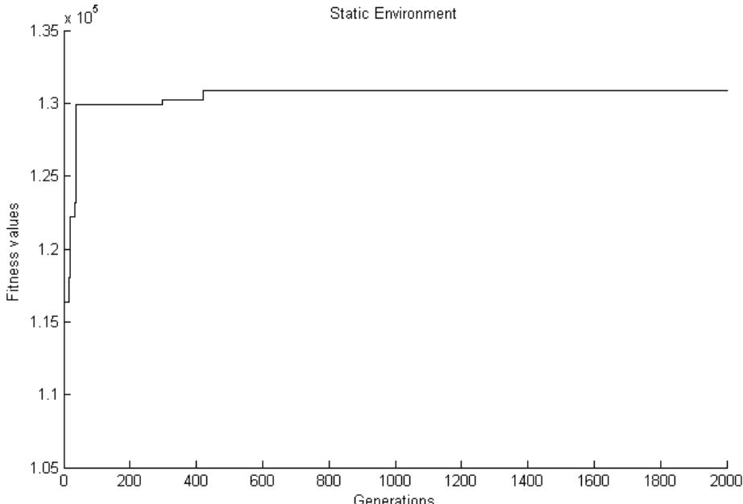
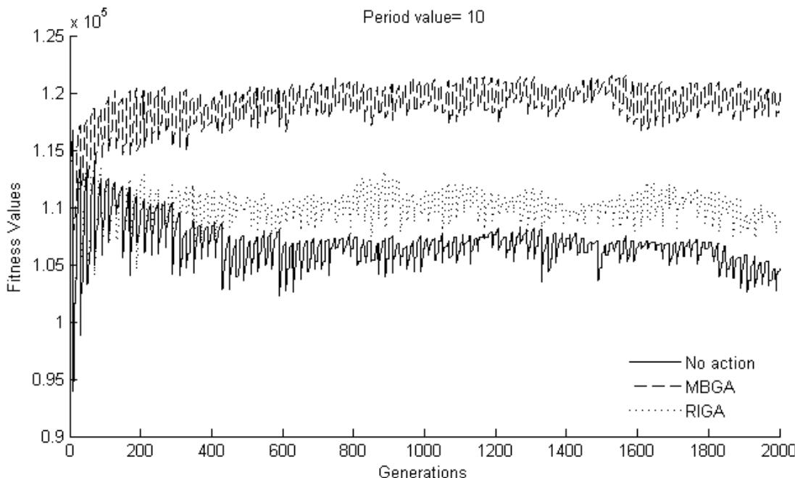
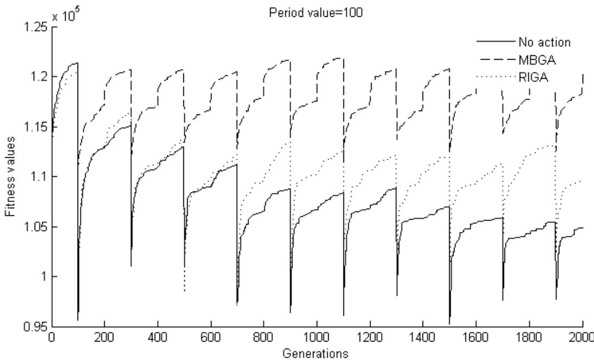
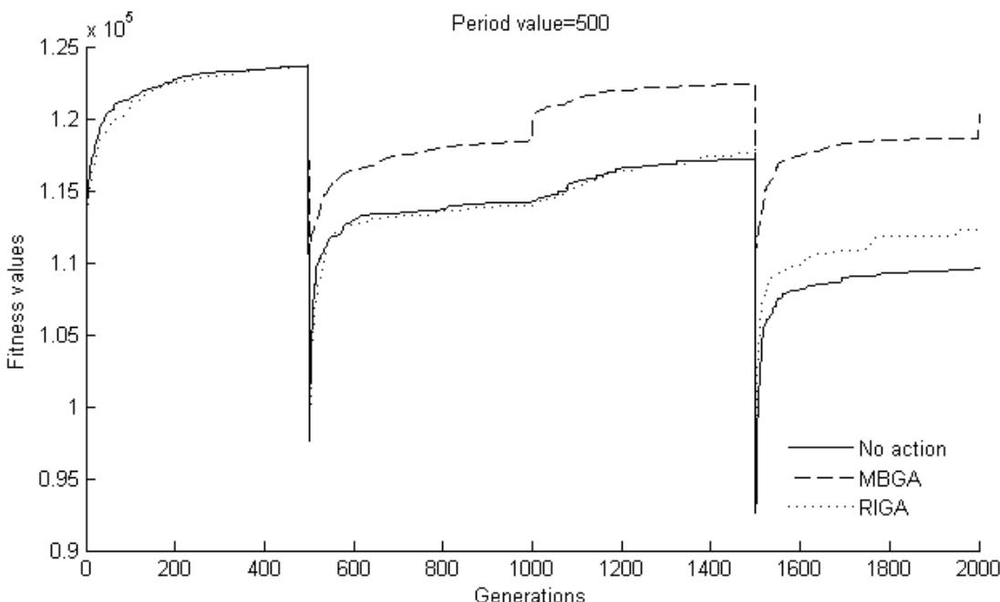

# Генетический алгоритм для задачи о многократном рюкзаке в динамической среде

Али Нади Юнал (Ali Nadi Ünal)

Аннотация — Задача о многократном рюкзаке с условиями 0/1 является важным классом задач комбинаторной оптимизации, для решения которой было разработано множество эвристических и точных методов. Генетический алгоритм (ГА) показывает хорошие результаты при решении статических задач оптимизации. Однако иногда потеря разнообразия не позволяет ГА адаптироваться к динамическим средам, где функция приспособленности и/или ограничения или условия среды могут меняться с течением времени. Было разработано несколько подходов для увеличения разнообразия ГА в динамических средах. В данной статье сравниваются два из этих подхода, называемые Генетическим алгоритмом на основе случайных иммигрантов (RIGA) и Генетическим алгоритмом на основе памяти (MBGA). Результаты показывают, что MBGA эффективнее, чем RIGA для задачи о многократном рюкзаке с условиями 0/1 в изменяющейся среде.

Ключевые слова — Генетические алгоритмы, задача о многократном рюкзаке, динамические среды

# I. ВВЕДЕНИЕ

Задача о рюкзаке (KP) — это хорошо известная NP-трудная задача оптимизации, которая может потребовать экспоненциального времени для получения результатов [1]. В связанной литературе этой проблеме также дают другие названия: «задача о рюкзаке с множественными ограничениями», «задача о множественных рюкзаках», «m-мерная задача о рюкзаке» и «многомерная задача о рюкзаке» [2]. Многие исследователи также включают в название задачи термин «с нулями и единицами» (zero-one). Задача может быть представлена следующим образом:

$$
\text{Максимизировать } \sum_{j=1}^{n} p_j x_j
$$
При ограничениях:
$$
\sum_{j=1}^{n} w_{ij} x_j \leq b_i, \quad i = 1, 2, \dots, m
$$
$$
x_j \in \{0, 1\}, \quad j = 1, 2, \dots, n
$$

Ограничения определены в (2) для $m$ рюкзаков. Каждый рюкзак имеет емкость $b_i$. У нас есть $n$ предметов, каждый из которых имеет прибыль $p_j$. В отличие от простой версии, в которой веса предметов фиксированы, вес $j$-го предмета в задаче о множественных рюкзаках принимает $m$ значений. Вес $j$-го предмета равен $w_{ij}$, когда он рассматривается для возможного включения в $i$-й рюкзак емкостью $b_i$. Как показано в (3), переменная $x$ может принимать только двоичные значения. Наша цель — найти вектор $\vec{x} = (x_1, x_2, \dots, x_n)$, который гарантирует, что ни один рюкзак не переполнен, и который дает максимальную прибыль.

Было предложено несколько подходов для решения ЗМР (MKP). Различные предложенные алгоритмы можно условно разделить на два класса: (i) точные алгоритмы и (ii) эвристики и метаэвристики. Хороший обзор этих подходов представлен в [3].

Как практики, так и теоретики интересуются задачами о рюкзаке. Практики ценят тот факт, что эти задачи могут моделировать множество промышленных приложений, таких как раскрой материалов, загрузка грузов, распределение капитала, планирование меню, выбор проектов и распределение процессоров [1, 4]. С другой стороны, теоретики считают, что эти простые по структуре задачи можно использовать как подзадачи для решения более сложных [4].

Существует огромный объем литературы по генетическим алгоритмам для различных задач и разных фаз алгоритма. Однако данный проект ограничивается конкретной эталонной задачей (то есть задачей о множественных рюкзаках Weingartner 2). По этой причине в следующих абзацах дается только необходимое объяснение (используемые в данной статье методы) относительно генетических алгоритмов и рассматриваемой проблемы (то есть динамической ЗМР).

Первым шагом при проектировании генетического алгоритма является создание начальной популяции, состоящей из особей (хромосом). Нам нужно разработать подходящую схему представления для представления особей в популяции. Уместно использовать стандартное 0-1 двоичное представление ГА для ЗМР, поскольку оно отражает лежащие в основе целочисленные переменные с условиями 0/1 [2]. Пример хромосомы для задачи о рюкзаке с семью предметами проиллюстрирован на рис. 1.

<table><tr><td rowspan=1 colspan=1>1</td><td rowspan=1 colspan=1>2</td><td rowspan=1 colspan=1>3</td><td rowspan=1 colspan=1>4</td><td rowspan=1 colspan=1>5</td><td rowspan=1 colspan=1>6</td><td rowspan=1 colspan=1>7</td></tr><tr><td rowspan=1 colspan=1>0</td><td rowspan=1 colspan=1>1</td><td rowspan=1 colspan=1>0</td><td rowspan=1 colspan=1>1</td><td rowspan=1 colspan=1>0</td><td rowspan=1 colspan=1>1</td><td rowspan=1 colspan=1>0</td></tr></table>

Рис. 1. Двоичный код для задачи о рюкзаке [5].

Верхние числа на рис. 1 обозначают порядковый номер предметов, а нижние числа — выбор предметов. Но такая схема кодирования может генерировать недопустимые решения. Недопустимое решение означает, что нарушается хотя бы одно из ограничений рюкзака.

Существует ряд стандартных способов работы с ограничениями и недопустимыми решениями в ГА [2], такие как: (i) использование представления, которое автоматически гарантирует, что все решения допустимы; (ii) разделение оценки приспособленности и недопустимости; (iii) проектирование эвристического оператора, который гарантирует преобразование любого решения в допустимое; и, наконец, (iv) применение штрафной функции для штрафа приспособленности любого недопустимого решения без искажения ландшафта приспособленности.

В этой статье недопустимым решениям разрешается присоединяться к популяции путем добавления штрафного члена к их приспособленности, как в [4]. В своей работе [4] авторы подчеркивают, что чем дальше от допустимости находится строка, тем выше должен быть ее штрафной член.

С учетом этого объяснения, максимизируемая функция приспособленности выглядит так:

$$
f(X) = \sum_{j=1}^{n} p_j x_j - s \cdot \max\{p_j\}
$$
где $s$ обозначает количество переполненных рюкзаков.

Для эталонной задачи Weingartner 2 существуют $2^{28}$ возможных решений проблемы независимо от предположения о допустимости. Но можно сказать, что чем больше единиц в любой хромосоме, тем выше вероятность нарушения ограничений. По этой причине предлагается смещение генератора случайных чисел так, чтобы он создавал строки, в которых количество нулей больше, чем количество единиц [4]. Это предложение принято в данной статье для работы с эталонной задачей.

Для фазы отбора в генетических алгоритмах в литературе используется несколько методов, таких как рулеточный выбор, стохастическая универсальная выборка, сигма-масштабирование, ранговый отбор, турнирный отбор и стационарный отбор. Для подробного объяснения этих методов читателю следует обратиться к [6].

В данной статье для отбора родителей используется турнирный отбор. Стратегия турнирного отбора обеспечивает селективное давление путем проведения турнирного соревнования между особями. Лучшая особь (победитель) из турнира — это та, которая имеет наибольшее значение приспособленности. Турнирное соревнование повторяется до тех пор, пока бассейн для размножения для создания нового потомства не будет заполнен. Бассейн для размножения, состоящий из победителей турниров, имеет более высокую среднюю приспособленность популяции. Разница в приспособленности создает селективное давление, которое заставляет ГА улучшать приспособленность последующих поколений. Этот метод более эффективен и приводит к оптимальному решению [7]. Для данной статьи размер турнира определен как 5.

После создания бассейна для размножения следующей фазой является кроссовер. Для двоичных представлений в [8] объясняется несколько методов. Среди этих операторов кроссовера (т.е. одноточечный кроссовер, N-точечный кроссовер и равномерный кроссовер) в этой статье используется одноточечный кроссовер. Он работает путем выбора случайного числа в диапазоне [0, l-1] (где l обозначает длину кодировки) и затем разрезания обоих родителей в этой точке и создания двух потомков путем обмена хвостами [8]. На рис. 2 проиллюстрирован этот процесс.

Рис. 2. Одноточечный кроссовер.

<table><tr><td rowspan=1 colspan=7>Родители</td><td rowspan=1 colspan=7>Потомки</td></tr><tr><td rowspan=1 colspan=1>0</td><td rowspan=1 colspan=1>1</td><td rowspan=1 colspan=1>0</td><td rowspan=1 colspan=1>1</td><td rowspan=1 colspan=1>1</td><td rowspan=1 colspan=1>0</td><td rowspan=1 colspan=1>0</td><td rowspan=1 colspan=1>0</td><td rowspan=1 colspan=1>1</td><td rowspan=1 colspan=1>0</td><td rowspan=1 colspan=1>1</td><td rowspan=1 colspan=1>0</td><td rowspan=1 colspan=1>0</td><td rowspan=1 colspan=1>0</td></tr><tr><td rowspan=1 colspan=1>1</td><td rowspan=1 colspan=1>0</td><td rowspan=1 colspan=1>0</td><td rowspan=1 colspan=1>1</td><td rowspan=1 colspan=1>0</td><td rowspan=1 colspan=1>0</td><td rowspan=1 colspan=1>0</td><td rowspan=1 colspan=1>1</td><td rowspan=1 colspan=1>0</td><td rowspan=1 colspan=1>0</td><td rowspan=1 colspan=1>1</td><td rowspan=1 colspan=1>1</td><td rowspan=1 colspan=1>0</td><td rowspan=1 colspan=1>0</td></tr></table>

После применения кроссовера к популяции выполняется процедура мутации. Выбранная процедура (например, побитовая мутация, ползучая мутация, случайный сброс, равномерная мутация, мутация обменом и т.д.) зависит от используемой кодировки [8]. Наиболее распространенный оператор мутации, используемый для двоичных кодировок, называется побитовой мутацией; по этой причине в данной статье побитовая мутация применяется к случайным особям через случайные биты. Пример побитовой мутации проиллюстрирован на рис. 3.

Рис. 3. Побитовая мутация.

<table><tr><td rowspan=1 colspan=1>До</td><td rowspan=1 colspan=1>1</td><td rowspan=1 colspan=1>0</td><td rowspan=1 colspan=1>1</td><td rowspan=1 colspan=1>0</td><td rowspan=1 colspan=1>0</td><td rowspan=1 colspan=1>0</td><td rowspan=1 colspan=1>0</td><td rowspan=1 colspan=1>1</td><td rowspan=1 colspan=1>0</td></tr><tr><td rowspan=1 colspan=1>После</td><td rowspan=1 colspan=1>1</td><td rowspan=1 colspan=1>0</td><td rowspan=1 colspan=1>0</td><td rowspan=1 colspan=1>1</td><td rowspan=1 colspan=1>0</td><td rowspan=1 colspan=1>0</td><td rowspan=1=1 colspan=1>0</td><td rowspan=1 colspan=1>0</td><td rowspan=1 colspan=1>0</td></tr></table>

Как показано на рис. 3, 3-й, 4-й и 8-й биты были изменены.

Мутация часто интерпретируется как «фоновый оператор», поддерживающий оператор кроссовера [4, 9]. По этой причине вероятность мутации обычно устанавливается на небольшое значение (например, 1 или 2 бита на строку) [2]. В этой статье вероятность мутации для особи равна 0.01, что составляет 2 бита на строку.

ЗМР могут быть решены с помощью генетических алгоритмов, как и многие другие задачи комбинаторной оптимизации (COP) [10]. Благодаря своей способности выборки из пространства поиска, способности одновременно манипулировать группой решений и потенциалу адаптивности эволюционные алгоритмы (ЭА) были успешно применены к большинству задач COP [11]. Это утверждение в основном верно для стационарных сред.

Когда среда меняется с течением времени, что приводит к модификации функции приспособленности от цикла к циклу, мы говорим, что находимся в динамической среде [12]. Склонность генетических алгоритмов к быстрой сходимости к оптимуму является недостатком в динамических средах. Потеря разнообразия — еще одна проблема. Поддержание разнообразия является существенным требованием для применения ГА к динамическим средам [13].

Было разработано несколько подходов внутри ГА для решения задач динамической оптимизации, таких как поддержание разнообразия во время выполнения с помощью случайных иммигрантов, увеличение разнообразия после изменения, использование схем памяти для повторного использования старых хороших решений и подходы с несколькими популяциями [14]. В этой статье подход на основе случайных иммигрантов и подход на основе памяти реализованы раздельно.

Подход на основе случайных иммигрантов — это довольно естественный и простой способ решения проблемы сходимости [14]. Он поддерживает уровень разнообразия популяции путем замены некоторых особей текущей популяции на случайно созданных особей в каждом поколении. Выбывающие особи из текущей популяции могут быть либо худшими, либо выбраными случайным образом. В этой статье частота замены составляет 0.1. Худшие особи в текущей популяции заменяются случайно сгенерированными иммигрантами. Согласно [12], лучшие результаты для подхода RIGA достигаются при частоте замены 0.1.

Подход на основе памяти работает путем хранения полезной информации из текущей среды. Сохраненная информация может быть повторно использована позже в изменяющихся средах [14]. Хранение полезной информации может происходить либо неявно через избыточные представления, либо явно путем хранения хороших решений в дополнительном пространстве памяти.

Для явной схемы памяти, когда среда меняется, старые хорошие решения в памяти, которые хорошо подходят к новой среде, будут реактивированы. В частности, когда среда меняется периодически, подход на основе памяти может работать очень хорошо, потому что со временем старая среда появится снова точно так же, и связанное с ней решение в памяти мгновенно переместит алгоритм в появившуюся среду [14]. Извлечение из памяти может выполняться периодически в каждом поколении или только при изменении среды.

Для обновления памяти может использоваться несколько стратегий замены [14]. Эти стратегии: (i) замена наименее важного с точки зрения возраста, вклада в разнообразие и приспособленности; (ii) замена того, который вносит наименьший вклад в дисперсию памяти; (iii) замена наиболее похожего, если особь лучше; или (iv) замена менее приспособленной особи из пары точек памяти, имеющих минимальное расстояние среди всех пар.

В данной статье используется явная схема памяти. Размер памяти равен 10 (0,1 * размер популяции). Сначала память инициализируется путем выбора 10 лучших решений из начальной популяции. Эта память теперь фиксирована и не будет обновляться на протяжении поколений. Когда среда меняется, память монтируется в популяцию (то есть последние 10 строк матрицы популяции заменяются на память).

# II. МЕТОДЫ

Были проведены эксперименты для сравнения RIGA и MBGA в динамической среде. Использовалась эталонная задача о множественных рюкзаках Weingartner 2. Эту задачу можно скачать по адресу http://elib.zib.de/pub/Packages/mp-testdata/ip/sac94-suite/. В этой задаче существует 28 предметов и 2 рюкзака. Емкость каждого рюкзака равна 500. Оптимальное решение для этой задачи заявлено как 130883. Для написания алгоритма использовалась среда MATLAB 7.6.0.

Для каждого из двух подходов параметры были установлены следующим образом: поколенческий ГА с элитарностью только 1 особи, одноточечный кроссовер с вероятностью 0,7, побитовая мутация с вероятностью 0,01 (2 бита на особь) и турнирный отбор для создания бассейна размножения (отбор родителей). Размер популяции составлял 100, а размер турнира для отбора — 5. Количество поколений было установлено равным 2000. Для 3 различных сценариев (т.е. без действий при изменяющейся среде, RIGA и MBGA) было выполнено 50 независимых прогонов с одинаковыми начальными значениями (seed values).

Изменение среды реализовалось периодически для 3 различных значений периода для обоих ГА, и результаты были сравнены. Значения периода: 10, 100 и 500. Это означает, что когда значение периода изменения равно 10, в каждом 10-м поколении емкость первого рюкзака колеблется между 400 и 500 (т.е. после 10-го поколения емкость равна 400, после 20-го поколения емкость снова 500 и так далее). Для значения периода 10 всего насчитывается 2000 / 10 = 200 изменений. На каждой итерации записывались лучшие значения приспособленности популяции по всем 50 прогонам.

Общая производительность подходов формулируется следующим образом [14]:

$$
\overline{Q}_{OE} = \frac{1}{G \cdot M} \sum_{i=1}^{G} \sum_{j=1}^{M} F_{best}^i(j)
$$
Где $G$ — количество поколений за один прогон, $M = 50$ — общее количество прогонов, $F_{best}^i(j)$ — лучшая приспособленность в поколении $i$ прогона $j$, а $\overline{Q}_{OE}$ — офлайн-производительность, то есть лучшая приспособленность в поколении, усредненная по 50 прогонам и за период сбора данных.

# III. РЕЗУЛЬТАТЫ И ОБСУЖДЕНИЕ

Прежде всего, для эталонной статической задачи о множественных рюкзаках с условиями 0/1 было выполнено 50 прогонов. Лучший результат, достигнутый за 50 прогонов, составил 130883 (включенные предметы: 3, 5, 7, 8, 10, 11, 14, 19, 21, 23, 24). Это показывает, что алгоритм может найти оптимальное решение в пределах 50 прогонов. Оптимальное значение было достигнуто на 40-м прогоне. Начальное значение (seed value) для этого прогона было установлено на 40.

Когда алгоритм находит оптимальное решение, траектория алгоритма в терминах значений приспособленности на протяжении 2000 итераций показана на рис. 4.

  
Рис. 4. Значение приспособленности по поколениям для статической задачи.

После проверки того, что алгоритм работает корректно для статических сред, пришло время запустить его для динамической среды, которая была упомянута выше в Разделе 3. Чтобы сравнить «подход RIGA», «подход MBGA» и «без действий» при изменяющейся среде друг с другом, для каждого алгоритма было выполнено по 50 прогонов с одинаковыми параметрами и одинаковыми начальными значениями для 3 различных сред. Было проведено сравнение офлайн-производительности использованных подходов, и результаты показаны в Таблице 1.

ТАБЛИЦА 1. ОБЩАЯ ПРОИЗВОДИТЕЛЬНОСТЬ 50 ПРОГОНОВ.

<table><tr><td rowspan="2">ПОДХОДЫ</td><td colspan="3">ЗНАЧЕНИЯ ПЕРИОДА</td></tr><tr><td></td><td>10</td><td>100</td><td>500</td></tr><tr><td>Без действий</td><td>106744</td><td>107870</td><td>115069</td></tr><tr><td>RIGA</td><td>110102</td><td>110771</td><td>115476</td></tr><tr><td>MBGA</td><td>119035</td><td>118837</td><td>119799</td></tr></table>

Как показано в Таблице 1, оба метода, использованные для увеличения разнообразия, похоже, хорошо работают по сравнению с отсутствием действий (т.е. «без действий»). Кроме того, MBGA превосходит RIGA для всех значений периода. Необходимо было проверить, являются ли результаты статистически значимыми. Для этого к собранным данным был применен критерий проверки гипотез.

Когда дисперсии генеральной совокупности неизвестны, для проверки гипотезы для больших выборок ($n > 40$) могут использоваться выборочные дисперсии с использованием Z-статистики, причем предположение о нормальности распределения не является обязательным (Монтгомери и Рангер, 2003, стр. 329). Результаты проверки гипотез представлены в Таблице 2.

Значения тестовой статистики в Таблице 2 подтверждают упомянутые выше утверждения. И MBGA, и RIGA лучше, чем отсутствие действий при изменяющейся среде, за исключением случая, когда значение периода равно 500. Когда значение периода равно 500, изменение среды происходит значительно медленно. MBGA снова превосходит остальные, но у нас нет веских доказательств, чтобы сделать вывод о том, что RIGA эффективнее, чем отсутствие действий. Для такой медленно меняющейся среды использование RIGA и предпочтение «без действий», по-видимому, вообще не дает разницы.

На рис. 5–7 видно динамическое поведение ГА для разных периодов изменения среды. На этих рисунках построены средние значения приспособленности каждого прогона по итерациям (то есть сумма значений приспособленности первых итераций за 50 прогонов делится на 50). Как показано на рисунках ниже, MBGA превосходит остальные подходы во всех средах.

ТАБЛИЦА 2. ПРОВЕРКА ГИПОТЕЗ (ОДНОСТОРОННЯЯ)

<table><tr><td>H0 (Нулевая гипотеза)</td><td>H1 (Альтернативная гипотеза)</td><td>Среднее 1</td><td>Среднее 2</td><td>Дисперсия 1</td><td>Дисперсия 2</td><td>Z-статистика</td><td>Решение</td></tr><tr><td>$\mu_1 \geq \mu_2$</td><td>$\mu_1 < \mu_2$</td><td>106744</td><td>119035</td><td>8695</td><td>3563</td><td>-9.2490</td><td>Отклонить H0</td></tr><tr><td>$\mu_1 \geq \mu_2$</td><td>$\mu_1 < \mu_2$</td><td>106744</td><td>110102</td><td>8695</td><td>6411</td><td>-2.1980</td><td>Отклонить H0</td></tr><tr><td>$\mu_1 \geq \mu_2$</td><td>$\mu_1 < \mu_2$</td><td>110102</td><td>119035</td><td>6411</td><td>3563</td><td>-8.6121</td><td>Отклонить H0</td></tr><tr><td>$\mu_1 \geq \mu_2$</td><td>$\mu_1 < \mu_2$</td><td>107870</td><td>118837</td><td>6952</td><td>3757</td><td>-9.8135</td><td>Отклонить H0</td></tr><tr><td>$\mu_1 \geq \mu_2$</td><td>$\mu_1 < \mu_2$</td><td>107870</td><td>110771</td><td>6952</td><td>6338</td><td>-2.1805</td><td>Отклонить H0</td></tr><tr><td>$\mu_1 \geq \mu_2$</td><td>$\mu_1 < \mu_2$</td><td>110771</td><td>118837</td><td>6338</td><td>3757</td><td>-7.7411</td><td>Отклонить H0</td></tr><td>$\mu_1 \geq \mu_2$</td><td>$\mu_1 < \mu_2$</td><td>115069</td><td>119799</td><td>5608</td><td>3434</td><td>-5.0862</td><td>Отклонить H0</td></tr><td>$\mu_1 \geq \mu_2$</td><td>$\mu_1 < \mu_2$</td><td>115069</td><td>115476</td><td>5608</td><td>5005</td><td>-0.3829</td><td>Не удалось отклонить H0</td></tr><td>$\mu_1 \geq \mu_2$</td><td>$\mu_1 < \mu_2$</td><td>115476</td><td>119799</td><td>5005</td><td>3434</td><td>-5.0361</td><td>Отклонить H0</td></tr></table>

$v_1 = v_2 = 50, \alpha=0.05, -z_{\alpha} = -1.645$

  
Рис. 5. Динамическое поведение ГА при значении периода 10.

  
Рис. 6. Динамическое поведение ГА при значении периода 100.

  
Рис. 7. Динамическое поведение ГА при значении периода 500.

# III. ВЫВОДЫ

В этой статье разработан ГА для задачи о многократном рюкзаке с условиями 0/1 (ЗМР), и его производительность в динамических средах сравнивается с использованием 2 различных подходов, а именно: генетического алгоритма на основе случайных иммигрантов (RIGA) и генетического алгоритма на основе памяти (MBGA). В качестве меры для сравнения двух подходов использовалась офлайн-производительность среди 3 различных изменяющихся сред (значения периода: 10, 100, 500).

Разработанный ГА с использованием простых генетических операторов (двоичное кодирование, одноточечный кроссовер, побитовая мутация, турнирный отбор) высоко эффективен для ЗМР с условиями 0/1. Для динамических сред как RIGA, так и MBGA полезны для увеличения разнообразия. Результаты показывают, что MBGA превосходит RIGA для всех сценариев. При значении периода 500 использование RIGA, по-видимому, вообще неэффективно по сравнению с отсутствием действий.

# Список литературы

[1] A. Zaheed and I. Younas, “A Dynamic Programming based GA for 0- 1 Modified Knapsack Problem” International Journal of Computer Applications , vol. 16, No. 7, pp. 1-6, 2011.   
[2] P.C. Chu and J. Beasley, “A Genetic Algorithm for the Multidimensional Knapsack Problem”, Journal of Heuristics , vol. 4, No.1, pp 63-86, June 1998.   
[3] M. Varnamkhasti, “Overview of the Algorithms for Solving the Multidimensional Knapsack Problems” Advanced Studies in Biology , vol. 4, No. 1, pp. 37-47, 2012.

Proceedings of the World Congress on Engineering and Computer Science 2013 Vol II WCECS 2013, 23-25 October, 2013, San Francisco, USA

[4] S. Khuri, T. Baeck and J. Heitkötter, “The Zero/One Multiple Knapsack Problem and Genetic Algorithms”, in Proc. ACM Symposium on Applied Computing (SAC'94), New York, 1994, pp. 188-193.   
[5] X. Yu and M. Gen, Introduction to Evolutionary Algorithm, London: Springer Verlag-London Limited, 2010, p. 272.   
[6] M. Mitchell, An Inroduction to Genetic Algorithms, Cambridge: The MIT Press, 1998, pp. 124-127.   
[7] S. N. Sivanandam and S.N. Deepa, Introduction to Genetic Algorithms, Berlin: Springer-Verlag, 2008, pp. 48-49.   
[8] A. Eiben and J. Smith, Introduction to Evolutionary Computing, Berlin: Springer, 2003, ch. 4.   
[9] T. Baeck, D. B. Fogel, D. Whitley, and P. J. Angeline, “Mutation Operators” in Evolutionary Computation 1: Basic Algorithms and Operators, T.Baeck, D.B. Fogel and Z. Michalevicz, Eds., Bristol: Institute of Physics Publishing, 2000, pp. 237-255.   
[10] M. Gen and R. Cheng, R Genetic Algorithms and Engineering Optimization, New York: John Wiley and Sons, 2000, p. 78.   
[11] A. Younes, S. Aeribi, P. Calamai, and O. Basir, “Adapting Genetic Algorithms for Combinatorial Optimization Problems in Dynamic Environments” in Advances in Evolutionary Algorithms, W. Kosinski, Ed., Viena: I-Tech Education and Publishing, 2008, pp. 207-230   
[12] A. Simoes and E. Costa, “ Using Genetic Algorithms to Deal with Dynamic Environments: A Comparative Study of Several Approaches Based on Promoting Diversity”, in Proc. Genetic and Evolutionary Computation Conference (GECCO’02), San Francisco, California: July, 2002, p. 698.   
[13] N. Mori and H. Kita, “ Genetic Algorithms for Adaptation to Dynamic Environments-A Survey”, in Proc. Industrial Electronics Society, 2000. IECON 2000. 26th Annual Conference of the IEEE, Nagoya: 2000, pp. 2947-2952.   
[14] S. Yang, “Memory-Based Immigrants for Genetic Algorithms in Dynamic Environments”, in Proc. Genetic and Evolutionary Computation Conference (GECCO’05), Washington DC: June, 2005, pp. 1115-1122.   
[15] D.C. Montgomery and G. C. Runger, “Applied Statistics and Probability for Engineers 3rd ed”, New York: John Wiley and Sons Inc, 2003, p. 329.
