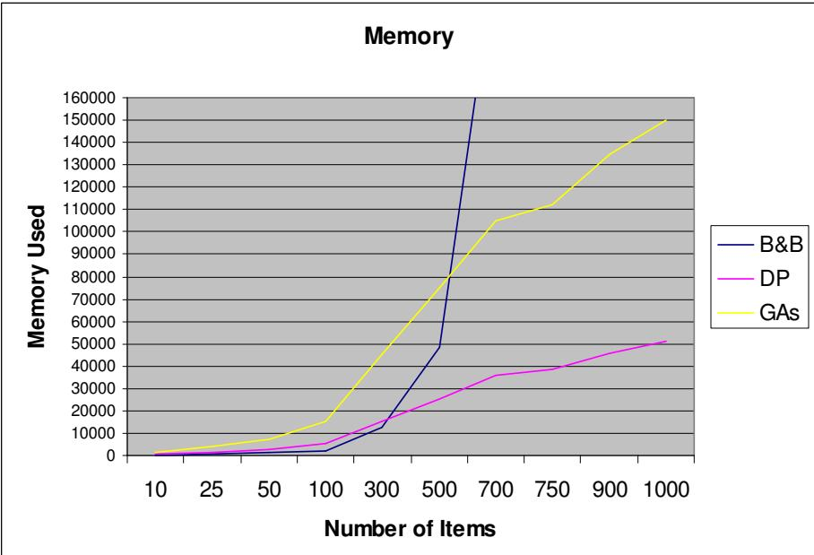
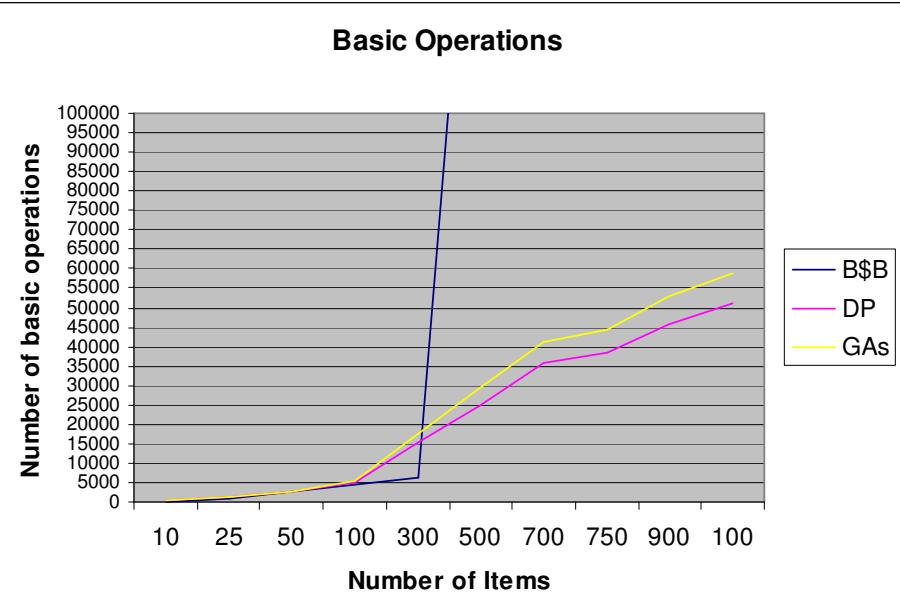
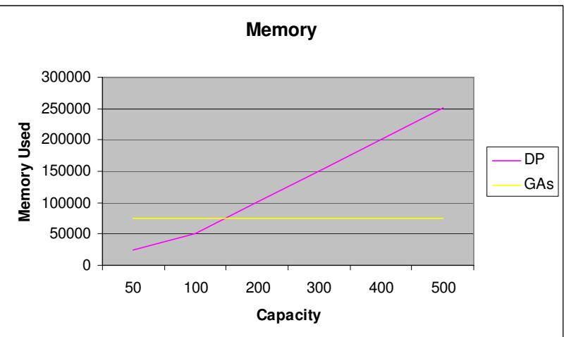
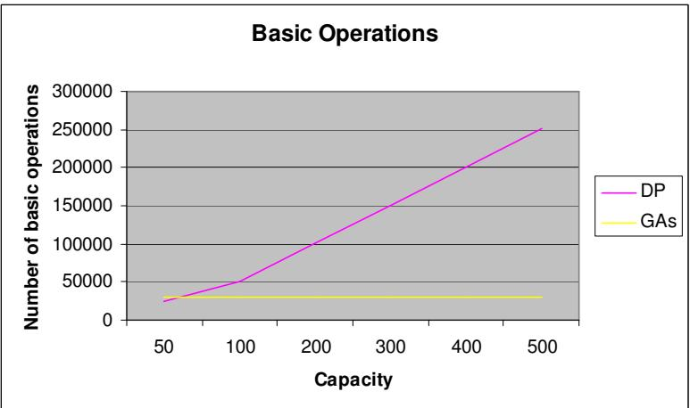

# Different Approaches to Solve the 0/1 Knapsack Problem

Maya Hristakeva   
Computer Science Department   
Simpson College   
Indianola, IA 50125   
hristake@simpson.edu   
Dipti Shrestha   
Computer Science Department   
Simpson College   
Indianola, IA 50125   
shresthd@simpson.edu

# Abstract

The purpose of this paper is to analyze several algorithm design paradigms applied to a single problem – the 0/1 Knapsack Problem. The Knapsack problem is a combinatorial optimization problem where one has to maximize the benefit of objects in a knapsack without exceeding its capacity. It is an NP-complete problem and as such an exact solution for a large input is practically impossible to obtain.

The main goal of the paper is to present a comparative study of the brute force, dynamic programming, memory functions, branch and bound, greedy, and genetic algorithms. The paper discusses the complexity of each algorithm in terms of time and memory requirements, and in terms of required programming efforts. Our experimental results show that the most promising approaches are dynamic programming and genetic algorithms. The paper examines in more details the specifics and the limitations of these two paradigms.

# Introduction

In this project we are going to use Brute Force, Dynamic Programming, Memory Functions, Branch and Bound, and Greedy Algorithms to solve the Knapsack Problem where one has to maximize the benefit of items in a knapsack without extending its capacity. The main goal of this project is to compare the results of these algorithms and find the best one.

# The Knapsack Problem (KP)

The Knapsack Problem is an example of a combinatorial optimization problem, which seeks for a best solution from among many other solutions. It is concerned with a knapsack that has positive integer volume (or capacity) $V .$ . There are $n$ distinct items that may potentially be placed in the knapsack. Item $i$ has a positive integer volume $V _ { i }$ and positive integer benefit $B _ { i }$ . In addition, there are $Q _ { i }$ copies of item $i$ available, where quantity $Q _ { i }$ is a positive integer satisfying $1 \leq Q _ { i } \leq \infty$ .

Let $X _ { i }$ determines how many copies of item $i$ are to be placed into the knapsack. The goal is to:

Maximize

$$
\sum _ { \mathrm { i } = 1 } ^ { \mathrm { N } } B _ { i } X _ { i }
$$

Subject to the constraints

$$
\sum _ { \mathrm { i } = 1 } ^ { \mathrm { N } } V _ { i } X _ { i } \leq V
$$

And

$$
0 \leq X _ { i } \leq Q _ { i } .
$$

If one or more of the $Q _ { i }$ is infinite, the KP is unbounded; otherwise, the KP is bounded [1]. The bounded KP can be either ${ 0 } { - } I { \ K P }$ or Multiconstraint $K P .$ . If $Q _ { i } = 1$ for $i = 1$ , 2, $\ldots , N ,$ , the problem is a 0-1 knapsack problem In the current paper, we have worked on the bounded $\partial { - } I { \bf \nabla } K P$ , where we cannot have more than one copy of an item in the knapsack.

# Different Approaches

# Brute Force

Brute force is a straightforward approach to solving a problem, usually directly based on the problem’s statement and definitions of the concepts involved. If there are $n$ items to choose from, then there will be $2 ^ { \mathfrak { n } }$ possible combinations of items for the knapsack. An item is either chosen or not chosen. A bit string of 0’s and 1’s is generated which is of length $n$ . If the $\mathrm { i } ^ { \mathrm { t h } }$ symbol of a bit string is 0, then the $\mathrm { i } ^ { \mathrm { t h } }$ item is not chosen and if it is 1, the $\bar { \mathbf { i } } ^ { \mathrm { t h } }$ item is chosen.

ALGORITHM BruteForce (Weights [1 … N], Values [1 … N], A[1…N])   
//Finds the best possible combination of items for the KP   
//Input: Array Weights contains the weights of all items Array Values contains the values of all items Array A initialized with 0s is used to generate the bit strings   
//Output: Best possible combination of items in the knapsack bestChoice [1 .. N]

for $\dot { 1 } = 1$ to $2 ^ { \mathfrak { n } }$ do $\mathrm { j }  \mathrm { n }$ tempWeight $ 0$ tempValue $ 0$ while ( A[j] $! = 0$ and $\mathrm { j } > 0 \mathrm { j }$ ) $\begin{array} { r } { \mathrm { A [ j ] }  0 } \\ { \mathrm { j }  \mathrm { j } - 1 } \\ { \mathrm { M [ j ] }  1 } \end{array}$ for $\mathbf k \gets 1$ to n do if $\mathbf { \tau } ( \mathbf { A } [ \mathbf { k } ] = 1 \mathbf { \dot { \tau } } _ { \mathrm { ~ } }$ ) then tempWeight $\longleftarrow$ tempWeight $^ +$ Weights[k] tempValue tempValue $^ +$ Values[k] if ((tempValue $>$ bestValue) AND (tempWeight $\leq$ Capacity)) then bestValue tempValue bestWeight $\longleftarrow$ tempWeight

bestChoice $ \mathbf { A }$ return bestChoice

# Complexity

$$
\begin{array} { r l } {  { 2 ^ { \mathrm { n } } \sum _ { 1 = 1 } ^ { 2 ^ { \mathrm { n } } } \big [ \sum _ { \mathrm { j } = \mathrm { n } } ^ { \mathrm { ~ x ~ } } + \sum _ { \mathrm { k } = 1 } ^ { \mathrm { n } } \big ] = \sum _ { \mathrm { i } = 1 } ^ { 2 ^ { \mathrm { n } } } [ \{ 1 + \ldots + 1 \} ( \mathrm { n } \mathrm { t i m e s } ) + \{ 1 + \ldots + 1 \} ( \mathrm { n } \mathrm { t i m e s } ) ] } } \\ & { = ( 2 \mathrm { n } ) ^ { \ast } [ 1 + 1 + 1 . . . . . + 1 ] ( 2 ^ { \mathrm { n } } \mathrm { t i m e s } ) } \\ & { = \mathrm { O } ( 2 \mathrm { n } ^ { \ast } 2 ^ { \mathrm { n } } ) } \\ & { = \mathrm { O } ( \mathrm { n } ^ { \ast } 2 ^ { \mathrm { n } } ) } \end{array}
$$

Therefore, the complexity of the Brute Force algorithm is $O \ : ( n 2 ^ { n } )$ . Since the complexity of this algorithm grows exponentially, it can only be used for small instances of the KP. Otherwise, it does not require much programming effort in order to be implemented. Besides the memory used to store the values and weights of all items, this algorithm requires a two one dimensional arrays (A[] and bestChoice[]).

# Dynamic Programming

Dynamic Programming is a technique for solving problems whose solutions satisfy recurrence relations with overlapping subproblems. Dynamic Programming solves each of the smaller subproblems only once and records the results in a table rather than solving overlapping subproblems over and over again. The table is then used to obtain a solution to the original problem. The classical dynamic programming approach works bottom-up [2].

To design a dynamic programming algorithm for the 0/1 Knapsack problem, we first need to derive a recurrence relation that expresses a solution to an instance of the knapsack problem in terms of solutions to its smaller instances.

Consider an instance of the problem defined by the first $i$ items, $1 \leq \mathbf { i } \leq \mathbf { N }$ , with:

weights $\mathbf { W } _ { 1 } , \ldots , \mathbf { W _ { i } }$ ,   
values $\mathbf { V } _ { 1 }$ , … , $\mathbf { V _ { i } }$ ,   
and knapsack capacity j, $1 \leq \mathrm { j } \leq$ Capacity.

Let Table[i, j] be the optimal solution of this instance (i.e. the value of the most valuable subsets of the first i items that fit into the knapsack capacity of j). We can divide all the subsets of the first i items that fit the knapsack of capacity j into two categories subsets that do not include the $\mathrm { i } ^ { \mathrm { t h } }$ item and subsets that include the $\mathrm { i } ^ { \mathrm { t h } }$ item. This leads to the following recurrence:

Cannot fit the ith item

If $\mathrm { j } < \mathrm { w } _ { \mathrm { i } }$ then Table[i, j] $\longleftarrow$ Table[i-1, j]   
Else Table[i, j] $\longleftarrow$ maximum { Table[i-1, j] AND $\mathrm { v _ { i } + T a b l e [ i - 1 , j - v _ { i } , ] }$

Do not use the ith item

Use the ith item

The goal is to find Table [N, Capacity] the maximal value of a subset of the knapsack.

- The knapsack has no value when there no items included in it (i.e. $\\mathrm { i } = 0$ ). Table $[ 0 , \mathrm { j } ] = 0$ for ${ \bf j } \geq 0$

- The knapsack has no value when its capacity is zero (i.e. $\mathrm { j } = 0 \mathrm { \ : }$ ), because no items can be included in it.

$$
{ \mathrm { T a b l e ~ [ i , 0 ] } } = 0 \ \mathrm { f o r ~ i \geq 0 ~ }
$$

ALGORITHM Dynamic Programming (Weights [1 … N], Values [1 … N], Table [0 ... N, 0 … Capacity] // Input: Array Weights contains the weights of all items Array Values contains the values of all items Array Table is initialized with 0s; it is used to store the results from the dynamic programming algorithm.

// Output: The last value of array Table (Table [N, Capacity]) contains the optimal solution of the problem for the given Capacity

for $\dot { \mathbf { 1 } } = 0$ to $_ \mathrm { N }$ do for $\mathrm { j } = 0$ to Capacity if $\mathrm { j } <$ Weights[i] then Table[i, j] $\longleftarrow$ Table[i-1, j] else Table[i, j] $\longleftarrow$ maximum { Table[i-1, j] AND Values[i] $^ +$ Table[i-1, j – Weights[i]]

return Table[N, Capacity]

In the implementation of the algorithm instead of using two separate arrays for the weights and the values of the items, we used one array Items of type item, where item is a structure with two fields: weight and value.

To find which items are included in the optimal solution, we use the following algorithm:

$n \gets \mathrm { { N } } \qquad c \gets \mathrm { { C a p a c i t y } }$   
Start at position Table[n, c]   
While the remaining capacity is greater than 0 do If Table $[ n , c ] = \mathrm { T a b l e } [ n - l , c ]$ then Item $n$ has not been included in the optimal solution Else Item $n$ has been included in the optimal solution Process Item $n$ Move one row up to $n { - } I$ Move to column c – weight(n)

# Complexity

$$
\begin{array} { r l } {  { \sum _ { \mathrm { i = 0 } } ^ { \mathrm { N \ C a p a c i t y } } 1 = \sum _ { \mathrm { i = 0 } } ^ { \mathrm { N } } ( 1 { + } 1 { + } 1 { + } . . . . . . { + } 1 ] \ ( \mathrm { C a p a c i t y \ t i m e s } ) } } \\ & { \ = \mathrm { C a p a c i t y } ^ { \mathrm { * } } \ [ 1 { + } 1 { + } 1 { + } . . . . . . { + } 1 ] \ ( \mathrm { N \ t i m e s } ) } \\ & { \ = \mathrm { C a p a c i t y } ^ { \mathrm { * } } \ \mathrm { N } } \\ & { = \mathrm { O ( N ^ { * } C a p a c i t y ) } } \end{array}
$$

Thus, the complexity of the Dynamic Programming algorithm is $o$ (N\*Capacity). In terms of memory, Dynamic Programming requires a two dimensional array with rows equal to the number of items and columns equal to the capacity of the knapsack. This algorithm is probably one of the easiest to implement because it does not require the use of any additional structures.

# Memory Functions

Unlike dynamic programming, memory functions solve in a top-down manner only subproblems that are necessary. In addition, it maintains a table of the kind that would have been used by a bottom-up dynamic programming algorithm. Initially, all the cells in the table are initialized with a special “null” symbol to indicate that they have not been calculated. This method first checks if the value in the needed cell has already been calculated (i.e. it is not null). If this is true, it retrieves it from the table. However, if the value in the cell is “null,” it is computed by the recursive call whose result is then recorded in the table [2]. Memory functions use the same recurrence relations as the dynamic programming algorithm.

ALGORITHM MemoryFunction (i, j)   
// Input: The function is initially called with $\mathrm { i } = \mathbf { N }$ and $\mathrm { j } =$ Capacity   
// Output: The last value of array Table (Table [N, Capacity]) contains the optimal solution of the problem for the given Capacity   
// The program uses global variables input arrays Weight [1 … N], Values [1 … N], and Table[0 … N, 0 … Capacity) whose entries are initialized with -1s except for the $0 ^ { \mathrm { t h } }$ row and column, which are initialized with 0s (follows from the boundary conditions explained in the Dynamic Programming section).

if Table[i, $\mathrm { j } ] < 0$ then if $\mathrm { j } <$ Weights[i] then if $\mathrm { j } < \mathrm { W } [ \mathrm { i } ]$ then value MemoryFunction (i-1, j) else value maximum { MemoryFunction (i-1, j) AND Values[i] $^ +$ MemoryFunction (i-1, j – Weights[i])

Table $[ \mathrm { i } , \mathrm { j } ] \gets$ value return Table[i, j]

Overall, memory functions are an improvement of dynamic programming because they only solve sub-problems that are necessary and do it only once. However, they require more memory because it makes recursive calls which require additional memory.

# Greedy Algorithm

Greedy programming techniques are used in optimization problems. They typically use some heuristic or common sense knowledge to generate a sequence of suboptimum that hopefully converges to an optimum value.

Possible greedy strategies to the 0/1 Knapsack problem:

1. Choose the item that has the maximum value from the remaining items; this increases the value of the knapsack as quickly as possible.   
2. Choose the lightest item from the remaining items which uses up capacity as slowly as possible allowing more items to be stuffed in the knapsack.   
3. Choose the items with as high a value per weight as possible.

We implemented and tested all three of the strategies. We got the best results with the third strategy - choosing the items with as high value-to-weight ratios as possible.

ALGORITHM GreedyAlgorithm (Weights [1 … N], Values [1 … N])

// Input: Array Weights contains the weights of all items Array Values contains the values of all items   
// Output: Array Solution which indicates the items are included in the knapsack (‘1’) or not (‘0’)   
Integer CumWeight   
Compute the value-to-weight ratios $\bf { r } _ { i } = \bf { V } _ { i } / \psi _ { W  i } , i = 1 , . . . , N .$ , for the items given   
Sort the items in non-increasing order of the value-to-weight ratios   
for all items do if the current item on the list fits into the knapsack then place it in the knapsack else proceed to the next one

# Complexity

1.Sorting by any advanced algorithm is O(NlogN)

$$
2 . \sum _ { \mathrm { i } = 0 } ^ { \mathrm { N } } 1 = [ 1 + 1 + 1 . . . . 1 ] \mathrm { ( N ~ t i m e s ) } = \mathrm { N } \approx \mathrm { O } ( \mathrm { N } )
$$

From (1) and (2), the complexity of the greedy algorithm is, $\mathrm { O ( N l o g N ) + O ( N ) \approx }$ $O ( N l o g N )$ . In terms of memory, this algorithm only requires a one dimensional array to record the solution string.

# Branch and Bound

Branch and bound is a technique used only to solve optimization problems. It is an improvement over exhaustive search, because unlike it, branch and bound constructs candidate solutions one component at a time and evaluates the partly constructed solutions. If no potential values of the remaining components can lead to a solution, the remaining components are not generated at all. This approach makes it possible to solve some large instances of difficult combinatorial problems, though, in the worst case, it still has an exponential complexity.

Branch and bound is based on the construction of a ‘state space tree’. A state space tree is a rooted tree where each level represents a choice in the solution space that depends on the level above and any possible solution is represented by some path starting out at the root and ending at a leaf. The root, by definition, has level zero and represents the state where no partial solution has been made. A leaf has no children and represents the state where all choices making up a solution have been made. In the context of the Knapsack problem, if there are N possible items to choose from, then the $\operatorname { k } ^ { \mathrm { { t h } } }$ level represents the

state where it has been decided which of the first $\mathbf { k }$ items have or have not been included in the knapsack. In this case, there are $2 ^ { \mathrm { k } }$ nodes on the ${ \mathrm { k } } ^ { \mathrm { t h } }$ level and the state space tree’s leaves are all on level N [2].

The most common ways, branch and bound uses to traverse the state space tree, are breath-first traversal and best-first traversal. Both breath-first and best-first stop searching in a particular sub-tree when it is clear that to search further down is pointless. The only difference between breath-first and best-first is that the first one uses a regular queue and the second uses a priority queue, where both queues keep track of all currently known promising nodes. We implemented the branch and bound algorithm using a priority queue.

In the state space tree, a branch going to the left indicates the inclusion of the next item while a branch to the right indicates its exclusion. In each node of the state space tree, we record the following information:

level - indicates which level is the node at, cumValue – the cumulative value of all items that have been selected on this   
branch, cumWeight – the cumulative weight of all items that have been selected on this   
branch, nodeBound – used as a key for the priority queue.

We compute the upper bound on the value of any subset by adding the cumulative value of the items already selected in the subset, $\nu .$ , and the product of the remaining capacity of the knapsack (Capacity minus the cumulative weight of the items already selected in the subset, $w _ { \mathrm { i } }$ ,) and the best per unit payoff among the remaining items, which is $\mathbf { V } _ { \mathrm { i + 1 } } \wedge \mathbf { W } _ { \mathrm { i + 1 } }$ [2].

$$
U p p e r B o u n d = \nu + ( C a p a c i t y - w ) ^ { * } ( \nu _ { i + I } / w _ { i + I } )
$$

ALGORITHM BestFirstBranchAndBound (Weights [1 … N], Values [1 … N)

// Input: Array Weights contains the values of all items Array Values contains the values of all items   
// Output: An array that contains the best solution and its MaxValue   
// Precondition: The items are sorted according to their value-to-weight ratios

PriorityQueue<nodeType> PQ nodeType current, temp

Initialize the root PQ.enqueue(the root) MaxValue $=$ value(root)

while(PQ is not empty) current $= { \mathrm { P Q } } . { \mathrm { G e t M a x } } ( )$ if (current.nodeBound $>$ MaxValue) Set the left child of the current node to include the next item

if (the left child has value greater than MaxValue) then MaxValue $=$ value (left child) Update Best Solution   
if (left child bound better than MaxValue) PQ.enqueue(left child)   
Set the right child of the current node not to include the next item   
if (right child bound better than MaxValue) PQ.enqueue(right child)

return the best solution and it’s maximum value

In the worst case, the branch and bound algorithm will generate all intermediate stages and all leaves. Therefore, the tree will be complete and will have $2 ^ { \mathrm { n - 1 } } - 1$ nodes, i.e. will have an exponential complexity. However, it is still better than the brute force algorithm because on average it will not generate all possible nodes (solutions). The required memory depends on the length of the priority queue.

# Genetic Algorithm

A genetic algorithm is a computer algorithm that searches for good solutions to a problem from among a large number of possible solutions. All GAs begin with a set of solutions (represented by chromosomes) called population. A new population is created from solutions of an old population in hope of getting a better population. Solutions which are then chosen to form new solutions (offsprings) are selected according to their fitness. The more suitable the solutions are the bigger chances they have to reproduce. This process is repeated until some condition is satisfied [4].

Most GAs methods are based on the following elements: “populations of chromosomes, selection according to fitness, crossover to produce new offspring, and random mutation of new offspring”[3].

# Outline of basic GA s

1. Start: Randomly generate a population of N chromosomes.

2. Fitness: Calculate the fitness of all chromosomes.

3. Create a new population: a. Selection: Randomly select 2 chromosomes from the population. b. Crossover: Perform crossover on the 2 chromosomes selected. c. Mutation: Perform mutation on the chromosomes obtained.

4. Replace: Replace the current population with the new population.

5. Test: Test whether the end condition is satisfied. If so, stop. If not, return the best solution in current population and go to Step 2.

Each iteration of this process is called generation. The entire set of generations is called a run [3].

We described in detail a genetic algorithm for solving the 0/1 Knapsack Problem in our previous publication “Solving the 0/1 Knapsack Problem with Genetic Algorithms.” There we concluded that the group selection function that we implemented produced better results than the roulette wheel selection function. Thus, in this project, we perform our testing with the group selection function. We also set the population size to 250, the mutation rate to $0 . 1 \%$ and the crossover rate to $85 \%$ $8 5 \%$ of every new generation will be formed with crossover and $15 \%$ will be copied without any changes). In our genetic algorithm the population converges when either $90 \%$ of the chromosomes in the population have the same fitness value or the number of generations is greater than a fixed number usually set to 500 [5].

# Complexity

The complexity of the genetic algorithm depends on the number of items $( \mathrm { N } )$ and the number of chromosomes in each generation (Size). It is $O ( S i z e ^ { * } N )$ .

# Analysis of Results

For the testing of the different algorithms, we generated files with different sizes where each record consists of a pair of randomly generated integers representing the weight and value of each item. We performed two types of testing. For the first one, we were increasing the number of items to be considered for the knapsack, while holding the capacity of the knapsack constant (equal to 50). During the second testing, we were increasing the capacity of the knapsack, while fixing the number of items to 500.

# Testing I: Increase the number of items & Capacity $\mathbf { \delta } = 5 \mathbf { 0 }$

10 Items   
Table 1   

<table><tr><td rowspan=1 colspan=1>Number of Items</td><td rowspan=1 colspan=1>Items included</td><td rowspan=1 colspan=1>Total Value</td><td rowspan=1 colspan=1>Max Value</td></tr><tr><td rowspan=1 colspan=1>Brute Force</td><td rowspan=1 colspan=1>3, 6, 8, 9, 10</td><td rowspan=1 colspan=1>152</td><td rowspan=1 colspan=1>152</td></tr><tr><td rowspan=1 colspan=1>Greedy Algorithm</td><td rowspan=1 colspan=1>3, 4, 6, 7, 8, 9</td><td rowspan=1 colspan=1>142</td><td rowspan=1 colspan=1>152</td></tr><tr><td rowspan=1 colspan=1>Branch and Bound</td><td rowspan=1 colspan=1>3, 6, 8, 9, 10</td><td rowspan=1 colspan=1>152</td><td rowspan=1 colspan=1>152</td></tr><tr><td rowspan=1 colspan=1>Dynamic Programming</td><td rowspan=1 colspan=1>3, 6, 8, 9, 10</td><td rowspan=1 colspan=1>152</td><td rowspan=1 colspan=1>152</td></tr><tr><td rowspan=1 colspan=1>Genetic Algorithm</td><td rowspan=1 colspan=1>3, 6, 8, 9, 10</td><td rowspan=1 colspan=1>152</td><td rowspan=1 colspan=1>152</td></tr></table>

25 Items   

<table><tr><td rowspan=1 colspan=1>Number of Items</td><td rowspan=1 colspan=1>Items included</td><td rowspan=1 colspan=1>Total Value</td><td rowspan=1 colspan=1>Max Value</td></tr><tr><td rowspan=1 colspan=1>Brute Force</td><td rowspan=1 colspan=1>6, 7, 9, 13, 17, 19, 20, 21</td><td rowspan=1 colspan=1>298</td><td rowspan=1 colspan=1>298</td></tr><tr><td rowspan=1 colspan=1>Greedy Algorithm</td><td rowspan=1 colspan=3>4, 6, 7, 9, 13, 19, 20, 21            284                  298</td></tr></table>

The maximum number of items we could run the brute force algorithm for was 25. Moreover, Table 1 and Table 2 show us that so far branch and bound, dynamic programming and genetic algorithms produce results that are the same as the optimal solution generated by the brute force algorithm.

Next we consider the solutions greedy, branch and bound, dynamic programming and genetic algorithms generate in terms of the total value, average number of basic operations and memory used.

100 Items   
Table 3   

<table><tr><td rowspan=1 colspan=1>Number of Items</td><td rowspan=1 colspan=1>Total Value</td><td rowspan=1 colspan=1>Total Weight</td><td rowspan=1 colspan=1>Operations</td><td rowspan=1 colspan=1>Memory</td></tr><tr><td rowspan=1 colspan=1>Greedy Algorithm</td><td rowspan=1 colspan=1>1361</td><td rowspan=1 colspan=1>50</td><td rowspan=1 colspan=1>1398</td><td rowspan=1 colspan=1>100</td></tr><tr><td rowspan=1 colspan=1>Branch and Bound</td><td rowspan=1 colspan=1>1388</td><td rowspan=1 colspan=1>49</td><td rowspan=1 colspan=1>4598</td><td rowspan=1 colspan=1>2156</td></tr><tr><td rowspan=1 colspan=1>Dynamic Programming</td><td rowspan=1 colspan=1>1388</td><td rowspan=1 colspan=1>49</td><td rowspan=1 colspan=1>5100</td><td rowspan=1 colspan=1>5100</td></tr><tr><td rowspan=1 colspan=1>Genetic Algorithm</td><td rowspan=1 colspan=1>1386</td><td rowspan=1 colspan=1>49</td><td rowspan=1 colspan=1>5608</td><td rowspan=1 colspan=1>15000</td></tr></table>

300 Items   
Table 4   

<table><tr><td rowspan=1 colspan=1>Number of Items</td><td rowspan=1 colspan=1>Total Value</td><td rowspan=1 colspan=1>Total Weight</td><td rowspan=1 colspan=1>Operations</td><td rowspan=1 colspan=1>Memory</td></tr><tr><td rowspan=1 colspan=1>Greedy Algorithm</td><td rowspan=1 colspan=1>5523</td><td rowspan=1 colspan=1>50</td><td rowspan=1 colspan=1></td><td rowspan=1 colspan=1>300</td></tr><tr><td rowspan=1 colspan=1>Branch and Bound</td><td rowspan=1 colspan=1>5658</td><td rowspan=1 colspan=1>50</td><td rowspan=1 colspan=1>6346</td><td rowspan=1 colspan=1>12578</td></tr><tr><td rowspan=1 colspan=1>Dynamic Programming</td><td rowspan=1 colspan=1>5658</td><td rowspan=1 colspan=1>50</td><td rowspan=1 colspan=1>15300</td><td rowspan=1 colspan=1>15300</td></tr><tr><td rowspan=1 colspan=1>Genetic Algorithm</td><td rowspan=1 colspan=1>5658</td><td rowspan=1 colspan=1>50</td><td rowspan=1 colspan=1>17688</td><td rowspan=1 colspan=1>45000</td></tr></table>

500 Items   
Table 5   

<table><tr><td rowspan=1 colspan=1>Number of Items</td><td rowspan=1 colspan=1>Total Value</td><td rowspan=1 colspan=1>Total Weight</td><td rowspan=1 colspan=1>Operations</td><td rowspan=1 colspan=1>Memory</td></tr><tr><td rowspan=1 colspan=1>Greedy Algorithm</td><td rowspan=1 colspan=1>15347</td><td rowspan=1 colspan=1>49</td><td rowspan=1 colspan=1></td><td rowspan=1 colspan=1>500</td></tr><tr><td rowspan=1 colspan=1>Branch and Bound</td><td rowspan=1 colspan=1>15466</td><td rowspan=1 colspan=1>50</td><td rowspan=1 colspan=1>200920</td><td rowspan=1 colspan=1>48560</td></tr><tr><td rowspan=1 colspan=1>Dynamic Programming</td><td rowspan=1 colspan=1>15466</td><td rowspan=1 colspan=1>50</td><td rowspan=1 colspan=1>25500</td><td rowspan=1 colspan=1>25000</td></tr><tr><td rowspan=1 colspan=1>Genetic Algorithm</td><td rowspan=1 colspan=1>15466</td><td rowspan=1 colspan=1>50</td><td rowspan=1 colspan=1>29441</td><td rowspan=1 colspan=1>75000</td></tr></table>

750 Items   
Table 6   

<table><tr><td rowspan=1 colspan=1>Number of Items</td><td rowspan=1 colspan=1>Total Value</td><td rowspan=1 colspan=1>Total Weight</td><td rowspan=1 colspan=1>Operations</td><td rowspan=1 colspan=1>Memory</td></tr><tr><td rowspan=1 colspan=1>Greedy Algorithm</td><td rowspan=1 colspan=1>25800</td><td rowspan=1 colspan=1>48</td><td rowspan=1 colspan=1></td><td rowspan=1 colspan=1>750</td></tr><tr><td rowspan=1 colspan=1>Branch and Bound</td><td rowspan=1 colspan=1>26504</td><td rowspan=1 colspan=1>50</td><td rowspan=1 colspan=1>1388299</td><td rowspan=1 colspan=1>223592</td></tr><tr><td rowspan=1 colspan=1>Dynamic Programming</td><td rowspan=1 colspan=1>26504</td><td rowspan=1 colspan=1>50</td><td rowspan=1 colspan=1>38250</td><td rowspan=1 colspan=1>38250</td></tr><tr><td rowspan=1 colspan=1>Genetic Algorithm</td><td rowspan=1 colspan=1>26456</td><td rowspan=1 colspan=1>49</td><td rowspan=1 colspan=1>44132</td><td rowspan=1 colspan=1>112500</td></tr></table>

1000 Items   

<table><tr><td rowspan=1 colspan=1>Number of Items</td><td rowspan=1 colspan=1>Total Value</td><td rowspan=1 colspan=1>Total Weight</td><td rowspan=1 colspan=1>Operations</td><td rowspan=1 colspan=1>Memory</td></tr><tr><td rowspan=1 colspan=1>Greedy Algorithm</td><td rowspan=1 colspan=1>43985</td><td rowspan=1 colspan=1>48</td><td rowspan=1 colspan=1></td><td rowspan=1 colspan=1>1000</td></tr><tr><td rowspan=1 colspan=1>Branch and Bound</td><td rowspan=1 colspan=1>NA</td><td rowspan=1 colspan=1>NA</td><td rowspan=1 colspan=1>NA</td><td rowspan=1 colspan=1>NA</td></tr><tr><td rowspan=1 colspan=1>Dynamic Programming</td><td rowspan=1 colspan=1>44549</td><td rowspan=1 colspan=1>50</td><td rowspan=1 colspan=1>51000</td><td rowspan=1 colspan=1>51000</td></tr><tr><td rowspan=1 colspan=1>Genetic Algorithm</td><td rowspan=1 colspan=1>44512</td><td rowspan=1 colspan=1>49</td><td rowspan=1 colspan=1>58823</td><td rowspan=1 colspan=1>150000</td></tr></table>

Table 7

As we can see from Tables 3 through 7, the maximum number of items we could run the branch and bound algorithm was 750. Therefore, although its complexity grows exponentially like the brute force algorithm, branch and bound executes for a lot greater inputs. Moreover, we can conclude that the dynamic programming, branch and bound, and genetic algorithms outperform the greedy algorithm in terms of the total value it generates. We decided to further analyze the dynamic programming, branch and bound, and genetics algorithms in terms of the number of basic operations (Fig. 2) and memory used (Fig. 1) for the different input files (number of items).

  
Fig. 1

  
Fig. 2

As we increase the number of items, the number of basic operations for the dynamic programming and genetic algorithms increase with approximately the same rate (Fig. 2). Since, dynamic programming seems to require less memory than the genetic algorithms (Fig. 1) one may conclude that it is better to use dynamic programming over genetic algorithms. However, we are missing to consider something. The complexity of dynamic programming depends on the number of items and the capacity. Unlike it, the complexity of the genetic algorithms depends on the number of items and the size of the population. Therefore, if we increase the capacity of the knapsack the number of basic operations and the memory required for the dynamic programming will increase and for the genetic algorithms will stay approximately the same (Table 8 through 13).

# Testing II: Increase the capacity & Number of Items $\mathbf { \delta } = 5 0 0$

Capacity $\mathbf { \delta } = 5 \mathbf { 0 }$   
Table 8   

<table><tr><td rowspan=1 colspan=1>Numberof Items</td><td rowspan=1 colspan=1>Total Value</td><td rowspan=1 colspan=1>Operations</td><td rowspan=1 colspan=1>Memory</td></tr><tr><td rowspan=1 colspan=1>Dynamic Programming</td><td rowspan=1 colspan=1>15466</td><td rowspan=1 colspan=1>25500</td><td rowspan=1 colspan=1>25000</td></tr><tr><td rowspan=1 colspan=1>Genetic Algorithm</td><td rowspan=1 colspan=1>15466</td><td rowspan=1 colspan=1>29441</td><td rowspan=1 colspan=1>75000</td></tr></table>

Capacity $\mathbf { \mu = 1 0 0 }$   
Table 9   

<table><tr><td rowspan=1 colspan=1>Number of Items</td><td rowspan=1 colspan=1>Total Value</td><td rowspan=1 colspan=1>Operations</td><td rowspan=1 colspan=1>Memory</td></tr><tr><td rowspan=1 colspan=1>Dynamic Programming</td><td rowspan=1 colspan=1>22408</td><td rowspan=1 colspan=1>50500</td><td rowspan=1 colspan=1>50500</td></tr><tr><td rowspan=1 colspan=1>Genetic Algorithm</td><td rowspan=1 colspan=1>22313</td><td rowspan=1 colspan=1>29456</td><td rowspan=1 colspan=1>75000</td></tr></table>

Capacity $\mathbf { \tau } = 2 \mathbf { 0 0 }$   
Table 10   

<table><tr><td rowspan=1 colspan=1>Number of Items</td><td rowspan=1 colspan=1>Total Value</td><td rowspan=1 colspan=1>Operations</td><td rowspan=1 colspan=1>Memory</td></tr><tr><td rowspan=1 colspan=1>DynamicProgramming</td><td rowspan=1 colspan=1>31793</td><td rowspan=1 colspan=1>100500</td><td rowspan=1 colspan=1>100500</td></tr><tr><td rowspan=1 colspan=1>Genetic Algorithm</td><td rowspan=1 colspan=1>31772</td><td rowspan=1 colspan=1>29535</td><td rowspan=1 colspan=1>75000</td></tr></table>

Capacity $\mathbf { \lambda } = 3 0 0$   
Table 11   

<table><tr><td rowspan=1 colspan=1>Number of Items</td><td rowspan=1 colspan=1>Total Value</td><td rowspan=1 colspan=1>Operations</td><td rowspan=1 colspan=1>Memory</td></tr><tr><td rowspan=1 colspan=1>Dynamic Programming</td><td rowspan=1 colspan=1>39245</td><td rowspan=1 colspan=1>150500</td><td rowspan=1 colspan=1>150500</td></tr><tr><td rowspan=1 colspan=1>Genetic Algorithm</td><td rowspan=1 colspan=1>39231</td><td rowspan=1 colspan=1>29542</td><td rowspan=1 colspan=1>75000</td></tr></table>

Capacity $\mathbf { \tau } = 4 0 0$   
Table 12   

<table><tr><td rowspan=1 colspan=1>Numberof Items</td><td rowspan=1 colspan=1>Total Value</td><td rowspan=1 colspan=1>Operations</td><td rowspan=1 colspan=1>Memory</td></tr><tr><td rowspan=1 colspan=1>Dynamic Programming</td><td rowspan=1 colspan=1>45775</td><td rowspan=1 colspan=1>200500</td><td rowspan=1 colspan=1>200500</td></tr><tr><td rowspan=1 colspan=1>Genetic Algorithm</td><td rowspan=1 colspan=1>45764</td><td rowspan=1 colspan=1>29574</td><td rowspan=1 colspan=1>75000</td></tr></table>

Capacity $\mathbf { \delta } = 5 0 0$   

<table><tr><td rowspan=1 colspan=1>Number of Items</td><td rowspan=1 colspan=1>Total Value</td><td rowspan=1 colspan=1>Operations</td><td rowspan=1 colspan=1>Memory</td></tr><tr><td rowspan=1 colspan=1>DynamicProgramming</td><td rowspan=1 colspan=1>51413</td><td rowspan=1 colspan=1>250500</td><td rowspan=1 colspan=1>250500</td></tr><tr><td rowspan=1 colspan=1>Genetic Algorithm</td><td rowspan=1 colspan=1>51392</td><td rowspan=1 colspan=1>29576</td><td rowspan=1 colspan=1>75000</td></tr></table>

Table 13

We plot the results of the above tables in Fig. 3 and Fig. 4.

  
Fig. 3

  
Fig. 4

As long as the capacity of the knapsack is less than the size of the population, the dynamic programming will outperform the genetic algorithm. However, once the capacity becomes greater than the size of the population, the dynamic programming number of operations and memory required will be a lot greater than the genetic algorithms ones.

# Conclusion

The comparative study of the brute force, greedy, dynamic programming, branch and bound and genetic algorithms shows that while the complexities of these algorithms are known, the nature of the problem they are applied to makes some of them more suitable than others. The best approximation approaches for the 0/1 Knapsack Problem are dynamic programming and genetic algorithms. As we have shown, the choice between the two depends on the capacity of the knapsack and the size of the population. However, one may decide to choose dynamic programming over genetic algorithms in any circumstances, because it is easy and straightforward to code. In contrast, genetic algorithms require a lot more time in terms of understanding the concepts of the paradigm and in terms of programming effort.

For future work, we would like to implement some of the more advanced approximation schemes and compare their performance to the dynamic programming and genetic algorithms paradigms.

# Acknowledgements

I want to thank Dr. Sinapova for her helpful comments and valuable advice.

# Список литературы

[1] Gossett, Eric. Discreet Mathematics with Proof. New Jersey: Pearson Education Inc., 2003.   
[2] Levitin, Anany. The Design and Analysis of Algorithms. New Jersey: Pearson Education Inc., 2003.   
[3] Mitchell, Melanie. An Introduction to Genetic Algorithms. Massachusettss: The MIT Press, 1998.   
[4] Obitko, Marek. “Basic Description.” IV. Genetic Algorithm. Czech Technical University (CTU). <http://cs.felk.cvut.cz/\~xobitko/ga/gaintro.html>   
[5] Hristakeva, Maya and Dipti Shrestha. “Solving the 0/1 Knapsack Problem with Genetic Algorithms.” MICS 2004 Proceedings. <www.micsymposium.org/mics_2004/Hristake.pdf>.