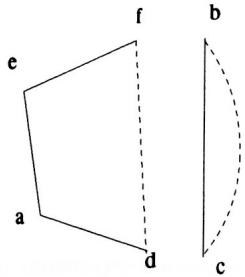
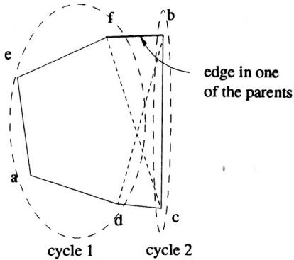
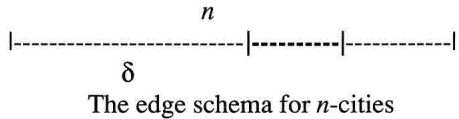
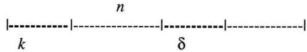
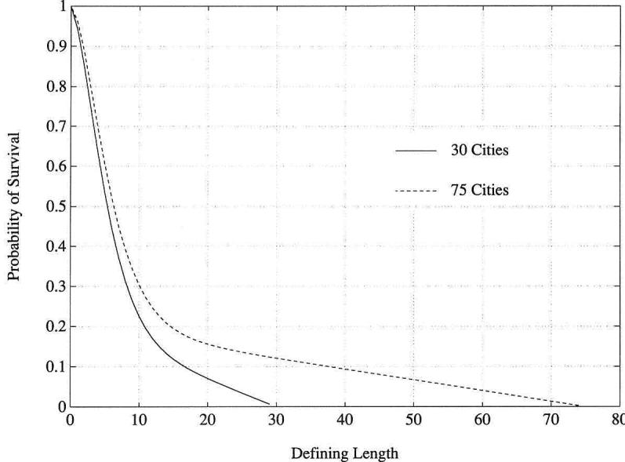

# Schema Analysis of the Traveling Salesman Problem Using Genetic Algorithms

Abdollah Homaifar\* Department of Electrical Engineering, North Carolina A&T State University, Greensboro, NC, 27411, USA

Shanguchuan Guan Department of Electrical Engineering, North Carolina A&T State University, Greensboro, NC, 27411, USA

Gunar E. Liepins Oak Ridge National Laboratory, P.O. Box 2008, Oak Ridge, TN, 37831, USA

Abstract. This paper provides a substantial proof that genetic algorithms (GAs) work for the traveling salesman problem (TSP). The method introduced is based on an adjacency matrix representation of the TSP that allows the GA to manipulate edges while using conventional crossover. This combination, interleaved with inversion (2-opt), allows the GA to rapidly discover the best known solutions to seven of the eight TSP test problems frequently studied in the literature. (The GA solution is within $2 \%$ of the best known solution for the eighth problem.) These results stand in contrast to earlier tentative conclusions that GAs are ill-suited to solving TSP problems, and suggest that the performance of probabilistic search algorithms (such as GAs) is highly dependent on representation and the choice of neighborhood operators.

# 1. Introduction

The traveling salesman problem (TSP) is a prototypical NP-complete problem [7]: easy to state, difficult to solve. A salesman, starting from his home city, is to visit each city in a given list and then return home. The challenge of the TSP is to find the visitation order that minimizes the total distance traveled. In other words, given a sequence of cities $c _ { 1 } , c _ { 2 } , \ldots , c _ { n }$ and intercity distances $d ( c _ { i } , c _ { j } )$ , the goal is to find a permutation $\pi$ of the cities that minimizes the sum of distances,

$$
\sum _ { i = 1 } ^ { n - 1 } d \bigl ( c _ { \pi ( i ) } , c _ { \pi ( i + 1 ) } \bigr ) + d \bigl ( c _ { \pi ( n ) } , c _ { \pi ( 1 ) } \bigr )
$$

Practical applications of the TSP include route finding, and wiring [23]. Other applications with non-symmetric distances $( d ( c _ { i } , c _ { j } ) \neq d ( c _ { j } , c _ { i } ) )$ include air route selection with wind factor [5]. In this paper, we will concentrate on the symmetric TSP, where the distances satisfy the condition $d ( c _ { i } , c _ { j } ) = d ( c _ { j } , c _ { i } )$ , for $1 \leq i$ , $j \le n$ .

The TSP problem has been approached by both exact and heuristic or probabilistic methods. Exact methods include cutting planes, branch and bound [33], and dynamic programming [1]. However, due to the fact that TSP is NP complete, without specialized problem reduction, exact methods are able to solve only small problems. On the other hand, heuristic and probabilistic methods are able to solve large problems. Examples of the latter methods include 2-opt [28, 17], Markov chain [29], TABU Search [8, 21], neural networks [15], simulated annealing [20, 22], and genetic algorithms [11, 12, 14, 16, 24, 26, 32, 36].

Among the largest problems known to have been solved to optimality is a 2392-city problem solved by Padberg and Rinaldi [33], using a combination of problem reduction, cutting planes, and branch and bound. Johnson [18] provided optimal solutions for several selected problems from the literature known to be NP complete, using an iterated Lin-Kernighan algorithm. Knox [21] reported that TABU search and a version of simulated annealing [22] exhibit similar performance. Those two approaches outperformed the genetic algorithm variants proposed by Whitley, et al. [36], and achieved the best known results for a variety of smaller problems. Among the most promising GA results were those of Muhlenbein [31], whose solution length of 27702 for a 532-city problem is near the known optimal of 27686. Another promising GA implementation was that of Lidd [24], who used an implicit penalty function formulation to generate good GA solutions (competitive with Knox's results) for a variety of smaller problems.

We show that if the representation and genetic recombination operators are properly chosen, genetic algorithms can be competitive with the best known techniques, contrary to Knox's findings [21]. This is achieved by introducing a binary matrix representation and a matrix crossover (MX). Our empirical results on a cross section of problems from the literature yield the best known solutions to these problems in seven out of eight cases.

# 2. Genetic algorithms

Genetic algorithms (GAs) are general purpose optimization algorithms developed by Holland [13], with roots in work by Bledsoe [2], Fogel, et al. [6], and others. Holland's intention was to develop powerful, broadly applicable techniques with which to attack problems resistant to other known methods. Loosely motivated by the example of population genetics, genetic search is population based, proceeding from generation to generation. The criteria of "survival of the fittest" provides evolutionary pressure for populations to develop increasingly fit individuals. Although there are many variants, including simple GA [10], GENITOR [35], mGA [10], CHC [5], and apGA [25], the basic mechanism of the GA consists of the following two steps.

1.Evaluation of individual fitness and formation of a gene pool.

2. Recombination and mutation.

Individuals resulting from these operations form the next generation, and the process is iterated until the system ceases to improve. Individuals (chromosomes) are typically fixed length binary strings. They are selected for the gene pool in proportion to some monotonic function of their relative fitness, as determined by the objective function. In the gene pool individuals are mutated and crossed. Mutation corresponds to a probabilistic flipping of the bits of an individual. The simplest implementation of crossover selects two "parents" from the pool and, after choosing the same random positions within each parent string, exchanges their tails. Crossover is typically performed with some probability (the crossover rate); parents not crossed are cloned. The resulting "offspring" form the subsequent population.

# 3. The motivation of our method

The search space for the TSP is the set of permutations of the cities. The most natural way to represent a tour is through path representation, where the cities are listed in the order in which they are visited. As an example of path representation, assume that there are six cities: $\{ 1 , 2 , 3 , 4 , 5 , 6 \}$ . The tour denoted by $\mathrm { ~ 1 ~ 2 ~ 3 ~ 4 ~ 5 ~ 6 ~ }$ would be interpreted to mean that the salesman visits city 1 first, city 2 second, city 3 third, . .., returning to city 1 from city 6.

Although this representation seems natural enough, there are at least two drawbacks to it. The first is that it is not unique. For example, (2 3 4 5 6 1) and (3 4 5 6 1 2) actually represent the same tour as (1 2 3 4 5 6); that is, the representation is unique only as far as the direction of traversal——clockwise or counterclockwise—and the originating city. This representational ambiguity generally confounds the GA. The second drawback is that a simple crossover operator could fail to produce legal tours. For example, the following strings with cross site 3 fail to produce legal tours.

before crossover (1 2 3 4 5 6) (245631) crossover site ^ after crossover $\begin{array} { l } { { ( 1 ~ 2 ~ 3 ~ 6 ~ 3 ~ 1 ) ~ \longleftarrow \mathrm { i l l e g a l } } } \\ { { ( 2 ~ 4 ~ 5 ~ 4 ~ 5 ~ 6 ) ~ \longleftarrow \mathrm { i l l e g a l } } } \end{array}$

Although Lidd [24] has apparently overcome the problem of infeasibility, and produced good results using two-point crossover in conjunction with an implicit penalty function [26], conventional GA wisdom has led researchers to experiment with feasibility preserving recombination operators. Among these operators are Goldberg and Lingle's partially mapped crossover (PMX) [11], Davis's order crossover OX) [3], and Oliver et al.s cycle crossover CX [2. Grefenstette, et al. [12], Liepins, et al. [27], and Whitley, et al. [36] also investigated recombination operators that focused on edges (adjacency relations) rather than fixed positions. These approaches removed the representational ambiguity, and in general produced results superior to those of the positional approaches.

After critically reviewing GA approaches for the TSP, we propose the basic building blocks to be edges as opposed to the absolute positions of the cities. A city in a given position without adjacent or surrounding information has little meaning for constructing a good tour; it is hard to claim that injecting city 3 in position 2 is better than injecting it in position 5. Presumably, the use of adjacency information in the OX can partially explain the experimental results (see [32]), in which it performs $1 1 \%$ and $1 5 \%$ better than the PMX and the CX, respectively.

# 4. Matrix crossover

We use a binary matrix to represent edges directly, and apply a conventional crossover to the matrix. These operations are closer to the original GA operators than the aforementioned adjacency recombination operators. Thus, we are able to manipulate edges while still using the two conventional crossover operators.

# 4.1 Representation

The binary matrix representation is formed as follows. The matrix is $_ { n }$ by $\textit { n }$ , where $n$ is the number of cities. For a given tour, a direction of traversal is chosen. If there is an edge from city $_ i$ to $j$ , the entry $( i , j )$ of the matrix is set to 1. The remaining entries of the matrix are set to 0. For example, the matrix representation for the tour (adcef b) is

<table><tr><td>1 0</td><td>a b 0 0</td><td>c 0</td><td>d</td><td>e</td><td>f</td></tr><tr><td>a b f</td><td></td><td>0</td><td>1 0</td><td>0 0</td><td>0 0</td></tr><tr><td>c d</td><td>0 0</td><td>0</td><td>0</td><td>1</td><td>0</td></tr><tr><td></td><td>0 0</td><td>1</td><td>0</td><td>0</td><td>0</td></tr><tr><td>e</td><td>0 0</td><td>0</td><td>0</td><td>0</td><td>1</td></tr></table>

This representation is unique as far as direction of traversal (the two traversal directions produce adjacency matrices that are transposes of one another). For example, (abcdef) and (bcdefa) have the same matrix representation. However, matrix representation requires much more storage space ( $n * n$ bits for an individual) than path representation ( $n$ characters for an individual). Therefore, to efficiently utilize space, we use matrix representation only when performing crossover and use path representation for storage.

# 4.2 Matrix crossover

Matrix Crossover (MX) is a natural extension of the conventional 1-point or 2-point crossover on strings and deals with column positions rather than bit positions. A crossover site is selected at random. MX exchanges all the entries of the two parents determined by the crossover site(s). The following example illustrates crossing between sites 2 and 5.

Parent 1:

Parent 2:

MX sites:

One of the two children resulting under two-point MX is as follows.

As shown in this example, MX may result in infeasibility in the form of duplications or cycles. These two problems are treated in the following two steps.

  
Figure 1: Two cycles in the resulting matrix.

Step 1. Remove the duplication by moving a 1 from each row with duplicate 1s into another row that has no 1 entries. This is done to preserve as many of the existing edges from the parents as possible.

For this example, the entries in positions $( \mathrm { b } , \mathrm { a } )$ and $( \mathrm { f , b } )$ are moved to $( \mathrm { d } , \mathrm { a } )$ and $( \mathrm { c } , \mathrm { b } )$ , respectively. This results in the following matrix.

<table><tr><td></td><td>a b</td><td>c</td><td>d</td><td>e</td><td>f</td></tr><tr><td>a b</td><td>0 0 0 0</td><td>0 1</td><td>0 0</td><td>1</td><td>0 0</td></tr><tr><td>c</td><td>0 1</td><td>0</td><td>0</td><td>0 0</td><td>0</td></tr><tr><td>d</td><td>1 0</td><td>0</td><td>0</td><td>0</td><td>0</td></tr><tr><td>e</td><td>0 0</td><td>0</td><td>0</td><td></td><td>1</td></tr><tr><td>f</td><td>0 1</td><td>0</td><td>1</td><td>0 0</td><td>0</td></tr></table>

Although there is only one 1 in each row or column in the matrix, a path may contain cycles, as in this example, which has the two cycles (d a e f) and (b c) (see Figure 1). Cycles can be broken by employing Step 2, as follows.

Step 2. Cut and connect cycles to produce a legal tour that preserves as many as possible of the existing edges from the parents.

For this example, we have two choices, either connecting f to b or to c. The edge $( \mathrm { f , b } )$ exists in one of the parents, whereas $\left( \mathrm { f , c } \right)$ does not. Thus, we select edge $( \mathrm { f , b } )$ , and the new tour becomes (d a ef b c), as illustrated in Figure 2.

# 5. Schema analysis for binary matrix representation

According to the fundamental schema theorem for GAs, the survival probability $( P _ { s } ( H ) )$ for a schema of defining length $\delta ( H )$ after crossover is

$$
P _ { s } ( H ) = 1 - p _ { c } \frac { \delta ( H ) } { n - 1 }
$$

where $n$ is the string length, and $p _ { c }$ is the probability of conventional crossover. It is clear that the survival probability of the schema increases as the defining length decreases. Short defining length and high fitness (along with selection scheme) are features of schemata that are likely to survive as building blocks to construct good solutions. The fundamental schema theorem is based on conventional string representation and crossover. We discuss such a relationship based on binary matrix representation and matrix crossover.

  
Figure 2: Selecting the right edge to connect cycles.

In order to define an edge schema, an "indifference" symbol $( ^ { * } )$ is added to represent any of the remaining permutations. The following binary matrix is an example of an edge schema of defining length $\delta = 4$ (the distance between the outermost fixed positions of a schema, including the two end positions) and order $O ( H ) = 3$ (the number of fixed bits).

$$
\begin{array} { r l } & { \mathrm { ~ a ~ b ~ \ c ~ \ d ~ \ e ~ { ~ f ~ } ~ } } \\ & { \mathrm { ~ a ~ \left[ ~ * ~ \ 1 ~ \ 1 ~ * ~ \ 0 ~ \ 0 ~ * ~ \right. ~ } } \\ & { \mathrm { ~ b ~ \left[ ~ * ~ \ 0 ~ * ~ \ 1 ~ 0 ~ \ 0 ~ * ~ \right. ~ } } \\ & { \mathrm { ~ c ~ \left. ~ 0 ~ * ~ \ 0 ~ \ 0 ~ * ~ \right. ~ } } \\ & { \mathrm { ~ d ~ \left. ~ \ast ~ \ 0 ~ * ~ \ 0 ~ \ 0 ~ * ~ \right. ~ } } \\ & { \mathrm { ~ e ~ } } \\ & { \mathrm { ~ f ~ } \left| \begin{array} { l l l l l l } { * } & { 0 } & { * } & { 0 } & { 0 } & { * } \\ { * } & { 0 } & { * } & { 0 } & { 1 } & { * } \\ & { ( * \mathrm { ~ a ~ * ~ b ~ f ~ * ~ } ) } & & & \end{array} \right. } \\ & { \mathrm { ~ \left. ~ \left( ~ * ~ a ~ * ~ b ~ f ~ * ~ \right) ~ \right. ~ } } \end{array}
$$

edge schema:

Generally, $( n - O ( H ) - 1 )$ is the number of directional tours that each edge schema of order $O ( H )$ represents. When $O ( H ) = 0$ , $( n - O ( H ) - 1 ) ! =$ $( n - 1 ) !$ , for example. This also explains the uniqueness of the matrix representation as compared to the path representation.

Schema Theorem. Assuming that crossover always occurs, that is, that $p _ { c } = 1$ , the survival probability of the edge schema is

$$
\begin{array} { c } { { P _ { s } ( H ) = 1 - \displaystyle \frac \delta n - \frac { n - \delta } { n } * \left\{ k _ { c } \left( 1 - \left( \frac 1 2 \right) ^ { ( \mathrm { a g n c } * \delta / \mathrm { n } ) } \right) \right. } } \\ { { \left. * \left( 1 - \left( \frac { n - \delta } { n } \right) ^ { \mathrm { a g n c } } \right) * \left( 1 - \displaystyle \frac 1 n \right) * \left( \frac { n - \delta } { n } \right) ^ { \mathrm { a g n d } } \right. } } \end{array}
$$

$$
\begin{array} { l } { + \{ k _ { d } ( 1 - ( \displaystyle \frac { 1 } { 2 } ) ^ { ( \mathrm { a g n d } * \delta / \mathrm { n } ) } ) * \displaystyle \frac { 1 } { n } + [ k _ { d } ( 1 - ( \displaystyle \frac { 1 } { 2 } ) ^ { ( \mathrm { a g n d } * \delta / \mathrm { n } ) } )  } \\ { \displaystyle * ( \displaystyle \frac { n - \delta } { n } ) ^ { \mathrm { a g n c } } + k _ { d c } ( 1 - ( \displaystyle \frac { 1 } { 2 } ) ^ { ( ( \mathrm { a g n d } + \mathrm { a g n c } ) * \delta / \mathrm { n } ) } ) } \\ { \displaystyle * ( 1 - ( \displaystyle \frac { n - \delta } { n } ) ^ { \mathrm { a g n c } } ) ] * ( 1 - \displaystyle \frac { 1 } { n } ) \} * ( 1 - ( \displaystyle \frac { n - \delta } { n } ) ^ { \mathrm { a g n d } } ) \Bigg \} } \end{array}
$$

where agnd and agnc are the average number of duplications and cycles, respectively, and $k _ { c } , \ k _ { d }$ , and $k _ { d c }$ are control variables defined in Equations (11),(14), and (15).

Proof. Suppose that 1-point MX is used; the survival probability of schema $\mathrm { H }$ is therefore

$$
P _ { s } ( H ) = 1 - P _ { d } ( H )
$$

where $P _ { d } ( H )$ is the probability of schema $H$ being disrupted. The schema can be disrupted when the crossover site is either within or outside of $\delta$ .

$$
P _ { d } ( H ) = P ( d \mid W ) P ( W ) + P ( d \mid O ) P ( O )
$$

where

$$
\begin{array} { r l } & { d = \mathrm { d i s r u p t i o n ~ o f ~ } H \mathrm { ~ o f ~ d e f n i n g ~ l e n g t h ~ } \delta } \\ & { W = \mathrm { c r o s s o v e r ~ s i t e ~ i s ~ w i t h i n ~ } \delta } \\ & { O = \mathrm { c r o s s o v e r ~ s i t e ~ i s ~ o u t s i d e ~ } \delta } \end{array}
$$

We give a pictorial representation of the edge schema of n cities with $\delta$ defining length. The probability of the crossover site being within $\delta$ is given by $P ( W ) = \delta / n$ , therefore, the probability of the crossover site being outside $\delta$ is $P ( O ) = 1 - \delta / n = ( n - \delta ) / n$ The probability of disruption given that the crossover site is within $\delta$ is $P ( d \mid W ) = 1$ .

Let the probability of disruption when the crossover site $k$ is outside $\delta$ be represented by $P ( d \mid O ) \equiv P ( d _ { o } )$ . Under this condition, disruption may occur whether or not duplications exist.

$$
P ( d _ { o } ) = P ( d _ { o } \mid \mathrm { d u p } ) P ( \mathrm { d u p } ) + P ( d _ { o } \mid \mathrm { n \_ d u p } ) P ( \mathrm { n \_ d u p } )
$$

where

$$
\begin{array} { c } { { \mathrm { d u p = d u p l i c a t i o n s \ e x i s t ~ a f t e r ~ c r o s s o v e r } } } \\ { { \mathrm { n \ " { d u p } = n o ~ d u p l i c a t i o n s \ e x i s t ~ a f t e r ~ c r o s s o v e r } } } \end{array}
$$

In order to facilitate the derivation of the probability of no duplication, consider the following figure.

$$
\begin{array} { r l } & { P ( \mathrm { n } _ { - } \mathrm { d } \mathrm { u } \mathrm { p } ) = \cfrac { ( n - \delta ) ! } { ( P ( n - \delta , n - \delta - k ) P ( n - \delta , k ) ) } } \\ & { \qquad = \cfrac { ( n - \delta - k ) ! k ! } { ( n - \delta ) ! } } \end{array}
$$

therefore,

$$
\begin{array} { r l } { P ( \mathrm { d u p } ) = 1 - P ( \mathrm { n . d u p } ) } & { } \\ { \displaystyle = \frac { 1 - ( n - \delta - k ) ! k ! } { ( n - \delta ) ! } } & { } \end{array}
$$

In Equation (4), because the crossover site $k$ varies from 1 to $n - \delta - 1$ , in the worst case $\left( k = n - \delta - 1 \right)$ with fixed $\delta$ , $P ( \mathrm { n . d u p } ) = 1 / ( n - \delta )$ Considering the fact that $\delta < n - 1$ , which is the situation in most cases, it is reasonable to assume that $P ( { \mathrm { n . d u p } } ) \approx 0$ , and therefore $P ( \mathrm { d u p } ) \approx 1$ Hence, Equation (becomes

$$
P ( d _ { o } ) \approx P ( d _ { o } \mid \mathrm { d u p } )
$$

Let, $P ( d _ { o } \mid \mathrm { d u p } ) \equiv P ( d _ { o \mathrm { - } \mathrm { d u p } } )$ . This term signifies the disruption probability when the crossover is outside of $\delta$ and duplications exist. It may be further expressed when the duplications occur inside or outside of $\delta$ as

$$
\begin{array} { r } { P ( d _ { o \_ { \mathrm { d u p } } } ) = P ( d _ { o \_ { \mathrm { d u p } } } \mid \mathrm { d u p \_ o u t s c h } ) P ( \mathrm { d u p \_ o u t s c h } ) } \\ { + P ( d _ { o \_ { \mathrm { d u p } } } \mid \mathrm { d u p \_ i n s c h } ) P ( \mathrm { d u p \_ i n s c h } ) } \end{array}
$$

where

$$
\begin{array} { r l } & { \mathrm { d u p \mathrm { \mathrm { . o u t s c h } } = a l l \mathrm { ~ d u p l i c a t i o n s ~ a r e ~ o u t s i d e ~ } } \delta } \\ & { \quad \mathrm { d u p \mathrm { . i n s c h } = a t \ l e a s t \ o n e \ d u p l i c a t i o n ~ o c c u r s ~ i n s i d e ~ } \delta } \end{array}
$$

The probability of exactly one duplication being outside of $\delta$ is $( n - \delta ) / n$ . Thus,

$$
\begin{array} { l } { { \displaystyle P ( \mathrm { d u p \mathrm { . o u t s c h } } ) = \left( \frac { n - \delta } { n } \right) ^ { \mathrm { a g n d } } } } \\ { { \displaystyle P ( \mathrm { d u p \mathrm { . i n s c h } } ) = 1 - \left( \frac { n - \delta } { n } \right) ^ { \mathrm { a g n d } } } } \end{array}
$$

The disruption probability when all of the duplications are outside of $\delta$ can be further expanded according to the existence or absence of cycles. Let $P ( d _ { o \mathrm { - } \mathrm { d u p } } \mid \mathrm { d u p \mathrm { - } o u t s c h } ) \equiv P ( d _ { o \mathrm { - } \mathrm { d u p \mathrm { - } o u t s c h } } )$ ; then,

$$
\begin{array} { r } { P ( d _ { o \mathrm { - } \mathrm { d u p \mathrm { - } o u t s c h } } ) = P ( d _ { o \mathrm { - } \mathrm { d u p \mathrm { - } o u t s c h } } \mid \mathrm { n o \mathrm { - } c y c } ) P ( \mathrm { n o \mathrm { - } c y c } ) } \\ { + P ( d _ { o \mathrm { - } \mathrm { d u p \mathrm { - } o u t s c h } } \mid \mathrm { c y c } ) P ( \mathrm { c y c } ) } \end{array}
$$

If the crossover site is outside of $\delta$ , then no duplications exist inside of $\delta$ , there is no cycle, and the probability of disruption is equal to zero. Therefore,

$$
P ( d _ { o \mathrm { - } \mathrm { d u p } \mathrm { - } \mathrm { o u t s c h } } ) = 0 * P ( \mathrm { n o . c y c } ) + P ( d _ { o \mathrm { - } \mathrm { d u p } \mathrm { - } \mathrm { o u t s c h } } \mid \mathrm { c y c } ) \left( 1 - { \frac { 1 } { n } } \right)
$$

where

$$
\begin{array} { c } { { \mathrm { n 0 \mathrm { - } c y c = n o \ c y c l e \ e x i s t s } } } \\ { { \mathrm { c y c = c y c l e \ o c c u r s } } } \end{array}
$$

$P ( d _ { o \mathrm { - } \mathrm { d u p \mathrm { - } o u t s c h } } \ )$ cyc) can be further expanded acording to the cycle's location inside or outside of $\delta$ The schema structure may be destroyed by removing the cycles. As stated earlier, the cycles are cut and connected while preserving as many of the existing edges from the parents as possible. Let

$$
\begin{array} { r } { P ( d _ { o \mathrm { - } \mathrm { d u p } \mathrm { - } \mathrm { o u t s c h } } | \mathrm { c y c } ) = P ( d _ { o \mathrm { - } \mathrm { d u p } \mathrm { - } \mathrm { o u t s c h } \mathrm { - } \mathrm { c y c } } | \mathrm { c y c } \mathrm { - } \mathrm { i n s c h } ) P ( \mathrm { c y c } \mathrm { i n s c h } ) } \\ { + P ( d _ { o \mathrm { - } \mathrm { d u p } \mathrm { - } \mathrm { o u t s c h } \mathrm { - } \mathrm { c y c } } | \mathrm { c y c } \mathrm { - } \mathrm { o u t s c h } ) P ( \mathrm { c y c } \mathrm { - } \mathrm { o u t s c h } ) } \end{array}
$$

where

The probability of no cycle occurring inside $\delta$ is

$$
P ( { \mathrm { c y c . o u t s c h } } ) = \left( { \frac { n - \delta } { n } } \right) ^ { \mathrm { a g n c } }
$$

thus,

$$
P ( { \mathrm { c y c . i n s c h } } ) = 1 - \left( { \frac { n - \delta } { n } } \right) ^ { \mathrm { a g n c } }
$$

The probability of survival of the schema after removing all the cycles is $( 1 / 2 ) ^ { ( \mathrm { a g n c } * \delta / \mathrm { n } ) }$ .Therefore,

$$
P ( d _ { o \mathrm { - } \mathrm { d u p } \mathrm { - } \mathrm { o u t s c h - c y c } } \mid \operatorname { c y c - i n s c h } ) = k _ { c } \left( 1 - \left( { \frac { 1 } { 2 } } \right) ^ { ( \mathrm { a g n c } \ast \delta / \mathrm { n } ) } \right)
$$

where $k _ { c } < 1$ is a control variable (the selection of which is influenced by the method chosen for preserving the edges from the existing parents). Thus,

$$
\begin{array} { r } { P ( d _ { o \mathrm { - } \mathrm { d i v } \mathrm { - } \mathrm { o u t s e h } } \mid \mathrm { c y c } ) = k _ { c } \left( 1 - \left( \frac { 1 } { 2 } \right) ^ { ( \mathrm { a g n c } * \delta / \mathrm { n } ) } \right) * \left( 1 - \left( \frac { n - \delta } { n } \right) ^ { \mathrm { a g n c } } \right) } \\ { + 0 * P ( \mathrm { c y c } \mathrm { - o u t s c h } ) } \\ { = k _ { c } \left( 1 - \left( \frac { 1 } { 2 } \right) ^ { ( \mathrm { a g n c } * \delta / \mathrm { n } ) } \right) } \\ { * \left( 1 - \left( \frac { n - \delta } { n } \right) ^ { \mathrm { a g n c } } \right) } \end{array}
$$

Substituting equation (11) into equation (10), it becomes

$$
\begin{array} { c l r } { { P ( d _ { o \mathrm { . d u p . o u t s c h } } ) = k _ { c } \left( 1 - \left( \displaystyle \frac { 1 } { 2 } \right) ^ { ( \mathrm { a g n c } * \delta / \mathrm { n } ) } \right) } } \\ { { } } & { { } } \\ { { * \left( 1 - \left( \displaystyle \frac { n - \delta } { n } \right) ^ { \mathrm { a g n c } } \right) * \left( 1 - \displaystyle \frac { 1 } { n } \right) } } \end{array}
$$

Let us consider the probability of disruption when the crossover site is within $\delta$ . Equation (7) can be further expanded according to the existence or absence of cycles.

$$
\begin{array} { r l } & { P ( d _ { o \mathrm { - } \mathrm { d u p } } \mid \mathrm { d u p } \mathrm { . i n s c h } ) = P ( d _ { o \mathrm { - } \mathrm { d u p } \mathrm { . i n s c h } } \mid \mathrm { n o . c y c } ) * P ( \mathrm { n o . c y c } ) } \\ & { \qquad + P ( d _ { o \mathrm { - } \mathrm { d u p } \mathrm { . i n s c h } } \mid \mathrm { c y c } ) * P ( \mathrm { c y c } ) } \end{array}
$$

where $P ( { \mathrm { n o . c y c } } ) \ = \ 1 / n$ , therefore $P ( \operatorname { c y c } ) = 1 - ( 1 / n )$ The disruption probability when the crossover site is outside $\delta$ , and duplication is inside $\delta$ with no cycles is

$$
P ( d _ { o \mathrm { - } \mathrm { d u p } \mathrm { - } \mathrm { i n s c h } } \mid \mathrm { n o \mathrm { - } c y c } ) = k _ { d } \left( 1 - \left( { \frac { 1 } { 2 } } \right) ^ { ( \mathrm { a g n d } * \delta / \mathrm { n } ) } \right)
$$

where $k _ { d } < 1$ is a control variable, the selection of which is influenced by the chosen method of removing duplications. The third term of equation (13) is further expanded when the cycles are either inside or outside of $\delta$ as

$$
\begin{array} { r l } { P ( d _ { o , \mathrm { d i n p } , \mathrm { i n s h o h } } \mid \mathrm { c y c } ) = P ( d _ { o , \mathrm { d i n p } , \mathrm { i n s h o h } , \mathrm { o y e } } \mid \mathrm { c y c o u t s h } ) P ( \mathrm { c y c o u t s e h } ) } \\ { + P ( d _ { o , \mathrm { d i n p } , \mathrm { i n s h o h } , \mathrm { e y c } } \mid \mathrm { c y c } . \mathrm { i n s h o h } ) P ( \mathrm { c y c } , \mathrm { i n s c h } ) } \\ { = k _ { d } \left( 1 - \left( \frac { 1 } { 2 } \right) ^ { \left( \mathrm { a g n d } + \beta / n \right) } \right) * \left( \frac { n } { n } \right) ^ { \mathrm { a g n c } } } \\ { + k _ { d c } \left( 1 - \left( \frac { 1 } { 2 } \right) ^ { \left( \mathrm { a g n d } + \delta / n \right) } \left( \frac { 1 } { 2 } \right) ^ { \left( \mathrm { a g n c } + \delta / n \right) } \right) } \\ { * \left( 1 - \left( \frac { n - \delta } { n } \right) ^ { \mathrm { a g n c } } \right) } \end{array}
$$

where $k _ { d c } < 1$ is a control variable, the selection of which is influenced by the methods for removing both duplications and cycles. Substituting (14) and (15) into (13), it becomes

$$
\begin{array} { l } { { \displaystyle P ( d _ { o \mathrm { - } \mathrm { d i n p } } \mid \mathrm { d u p } \mathrm { . ~ i n s c h } ) = k _ { d } \left( 1 - \left( \frac { 1 } { 2 } \right) ^ { ( \mathrm { a g n d ~ } + \delta / \mathrm { n } ) } \right) * \frac { 1 } { n } } } \\ { ~ + \left[ k _ { d } \left( 1 - \left( \frac { 1 } { 2 } \right) ^ { ( \mathrm { a g n d } + \delta / \mathrm { n } ) } \right) * \left( \frac { n - \delta } { n } \right) ^ { \mathrm { a g n c } } \right. } \\ { { \displaystyle ~ + \left. k _ { d c } \left( 1 - \left( \frac { 1 } { 2 } \right) ^ { ( \mathrm { a g n d } + \mathrm { a g n c } ) * \delta / \mathrm { n } } \right) \right.}  } \\ { { \displaystyle ~ \left. * \left( 1 - \left( \frac { n - \delta } { n } \right) ^ { \mathrm { a g n c } } \right) \right] * \left( 1 - \frac { 1 } { n } \right) } } \end{array}
$$

Substituting (8), (9), (12), and (16) into (7), it becomes

$$
\begin{array} { r l } { P ( \mathcal { L } _ { \theta } | \operatorname { d } \mathfrak { H } y ) = h _ { \star } ( 1 - ( \frac { 1 } { \frac { \sqrt { 3 } } { 2 } } ) ^ { \alpha \times \alpha + \alpha + \beta \alpha } ) \star ( 1 - ( \frac { \alpha - \beta } { \alpha } ) ^ { \alpha \times \beta } ) } & { } \\ & { \star ( 1 - \frac { \sqrt { 3 } } { \alpha } ) \star ( \frac { \gamma - \beta } { \gamma } ) ^ { \alpha \times \beta } } \\ & { \star ( \mathbf { k } ( 1 - ( \frac { 1 } { 2 } ) ^ { \alpha \times \alpha + \beta \alpha + \beta \alpha } ) \star \frac { 1 } { \alpha }  } \\ & { \star  ( \mathbf { k } ( 1 - ( \frac { 1 } { 2 } ) ^ { \alpha \times \alpha + \alpha + \beta \alpha } ) \star ( \frac { \alpha - \beta } { \alpha } ) ^ { \alpha \times \alpha }   } \\ & { \star   \mathrm { i } k _ { \alpha } ( 1 - ( \frac { 1 } { 2 } ) ^ { \alpha \times \alpha + \alpha + \alpha + \beta \alpha } ) \star ( \frac { \alpha - \beta } { \alpha } ) ^ { \alpha \times \alpha }  } \\ & { \star   \mathrm { i } k _ { \alpha } ( 1 - ( \frac { 1 } { 2 } ) ^ { \alpha \times \alpha } ) ) \star ( 1 - \frac { 1 } { \alpha } ) \} } \\ & { \star ( 1 - ( \frac { \alpha - \beta } { \alpha } ) ^ { \alpha \times \alpha } ) ) \star ( 1 - \frac { 1 } { \alpha } ) \} } \\ & { \star ( 1 - ( \frac { \alpha - \beta } { \alpha } ) ^ { \alpha \times \alpha } ) } \end{array}
$$

Finally, substituting equations (17) and (2) into equation (1), we obtain $P _ { s } ( H )$

The survival probabilities for the 30- and 75-city TSP for various values of $\delta$ are shown in Figure 3. The control variables and the average number of duplications and cycles are set to $k _ { d } = k _ { c } = k _ { c d } = 0 . 8$ , and agnd $=$ $\mathrm { a g n c } = ( n / 3 )$ , respectively. The figure shows that as $\delta$ decreases, the schema survival probability increases. Along with the tournament selection, high fitness schema and short defining length schema have a tendency to survive in the population. This complies with the fundamental theorem for GAs. Thus, by the selection of appropriate values for the control variables, matrix crossover can have similar effects to conventional crossover—except that the survival probability decays faster than the conventional GA schema theorem.

  
Figure 3: Survival probabilities versus defining length.

Just as the fundamental schema theorem is suitable for 2-point crossover, this analysis is suitable for 2-point MX, since 2-point MX without control of the segment length easily can be transformed to 1-point MX. In 2-point MX, agnc and agnd can be reduced by controlling segment size. With smaller agnd and agnc, the terms $( 1 - ( ( n - \delta ) / n ) ^ { \mathrm { a g n d } } )$ and $( 1 - ( ( n - \delta ) / n ) ^ { \mathrm { a g n c } } )$ will decrease more rapidly as $\delta$ decreases, thus improving the schema survival probability. This is the theoretical explanation for the result shown in Table 1.

# 6. MX with inversion

We further specialize our GA variant by incorporating the inversion operator (2-opt), which has a venerable history of generating good TSP solutions by itself. This type of hybridization is exactly what is advocated by Muhlenbein, et al. [30] for the solution of real-world problems.

Logically, there are three ways to incorporate specialized "hill climbers" such as 2-opt into the GA: use the hill climber as a preprocessor to find a highly fit initial population, use the hill climber as a postprocessor to improve upon the GA solutions, or repeatedly interleave the GA and the hill climber. We interleave 2-opt with the other GA operators, repeatedly applying 2-opt as a deterministic hill climber to each chromosome in the population until no further improvement occurs.

Note that in path representation, 2-opt is nothing more than inversion. For any selected string, randomly choose two cut sites, and invert the order of the sub-string specified by the cities located between the sites. For example, for cut sites between the first and the second and the fourth and fifth symbols of the string

inversion yields

In our implementation we use 2-opt as a deterministic hill climber: we keep the result of the swap only if it results in an improvement. Furthermore, we iteratively apply 2-opt with increasing segment length. For the preceding example, we would keep the result of the swap only if $d ( { \mathrm { a } } , { \mathrm { d } } ) + d ( { \mathrm { b } } , { \mathrm { e } } ) <$ $d ( \mathrm { a } , \mathrm { b } ) + d ( \mathrm { d } , \mathrm { e } )$ ; otherwise, we would keep the old tour. The iterative aspect of our implementation systematically tries all exchanges of length 2, then length 3, and so on, until the exchange of length $n - 1$ is tried.

# 7. Experimental results for GA with MX and inversion

In this section, we present the best results known to us for a variety of TSP problems, using a variety of solution techniques. We stress that the tour length generated by a probabilistic technique is a random variable whose estimated mean and variance should also be reported. In addition, the solution quality should be judged by its computational complexity. For probabilistic algorithms, computational complexity has two dimensions: computation required to find the optima (assuming that an optimum can be found), and computation required to adequately support the hypothesis that no better solution can be found. A further complication in reporting comparative computational complexity of different methods is the difficulty in finding a fair measure. The number of function evaluations is one measure, although this fails to account for differences in complexity in different algorithms' elementary search operators (neighborhood search operators). For these reasons, the solutions reported in Table 1 are simply the best known solutions generated by each technique. (For details of computational complexity and variance, see [34].) For matrix crossover with inversion applied to the problems we studied, the difference among final solutions due to different randomization is less than $1 \%$ .

For the common benchmark TSPs (30-, 50-, 75-, 100-, and 318-city), Table 2 provides additional statistics about the performance of the 2-point MX with inversion.

One may claim that GAs have added little to 2-opt in the solution of these problems. In this respect, the experimental results in Table 3 show that our implementation of 2-opt alone cannot solve these problems, as it

Table 1: Comparison of TSP results.   

<table><tr><td rowspan=1 colspan=1></td><td rowspan=1 colspan=1>25</td><td rowspan=1 colspan=1>30</td><td rowspan=1 colspan=1>42</td><td rowspan=1 colspan=1>50</td><td rowspan=1 colspan=1>75</td><td rowspan=1 colspan=1>100</td><td rowspan=1 colspan=1>105</td><td rowspan=1 colspan=1>318</td></tr><tr><td rowspan=1 colspan=1>EDGE RECM.</td><td rowspan=1 colspan=1></td><td rowspan=1 colspan=1>421</td><td rowspan=1 colspan=1></td><td rowspan=1 colspan=1>428</td><td rowspan=1 colspan=1>545</td><td rowspan=1 colspan=1></td><td rowspan=1 colspan=1></td><td rowspan=1 colspan=1></td></tr><tr><td rowspan=1 colspan=1>PMX</td><td rowspan=1 colspan=1></td><td rowspan=1 colspan=1>498</td><td rowspan=1 colspan=1></td><td rowspan=1 colspan=1></td><td rowspan=1 colspan=1></td><td rowspan=1 colspan=1></td><td rowspan=1 colspan=1></td><td rowspan=1 colspan=1></td></tr><tr><td rowspan=1 colspan=1>OX</td><td rowspan=1 colspan=1></td><td rowspan=1 colspan=1>425</td><td rowspan=1 colspan=1></td><td rowspan=1 colspan=1></td><td rowspan=1 colspan=1></td><td rowspan=1 colspan=1></td><td rowspan=1 colspan=1></td><td rowspan=1 colspan=1></td></tr><tr><td rowspan=1 colspan=1>CX</td><td rowspan=1 colspan=1></td><td rowspan=1 colspan=1>517</td><td rowspan=1 colspan=1></td><td rowspan=1 colspan=1></td><td rowspan=1 colspan=1></td><td rowspan=1 colspan=1></td><td rowspan=1 colspan=1></td><td rowspan=1 colspan=1></td></tr><tr><td rowspan=1 colspan=1>TABU</td><td rowspan=1 colspan=1>1,711</td><td rowspan=1 colspan=1>420</td><td rowspan=1 colspan=1>699</td><td rowspan=1 colspan=1></td><td rowspan=1 colspan=1>535</td><td rowspan=1 colspan=1>627</td><td rowspan=1 colspan=1></td><td rowspan=1 colspan=1></td></tr><tr><td rowspan=1 colspan=1>PENALTY FUN</td><td rowspan=1 colspan=1></td><td rowspan=1 colspan=1>420</td><td rowspan=1 colspan=1></td><td rowspan=1 colspan=1></td><td rowspan=1 colspan=1></td><td rowspan=1 colspan=1></td><td rowspan=1 colspan=1></td><td rowspan=1 colspan=1></td></tr><tr><td rowspan=1 colspan=1>BINARY MX&amp; INVERSION</td><td rowspan=1 colspan=1>1,711</td><td rowspan=1 colspan=1>420</td><td rowspan=1 colspan=1>699</td><td rowspan=1 colspan=1>426</td><td rowspan=1 colspan=1>535</td><td rowspan=1 colspan=1>629</td><td rowspan=1 colspan=1>14,382.9</td><td rowspan=1 colspan=1>42,154</td></tr><tr><td rowspan=1 colspan=1>BEST KNOWNSOLUTION</td><td rowspan=1 colspan=1>1,711</td><td rowspan=1 colspan=1>420</td><td rowspan=1 colspan=1>699</td><td rowspan=1 colspan=1>425</td><td rowspan=1 colspan=1>535</td><td rowspan=1 colspan=1>627</td><td rowspan=1 colspan=1>14,383</td><td rowspan=1 colspan=1>41,345</td></tr></table>

<table><tr><td rowspan=1 colspan=1>N</td><td rowspan=1 colspan=1>Pop</td><td rowspan=1 colspan=1>Seg</td><td rowspan=1 colspan=1>Pm</td><td rowspan=1 colspan=1>Gen</td><td rowspan=1 colspan=1>Pop.Best</td></tr><tr><td rowspan=1 colspan=1>30</td><td rowspan=1 colspan=1>60</td><td rowspan=1 colspan=1>10</td><td rowspan=1 colspan=1>1%</td><td rowspan=1 colspan=1>10</td><td rowspan=1 colspan=1>420</td></tr><tr><td rowspan=1 colspan=1>50</td><td rowspan=1 colspan=1>100</td><td rowspan=1 colspan=1>15</td><td rowspan=1 colspan=1>1%</td><td rowspan=1 colspan=1>17</td><td rowspan=1 colspan=1>426</td></tr><tr><td rowspan=1 colspan=1>75</td><td rowspan=1 colspan=1>300</td><td rowspan=1 colspan=1>25</td><td rowspan=1 colspan=1>1%</td><td rowspan=1 colspan=1>21</td><td rowspan=1 colspan=1>535</td></tr><tr><td rowspan=1 colspan=1>100</td><td rowspan=1 colspan=1>400</td><td rowspan=1 colspan=1>40</td><td rowspan=1 colspan=1>1%</td><td rowspan=1 colspan=1>27</td><td rowspan=1 colspan=1>629</td></tr><tr><td rowspan=1 colspan=1>318</td><td rowspan=1 colspan=1>6000</td><td rowspan=1 colspan=1>100</td><td rowspan=1 colspan=1>1%</td><td rowspan=1 colspan=1>18</td><td rowspan=1 colspan=1>42154</td></tr></table>

$\mathrm { P o p = }$ population size   
$\mathrm { P m } =$ probability of mutation   
Gen $=$ the generation in which the best solution was achieved ${ \mathrm { S e g } } =$ the largest allowed segment length in 2-pt Binary MX

Pop. Best $=$ average best results with 2-pt Binary MX and inversion

Table 2: Experimental results of GA with 2-point MX and inversion.

<table><tr><td rowspan=1 colspan=1>N</td><td rowspan=1 colspan=1>Pop</td><td rowspan=1 colspan=1>B. S.</td><td rowspan=1 colspan=1>IterN</td></tr><tr><td rowspan=1 colspan=1>50</td><td rowspan=1 colspan=1>100</td><td rowspan=1 colspan=1>429</td><td rowspan=1 colspan=1>8</td></tr><tr><td rowspan=1 colspan=1>75</td><td rowspan=1 colspan=1>300</td><td rowspan=1 colspan=1>555</td><td rowspan=1 colspan=1>8</td></tr><tr><td rowspan=1 colspan=1>100</td><td rowspan=1 colspan=1>400</td><td rowspan=1 colspan=1>664</td><td rowspan=1 colspan=1>9</td></tr></table>

$\mathrm { N } =$ number of cities

B. $\mathrm { { S } } , =$ best result achieved using only 2-opt

IterN $=$ number of times that each individual has gone through a set of 2-opt

Table 3: Experimental results with 2-opt only.

quickly becomes stuck, especially as the size of the TSP increases. We can say that 2-opt by itself lacks the power which MX provides through producing offspring from two parents.

# 8. Complexity analysis of the proposed techniques for the TSP

The characteristic of the traveling salesman problem which makes it so difficult to solve is its combinatorially explosive nature. The number of feasible tours increases exponentially as the number of cities in a TSP increases.

One approach which would certainly find the optimal solution of any TSP is the application of exhaustive enumeration and evaluation. The procedure consists of generating all possible tours and evaluating their corresponding tour length. The tour with the smallest length is selected as the best, which is guaranteed to be the optimal. If we could identify and evaluate one tour per nanosecond (or one billion tours per second), it would require almost ten million years (number of possible tours $= 3 . 2 \times 1 0 ^ { 2 3 }$ )to evaluate all of the tours in a 25-city TSP.

The following relationship is obtained for 30, 50, 75, 100, and 318 cities from the experimental results in Table 1. Let the population size be some proportion of the number of cities.

$$
\mathrm { p o p u l a t i o n ~ s i z e } = \mathrm { p } * n \qquad \mathrm { ~ p ~ a ~ c o n s t a n t ~ f r o m ~ 2 ~ t o ~ } 2 0
$$

Then the number of inversions performed for each individual is

$$
\sum _ { k = 2 } ^ { n } ( n - k + 1 ) \simeq \frac { 1 } { 2 } n ^ { 2 }
$$

This result is based on the method of inversion described in Section 6. Then, the equivalent number of function evaluations for inversion at each generation is:

$$
\mathrm { p } * n * { \frac { 1 } { 2 } } n ^ { 2 } * { \frac { 4 } { n } } = 2 * \mathrm { p } * n ^ { 2 }
$$

Assuming that the algorithm converges to optimal solution within acceptable tolerance in finite generations, then the total number of function evaluations for the algorithm, including the number of duplications or loops and cycles, may be written as

$$
T ( n ) = \left( 2 * \mathrm { p } * n ^ { 2 } + \mathrm { p } n + { \frac { \mathrm { p } n } { 3 } } + { \frac { \mathrm { p } n } { 3 } } \right) * \mathrm { g e n } = \mathrm { A } n ^ { 2 }
$$

where gen (a constant) is the number of generations to convergence. The product of two constants, A, is also a constant. Note that the constants p and gen for the cases of 30, 50, 75, 100, and 318 cities are $( 2 , 1 0 )$ , $( 2 , 1 7 )$ , $( 4 , 2 1 )$ , $( 4 , 2 7 )$ , and (19, 18), respectively (see Table 2).

Remark. The number of duplications and loops in Step 1 of the MX is controlled by the segment size for the matrix crossover (i.e., the crossover sites).

The maximum number of duplications and loops is $n / 3$ if the segment size is set to $n / 3$ .Therefore, as $_ n$ increases, the time for processing duplications and loops for Step 1 increases linearly. Similarly, the maximum number of cycles in Step 2 of the MX is $n / 3$ .

# 9. Conclusion

We have presented a GA variant for solving the TSP that uses the conventional GA operators and the recombination of edges. This variant uses a binary matrix representation and a matrix crossover (MX) to search for and combine useful building blocks. The optimal solutions for several TSPs (and other results) obtained using this technique are generally competitive with the best known techniques. These results suggest that the specific implementation of the GA (including the choice of representation) plays an important role in the GA's ability to satisfactorily solve the TSP. Schema analysis has shown the usefulness of the binary matrix representation with matrix crossover. Earlier conclusions suggesting that GAs were ill-suited to the TSPs seem to have been premature.

For the method presented, the maximum deviation of the optimal solutions from the best known solutions is less than $2 \%$ This is explained by the schema analysis: as $_ n$ increases, the survival probability curve $( P _ { s } )$ becomes more convex to the defining length-axis, hence the performance deteriorates (see Figure 3). In fact, the schema analysis shows the quality of the solution as a function of the number of cities. However, the performance of the method presented will deteriorate for larger problems (for instance, the 318-cities problem).

In Table 1, the performance of this variant method is compared with other GA methods, and shown to have the best performance. It has also been shown that the performances of TABU and the method presented are comparable for the problems reported by Knox [21], who compared TABU with simulated annealing and genetic algorithms. Nonetheless, the purpose of this paper is to show that a different approach to the TSP will enrich the methodology for this set of problems, and not to prove that the method presented is the best.

# Acknowledgments

The work of A. Homaifar and S. Guan was supported in part by grants from AT&T 448074, and the NSF-446009 at N.C. A&T State University, respectively. The authors wish to thank both AT&T and NSF for their support. This paper is dedicated to our friend and coauthor Gunar E. Liepins, whose untimely death in March 1992 could not blot out the significant impact he made on us and on this paper.

References   
[1] B. E. Bellman, "Dynamic Programming Treatment of the Traveling Salesman Problem," Journal of the Association for Computing Machinery, 9 (1963).   
[2] W. W. Bledsoe, "The Use of Biological Concepts in the Analytical Study of Systems," paper presented at the ORSA-Times National Meeting, San Francisco, 1961.   
[3] L. Davis, "Applying Adaptive Algorithms to Epistatic Domains," Proceedings of the 9th International Joint Conference on Artificial Intelligence, (1985) 162164.   
[4] L. Davis and D. Smith, Adaptive Design for Layout Synthesis, Texas Instruments internal report, 1985.   
[5] L. J. Eshelman, "The CHC Adaptive Search Algorithm: How to Have Safe Search When Engaging in Nontraditional Genetic Recombination," pages 265283 in Foundation of Genetic Algorithms, edited by G. Rawlins (San Mateo, CA, Morgan Kaufman, 1991).   
[6] L. J. Fogel, A. J. Owens, and M. J. Walsh, Artificial Intelligence through Simulated Evolution (New York, John Wiley, 1966).   
[7] M. R. Garey and D. S. Johnson, Computers and Interactability (New York, W. H. Freeman, 1966).   
[8] F. Glover, "Artificial Intelligence, Heuristic Frameworks and Tabu Search," Managerial and Decision Economics, 11 (1990).   
[9] D. E. Goldberg, Genetic Algorithms in Search, Optimization, and Machine Learning (Reading, MA, Addison-Wesley, 1989).   
[10] D. E. Goldberg, K. Deb, and B. Korb, "Messy Genetic Algorithms Revisited: Studies in Mixed Size and Scale," Complex Systems, 4 (1990) 415444.   
[11] D. E. Goldberg and R. Lingle, "Alleles, Loci and the Traveling Salesman Problem," Genetic Algorithms and Their Applications: Proceedings of the Second International Conference on Genetic Algorithms, edited by J. Grefenstette (Hillsdale, NJ, Erlbaum Associates, 1985).   
[12] J. J. Grefenstette, et al., "Genetic Algorithms for the Traveling Salesman Problem," pages 154-159 in Proceedings of an International Conference on Genetic Algorithms and Their Applications, edited by J. Grefenstette (Texas Instruments and U.S. Navy Center for Applied Research and Artificial Intelligence, 1985).   
[13] J. H. Holland, Adaptation in Natural and Artificial Systems (Ann Arbor, University of Michigan Press, 1975).   
[14] A. Homaifar, S. Guan, and G. E. Liepins, "A New Approach on the Traveling Salesman Problem by Genetic Algorithms," pages 460-466 in Proceedings of

the Fifth International Conference on Genetic Algorithms, edited by S. Forrest (San Mateo, CA, Morgan Kaufmann, 1993).

[15] J. J. Hopfield and D. W. Tank, "Neural' Computation of Decisions in Optimization Problems," Biological Cybernetics, 52 (1985).

[16] P. Jog, J. Y. Suh, and D. VanGucht, "The Effects of Population Size, Heuristic Crossover and Local Improvement on a Genetic Algorithm for the Traveling Salesman Problem," pages 110-115 in Proceedings of The Third International Conference on Genetic Algorithms, edited by J. D. Schaffer (San Mateo, CA, Morgan Kaufmann, 1989).

[7] D.S. Johnson, "More Approaches to the Travelling Salesman Guide," Nature, 330 (1987) 525.

[18] D. S. Johnson, "Local Optimization and the Traveling Salesman Problem," pages 446461 in Proceedings of the 17th Colloquium on Automata, Languages and Programming (New York, Springer-Verlag, 1990).

[19] S. Kirkpatrick, C. D. Gelatt, Jr., and M. P. Vecchi, "Optimization by Simulated Annealing," Science, 220 (1983) 671680.

[0 S. Kirkpatrick and G. Toulouse, "Configuration Space Analysis of Travelling Salesman Problems," Journal de Physique, 46 (1985) 12771292.

[21] J. Knox, "The Application of TABU Search to the Symmetric Traveling Salesman Problem," Ph.D dissertation, University of Colorado, 1989.

[22] J. Lam, "An Efficient Simulated Annealing Schedule," Ph.D. dissertation, Department of Computer Science, Yale University, 1988.

[23] E. L. Lawler, et al. (eds.), The Traveling Salesman Problem (New York, John Wiley, 1985).

[24] M. L. Lidd, "Traveling Salesman Problem Domain Application of a Fundamentally New Approach to Utilizing Genetic Algorithms," research sponsored in part by Air Force Office of Scientific Research and Office of Naval Research, Contract F4920-90-G-0033, 1991.

[25] G. E. Liepins and Baluja, "apGA: An Adaptive Parallel Genetic Algorithm," Computer Science and Operations Research: New Developments in their Interfaces.

[26] G. E. Liepins, et al., "Genetic Algorithm Applications to Set Covering and Traveling Salesman Problems," pages 2957 in Operations Research and Artificial Intelligence: The Integration of Problem Solving Strategies, edited by Brown and White (Norwell, MA, Kluwer, 1990).

[27] G. E. Liepins, et al., "Greedy Genetics," pages 231235 in Genetic Algorithms and Their Applications: Proceedings of the Second International Conference on Genetic Algorithms, edited by J. Grefenstette (Hillsdale, NJ, Erlbaum Associates, 1987).

[28] S. Lin and B. W. Kernighan, "An Effective Heuristic Algorithm for the Traveling Salesman Problem," Operations Research, (1973) 498516.   
[29] O. Martin, S. W. Otto, and E. W. Felten, "Large-step Markov Chains for the Traveling Salesman Problem," Complex Systems, 2 (1991) 299326.   
[30] H. Muhlenbein, M. George-Schleuter, and O. Kramer, "Evolution Algorithms in Combinatorial Optimization," Parallel Computing, 7 (1988) 65.   
[31] H. Muhlenbein, "Parallel Genetic Algorithms, Population Genetics and Combinatorial Optimization," pages 416-421 in Proceedings of The Third International Conference on Genetic Algorithms, edited by J. D. Schaffer (San Mateo, CA, Morgan Kaufmann, 1989).   
[32] I. M. Oliver, D. J. Smith, and J. R. C. Holland, "A Study of Permutation Crossover Operators on the Traveling Salesman Problem," pages 224-230 in Genetic Algorithms and Their Applications: Proceedings of the Second International Conference on Genetic Algorithms, edited by J. Greffenstette (Hillsdale, NJ, Erlbaum Associates, 1987).   
[33] M. Padberg and G. Rinaldi, "Optimization of a 532-city Symmetric Traveling Salesman Problem by Branch and Cut," Operations Research Letters, 6 (1987) 17.   
[34] M. W. Padberg and S. Hong Lin, "On the Symmetric Traveling Salesman Problem: A Computational Study," Mathematical Programming Studies, 12 (1980) 78.   
[35] D. Whitley and T. Starkweather, "GENITOR II: A Distributed Genetic Algorithm," Journal of Experimental and Theoretical Artificial Intelligence, 2 189214.   
[36] D. Whitley, T. Starkweather, and D. Fuquay, "Scheduling Problems and Traveling Salesman: The Genetic Edge Recombination Operator," pages 133-140 in Proceedings of The Third International Conference on Genetic Algorithms, edited by J. D. Schaffer (San Mateo, CA, Morgan Kaufmann, 1989).