# A Complete Archive Genetic Algorithm for the Multidimensional Knapsack Problem

Ausgef¨uhrt am Institut f¨ur Computergraphik und Algorithmen der Technischen Universit¨at Wien

unter der Anleitung von Univ.-Prof. Dipl.-Ing. Dr.techn. G¨unther Raidl

durch

# Abstract

This thesis presents a complete solution archive enhancing a genetic algorithm for the Multidimensional Knapsack Problem (MKP). The genetic algorithm on which this work is based on uses a special repair operator to prevent the generation of infeasible solutions and to transform each feasible solution into a locally optimal solution.

In longer runs it is likely that this algorithm produces candidate solutions that have already been generated and evaluated before. This effect can significantly reduce the algorithm’s overall performance. To prevent the reconsideration of already evaluated solutions, a solution archive based on a Trie is studied.

Each newly generated candidate solution is inserted into this archive. If during insertion into the archive a solution is recognized to be a duplicate of an already visited solution, a special procedure transforms this duplicate solution into a new solution that is not contained in the archive and is locally optimal. Furthermore upper bounds are calculated during the insertion at each node of the Trie. If the upper bound calculated at some level of the Trie is smaller than the best solution found so far, the corresponding sub Trie is cut off. Each solution that is generated and would be located in this sub Trie is considered to be a duplicate and an alternative solution is generated.

This thesis presents the algorithms and data structures that are needed to implement the solution archive together with the procedures that operate on this archive. This enhanced genetic algorithm is compared with the original algorithm, showing that for many test instances better solutions can be found.

# Zusammenfassung

In dieser Arbeit wird ein vollst¨andiges L¨osungsarchiv vorgestellt, das einen genetischen Algorithmus zur L¨osung des multidimensionalen Rucksack Problems (MKP) erweitert. Der genetische Algorithmus, auf dem diese Arbeit aufbaut, verwendet einen repair operator, um ung¨ultige L¨osungen auszuschließen und jede g¨ultige L¨osung zu einer lokal optimalen L¨osung zu transformieren.

Es ist wahrscheinlich, dass der genetische Algorithmus L¨osungen produziert, die w¨ahrend der Laufzeit schon einmal generiert und ausgwertet wurden. Um die Ber¨ucksichtigung von schon ausgewerteten L¨osungen zu verhindern, wird ein L¨osungsarchiv auf der Basis eines Tries analysiert.

Jede erzeugte Kandidatenl¨osung wird in das Archiv eingef¨ugt. Wird eine schon enthaltene L¨osung in das Archiv eingef¨ugt, so wird mit einer speziellen Prozedur aus dieser doppelten L¨osung eine neue, noch unbesuchte L¨osung generiert, die ebenfalls lokal optimal ist. Des weiteren werden w¨ahrend des Einf¨ugens von L¨osungen obere Schranken an jedem Knoten des Tries berechnet. Wird f¨ur einen Teilbaum des Tries eine obere Schranke ermittelt, die kleiner als die bisher beste gefundene L¨osung ist, so wird der entsprechende Teilbaum abgeschnitten. Sind in einem Teilbaum alle lokal optimalen L¨osungen schon einmal besucht worden, so wird dieser Teilbaum ebenfalls abgeschnitten. Jede L¨osung, die sp¨ater generiert wird und in diesem abgeschnittenen Teilbaum liegen w¨urde, wird als schon besuchte L¨osung identifiziert, und in eine noch unbesuchte Alternativl¨osung transformiert.

In dieser Arbeit werden die zur Implementierung notwendigen Algorithmen und Datenstrukturen dieses L¨osungsarchivs vorgestellt. Dieser erweiterte genetische Algorithmus wird mit dem urspr¨unglichen Algorithmus verglichen, und es zeigt sich, dass durch dieses L¨osungsarchiv bei vielen Instanzen bessere L¨osungen gefunden werden.

# Contents

# 1 Introduction 7

# 2 Solution Approaches for the MKP 9

2.1 Exact Algorithms for the MKP 9   
2.1.1 Commercial Software . 10   
2.2 Heuristic Algorithms for the MKP 11   
2.2.1 Greedy Heuristics 11   
2.2.2 Relaxation Based Heuristics 12   
2.2.3 Metaheuristics 1 2

# 3 Fundamentals and Motivation 14

3.1 Principles of Genetic Algorithms . . . 1 4

3.1.1 Coding and Fitness Function 15   
3.1.2 Reproduction . 15   
3.1.3 Generations and Convergence 15   
3.1.4 Avoiding Duplicates in the Population 16   
3.2 Chu & Beasley’s Genetic Algorithm for the MKP 17   
3.2.1 The Boundary of the Feasible Region . . 17   
3.2.2 Chromosome Representation and Fitness Function . . 1 8   
3.2.3 Parent Selection, Mutation and Crossover . 19   
3.2.4 Repair Operator . 2 0   
3.2.5 Initialization 21   
3.2.6 The Genetic Algorithm 21   
3.3 Complete Solution Archive 2 3   
3.3.1 Goals for a Solution Archive . 2 3   
3.3.2 Suitable Data structure 24   
3.3.3 Trie 25   
3.3.4 Size of Search Space . . 2 8   
3.3.5 Information Gained from Solution Archive 30   
3.3.6 Resource Requirements 30

# 4 A Trie Based Solution Archive 32

# 4.1 Definitions . . . 3 2

4.1.1 Trie Nodes 33   
4.1.2 Representation of Boundary Solutions in the Trie . . 3 3   
4.1.3 Procedures 35   
4.2 Handling of Duplicates . . . 3 6   
4.2.1 Requirements for a Search Algorithm 36   
4.3 Search Algorithm . 3 7   
4.3.1 Search for Boundary Solution 37   
4.3.2 Check if a Solution Lies on the Boundary 40   
4.3.3 Runtime Analysis . 40   
4.4 Marking Parts of the Trie as Completed 43   
4.4.1 Marking Boundary Solutions 43   
4.4.2 Marking Non-Boundary Solutions as Completed 44   
4.4.3 Optimized Marking for all Other Solutions 4 5   
4.5 Using Bounds to Reduce the Search Space . . 48   
4.5.1 Selection of a Suitable Bound . . 4 8   
4.5.2 Calculation of the Upper Bound . 49   
4.5.3 Applying the Bounds to Reduce Search Space . . 5 2   
4.6 Mapping of Trie Levels to Items . 52   
4.6.1 Random Order . 5 2   
4.6.2 Partial Random Order . 53

# 5 Implementation Details 54

# 5.1 Data Structures . . . . 54

5.2 Memory Management 54   
5.2.1 Drawbacks of Conventional Memory Management . . 54   
5.2.2 Customized Memory Management 55   
5.2.3 Considerations for 32 versus 64 Bit . 5 7   
5.3 Implementation of Random Ordering . . . 5 7   
5.4 Usage 5 8

# 6 Experimental Results 61

# 6.1 Test Instances . . . 61

6.2 Results for large problems . . . . 62   
6.2.1 Influence of the Archive . . 6 5   
6.2.2 Size of the Trie . . 69   
6.2.3 Computation Time . . 7 3

# 7 Conclusion

#

7.1 Suggestions for future work . . . . . . 75

# Bibliography

# List of Figures

3.1 One-point crossover 1 9   
3.2 Two-point crossover 1 9   
3.3 A Trie for binary strings . . 2 7   
4.1 Complete solution Trie . . . 34   
4.2 Marking parts of the Trie as completed . . 4 3   
4.3 Marking non-boundary solutions 4 4   
4.4 Costly repetitions of step3 . 4 7   
4.5 Solution of surrogate LP relaxation 49   
4.6 Updating the upper bound after adding an item 51   
4.7 Updating the upper bound after removing an item 51   
4.8 A complete solution archive in random order 53

6.1 Comparison of different variants of the Trie (Trie R B = with random mapping and upper bounds, Trie B = only with upper bounds, Trie = only the Trie) . 68   
6.2 Difference of Trie sizes . . 69   
6.3 Utility ratios of instances of different type . . 7 1   
6.4 Number of occurrences of items in the last 700000 solutions ordered according to decreasing utility ratios 7 2

# List of Algorithms

1 GreedyRepair . . . . . . . . 2 1   
2 Initialize . 22   
3 GA . 2 2   
4 $\operatorname { I n s e r t } ( x , r )$ 27   
5 $\operatorname { S e a r c h } ( x , r )$ 28   
6 $\mathrm { D e l e t e } ( x , r )$ 29   
7 $\mathrm { F r e e } ( r )$ . . 29   
8 step3 . 39   
9 handleRightDiversion 41   
10 boundaryCheck . 42   
11 step3Enhanced 46   
12 improveMarking 48   
13 SRLP 50   
14 Allocate . . 56   
15 Free . 57   
16 SRLP 58

# Chapter 1

# Introduction

The Multidimensional Knapsack Problem (MKP) is a combinatorial optimization problem that is a generalization of the well-known 0-1 Knapsack Problem. It can be formulated as the following Integer Linear Program:

$$
\begin{array} { l l } { \mathrm { m a x i m i z e } } & { z = \displaystyle \sum _ { j = 1 } ^ { n } p _ { j } x _ { j } } \\ { \mathrm { s u b j e c t ~ t o } } & { \displaystyle \sum _ { j = 1 } ^ { n } a _ { i j } x _ { j } \leq c _ { i } , \quad i = 1 , \ldots , m } \\ & { x _ { j } \in \{ 0 , 1 \} , \quad j = 1 , \ldots , n } \end{array}
$$

The problem consists of $n$ items with profits $p _ { j } > 0$ and resource consumption values $a _ { i j } > 0$ for resources $i = 1 \dots m$ . Each resource $i$ has capacity $c _ { i } > 0$ . The goal is to find a subset of the $n$ items yielding maximum profit (see 1.1) without violating any of the $m$ constraints also called knapsack constraints (see 1.2). The special case with $m = 2$ is also called bi-knapsack problem. The problem is known to be strongly NP-hard which means that no deterministic polynomial algorithm is supposed to exist to solve the problem [CB98].

The multidimensional knapsack problem has been used to model many real world problems including capital budgeting and project selection problems. The first examples were published by Lorie and Savage in [LS55] and by Manne and Markovitz in [MM57]. Given a set of $n$ projects, the goal here is to find a subset of projects yielding maximum profit. Each project has a profit $p _ { j }$ and consumes $a _ { i j }$ units of each of several resources $i = 1 \dots m$ . The overall resource consumption may not exceed $c _ { i }$ for each resource. More recent applications related to capital budgeting can be found in [MCS01] and [BMM01].

The multidimensional knapsack problem also occurs in cutting stock problems [GG66], loading problems [Shi79], allocating processors and databases in distributed computing systems [GP82], and finding good investment policies for the tourism sector of a developing country [GSV73]. Furthermore the problem appears as subproblem in many general integer programs. In [Fr´e04] an extensive overview on the MKP can be found.

# Goal of this Thesis

In 1998, Chu and Beasley [CB98] published a (hybrid) genetic algorithm for heuristically solving larger instances of the MKP, which is still among the best approximate solution approaches. As a major feature it includes a strong repair and local improvement operator which ensures that only promising feasible solutions at the boundary of the feasible region are produced as candidate solutions.

The disadvantage of this approach, however, is that in longer runs the same solutions are repeatedly generated and evaluated many times, and valuable CPU-time is wasted.

In this work, Chu and Beasley’s algorithm is enhanced by a special archive to efficiently avoid these re-computations by inserting each solution in the archive before evaluating it. If during insertion a solution is identified as duplicate a special algorithm transforms the duplicate into an alternative solution that is not a duplicate. In this thesis the solution archive as well as the algorithms for finding alternative solutions are introduced. The potential benefits of this enhancement of the genetic algorithm is investigated and discussed.

# Thesis Overview

In chapter 2 existing exact and heuristic approaches to solve the MKP are summarized. In chapter 3 the motivations for extending a genetic algorithm with a complete solution archive are presented. Chapter 4 introduces the solution archive and a search algorithm for finding alternative unvisited solutions within this archive. Implementation details are given in chapter 5 and computational results on a large set of test instances as well as conclusions and suggestions for further research are presented in the last two chapters.

# Chapter 2

# Solution Approaches for the MKP

Since this thesis’ goal is to investigate the potential benefits of a complete solution archive in particular for Chu and Beasley’s genetic algorithms for the MKP an overview of the various approaches for the MKP is given in this chapter. Several methods for solving the MKP have been developed during the past few decades. These methods can be classified in exact and heuristic algorithms. In this chapter an overview of different approaches is given. Note that not all articles published for the MKP during the past few decades can be cited here. In the book “Knapsack Problems” of Kellerer et al. [KPP04] a comprehensive overview of practical and theoretical results can be found. For extended bibliographies on the MKP see [Fr´e04] and [FH05].

# 2.1 Exact Algorithms for the MKP

Though the MKP has not received as much attention as the single dimensional standard 0-1 knapsack problem during the past decades the first exact algorithms to approach the MKP have been developed in the sixties. Among the early attempts to solve the problem dynamic programming techniques were widely adopted. Green [Gre67] proposed two algorithms of which one is an adaption of a dynamic programming based algorithm for the single dimensional case proposed by Gilmore and Gomory [GG66]. While dynamic programming algorithms for the single dimensional KP have a worst case runtime of $O ( n c )$ where $c$ is the capacity of the Knapsack, dynamic programming solutions for the MKP exhibit a worst case runtime of $O ( n ( c ^ { * } ) ^ { m } )$ where $c ^ { * } = \operatorname* { m a x } \{ c _ { 1 } , \ldots , c _ { m } \}$ [BD02]. The space requirements and computation time thus grows rapidly with increasing $m$ and even problem instances of moderate size cannot be solved efficiently in practice.

Subsequent approaches tried to take advantage of the special structure of the MKP but did not produce convincing results (e.g. [Cab70]). In particular implicit enumeration techniques for 0-1 Integer Programming (e.g. [LS67]) could not produce results that are competitive with today’s stateof-the-art.

In the late seventies Shih [Shi79] presented the first linear programming based branch and bound algorithm. Shih used the $m$ single dimensional knapsack problems to compute upper bounds. The fractional solution (the solution of the linear programming formulation where the integrality constraints are omitted, also called the solution of the LP relaxation) for each of the $m$ single constraint problems was computed and the minimum of those objective function values was used as upper bound. Computational experiments on a test set of 30 randomly generated test instances with sizes up to $m = 5$ and $n = 9 0$ showed better performance than approaches mentioned above.

Lagrangian relaxation based techniques have also been developed. These methods however have not produced competitive results. The investigations reported in literature have shown that Lagrangian relaxation frameworks do not seem suited to solve the MKP efficiently because relaxing a small number of constraints does not simplify the problem significantly [Fr´e04].

Surrogate relaxation based methods (the Surrogate relaxation is presented in section 4.5.1) however have shown to be promising. Gavish and Pirkul [GP85] have developed a branch and bound approach that uses the surrogate relaxation to obtain upper bounds. To avoid solving single dimensional knapsack problems and thus to save computation time the LP relaxation of the surrogate dual is solved to obtain the upper bounds. Hence the bounds obtained by this method did not improve compared to the LP relaxation based bounds, but significant improvements with respect to computation time were achieved. Furthermore their algorithm can be used as a heuristic by terminating it before optimality is proven. Computational experiments have shown that the algorithm is considerably faster than Shih’s LP relaxation based branch and bound procedure presented in [Shi79]. It has also been found to be faster than the commercial mixed integer programming solver Sciconic/VM.

# 2.1.1 Commercial Software

Even though commercially available general purpose integer-programming solvers such as CPLEX have produced impressive results for certain classes of large-scale integer programs the MKP is still difficult if optimal solutions are needed for large-scale instances. It has been shown that the existence of special constraints such as generalized upper bounds, special-ordered sets and plant-location constraints is essential for the efficient solution of general 0-1 integer problems [EMT95]. Due to the absence of such constraints and the non-negativity and density of the constraint matrix $A$ the MKP is still difficult to solve with general purpose integer programming software if optimal solutions are desired. Such techniques include variable fixing, tightening the LP relaxation, identifying constraint redundancies and others. The size of instances that can be solved to optimality varies. There are instances of size $n = 1 0 0$ and $m = 1 0$ which can be solved to optimality with CPLEX 11 within one minute (e.g. instances taken from Beasley’s OR-library [Bea90]) while other instances (see section 6.1) of equal size take more than an hour to be solved on an AMD Opteron 270 with 2 GHz. Instances with several hundreds items are usually far too large to be solved to optimality with exact algorithms even for a moderately sized number of constraints.

# 2.2 Heuristic Algorithms for the MKP

In contrast to the methods mentioned in section 2.1, heuristic methods are not used to find guaranteed optimal solutions. Instead near optimal solutions that are obtained with reasonable effort are wanted. Heuristic approaches are in practice the only viable option for approaching large scale instances.

# 2.2.1 Greedy Heuristics

Among the early approaches were greedy heuristics that make use of utilityratios. These utility ratios are an extension of the “bang-for-buck” ratio known from the single dimensional knapsack problem which is defined as the ratio of profit and resource consumption per item. In the multidimensional extension these utility ratios are defined as $\textstyle p _ { j } / \sum _ { i = 1 } ^ { m } w _ { i } a _ { i j }$ , where the vector $w$ is of dimension $m$ and represents a weighting of the resource coefficients. In [ST68] Senju and Toyoda presented an algorithm which starts by setting all variables to one and then successively remove items according to ascending utility ratios until the solution is feasible. After having attained feasibility all removed items are checked whether they fit in the slack capacity. In contrast to such a dual heuristic which starts from an infeasible solution, primal heuristics have been published (e.g. [LM79]) that start from a zero solution and add items according to increasing utility ratios as long as no constraint is violated. It is noted that concepts of this greedy approach also appear in metaheuristics, where repair operators or drop-add moves use greedy like assignments of variables exploiting utility ratios. An example can be found in [CB98] which describes the genetic algorithm that is enhanced by a solution archive in this thesis. Other examples include tabu search algorithms (e.g [DV93]).

# 2.2.2 Relaxation Based Heuristics

Besides greedy heuristics mathematical programming as well as upper and lower bounds have also been exploited in many heuristic approaches. One of the most well known approaches for 0-1 programming is the Pivot and Complement procedure developed by Balas and Martin [BM80]. Their procedure uses the solution of the LP relaxation and transforms the fractional solution into an integer solution with a sequence of pivots. Finally a local search is performed to improve the attained integer solution. Good results were obtained on many types of 0-1 integer programs and the procedure has been used in commercial solvers as well. A preprocessing procedure that produces good feasible solutions has been presented by Balev et al. [BYFA08]. The procedure generates a non-increasing sequence of upper bounds with the LP relaxation and an increasing sequence of lower bounds with a dynamic programming approach. With these sequences of bounds either optimality is proven or variables can be fixed to their optimal values. Another heuristic preprocessing approach was presented by Puchinger, Raidl and Pferschy [PRP06]. In their Core Concept a core is defined as a subset of items that are not fixed to 1 or 0 and undergoes optimization. To compute this subset the LP relaxation of the problem instance is solved and the items are ordered according to decreasing utility ratios, using the dual variables of the LP solution as surrogate multipliers. The split interval is the interval between the first and the last fractional item in this ordered sequence. The center of this split interval is taken as the center of the core of fixed size. All items with utility ratios greater than the utility ratios of items in the core are set to 1 and the remaining items outside the core are set to 0. The remaining subproblem was solved with different metaheuristic approaches.

# 2.2.3 Metaheuristics

Simulated annealing has been among the first attempts to tackle the MKP with metaheuristic approaches. Genetic algorithms, tabu search, and neural networks have also been published with varying results. Early developments of genetic algorithms for the MKP have not shown satisfying results. One problem with standard genetic algorithms is that infeasible solutions can occur and they need to be penalized by the fitness function of the algorithm as for example in [KBH94]. In 1996 Hoff, Løkketangen and Mittet published an enhanced genetic algorithm, that allows only feasible solutions within the population [HLM96]. The population was initialized with only feasible solutions and if during any generation an infeasible string occurs in the population, randomly chosen items are removed from the solution until no constraint is violated. Chu and Beasley restricted all individuals in the population of their genetic algorithm to the boundary of the feasible region [CB98]. They used a special greedy like repair operator to transform each solution that is not on the boundary of the feasible region to one that lies on the boundary. It has turned out that such repair and local improvement strategies are essential for genetic algorithms in order to be competitive with other state-of-the-art approaches. The algorithm of Chu and Beasley will be discussed in more detail in chapter 3.

Tabu search techniques have also proven to be a promising approach to tackle the MKP. Remarkable results in this area were reported by Vasquez and Hao with a hybrid algorithm [VH01]. Their approach computes values $k _ { m i n }$ and $k _ { m a x }$ which denote lower and upper bounds for the number of items included in an optimal solution. An additional constraint $\scriptstyle \sum _ { j = 1 } ^ { n } x _ { j } \ = \ k$ is introduced and the LP relaxation of the resulting problem for each value of $k$ between $k _ { m i n }$ and $k _ { m a x }$ is solved and the obtained solutions are used as starting point for a local tabu search with dynamic tabu list management. Later Vasquez and Vimont improved the results by embedding this algorithm in a heuristic preprocessing procedure which fixes variables to reduce the search space [VV05]. Their experiments on standard test instances which are widely used in literature show the best solution in quality reported so far for these test instances. A drawback of their approach is the rather high computation time required for solving large instances.

# Chapter 3

# Fundamentals and Motivation

# 3.1 Principles of Genetic Algorithms

The concept of genetic algorithms has first been published in the seventies by Holland in [Hol75]. An overview of genetic algorithms as well as references for applications of genetic algorithms in various fields can be found in [BBM93b] and [BBM93a]. There are numerous publications describing the basic principle of genetic algorithms in detail (e.g. [Dav91], [G $^ +$ 89]) and many textbooks on evolutionary and genetic algorithms. During the last few decades genetic algorithms have been applied to a wide range of problems as numerical function optimization, which received most focus during the first period of research on genetic algorithms, image processing, combinatorial optimization, machine learning, design and others.

The main idea of genetic algorithms is that the process of evolution in nature is simulated. In nature the individuals of a species compete with each other for resources. The individuals which are the most successful in surviving and mating will have more offspring while the weak individuals will have few or no offspring at all. Thus the genes that make an individual successful will be spread over the population over time.

Genetic algorithms mimic this process by representing a population of candidate solutions of an optimization or search problem with a population of chromosomes in a suitable encoding. The fitness of a candidate solution is determined by evaluating a fitness function. The individuals are given opportunity to reproduce with other individuals depending on their fitness so that the resulting offspring shares features from each parent. In a well designed GA, the population will converge to an optimum. The following section explains basic principles of Genetic Algorithms. A more elaborate overview can be found in [BBM93b] and [BBM93a] or a textbook on Genetic Algorithms (e.g. [G $^ +$ 89]).

# 3.1.1 Coding and Fitness Function

Each candidate solution of the problem has to be represented by a chromosome, which is the input for the fitness function. A chromosome is the combination of all parameters that describe a candidate solution, called genes. One possible coding for many problems is a binary string, where each gene of a chromosome can only have the values 0 or 1. The fitness function computes a single numerical value that should be proportional to the “utility” or the “quality” of a solution represented by a chromosome.

# 3.1.2 Reproduction

During the phase of reproduction individuals are typically selected randomly from the population to produce offspring for the next generation. The probability for individuals with a high fitness to be selected is greater than for individuals with a low fitness. Typically, poor individuals may not be selected at all while good ones can be selected several times. The main operation to produce offspring is a Crossover operator which takes two parent chromosomes and produces one or two child chromosomes depending on the crossover operator. A discussion on different crossover techniques can be found in [BBM93a]. Usually some proportion of the offspring is produced by simply duplicating parent chromosomes instead of performing a crossover operation.

Mutation is usually applied to the offspring. Each gene is altered randomly with a certain probability which is usually very low. The primary goal of mutation in genetic algorithms is to (re-)introduce genetic material unavailable in the population.

# 3.1.3 Generations and Convergence

There are two widespread models of genetic algorithms: Steady-state algorithms and generational algorithms. In steady-state algorithms an initial population is created which is evolved by replacing single chromosomes by newly generated ones. Only one child individual is created at a time and this individual usually replaces the worst individual in the population. In contrast, generational algorithms create an initial population which is taken as parent generation to produce an offspring generation. This process is performed repeatedly.

In a well designed algorithm the population will evolve towards the global optimum while diversity in the population decreases. If the majority of the individuals share the same value for a gene, the gene is said to be converged and if all of the genes have converged, the population is said to have converged.

# 3.1.4 Avoiding Duplicates in the Population

Raidl and Gottlieb [RG99] investigated the importance of phenotypic duplicate elimination in the population of decoder-based evolutionary algorithms. Such algorithms use a special indirect coding to represent candidate solutions. Due to the common encoding redundancy many chromosomes that differ in genotype (i.e. their genetic data is different) may be mapped to the same phenotype (they map to the same candidate solution after the decoding procedure is applied). Thus, these algorithms are susceptible to premature convergence due to a loss of diversity in the population. With duplicate elimination a newly generated solution is only accepted if it does not already exist in the population. Raidl and Gottlieb have shown that it is usually not sufficient to eliminate chromosomes which are genotypic duplicates of chromosomes already contained in the population but it is important to perform a phenotypic duplicate elimination. Ronald used hash tagging to prevent a loss of diversity in a genetic algorithm for the Traveling Salesman Problem [Ron95].

While duplicate elimination has proven to be an effective measure for maintaining population diversity, it only considers chromosomes that are in the population at the time of generation of a chromosome to determine whether to accept the newly generated chromosome or not. Kratica [Kra99] improves the runtime performance of a genetic algorithm for the simple plant location problem by caching the procedure for evaluating the fitness function. His approach works well for problems where the length of the chromosomes is relatively small but the evaluation of the fitness function is computational expensive. Povinelli [Pov00] compared three different methods for saving computation time of genetic algorithms by saving the objective value for each chromosome in order to avoid the reevaluation of the objective function. In many genetic algorithms most of the computation time is needed for evaluating the fitness function. In [PF99] Povinelli suggests the use of a hash table to save the evaluated fitness values for each chromosome that occurs during the run of the algorithm. If the same chromosome is reconsidered the value stored in the hash table can be returned saving the computation time of reevaluating the fitness function. The three methods compared also include a binary search tree, in which all chromosomes are inserted and the third method is also based on the hash table method, but the hash table only contains the fitness values for the chromosomes of the last generation. It is noted however that Povinelli’s approach does not aim to find alternate solutions once a duplicate chromosome is detected. Only the cached fitness value is used and thus computation time is saved.

An approach that detects duplicates not only within the current population but among all chromosomes that have been generated, and to replace these duplicates with new candidate solutions that are constructed from the duplicates, has not yet appeared in literature to my knowledge.

# 3.2 Chu & Beasley’s Genetic Algorithm for the MKP

The genetic algorithm chosen to be enhanced by a complete solution archive is the algorithm proposed by Chu and Beasley in 1998 [CB98]. It was the first implementation of a genetic algorithm for the MKP to be competitive with other heuristic approaches. In this section this algorithm is presented in detail.

One problem with genetic algorithms for the MKP is the encoding of candidate solutions and how to efficiently deal with infeasible solutions. The direct representation, where the chromosome is a binary string that corresponds to the solution vector of the integer linear program, allows for chromosomes to represent each feasible and infeasible combination of items to be packed. It is useful to classify this search space and define different regions of it [Got00].

# 3.2.1 The Boundary of the Feasible Region

Let $S = \{ 0 , 1 \} ^ { n }$ be the entire search space. Clearly $S$ contains infeasible and feasible solutions with respect to the MKP. The feasible region $F$ is defined as follows:

$$
F = \left\{ x \in S \mid \sum _ { j = 1 } ^ { n } a _ { i j } x \leq c _ { i } { \mathrm { ~ f o r ~ a l l ~ } } i \in \{ 1 , \ldots , m \} \right\}
$$

The infeasible region $U$ is defined as $S \setminus F$ . Let $\prec$ be a binary relation over $S \times S$ that is defined as follows:

where $d : S \times S  \mathbb { N }$ is the Hamming distance. Consider solutions $x$ and $y$ which satisfy $x \prec y$ . The following statements can be easily verified:

1. If $y \in F$ then $x \in F$ .   
2. If $x \in U$ then $y \in U$ .   
3. $y$ has a higher profit than $x$ .

If $y \in F$ then $x$ cannot be a global optimum because of 1 and 3. Furthermore the set $X = \{ x \in S \mid x \prec y \}$ is a subset of $F$ and does not contain a global optimum. Thus large amounts of the feasible region cannot contain a global optimum. Suppose $x ^ { * }$ to be a global optimum. The set $Y = \{ y \in S \mid x ^ { * } \prec y \}$ is a subset of $U$ . The most interesting part of the search space is the boundary $B$ of the feasible region which represents all solutions that are feasible, but turn infeasible if any single item that is not included is added. Thus, $B$ is a subset of $F$ that is defined as follows:

$$
B = \{ x \in F \mid x \prec y  y \in U \}
$$

All global optima are located within $B$ , and thus a search algorithm that focuses the search on $B$ will typically find an optimal solution with a higher probability than an algorithm that focuses the search on $F$ or $S$ .

# 3.2.2 Chromosome Representation and Fitness Function

The most obvious way to represent solutions as chromosomes is to use the incidence vector $x$ , since this directly represents the underlying 0-1 integer variables. One problem with this representation, however, is that the individuals are not restricted to the feasible region $F$ of the search space $S$ when considering standard initialization, recombination and mutation operators. Thus infeasible solutions can also occur in the population. There exist simple standard ways to deal with this problem.

• A different, indirect representation can be used that ensures that no infeasible solution is generated. For the MKP a permutation based representation used with a decoding routine is an example for such a representation. The decoding routine adds the items in the order according to the permutation as long as the items fit in the solution. Raidl and Gottlieb presented an overview of different representations for the MKP [RG05].   
A penalty function is applied to penalize infeasible solutions. An overview of GAs that use a penalty function can be found in [Got00]. In general, however such approaches work out to be less effective for the MKP.   
A special heuristic repair operator is used that transforms each infeasible solution into a feasible solution. The algorithm that is used as basis in this thesis applies such an operator to each feasible and infeasible solution.   
• Instead of using standard initialization, recombination and mutation operators, special operators can be implemented that assure that feasibility is maintained. This approach, however, basically adds up to heuristic repair operators mentioned above.

The algorithm of Chu and Beasley that is used in this thesis uses binary string chromosomes.

# 3.2.3 Parent Selection, Mutation and Crossover

Parent selection is the task of selecting individuals of the population to produce child individuals. Typically two individuals are used to derive one (or more) children. The method used in this algorithm is the binary tournament selection. In tournament selection a pool of $k$ individuals is drawn from the population randomly. The individual with the best fitness is chosen as one parent individual. Further parents are selected in the same way. The larger the pools are, the larger the selection pressure gets. For binary tournament the pool size is $k = 2$ .

There are different standard crossover operators that are widely used with binary string chromosomes: One-point crossover, two-point crossover and uniform crossover. For one-point crossover one single crossover point is needed which is typically drawn randomly. All data in the chromosomes beyond this crossover point is swapped between the two parent chromosomes. The resulting chromosomes are the children. Figure 3.1 illustrates one-point crossover. Two point crossover is essentially the same as one point crossover with the difference that two crossover points are selected. Figure 3.2 describes two-point crossover. A generalization of these crossover operators is $k -$ point crossover where $k$ crossover points are selected.

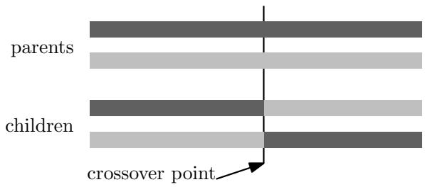  
Figure 3.1: One-point crossover

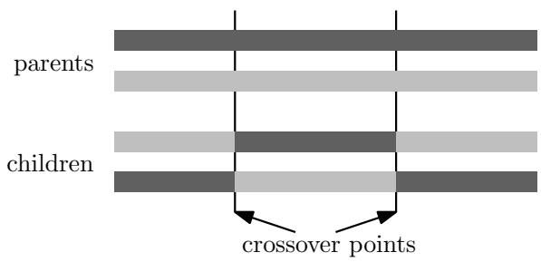  
Figure 3.2: Two-point crossover

The uniform crossover operator creates a child chromosome of the parent chromosomes by selecting for each gene in the child chromosome randomly with a certain probability (typically 0.5) whether it is taken from the first or the second parent.

Since binary string representation was chosen for the chromosomes a wide range of crossover and mutation operators for can be used. Chu and Beasley have chosen uniform crossover as as the default crossover operator for their genetic algorithm.

For each child that is generated by crossover a mutation procedure is applied, that introduces small changes to a chromosome. The value of some bits that are randomly selected is changed from 0 to 1 or vice versa. The probability for a bit to mutate is chosen so that on average two bits of the string change.

# 3.2.4 Repair Operator

The solutions generated by the mutation and crossover operator may not be feasible. A heuristic repair operator is applied to maintain feasibility for all solutions. Further more the repair operator does not only “repair” solutions that lie in the infeasible region $U$ but it also locally optimizes all feasible solutions by transforming them into boundary solutions. Thus every solution that is generated by the crossover and mutation operator is transformed into a solution that is contained in the boundary $B$ of the feasible region.

Most greedy like heuristics as the ones presented in the previous chapter use the notion of utility ratios. As the surrogate relaxation of the MKP aggregates all knapsack constraints into a single constraint (see section 4.5.1) this provides an easy way to compute utility ratios. The utility ratio of an item is then defied as $\textstyle p _ { j } / \sum _ { i = 1 } ^ { m } w _ { i } a _ { i j }$ where $w _ { i }$ are non negative weights. The selection of the weights is a crucial task and it influences the quality of the heuristic that uses the utility ratios. A simple method to compute the weights $w _ { i }$ is to take the dual variables of the optimal solution of the LP relaxation of the original problem.

Chu and Beasley designed a repair operator that consists of two phases. The first part called DROP phase ensures that every solution that was processed by this DROP phase is feasible. Each variable is examined in ascending order of utility ratios and as long as the solution is infeasible the current item examined is excluded from the solution if it was included. The second part, called ADD phase, examines all items in decreasing order of utility ratio and adds each item that is not included in the solution as long as no resource constraint gets violated. Algorithm 1 shows the pseudo-code for this repair operator.

The idea behind the algorithm is to remove elements from any infeasible solution until it is feasible and then to transform it into a boundary solution by adding all items that fit in the resulting temporary solution. The idea

# Algorithm 1 GreedyRepair

<table><tr><td>Input: Solution vector x sorted according to ascending utility ratios Output: Boundary solution vector 1: Rk ← ∑i=1 aikx[] ∀k  {1, . . , m}</td></tr><tr><td>2: j ←n</td></tr><tr><td>3: while (Rk &gt; ck for any k  {1, . . . , m}) { // DROP phase 4: if (x[j] = 1) {</td></tr><tr><td>5: x[j] ← 0</td></tr><tr><td>6: Rk ← Rk − ajk ∀k  {1, . . . , m} 7: }</td></tr><tr><td>8: j ←j − 1</td></tr><tr><td>9: }</td></tr><tr><td>10: for j = 1 . . . n { / / ADD phase</td></tr><tr><td>11: if (x[j] = 0) and (Rk + ajk &lt; bk ∀k  {1, . . . , m}) {</td></tr><tr><td>12: x[j] ← 1</td></tr><tr><td>13: Rk ← Rk + ajk ∀k  {1, . . . , m}</td></tr><tr><td>14: }</td></tr></table>

behind the utility ratios is to remove the items with the lowest profit per weight ratio and to add items with the highest profit per weight ratio as possible. The worst case runtime of this algorithm is $O ( n m )$ as can be easily seen, since each operation in the loops (addition of items and check for feasibility) has a worst case runtime of $O ( m )$ .

# 3.2.5 Initialization

The initial population is set up as follows. Instead of simply creating random solutions taken from the entire search space $S$ and then applying the repair operator on each individual of the population, Chu and Beasley use a special initialization routine which ensures that all individuals of the initial population are feasible. The initialization routine starts by setting all components of the solution vector to 0. Then a random permutation of all items is generated and the items are added in order of this random permutation. The algorithm stops when the first item is encountered that does not fit in the solution. Algorithm 2 illustrates this routine.

# 3.2.6 The Genetic Algorithm

The algorithm framework is steady-state and a new candidate solution replaces the worst chromosome in each iteration. Duplicate elimination is also performed which means that if a solution generated by crossover and mutation is identical to a solution already contained in the population, the

# Algorithm 2 Initialize

Input: Uninitialized Solution vector $x$   
Output: Initialized Solution vector   
1: $x [ i ]  0$ , for all $i \in \{ 1 , \ldots , n \}$   
2: $R _ { k } \gets 0 \quad \forall k \in \{ 1 , \dots , m \}$   
3: Generate a random permutation $\Pi$ of $\{ 1 , \ldots , n \}$   
4: $k \gets 0$   
5: $i \gets \Pi [ k ]$   
6: while $( R _ { k } + a _ { i k } < b _ { k } \quad \forall k \in \{ 1 , . . . , m \} ) \ .$ {   
7: $x [ i ]  1$   
8: $R _ { k } \gets R _ { k } + a _ { i k } \quad \forall k \in \{ 1 , \ldots , m \}$   
9: k k + 1   
10: $i \gets P [ k ]$   
11: }

solution is discarded and a new child is generated. Algorithm 3 shows the pseudo code of the genetic algorithm.

# Algorithm 3 GA

1: initialize $P ~ / /$ initial population 2: evaluate each chromosome $x \in P$ 3: find best chromosome $x ^ { * } \in P$ 4: $i t e r \gets 0$ 5: while (iter < MAXITER) $\{$ { 6: select $( x _ { 1 } , x _ { 2 } ) \ / / $ select 2 chromosomes with binary tournament 7: $y  \mathrm { C r o s s o v e r } ( x _ { 1 } , x _ { 2 } )$ 8: $y \gets \mathrm { M u t a t e } ( y )$ 9: $y  \operatorname { G r e e d y R e p a i r } ( y )$ 10: if ( $y \equiv x$ for any $x \in P$ ) $\{$ 11: goto 5 12: } 13: find worst chromosome $x _ { m i n } \in P$ 14: replace $x _ { m i n }$ with $y$ 15: evaluate $y$ 16: if ( $y$ better than $x ^ { * }$ ) { 17: $x ^ { * } \gets y$ 18: } 19: iter iter + 1 20: } 21: return $x ^ { * }$

# 3.3 Complete Solution Archive

# 3.3.1 Goals for a Solution Archive

A solution archive enhancing the genetic algorithm should have the following properties:

Duplicate detection: Each solution should be inserted into the archive so that all duplicates can be detected.   
Excluding parts of the search space: The solution archive should allow for marking completely evaluated parts of the search space in the archive and deleting them from the archive and thus excluding them from search space.   
• Alternative solutions: Upon insertion of a duplicate solution it should be possible to generate a similar unique solution to replace the duplicate.   
Detect Complete Evaluation: The archive should permit the detection whether the complete search space has already been evaluated.

# Duplicate Detection

The first goal mentioned above differs from the duplicate elimination method that is used in Chu & Beasley’s algorithm. The method that is performed in the genetic algorithm of Chu and Beasley (see line 11 of Algorithm 3) only detects duplicates that are contained in the population at the time of generation of the duplicate solution. It is however possible and not so unlikely that a candidate solution that was replaced by a different solution is generated again in a later iteration. This kind of duplicate occurrence should be detected with the help of the solution archive

# Excluding Parts of the Search Space

The second goal mentioned above is necessary to efficiently identify parts of the search space that are completely evaluated. Furthermore if all such parts can be marked in the archive and the memory that is occupied by solutions located in such a part can be freed, this can significantly reduce the resource requirements of the archive.

# Alternative Solutions

Upon detection of a duplicate solution it is desired to derive an alternative solution from the duplicate solution that is not contained in the solution archive. Thus, the solution archive should be implemented with a data structure that not only permits the detection of duplicate solutions but also permits to generate alternative unvisited solutions not only by proceeding with the genetic algorithm, but to actively search for such alternative solutions. This search can be simplified if evaluated parts of the search space (and thus parts where no such alternative solutions can be located) can be marked in the archive as mentioned above.

# Detect Complete Evaluation

If the complete search space has been evaluated, the genetic algorithm should terminate. This is only possible if the solution archive permits to detect whether all solutions are already contained in the archive and no alternative unvisited solution exists.

# 3.3.2 Suitable Data structure

A suitable data structure needs to be chosen that satisfies all requirements stated above. The applicability of a hash table, a binary tree as well as a Trie is compared in this section.

Hash table: The first requirement stated above (duplicate detection) can be achieved with a solution archive based on a hash table. Each solution that is already contained in the hash table can easily be identified as duplicate when inserting it a second time in the archive. The exclusion of parts of the search space however cannot be achieved with a hash table if no additional data structure is used. Upon inserting a solution a plain hash table cannot indicate whether the solution lies in an excluded part of the search space. The exclusion of completely evaluated parts of the search space is crucial for detecting the complete evaluation of the search space as well as for searching for alternative solutions. Basically the only operation that a hash table based archive offers is to insert a solution and to tell whether a solution is contained in the archive. Thus it does not fulfill all requirements stated above.

Binary search tree: As for hash tables a binary tree allows for detecting any duplicate solution that is inserted into the archive. The second goal (excluding parts of the search space) cannot be performed with a binary search tree. Consider an implementation where each node represents a solution and the left sub tree contains only “smaller” solutions and the right sub tree contains only “greater” solutions (the keys for comparing the solutions are binary strings that are interpreted as binary numbers). Excluding the left or right sub tree of a tree node from the search space will eliminate a greater region of the search space than a region that is defined by a certain prefix. It is however desired to be able to exclude regions of the search space that are defined by a certain prefix of the solution string.

To actively search for boundary solutions that are not included in the tree, the structure of the Trie cannot easily be used since the location of a solution in the tree and a descent from the root to the solution does not give us enough information to determine whether a solution is a boundary solution. There are further disadvantages of binary search trees that are discussed later in this chapter.

Trie: A Trie based archive can overcome the drawbacks of hash tables and binary search trees that are explained above. The exclusion of parts of the search space that are defined by a certain prefix can easily be implemented since each level of the Trie corresponds to an item of a problem instance and a sub Trie of Trie node corresponds to all strings that share the same prefix. The nodes of a Trie do not contain the records (solutions) that are stored in the Trie and thus the size of each node is very small. In contrast to hash tables and binary search trees alternative boundary solutions can be searched in the archive. It is even possible to detect whether all boundary solutions are already contained in the archive and to terminate the genetic algorithm in this case.

# Performance Improvements

The repair operator can be easily extended to compute the fitness function while “repairing and optimizing” a chromosome. The worst case runtime of the extended repair operator is $O ( n ( m + 1 ) )$ which is asymptotically the same as $O ( n m )$ . Each time an item is removed or added the resource consumption for each of the $m$ resources needs to be updated as well as the overall profit. If the fitness values are stored in the solution archive the benefit in computation time would not be very large because the repair operator has to be performed once for each chromosome and the runtime of the repair operator is $O ( n m )$ while the runtime of the evaluation of the fitness function is $O ( n )$ . The saved fitness value only saves the effort of reevaluating the fitness function for duplicate chromosomes which gets negligible in comparison to the effort of applying the repair operator for instances with large $m$ . Thus the solution archive does not need to store the fitness values to save the time of reevaluation since the performance improvement would be negligible compared to the extra memory needed to store the fitness values.

# 3.3.3 Trie

A Trie (derived from retrieval) is a data structure that is suitable to store many strings. The name was first suggested in [Fre60]. It is a kind of specialized search tree that makes use of the string representation of the keys to be inserted into the Trie. The difference to binary search trees is that no node in the Trie stores the string that is associated with it, but the position of each node relative to the root node determines the string that is represented by a node. Tries are very efficient for implementing a dictionary which is a common application for a Trie.

There exist many different kinds of Tries such as Radix Tries, Indexed Tries, Packed Tries, Linked Tries and others. A more detailed discussion on Trie data structures can be found in [Knu73] and [Gus97].

In indexed Tries each node has in general $m$ child nodes if the strings to be inserted are composed of a character set with $m$ characters. The pointers to the child nodes are stored in an array and thus the access of a child node corresponding to a given character can be performed by indexing the corresponding pointer in the array. Additionally flags are used to mark the end of a word. This is especially important if a word is a prefix of another word stored in the Trie (e.g. the words the and theater).

The size of indexed Tries can be compacted by using suffix compression, linked Tries or packed Tries which are compacted variants of indexed Tries that use less memory.

A Radix Trie is a special kind of binary tree that contains records that are ordered according to a key that is a binary string $S$ of fixed length. Only the leaf nodes contain the data records while the internal nodes are only router nodes that have a maximum of two child nodes. A router node on level $i$ has the property that in its left sub Trie only records are stored for which $S _ { i }$ (the $i$ -th bit of the key) is 0 and the right sub Trie contains only records with $S _ { i } = 1$ . The leaf nodes are attached at a router node the highest possible level so that the key can be uniquely identified among other keys that share a common prefix. Thus no unnecessary router nodes are contained in the Trie.

# Binary Trie

For the solution archive a binary Trie similar to the Radix Trie was selected to store the solution strings. Since the records to be stored (solution strings) can be used as keys the leaf nodes do not need to contain a record. The position of a leaf node is sufficient to identify the corresponding solution. However, a solution can only be uniquely identified by a leaf node at the lowest level of the Trie. Thus, even if only one solution is contained in the Trie all internal nodes on the path from the root to the leaf corresponding to the solution string are needed to describe the solution. Since all solutions are described by strings of the same length, all leaf nodes are placed at the same level of the Trie. Thus the Trie has a height of $n$ levels for an MKP instance with $n$ items. The binary Trie in Figure 3.3 for example contains the binary strings 001, 011, 110 and 111 that correspond to solutions of an MKP instance with 3 items. The operations for inserting, searching and deleting of strings in the Trie all exhibit a worst case runtime of $0 ( n )$ . Algorithm 4 illustrates the insertion of a string in such a Trie. Since each node has only two child nodes they can be named left (indicating a 0 for the corresponding bit in the string) and right (indicating 1). The retrieval of

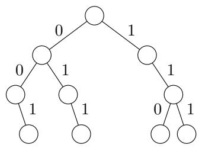  
Figure 3.3: A Trie for binary strings

# $\mathbf { A l g o r i t h m 4 I n s e r t } ( x , r )$

Input: string $x$ to be inserted, root node $r$   
Output: leafnode representing the string that was inserted   
1: $n o d e \gets r$   
2: for i = 1 . . . x.length   
3: if $x [ i ] = 0$ {   
4: if $n o d e . l e f t = \mathrm { N U L L }$ {   
5: node.lef t = new node   
6: }   
7: node  node.lef t   
8: } else {   
9: if node.right $=$ NULL   
10: node.right $=$ new node   
11: }   
12: node  node.right   
13: }   
14: }   
15: return node

a string is illustrated in Algorithm 5 and the deletion of a string is depicted in Algorithms 6 and 7. It is easy to see that Algorithms 4, 5, and 6 exhibit a worst case runtime of $O ( n )$ . Algorithm 7 also exhibits a worst case runtime of $O ( n )$ since the sub Trie to be deleted by this algorithm is in fact only a linked list that does not contain any branches.

# Advantages over Binary Search Trees

As mentioned above a binary Trie is the data structure that fits best to the requirements of the solution archive. Furthermore a Trie has significant advantages over a binary search tree in a scenario like this.

# $\mathbf { A l g o r i t h m 5 } \ \mathrm { S e a r c h } ( x , r )$

Input: string $x$ to be searched, root node $r$   
Output: whether the string was found   
1: $n o d e \gets r$   
2: for $\begin{array} { r }  i = 1 \dots x . l e n g t h { \ \left\{ \begin{array} { l } { \begin{array} { r l r } \end{array} } \right. } \end{array} \end{array}$   
3: if $x [ i ] = 0$ {   
4: if $n o d e . l e f t = \mathrm { N U L L }$ {   
5: return false   
6: }   
7: node  node.lef t   
8: else   
9: if node.right $=$ NULL   
10: return false   
11: }   
12: node  node.right   
13: }   
14: }   
15: return true

Looking up keys (in this case solution strings) is faster than with binary search trees. The height of a well balanced binary search tree is in $O ( \log ( k ) )$ where $k$ is the number of solutions inserted into the binary search tree the and thus the number of key comparisons to be made for searching or inserting a solution is in $O ( \log ( k ) )$ . The comparison of the keys (binary strings of length $n$ where $n$ is the number of items in the MKP instance) is in $O ( n )$ . Thus the wost case time for inserting, searching and deleting solutions is in $O ( n \log ( k ) )$ which is greater than $O ( n )$ for the binary Trie.   
In many cases the Trie requires less memory because the strings do not need to be stored in the nodes and nodes are shared by strings that have a common prefix.   
A Trie cannot degenerate to a linked list as a non-balanced binary search tree can. The balancing of a binary search tree needs some effort that is not needed when a Trie is used.

# 3.3.4 Size of Search Space

Section 3.2.1 gives an overview on how the entire search space can be classified. An ordinary genetic algorithm that uses binary string chromosomes and does not use a special repair and optimization operator will generate solutions that are contained in the entire search space and thus can be contained in either the feasible region $F$ or the infeasible region $U$ . The repair

# $\mathbf { A l g o r i t h m 6 } \ \mathrm { D e l e t e } ( x , r )$

Input: string $x$ to be deleted from Trie, root node $r$ , index $i$   
1: $n o d e \gets r$   
2: $d e l e t e \gets r$   
3: for $\begin{array} { r }  i = 1 \dots x . l e n g t h { \ \left\{ \begin{array} { l } { \begin{array} { r l r } \end{array} } \right. } \end{array} \end{array}$   
4: if $x [ i ] = 0$ {   
5: if $n o d e . l e f t = \mathrm { N U L L }$ {   
6: String not contained   
7: }   
8: if node.right = NULL   
9: delete  node.lef t   
10: }   
11: node  node.lef t   
12: } else {   
13: if node.right $=$ NULL {   
14: String not contained   
15: }   
16: if $n o d e . l e f t \ne \mathrm { N U L L } \left\{ \begin{array} { r l } \end{array} \right.$   
17: delete $\longleftarrow$ node.right   
18: }   
19: node  node.right   
20: }   
21: }// delete is the root node of the sub Trie to be deleted   
22: Free(delete)

# Algorithm 7 Free(r)

<table><tr><td>1: if r = NULL {</td><td>Input: Root r of sub Trie to be freed from memory</td></tr><tr><td>2:</td><td></td></tr><tr><td>Free(r.lef t) 3: Free(r.right)</td><td></td></tr><tr><td>4: delete node r</td><td></td></tr><tr><td>5:}</td><td></td></tr><tr><td></td><td></td></tr></table>

operator presented in 3.2.4 does not only ensure that each solution lies in $F$ but also optimizes each solution so that finally only solutions that are contained in $B$ are generated. Clearly the size of $B$ is only a fraction of the size of $S$ and in general there will be many solutions that are generated by a crossover and mutation operator that map to the same solution in $B$ after applying the repair operator. Thus the probability for identical solutions to occur during the reproductive phase of this genetic algorithm is higher than for an ordinary genetic algorithm.

As can be seen in chapter 6, the number of duplicate individuals that can be detected with a solution archive is much higher than the number of duplicates that are detected with the duplicate elimination method that is implemented by the genetic algorithm. For the large instances from Chu and Beasley ( $n = 5 0 0 , m = 3 0$ ) more than half of the generated solutions can be identified as duplicates and for smaller instances ( $n = 2 5 0 , m = 1 0$ ) about two thirds or more of the solutions are duplicates.

# 3.3.5 Information Gained from Solution Archive

A solution archive based on a Trie has significant advantages over a solution archive based on a hash table. The structure of a binary Trie based archive represents the entire search space for the MKP. This enables more opportunities how to handle the detection of a duplicate. While with a hash table based solution archive the only action that can be efficiently performed is to discard the duplicate and proceed with the genetic algorithm, a Trie based solution archive allows us to actively search for an alternate solution in the neighborhood (i.e with a small Hamming distance to the original solution) that is not contained in the solution archive. Furthermore the Trie structure permits the exclusion of parts (sub Tries) of the search space that either have been evaluated completely or that can be shown not to contain any solution that is better than the best solution found so far. The latter can be implemented by the computation of upper bounds during the insertion of chromosomes in the solution archive.

# 3.3.6 Resource Requirements

Today, as even large amounts of memory are relatively cheap, a Trie based solution archive does not pose a problem in regard to resource requirements. Modern computers today have several Gigabytes of main memory. The amount of memory needed for such a solution archive depends on the size of the problem instance (the number of constraints is irrelevant), the implementation of the Trie based archive and the order in which the levels of the Trie correspond to items of the problem instance. Whether the size of a Trie based solution archive is greater or smaller than the size of a hash table based archive cannot be stated generally since it depends on many factors as stated above. An analysis of the size of the Trie based solution archive can be found in section 6.2.2. In the worst case the Trie requires an amount of memory with is close to kns if $k \ll 2 ^ { n }$ where $k$ is the number of solutions contained in the Trie, $n$ is the number of items of the problem instance ans $s$ is the size of a Trie node. This situation occurs if all solutions that included in the archive share the shortest common prefix possible, i.e. all branches in the Trie are at levels near the root so that only few Trie nodes are shared among the solutions. A complete Trie where all solutions (all possible strings) are included requires an amount of memory equal $2 ^ { n + 1 } s$ .

The enhancements of the Trie to exclude parts of the search space that are discussed in the next chapter avoid such a scenario even for small scale instances where all solutions can be generated by the genetic algorithm within reasonable time.

# Chapter 4

# A Trie Based Solution Archive

This chapter presents a complete solution archive for Chu & Beasley’s genetic algorithm. The data structure as well as all algorithms that operate on the Trie are explained in detail.

# 4.1 Definitions

Throughout this chapter the terms solution and chromosome will be used to identify any binary string of length $n$ that represents either a feasible or an infeasible solution. These terms will be used interchangeably. A ‘1’ in the binary string at index $i$ means that the item corresponding to this index is contained in the solution whereas a ‘ $0$ ’ denotes the absence of the item. The term boundary solution will be used for solutions contained in $B$ , i.e. solutions that cannot be improved by adding items and thus are locally optimal.

The solution archive consists of a Trie as it is explained in 3.3.3. The Trie explained in the last chapter always has a height of $n$ for an instance with $n$ items and the leaf nodes that are located at the lowest level in the Trie represent the candidate solutions that are inserted in the Trie. To allow for marking completely evaluated regions of the search space the Trie has to be enhanced. An inner node at level $i$ of the Trie as defined in the previous chapter represents a set of solutions that all share the same prefix of length $i$ . The set of solutions that is contained in the sub Trie of this inner node corresponds to all leaf nodes of the sub Trie. To mark and exclude such a set of solutions from the search space the corresponding inner node needs to indicate the exclusion of its sub Trie. This enhancement can be accomplished by storing a special value in the pointer to the corresponding sub Trie and thus no additional memory is needed. In section 4.1.2 we will see that for each boundary solution an inner node can be found that is the root of a sub

Trie that does not contain any feasible solution other than the boundary solution. This sub Trie can be marked and eliminated without evaluating it.

# 4.1.1 Trie Nodes

Each node of the Trie contains only two pointers – one for the left child and one for the right child of the node. The meaning of these pointers depends on the value they contain:

NULL: If the value of the pointer is 0 this means that no chromosome is contained in the Trie that would be located in the corresponding sub Trie. Obviously before inserting the first chromosome in the Trie the pointer to the root contains the value NULL.   
COMPLETED: This indicates that all chromosomes that are located in the sub Trie of the corresponding pointers have already been evaluated and that each chromosome that is to be inserted and would be located in this sub Trie is considered a duplicate solution.   
Anything else: All other values denote the address of the node that is a child node of the node containing the pointer.

For the Trie nodes the following properties hold:

Leaf nodes at level $n$ (for instances with $n$ items), that represent solutions have no child nodes.   
Leaf nodes at a level smaller than $n$ contain one NULL pointer and one COMPLETED pointer. An inner node that contains two NULL pointers would be unnecessary because it would neither represent a solution nor a completed region of the search space. A pointer that contains two COMPLETED pointers would be redundant because the pointer to it at the parent node could contain the value COMPLETED.   
All inner nodes have at least one child node

# 4.1.2 Representation of Boundary Solutions in the Trie

The genetic algorithm that is enhanced by the solution archive only generates boundary solutions. All solutions outside the feasible region are transformed to feasible solutions by the repair operator and all solutions which are contained in $F \backslash B$ are locally optimized so that they lie on the boundary region $B$ . Since only boundary solutions are relevant for the solution archive all trailing 0s in the binary string representing a boundary solution can be omitted, because each of the trailing 0s represents an item that would make the solution infeasible if added. Therefore solutions in the Trie have the following properties:

Each (feasible or infeasible) solution is represented by a leaf node in the Trie.   
• Each boundary solution can also be represented by the last right child node on the path from the root to the leaf that describes the boundary solution since this is the only feasible solution the sub Trie contains. (See node $c$ in Figure 4.1)   
Considering the sub-Trie in which boundary solution $a$ is the rightmost leaf, this sub-Trie does not contain any better solution (and therefore also boundary solution) with a depth smaller or equal than the depth of $a$ . (Node $a$ in Figure 4.1)   
Two different boundary solutions always have a Hamming-Distance of at least 2.

A naive approach would be to map the levels of the Trie to the items of the problem instance in decreasing order of utility ratios as used in the repair operator described above. But it is also possible to use a different order for the Trie levels as explained in section 4.6

Example: Consider the problem instance given in table 4.1 with $n = 4$ and $m = 1$ and the capacity of the knapsack equal to 18.

Table 4.1: Small example instance   

<table><tr><td>item</td><td></td><td>2</td><td>3</td><td>4</td></tr><tr><td>profit</td><td>9</td><td>5</td><td>7</td><td>6</td></tr><tr><td>weight</td><td>5</td><td>3</td><td>8</td><td>7</td></tr></table>

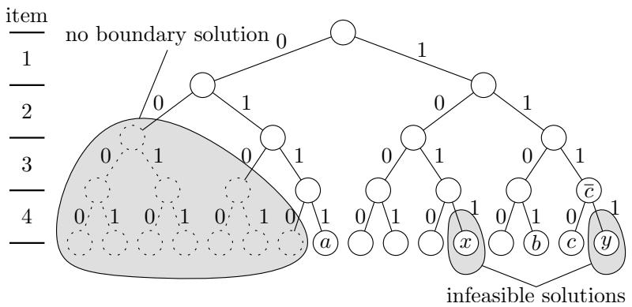  
Figure 4.1: Complete solution Trie

This instance has 16 distinct solutions of which two are infeasible and three are boundary solutions. The leaf nodes $a$ , $b$ and $c$ in Figure 4.1 represent the three boundary solutions 0111, 1011 and 1110. Note that boundary solution $c$ can also be represented by node $c$ since the sub Trie of this node does not contain any other feasible solution than $c$ . Thus the pointer to node $\bar { c }$ can be marked COMPLETED.

The structure of the Trie (regardless of the order in which the levels of the Trie correspond to the items of the problem instance) allows a very easy computation of upper bounds at each level in the Trie. This can be incorporated to mark certain regions of the Trie as completed even though not all boundary solutions have already been visited in that sub-Trie. The existence of an upper bound which is smaller than the best solution found so far guarantees that no solution is excluded from the search space that is better than the best solution found so far. Section 4.5 describes this in detail.

Note that in the pseudocode for the algorithms presented in this chapter only a check for the value COMPLETED is performed on the pointers of a node since this is the only value that prohibits to descend further down the Trie. If the value is either NULL or anything else the descent may proceed. In this case a new Trie node has to be allocated if the value was NULL. For the sake of simplicity this check for the value NULL and the allocation of a new Trie node is not included in the pseudocode for the algorithms presented in this chapter.

# 4.1.3 Procedures

There are three main procedures that operate on the Trie.

insert: This procedure takes a chromosome and inserts the chromosome into the Trie. If the chromosome is not already contained in the Trie this procedure returns true. If the chromosome to be inserted is already contained in the Trie false is returned.   
find alternate: This procedure takes a chromosome and searches for an alternative boundary solution that is not yet contained in the Trie. If an alternative solution is found true is returned and the chromosome that was given as argument is changed so that it represents the new solution. The only case this procedure returns false is when all boundary solutions have been evaluated, i.e. the pointer to the root node of the Trie has the value COMPLETED.   
is completed: This procedure returns true if all boundary solutions are contained in the Trie and thus, the pointer to the root node has the value COMPLETED.

For each chromosome that is generated by the genetic algorithm the procedure is completed is called and if false is returned insert is called. If insert returns false the procedure find alternate is called to obtain an alternative boundary solution that is not a duplicate of any candidate solution generated so far. If find alternate or is completed returns false the genetic algorithm terminates, indicating that the optimal solution has been found.

The procedure find alternate uses many sub procedures to perform the task of searching for alternative solutions. In this chapter all important algorithms required to implement the archive and the above mentioned procedures are presented.

# 4.2 Handling of Duplicates

If the insertion of a boundary solution fails because the solution to be inserted lies in a region of the Trie that is marked as COMPLETED (Algorithm 4 can easily be enhanced to detect this), the insertion will fail. The procedure find alternate transforms the solution into an alternate boundary solution that has not yet been visited and hence does not lie in a completed region of the Trie. To transform a boundary solution to an alternate boundary solution, at least one item has to be unpacked and the freed capacity needs to be filled by other items.

# 4.2.1 Requirements for a Search Algorithm

An algorithm that searches for an unvisited boundary solution in the Trie starting from an already visited solution should have the following properties:

• Only boundary solutions should be returned by the algorithm.   
• Boundary solutions in the neighborhood (small Hamming-Distance) of the duplicate solution should be returned in favor by the algorithm.   
• The algorithm should ideally run in $O ( n m )$ time.   
• Sub-Tries that do not contain any unvisited boundary solution should be marked as completed and freed from memory.   
• It should be possible to control the probability for an item to be replaced by the algorithm. Possible approaches include equal distribution over all items as well as probabilities based on the pseudo utility ratios or normal distribution.   
• If an unvisited boundary solution exists it should be returned by the algorithm. If no unvisited boundary solution exists the algorithm should terminate and indicate that the entire search space has been evaluated.

All of the above mentioned properties cannot be completely satisfied at the same time. The generation of an alternate boundary solution in the neighborhood of an already existing boundary solution means that one or more items have to be unpacked, and at least one item which is not part of the initial solution has to be added. A guaranteed worst case runtime of $O ( n m )$ seems hard to achieve if possible at all. A guarantee that unvisited boundary solutions are found and returned by the algorithm, if any exist, is very important. The selection of an item to be unpacked from the initial solution can have an effect on the Hamming-Distance of the generated solution. If an item with very large resource consumption is chosen to be unpacked and the resulting “space” in the knapsack is large enough to accommodate any two items except the unpacked one, then the Hamming-Distance of the generated boundary solution will be 3 even if boundary solutions with Hamming-Distance of only 2 exist.

# 4.3 Search Algorithm

Since solutions with a small Hamming-Distance should be generated it is best to start searching for a new boundary solution by unpacking a randomly selected item or adding a randomly selected item to the initial boundary solution. The index of the item to be removed or added is chosen randomly (either equally distributed or normally distributed). Whether the item is included in the solution determines whether the item will be added or removed.

# 4.3.1 Search for Boundary Solution

Let $f$ be the index at which the insertion of the solution into the Trie failed. This index will be needed during the search for an alternate solution. The following steps describe the procedure of searching for an alternate boundary solution. In all algorithms that follow in this section the variables $R _ { l }$ contain the resource consumptions for all $m$ constraints as they were computed by the repair operator.

Step1: Let $P = ( p _ { 1 } , p _ { 2 } , p _ { 3 } , . . . , p _ { n } )$ , $p _ { i } ~ \in ~ \{ 0 , 1 \}$ be the solution vector which was returned by the greedy repair operator where $p _ { k }$ represent the items in the order of the levels of the Trie. Assume that $P$ happens to be a duplicate of a boundary solution which already exists in the Trie. An index $k$ is selected randomly from a normal distribution with $\mu = c$ and $\sigma = 0 . 1 5 n$ where $c$ is the index of the center of the core as defined in [PRP06]. If $p _ { k } = 1$ go to Step2a else go to Step2b.

Step2a: Remove item $k$ (set $p _ { k } = 0$ ) and go to Step2c.

Step2b: Add item $k$ (set $p _ { k } = 1$ ). The interim solution is infeasible now. Remove items in reverse order of the solution vector starting from index $f$ without touching the item just added, until the interim solution is feasible. If index 0 is reached without attaining feasibility “wrap around” and continue to remove items starting from the last index until the solution is feasible. The removal of the items is started at index $f$ since this will ensure that the solution vector changes before index $f$ . If the solution vector would only change beyond index $f$ a descent into the Trie might follow the path described by the initial solution vector and end up in the already completed region of the Trie. Set $k = - 1$ and perform Step2c.

step2c: While step3 does not return true perform boundaryCheck (see section 4.3.2). If either step3 or boundaryCheck returns true a new boundary solution was found.

Step3: In this step a new boundary solution is searched. Let $x$ be the input vector for this step. Start at the root of the Trie and perform a descent along the path given by $x$ except for levels in the Trie which represent an item that is not included in $x$ and with resource consumption smaller than spare resources in $x$ . At these levels the descent follows the right instead of the left child of the corresponding node. If no completed region of the Trie is entered a new boundary solution has been found. Mark the solution in the Trie as completed (see 4.4). Algorithm 8 describes this step in detail. If called from Step2a, $k$ is the item that was just removed, so this item will not be added (to prevent the generation of the same duplicate). If called from $S t e p \mathcal { 2 } b \ k$ is set to $^ { - 1 }$ so any item may be added.

Note that this step is not guaranteed to generate a new boundary solution. This happens if the intended path has to be left because the path leads to a completed region of the Trie. Being diverted to the left child during the descent along $x$ (see line 21 in Algorithm 8) means that an item which would fit in the temporary solution cannot be added or has to be removed respectively. After this diversion continue the operation of Step3 as if this incident would not have happened in Algorithm 8. The resulting solution is not guaranteed to be a boundary solution however it is marked as completed in the Trie before it is analyzed if it lies on the boundary. This is shown in 4.3.2. If diverted to the right perform $S t e p 4$ and return false. In both cases Algorithm 8 returns false to indicate that the solution has to be analyzed if it lies on the boundary of the feasible region.

Step4: Being diverted to a right child during the descent along $x$ means that an item which does not fit in the temporary solution has to be added. If the resulting solution without the elements represented by nodes further down the Trie is already infeasible, mark the infeasible branch as completed,

# Algorithm 8 step3

Input: Solution $x$ , index $k$   
Output: Whether a new boundary solution was found   
1: found $\longleftarrow$ true   
2: current $\longleftarrow$ root   
3: for $i = 1$ to $n$ $\{$   
4: if ( $x [ i ] = 0$ ) and $( R _ { l } + a _ { i l } > b _ { l }$ for any $l \in \{ 1 , \ldots , m \}$ ) $\{ \begin{array} { l }   \begin{array} { r l } \end{array}   \begin{array} { r l } \end{array}  \end{array}$ gets   
infeasible if item $i$ is included   
5: if current.leftchild $\neq$ COMPLETED   
6: current $\longleftarrow$ current.leftchild   
7: } else {   
8: $x [ i ]  1$   
9: $R _ { l } \gets R _ { l } + a _ { i l } \quad \forall l \in \left\{ 1 , \dots , m \right\} / /$ Add the resource consumption   
of item $i$   
10: $x \gets$ handleRightDiversion( $x$ , current, $i$ )   
11: return false   
12: }   
13: }   
14: if ( $[ i ] = 1 )$ or ( $( x [ i ] = 0 )$ ) and $( R _ { l } + a _ { i l } \le b _ { l } \quad \forall l \in \{ 1 , \dots , m \} )$ ) {   
15: if (current.rightchild $\neq$ COMPLETED) and ( $i \neq k$ ) $\{ \ / \}$ we may   
not add item $k$   
16: current $\longleftarrow$ current.rightchild   
17: $\begin{array} { r l } & { \mathrm { ~ i f ~ } ( [ i ] = 0 ) ~ \{ } \\ & { \quad x [ i ]  1 } \\ & { \quad R _ { l }  R _ { l } + a _ { i l } \quad \forall l \in \{ 1 , \dots , m \} } \\ & { \quad \mathrm { ~ j ~ } } \\ & { \mathrm { ~ e l s e ~ } \{ } \end{array}$   
18:   
19:   
20:   
21: $\}$   
22: current $\longleftarrow$ current.leftchild   
23: if $( [ i ] = 1 )$ {   
24: x[i] ← 0   
25: Rl ← Rl − ail ∀l ∈ {1, . . . , m}   
26: }   
27: found $\longleftarrow$ false   
28: }   
29: }   
30: }   
31: mark(x, found)   
32: return found

otherwise continue the descent along the intended path as long as the items fit in the temporary solution. The resulting solution is marked as completed. Algorithm 9 shows this in detail.

# 4.3.2 Check if a Solution Lies on the Boundary

The analysis whether a temporary solution $x$ is contained in the boundary region is very similar to step3. A descent from the root along the path given by $x$ is performed. As in step3 each item that is not included in $x$ is added if it does not violate any knapsack constraint. If this descent finishes without entering an already completed region of the Trie the solution $x$ was not on the boundary (otherwise the descent would have ended up in the node that was marked just before in step3 ) and the resulting solution $x ^ { \prime }$ is a new boundary solution. Mark this new boundary solution as completed and return true.

If the descent reaches a completed region the remaining part of $x$ (the suffix for which the descent is not performed) has to be analyzed without descending further down the Trie. This operation is equivalent to the second part of the greedy repair operator presented in [CB98]. If however $x$ was changed before a completed region was reached (see lines 8 and 24 in Algorithm 10), $x$ was not not on the boundary, and by adding items it could only be changed to a solution that lies in a completed region of the Trie.

If $x$ is on the boundary true is returned. If it is not on the boundary false is returned to indicate that the search for a boundary solution has to be performed again. Algorithm 10 illustrates this procedure.

# 4.3.3 Runtime Analysis

The worst case runtime of the procedures presented above is $O ( n m )$ for step3 and boundaryCheck. These two procedures perform a descent through the Trie and perform a check if an item can be added at each level of the Trie if the corresponding item is not already included. The descent has a worst case runtime of $O ( n )$ and a check whether a single item can be added runs in $O ( m )$ . The procedure handleRightDiversion gets called from step3 and performs a descent only for the levels that step3 has not reached before calling handleRightDiversion. Thus the runtime of handleRightDiversion is already included in the runtime of step3. A worst case runtime of the complete algorithm cannot be analyzed exactly because it depends on the solutions that are contained in the Trie that influence the number of attempts to be made before a new boundary solution is found. Though, computational results show that the number of attempts to find a new boundary solution is on average very small (see section 6.2.1).

# Algorithm 9 handleRightDiversion

# Input: Infeasible solution $x$ , TreeNode startnode, Integer $k$

1: current $\longleftarrow$ startnode   
2: for $i = k$ to $n$ {   
3: if ( $x [ i ] = 1$ ) and $\begin{array} { r } { ( R _ { l } - \sum _ { j = i + 1 } ^ { n } x [ j ] a _ { i l } \leq b _ { l } \quad \forall l \in \{ 1 , \dots , m \} ) } \end{array}$ $\{ \ / \}$ If   
item $i$ is included and $x$ without items beyond $i$ is feasible   
4: if current.rightchild $\neq$ COMPLETED $\{$   
5: current $\longleftarrow$ current.rightchild   
6: $\}$ else   
7: current $\longleftarrow$ current.leftchild   
8: $\begin{array} { l } { x [ i ]  0 } \\ { R _ { l }  R _ { l } - a _ { i l } \quad \forall l \in \{ 1 , \dots , m \} } \end{array}$   
9:   
10: $\}$   
11: $\}$ }else if $( x [ i ] = 1 )$ and $\begin{array} { r } { ( R _ { l } - \sum _ { j = i + 1 } ^ { n } x [ j ] a _ { i l } > b _ { l } } \end{array}$ for any $l \in$   
$\{ 1 , \ldots , m \}$ ) $\{ \ / \}$ If item $i$ is included and $x$ without items beyond $i$ is   
infeasible   
12: if current.r $\mathrm { \ i g h t c h i l d \neq { C O M P L E T E D } }$ {   
13: b $\begin{array} { r l } & { R _ { l } \gets R _ { l } - \sum _ { j = i + 1 } ^ { n } x [ j ] a _ { i l } \quad \forall l \in \{ 1 , \dots , m \} } \\ & { x [ j ] \gets 0 , \mathrm { f o r } i < j \leq n } \\ & { \mathrm { m a r k } ( x , \mathbf { t r u e } ) } \\ & { x [ i ] \gets - 0 } \\ & { R _ { l } \gets R _ { l } - a _ { i l } \quad \forall l \in \{ 1 , \dots , m \} } \end{array}$   
14:   
15:   
16:   
17:   
18: return $x$   
19: $\}$ else {   
20: current $\longleftarrow$ current.leftchild   
21: $\begin{array} { l } { x [ i ]  0 } \\ { R _ { l }  R _ { l } - a _ { i l } \quad \forall l \in \{ 1 , \dots , m \} } \end{array}$   
22:   
23: }   
24: } else $\{ \ / \}$ item $i$ is not included   
25: if current.leftch $\mathrm { i l d } \ne \mathrm { C O M P L E T E }$ D   
26: current $\longleftarrow$ current.leftchild   
27: } else {   
28: $x [ i ]  1$   
29: Rl Rl + ail $\forall l \in \{ 1 , \ldots , m \}$   
30: return handleRightDiversion( $x$ , current, $i$ )   
31: }   
32: }   
33: }   
34: mark(S, false)   
35: return S

Input: Solution $x$   
Output: Whether the solution lies on the boundary 1: current $\longleftarrow$ root 2: changed $\longleftarrow$ false 3: for $i = k$ to $n \left\{ \begin{array} { r l } \end{array} \right.$ 4: if $( x [ i ] = 0$ ) and $( R _ { l } + a _ { i l } > b _ { l }$ for any $l \in \{ 1 , \ldots , m \}$ ) $\{$ { 5: if current.leftchild $\neq$ COMPLETED { 6: current $\longleftarrow$ current.leftchild 7: } else { 8: if (changed = true) $\{$   
9: return false $/ / x$ was not on the boundary   
10: $\}$ else {   
11: return onBoundary(x) // $x$ may be on the boundary   
12: }   
13: }   
14: }   
15: if $( x [ i ] = 1$ ) or ( $( x [ i ] = 0 )$ and $( R _ { l } + a _ { i l } \le b _ { l } \quad \forall l \in \{ 1 , \dots , m \} ) .$ ) {   
16: if (current.rightchild $\neq$ COMPLETED) {   
17: current $\longleftarrow$ current.rightchild   
18: if $x [ i ] = 0 \left\{ \begin{array} { r l } \end{array} \right.$   
19: $x [ i ]  1$   
20: Rl Rl + ail l  1, . . . , m   
21: changed $\longleftarrow$ true   
22: }   
23: else $\{$   
24: if $( { \mathrm { c h a n g e d } } = { \mathbf { t r u e } } )$ $\{$   
25: return false $/ / x$ was not on the boundary   
26: $\}$ else   
27: return onBoundary(x) // $x$ may be on the boundary   
28: }   
29: }   
30: }   
31: }   
32: mark(x, true)   
33: return true

# 4.4 Marking Parts of the Trie as Completed

All solutions that are inserted into the Trie have to be marked so that during insertion or search for alternate solutions duplicates can be identified. To save memory, entire sub Tries should be deleted and marked to indicate regions of the search space that are completely evaluated. When marking the pointer to a child at a node as completed and the pointer to the other child is already marked as completed the corresponding pointer at the parent node can be marked as completed. This procedure is performed recursively. The following sections describe which node may be marked for a certain solution. The aim is to mark solutions at the highest possible level in the Trie without eliminating parts of the Trie that possibly contain unvisited boundary solutions.

# 4.4.1 Marking Boundary Solutions

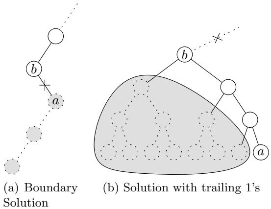  
Figure 4.2: Marking parts of the Trie as completed

As explained in section 4.1.2, each new boundary solution can be viewed as the last right child in the path that represents the solution before it is marked as completed. The trailing zeros in the solution vector all represent items, that do not fit in the solution. Thus, the last node that is the right child of its parent (node $a$ in Figure 4.2a) is the root of a completed sub Trie because no other feasible solution (and therefore boundary solution) can exist in this sub Trie. At the parent of this right child (node $b$ in Figure 4.2a), the pointer to the right child can be marked as completed and the corresponding sub Trie can be freed from memory. The procedure mark is always called with 2 parameters from all procedures. The first parameter denotes the solution string and the second parameter indicates whether the solution may be marked at its last right child.

# 4.4.2 Marking Non-Boundary Solutions as Completed

If the last $k$ ( $k \geq 1$ ) components of the solution vector are equal to 1, i.e. it contains $k$ trailing 1’s, a greater sub Trie than only this leaf can be marked as completed. Consider the last component $x _ { i }$ of the solution vector $x$ which is equal 0 (node $b$ in Figure 4.2b). The solution represented by node $a$ is the best solution within the sub Trie of node $b$ and no other solution in this sub Trie can be located on the boundary. This condition holds for both cases when $x$ represents a boundary solution and when $x$ represents a solution that is contained in $F \setminus B$ . Therefore the complete sub Trie can be marked as completed at the parent node of the last left child.

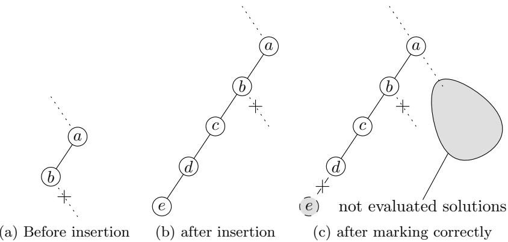  
Figure 4.3: Marking non-boundary solutions

Non boundary solutions generated by one of the procedures explained above cannot be handled that easy. In contrast to boundary solutions there may be items represented by trailing zeros in the solution vector which would fit in the solution but were not added during step3. This scenario can occur in the following situation. Consider a solution $x$ which is processed by step3 that has the following structure:

$$
x = ( x _ { 1 } , x _ { 2 } , \ldots , x _ { n - 3 } = 0 , x _ { n - 2 } = 1 , x _ { n - 1 } = 0 , x _ { n } = 0 )
$$

Figure 4.3a represents the corresponding part of the Trie where $x$ gets inserted (at node $a$ item $x _ { n - 3 }$ determines the direction to follow). During the operation of step3, with node $a$ as current node, item $x _ { n - 3 }$ cannot be added due to one or more resource constraints that would be violated. Thus step3 proceeds to node $b$ in the next iteration. Then $x _ { n - 2 }$ has to be unpacked because the right child of node $b$ is marked as completed. Hence step3 proceeds to node $c$ (Figure 4.3b). The result is solution $x ^ { \prime }$ that has the following structure:

$$
x ^ { \prime } = ( x _ { 1 } ^ { \prime } , x _ { 2 } ^ { \prime } , \ldots , x _ { n - 3 } ^ { \prime } = 0 , x _ { n - 2 } ^ { \prime } = 0 , x _ { n - 1 } ^ { \prime } = 0 , x _ { n } ^ { \prime } = 0 )
$$

The remaining 2 items ( $x _ { n - 1 }$ and $x _ { n }$ ) do not fit anymore into $x ^ { \prime }$ and thus the output of $s t e p \mathcal { B }$ is solution $x ^ { \prime }$ which has to be marked as completed. Even though the last 4 items are set to 0 the last right child in this solution (node $a$ in Figure 4.3b) must not be marked as completed, because the sub Trie with $x _ { n - 3 } = 1$ (right sub Trie of node $a$ ) has not yet been completed and boundary solutions (and even the optimal solution) may be located in this sub Trie. Instead of marking the last right child of the solution as completed a naive approach would be to mark the leaf of the solution (see Figure 4.3c).

The scenario described above however does not occur for all non boundary solutions. There may be many non boundary solutions generated by step3 in which all items represented by trailing zeros do not fit anymore in the solution. For these solutions, it would be acceptable to cut off the Trie at the last right child. Therefore it is necessary to identify such non boundary solutions during the operation of step3.

The scenario described above, resulting in a non boundary solution that must not be marked at its last right child (because containing trailing zeros that represent items of which one or more would fit in the solution), is the only scenario that can lead to such a solution. If the else block in line 21 of Algorithm 8 is entered, an item which has initially been part of the solution may be unpacked. If this happens, the solution must not be marked at its last right child. The corresponding else-block however is also entered if an item that is not part of the solution would fit in the solution but cannot be added because the right child of the corresponding Trie node is already marked as completed. In this case the situation described in 4.4.1 does not apply. Thus it is safe to mark non boundary solutions at their last right child, if during step3 no item that was initially part of the solution has to be unpacked. Furthermore a solution may be marked at its last right child if beyond the last right branch no item has to be unpacked regardless of unpacked items before the last right branch. Algorithm 11 shows these changes in step3. Note that the procedure mark can be called with the second parameter having the value true even though the resulting solution is not a boundary solution. The parameter will only be false if beyond the last right branch an item had to be unpacked.

# 4.4.3 Optimized Marking for all Other Solutions

Sections 4.4.1 and 4.4.2 describe how for certain types of solutions a node higher than the leaf node can be marked. If the rest of the solutions are simply marked at the leaf nodes the performance of the search procedures is degraded noticeable, which is demonstrated by the following example:

During step3 a solution was generated which can only be marked at its leaf node. The item corresponding to node $a$ in Figure 4.4 had to be unpacked because the right child of $a$ has already been marked. Items $b$ through $d$ do not fit in the solution. So the solution is neither a boundary solution nor can it be marked at its last right branch. Thus, only the leaf node (node $e$ ) can be marked (Figure 4.4b). Since no boundary solution

# Input: Solution $x$ , TreeNode root

1: found $\longleftarrow$ true   
2: notunpacked $\longleftarrow$ true   
3: current $\longleftarrow$ root   
4: for $i = 1$ to $n$ {   
5: if $( x [ i ] = 0$ ) and $( R _ { l } + a _ { i l } > b _ { l }$ for any $l \in \{ 1 , \ldots , m \}$ ) {   
6: if (current.leftchild 6= COMPLETED) {   
7: current $\longleftarrow$ current.leftchild   
8: } else {   
9: $x [ i ]  1$   
10: $R _ { l } \gets R _ { l } + a _ { i l }$ $\forall l \in \{ 1 , \ldots , m \}$   
11: $x \gets$ handleRightDiversion(S, current, i)   
12: return false   
13: }   
14: }   
15: if $( x [ i ] = 1$ ) or ( $( x [ i ] = 0 )$ and $( R _ { l } + a _ { i l } \le b _ { l } \quad \forall l \in \{ 1 , \dots , m \} )$ ) {   
16: if (current.rightchild $\neq$ COMPLETED) and ( $~ i \neq k$ ) $\{$   
17: current $\longleftarrow$ current.rightchild   
18: if $( [ i ] = 0 )$ ) {   
19: $x [ i ]  1$   
20: Rl ← Rl + ail ∀l ∈ {1, . . . , m}   
21: }   
22: notunpacked $\longleftarrow$ true   
23: } else {   
24: current $\longleftarrow$ current.leftchild   
25: if $( x [ i ] = 1$ ) $\{$   
26: notunpacked $\longleftarrow$ false   
27: x[i] ← 0   
28: Rl Rl ail l  1, . . . , m   
29: }   
30: found $\longleftarrow$ false   
31: }   
32: }   
33: }   
34: mark(x, notunpacked)   
35: return found

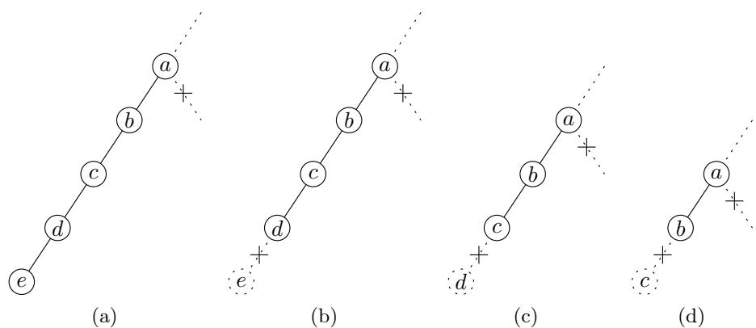  
Figure 4.4: Costly repetitions of step3

was generated step3 has to be called again. Item $a$ is the only item, that would fit in the solution but since the corresponding sub Trie is already marked, the algorithm proceeds to nodes $b$ , $c$ , and $d$ . A right-diversion occurs at node $d$ resulting in the right child of $d$ getting marked and thus $d$ getting marked itself (Figure 4.4c). This operation is repeated (Figures 4.4c and 4.4d) until node $a$ is marked and step3 will generate a solution in a different sub Trie. The number of calls of step3, step4 and boundaryCheck is performed $k$ times where $k$ is the number of levels between nodes $a$ and $e$ . Since each run of step3 and the following procedures performs a descent through the Trie from the root, this significantly affects the computation time of the overall algorithm.

To overcome this problem the marking procedure has to be enhanced. In the previous example only the leaf node of the solution can be marked initially and all subsequent iterations only mark the next higher node. The ideal case would be to mark node $a$ in Figure 4.4.3 during the first iteration to save the computation time of subsequent iterations.

If only the leaf node of a solution can be marked the procedure ascends the Trie along the path representing the solution and stops at the fist node that either represents an item that could be added (i.e. the item would fit in the solution and the corresponding sub Trie is not yet marked) or at the first node that is a right child. This node will be marked as completed. Algorithm 12 shows this procedure. Note that in this Algorithm the father of a Trie node is accessed. Since the Trie nodes only contain pointers to the left and the right child the father of a node cannot be accessed directly. For this purpose all nodes of the path from the root to a leaf are cached in an array during the descent from the root to a leaf. When walking the Trie up from this leaf node as in Algorithm 12 the array is used to determine the father node of a node. For the sake of simplicity Algorithm 12 does not make use of such an array but rather accesses the father of a node directly.

# Algorithm 12 improveMarking

Input: Solution $x$   
1: current $\longleftarrow$ leaf node of $x$   
2: $\mathrm { i }  n$   
3: while (current is no right child) $\{$   
4: if $( R _ { l } + a _ { i l } \le b _ { l }$ $\forall l \in \left\{ 1 , \ldots , m \right\}$ ) $\{$   
5: if (current.father.rightchild $\neq$ COMPLETED)   
6: break   
7: }   
8: }   
9: current $\longleftarrow$ current.father   
10: i  i - 1   
11: }   
12: cutoff(current)

# 4.5 Using Bounds to Reduce the Search Space

The structure of the Trie lends itself to exploit the advantage of upper bounds in the archive-enhanced genetic algorithm and thus to reduce the search space. Therefore it is necessary to compute upper bounds for each solution that is inserted into the Trie at each level of the Trie. Since the genetic algorithm generates a large quantity of solutions the computation of the upper bound has to be very efficient with respect to computation time. Furthermore the upper bound should be calculated at each level in the Trie, so it is also important that an incremental computation of the upper bounds can be implemented. That means that for the computation of the upper bound in level $k$ of the Trie the previously computed upper bound of level $k - 1$ should be incorporated.

# 4.5.1 Selection of a Suitable Bound

There exist several ways to compute upper bounds for the MKP. Solving the LP relaxation of the original problem to obtain upper bounds is computationally too expensive to be performed several hundreds of thousands of times. The surrogate LP relaxation is much better suited for this purpose. The surrogate relaxation of the MKP, introduced by Glover [Glo65], is defined as:

$$
\begin{array} { l l } { \mathrm { n a x i m i z e ~ } } & { z = \displaystyle \sum _ { j = 1 } ^ { n } p _ { j } x _ { j } } \\ { \mathrm { ~ } } & { \mathrm { ~ } } \\ { \mathrm { ~ \textmu _ { b j e c t } ~ t o ~ } } & { \displaystyle \sum _ { j = 1 } ^ { n } \left( \sum _ { i = 1 } ^ { m } \mu _ { i } a _ { i j } \right) x _ { j } \leq \sum _ { i = 1 } ^ { m } \mu _ { i } c _ { i } } \\ & { \displaystyle \quad } & { x _ { j } \in \{ 0 , 1 \} , \quad j = 1 , \ldots , n . } \\ & { \displaystyle \quad } & { \mu _ { i } \geq 0 , \quad i = 1 , \ldots , m . } \end{array}
$$

The single constraint (4.2) is called surrogate constraint, and the values $\mu _ { i }$ are called surrogate multipliers. If the integrality constraints for the variables $x _ { j }$ are omitted the optimal objective value of this surrogate LP relaxation can be computed very efficiently. The optimal solution of the surrogate LP relaxation yields the same value as the optimal solution of the LP relaxation if the dual variables of the Knapsack constraints of the optimal LP solution are used as surrogate multipliers [GP85]. To keep complexity and computation time low the surrogate multipliers are only computed once per problem instance. If during the descent in the Trie an item’s variable is fixed to 1 or 0 and the value of this variable is different to the value in the optimal LP solution, the LP relaxation of the resulting sub problem will yield different dual variables than the LP relaxation of the original problem. This may affect the quality of the upper bounds obtained by the surrogate LP relaxation, if the surrogate multipliers are not updated accordingly. However to compute the dual variables at each level in the Trie where the above mentioned situation occurs is computationally too expensive. So we are satisfied with the surrogate multipliers that are obtained from the LP relaxation of the original problem.

# 4.5.2 Calculation of the Upper Bound

The calculation of the surrogate LP relaxation is performed by a simple greedy algorithm. The items are sorted according to decreasing utility ratio and included in the solution as long as the surrogate Knapsack constraint is not violated. The first item, that does not fit in the solution is divided and only the fraction of the item which fits into the solution is added. The pseudocode of this procedure is given in Algorithm 13.

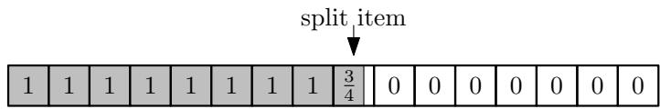  
Figure 4.5: Solution of surrogate LP relaxation

# Algorithm 13 UpperBound

Input: array of items in order of decreasing utility ratio, capacity $c$   
Output: Upper bound   
1: $u b \gets 0$ , $\mathit { z o n s u m p t i o n } \gets 0 , \ i \gets 0$   
2: while (consumption $+$ items[i].weight $\leq c$ )   
3: consumption $\longleftarrow$ consumption + items[i].weight   
4: ub  ub + items[i].profit   
5: $i + +$   
6: }   
7: $f r a c \gets ( c - c o n s u m p t i o n ) / \mathrm { i t e m s } [ \mathrm { i } ] . \mathrm { w e i g h t }$   
8: ub  ub + items[i].profit $^ *$ frac   
9: consumption  c   
10: return ub

Figure 4.5 depicts the structure of of the solution of the surrogate LP relaxation. The values in this example were chosen randomly. The bound derived from the surrogate LP relaxation is a global upper bound for the optimal value of the original MKP. This global bound also represents the starting point to compute local upper bounds during the descent at each level in the Trie. Not only the upper bound but also the structure of the solution is kept in memory for subsequent computation of upper bounds.

Following the path to the left or the right child of a node during the descent in the Trie corresponds to fixing the item represented by the current level in the Trie to 0 or 1 respectively. Note that the order in which the items correspond to Trie levels does not necessarily correspond to the order which was taken for the computation of the upper bound where the items were sorted according to decreasing utility ratios. The order of the items in the Trie may even vary between different branches of the Trie as described in section 4.6. To update the upper bound at each level we have to distinguish two cases:

• Fixing an item to 1 (next node is right child) • Fixing an item to 0 (next node is left child)

# Fixing an Item to 1

When fixing an item to 1, again two cases need to be distinguished. Either the item to be fixed to 1 is already included in the current solution of the surrogate LP relaxation or it is not included. In the first case, there is nothing left to do except marking the item as fixed so that this item will not be touched any more during the calculation of upper bounds of subproblems. In the second case however the item has to be added and marked as fixed in the solution of the surrogate LP relaxation. Since the surrogate Knapsack constraint is violated when adding any item to the solution, other items have to be removed, so that the constraint is satisfied. The items to be removed are chosen by ascending utility ratio. Note that only items that have not yet been marked as fixed may be removed. In the visualization of the upper bound the split item will move to the left as illustrated in Figure 4.6.

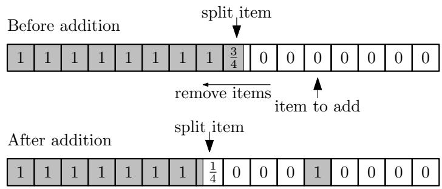  
Figure 4.6: Updating the upper bound after adding an item

# Fixing an Item to 0

The procedure for fixing an item to 0 resembles the procedure for adding an item. If the item to be fixed to 0 is not contained in the current solution of the surrogate LP relaxation nothing has to be done but marking the item as fixed. If the item to be fixed to 0 is included in the current surrogate LP solution it has to be removed and marked as fixed and thus the Knapsack constraint is over satisfied and other items need to be added so that there is no slack in the constraint. Items according to decreasing utility ratios are added, starting from the split item, as long as the constraint is satisfied. Note that only items that have not yet been marked as fixed may be added. Figure 4.7 depicts this process.

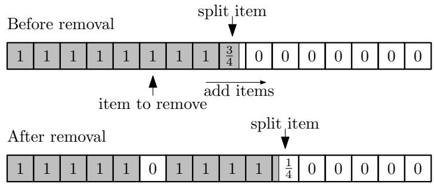  
Figure 4.7: Updating the upper bound after removing an item

# 4.5.3 Applying the Bounds to Reduce Search Space

Section 4.4 explains how every solution that is inserted in the Trie (whether it is feasible, infeasible or a boundary solution) is marked at the highest possible level. Incorporating the knowledge of an upper bound and the best solution found so far (global lower bound) at each level of the Trie makes it easy to decide for each solution at each level in the Trie whether the sub Trie may contain better solutions than the best solution found so far. Walking down the levels from the root, the upper bound is calculated incrementally and as soon as the upper bound gets smaller than the global lower bound the solution is marked at this node and the sub Trie is cut off. In this case sub Tries can be eliminated even though there still may exist many unvisited boundary solutions. But all boundary solutions that are located in this sub Trie are worse than the best solution found so far. This approach is a kind of a hybridization of Branch and Bound and Genetic Algorithms. To save computation time the global upper bound is only computed once and for each new solution the data structures needed to perform the incremental calculation are populated with a copy of the initial upper bound.

# 4.6 Mapping of Trie Levels to Items

The order in which the items of a solution correspond to the levels of the Trie can have a large influence on the generation of alternate solutions. The search algorithm presented in section 4.3 has some greedy like behavior. It tries to pack the first item of a non-boundary solution it encounters on the way down from the root along the path described by the chromosome. Therefore items with a high utility ratio should be tried first before attempting to pack items with a low utility ratio. The naive approach maps the item with the highest utility ratio to the highest level in the Trie and the item with the lowest utility ration to the lowest level in the Trie.

# 4.6.1 Random Order

Another approach to map Trie levels to items is a distinct pseudo random order for each path in the Trie. Clearly the root can only correspond to a single item. The mapping of the second level of the Trie depends on the value of the item corresponding to the root of the Trie in a pseudo random manner. The mapping of level $n$ depends on the value of all items represented by levels smaller than $n$ . Therefore, for two different chromosomes that share the same prefix of length $l$ , the first $l + 1$ levels in the Trie of the paths corresponding to the chromosomes will map to the same items and from level $l + 2$ the mapping will be different for both chromosomes. For two different chromosomes that do not share any prefix still the root maps to the same item. Figure 4.8 depicts an example of a complete Trie for an instance size of $n = 5$ with random order. The numbers in the nodes denote the item that corresponds to the node. It is noted here that the number of the item that corresponds to a node is not stored in a Trie node since it can be computed with the information given by the path to the node. This will be explained in more detail in section 5.3

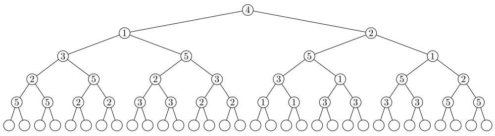  
Figure 4.8: A complete solution archive in random order

# 4.6.2 Partial Random Order

To combine the advantages of a random order and the decreasing order according to utility ratios a hybrid approach was chosen. Only items that are in the core (see section 2.2.2) are mapped pseudo randomly to Trie levels. Items with a utility ratio greater than for the ones in the core will get mapped to the highest levels according to decreasing utility ratios and items with a lower utility ratio will get mapped to the lowest levels in the Trie. That way the search algorithm tries to add items with a high utility ratio first. For items with a medium ratio the order in which the items are tried to be added varies. Items with a low utility ratio are checked last whether they can be added.

# Chapter 5

# Implementation Details

The archive enhanced genetic algorithm was implemented in C++. For the part of the genetic algorithm a well suited generic library for Evolutionary Algorithms (ealib) was used. In this section the focus lies on the implementation of the Trie based solution archive.

# 5.1 Data Structures

The Trie is implemented as a singleton class that contains the complete Trie as well as the declaration and definition of the Trie-node type. To keep memory consumption as low as possible a Trie-node consists only of two pointers – one for the left and one for the right child. It is noted here that no additional data needs to be stored in the Trie, because the structure of the Trie itself contains all information that is needed. Thus on a 32 bit processor one Trie node occupies 8 bytes of memory.

# 5.2 Memory Management

During the insertion of chromosomes in the Trie a large number of Trienodes is allocated and deallocated. Each time the marking procedure marks a solution at a node located at a higher level than the leaf-node, all nodes beyond the marked node have to be freed from memory. If the sibling of the node that is marked has already been marked before the parent node gets marked and freed and this procedure is performed recursively. Thus a large amount of Trie-nodes (that are of uniform size) will be allocated and freed from memory.

# 5.2.1 Drawbacks of Conventional Memory Management

During the runtime of the genetic algorithm several thousand solutions get inserted into the solution archive and regions of the Trie that correspond to completely evaluated regions of the search space get freed from memory. Thus, millions of nodes get allocated and deallocated. Even though the memory management subsystem of a modern operating system is very efficient this special case can be handled much more efficiently with a customized memory management than by a general purpose memory management. Experimental results have shown that for large instances the waste of memory introduced by the memory management can be up to 50% and more.

# 5.2.2 Customized Memory Management

Since the memory requirements of the Trie are a special case (all nodes have the same size and structure) and thus the overhead of a general purpose management can be significant as described in the previous section, a customized memory management that handles this special case without overhead is desired. The fact, that most operators in C++ including the new and delete operators can be overloaded globally of for certain types, facilitates the implementation of a special memory management for the Trie. The requirements for this memory management are very simple and straight forward:

• only Trie-nodes of equal size need to be allocated and freed from memory   
the allocation and freeing of one Trie-node should have a worst case runtime of $O ( 1 )$   
• the size of the data structures needed by the memory management should be very small so that ideally no memory gets wasted   
• many cycles of allocation and deallocation phases should not degrade the performance of the memory management

A pool-based memory management satisfies all these requirements. A pool of fixed size is allocated before the genetic algorithm is started and all Trienodes that are allocated are taken from the pool. The freed Trie nodes are kept in a linked list. Note that no external linked list is used but rather the freed Trie nodes are used as list items that are arranged in the linked list. Three pointers are used to manage the memory pool:

head: The head of the linked list, in which the freed nodes are managed. Note that only nodes that once have been allocated and have been freed again are managed in this list.   
first: The first unused Trie-node of the memory pool, that has not yet been used in the Trie.   
last: The last Trie-node in the pool.

# Initialization of Memory Pool

The memory pool is initialized before the genetic algorithm runs. An array of Trie-nodes is allocated where the number of Trie-nodes in the array is calculated as bpoolsize/sizeof(TrieNode)c. The first pointer gets assigned the address of the first element of the array, the last pointer is initialized with the address of the last element of the array and the head pointer is set to NULL.

# Allocation of a Trie-Node

The allocation of a Trie-node is performed by a small procedure that returns a pointer to a free Trie-node within a constant runtime. Algorithm 14 illustrates this procedure. The use of the first pointer is to use the memory pool without iterating through all Trie-nodes and arranging them in a linked list during initialization phase. Instead the pool consists of two parts: A linked list of free Trie-nodes and an uninitialized memory area. After initialization of the pool the linked list is empty while during runtime both parts can contain free Trie-nodes, but nodes are only allocated from the uninitialized area if the linked list is empty. If all Trie-nodes have been allocated and the genetic algorithm requests the allocation of another node an error is returned.

# Algorithm 14 Allocate

Output: Pointer to a Trie-node   
1: node $=$ NULL   
2: if (head ! $\ ! =$ NULL)   
3: node $=$ head   
4: hea $\mathtt { d } = \mathtt { h e a d - }$ >right   
5: return node   
6: } else $\{$   
7: if (first > last)   
8: return ERROR // out of memory   
9: }   
10: n ${ \mathrm { o d e } } = \mathbf { f i r s }$ t   
11: first $=$ first $\textbf { + } 1 / /$ Advance first to the next Trie-node in the   
pool   
12: return node   
13: }

# Freeing a Trie-Node

A node, that gets freed by the marking procedure, is recycled by inserting it at the head of the linked list. Algorithm 15 illustrates this procedure in a

C-like pseudo code syntax.

<table><tr><td>Algorithm 15 Free</td></tr><tr><td>Input: Pointer p to Trie-node to be freed</td></tr><tr><td>1: p-&gt;right = head</td></tr></table>

# 5.2.3 Considerations for 32 versus 64 Bit

The address space of 32 bit systems is limited to 4 GB. Since on a 32 bit processor each pointer has a size of 32 bit and thus each Trie node occupies 8 bytes no more than $2 ^ { 2 9 }$ (approximately 500 million) Trie nodes could be allocated theoretically. The actual number is smaller, since user space processes usually have an address space limited to 3 GB. The advantage of 64 bit architectures is the increased size of address space but that comes with the drawback that pointers occupy 64 bit and thus on a 64 bit architecture each Trie node occupies 16 bytes, twice the amount as on 32 bit processors. A modification of the customized memory management can overcome this drawback and keep the size of each Trie node at 8 byte. Instead of storing two 64 bit pointers in each Trie node two 32 bit indices are sufficient to address $2 ^ { 3 2 }$ Trie nodes each 8 bytes of size. The 32 bit index references a Trie node in the node pool maintained by the memory management. Thus, on 64 bit systems with less than 32 GB memory this enhancement can handle twice as many Trie nodes as with standard 64 bit pointers.

# 5.3 Implementation of Random Ordering

Section 4.6 discusses the various approaches how to map the levels of the Trie to the items of a problem instance including a random mapping for the different paths in the Trie. This section discusses the details how to implement such a random mapping.

Each time a new chromosome is inserted into the Trie a new mapping of Trie levels to items is computed based on the values of the genes of the chromosome. Clearly two identical chromosomes will yield the same mapping. An integer value is computed and updated incrementally for each level during the descent from the root along a given path in the Trie and stored in an array. This integer value together with the value of an item’s variable is used to determine the item that will get mapped to the next level in the Trie on a path. The mapping for all Trie levels is stored in an array that has to be initialized for each new chromosome with the values $[ 1 , 2 , 3 , \ldots , n ]$ . Algorithm 16 shows this procedure in pseudo code. The $\ll$ operator denotes a left-shift and the  operator denotes bitwise ‘or’. The function ‘pseudoRandomFunc’ computes a pseudo random value from two integer parameters.

The parameter seed in this algorithm denotes a random value, that is not changed during the runtime of the program. This procedure can easily be changed to compute a random mapping to Trie levels for all items, not only for the items in the core.

# Algorithm 16 GetItemForLevel

Input: chromosome $x$ representing a solution vector, Trie level $i$ for whi   
to obtain item   
Output: index in $x$ that will map to Trie level $i$   
1: $r \gets 1$   
2: if $i > 0$ ) $\{$   
3: $r \gets \mathrm { r a n d 0 r d e r P a t t e r n } | i |$   
4: $r  ( r \ll 1 ) | x [ i - 1 ]$   
5:   
6: ra $\mathrm { _ { 1 d O r d e r P a t t e r n } } [ i ]  r$   
7: if $( c o r e S t a r t \le i \le c o r e E n d$ ) $\{$   
8: // compute a random index in range $i \leq i n d e x \leq c o r e E n d$   
9: $i n d e x \gets$ pseudoRandomFunc(seed, r) mod $( c o r e E n d + 1 - i )$   
10: $i n d e x \gets i n d e x + i$   
11: // swap item $i$ and index in geneOrder array   
12: $h \gets \mathrm { g e n e O r d e r } [ i n d e x ]$   
13: $\mathrm { g e n e O r d e r } [ i n d e x ] \gets \mathrm { g e n e O r d e r } [ i ]$   
14: geneOrder[i]  h   
15: }   
16: return geneOrder[i]

# 5.4 Usage

This section provides a detailed description on the usage of the program. All parameters that are relevant for the solution archive are described. Furthermore the most important parameters of the EAlib are discussed. A detailed description of all parameters of the EAlib can be found in the documentation of the ealib. The usage of the program is as follows:

TrieMKP [parameters]

parameters is a string that contains key/value pairs for each parameter that should be set. If a parameter is not specified in the string the default value of the parameter is used. A ‘ $@$ ’ followed by a filename specifies that the file contains parameters. The command line may contain key/value pairs to set parameters as well as a file containing further parameters and their values. The following parameters influence the behavior of the archive.

PoolSize: Possible values: A positive integer specifying the amount of memory to be allocated for the node pool. The integer may be followed by one of the characters [KMG] which denotes kilobytes, megabytes and gigabytes respectively. 512M specifies a pool size of 512 megabytes. The default value is 512M.

coreSize: Possible values: Any real number in the interval $\lfloor 0 , 1 \rfloor$ that specifies the size of the core as ratio of the number of items. A value of 0.1 indicates that $1 0 \%$ of the items before the center and $1 0 \%$ beyond the center of the core will be included in the core and thus the core size is $2 0 \%$ of the items. The standard value is 0.15

TrieOrder: Possible values: -1, $0$ , 1 and 2. This parameter specifies the order in which the levels of the Trie correspond to items of the problem instance. The value -1 stands for ascending utility ratios, 1 for decreasing utility ratios, 2 for decreasing utility ratios outside the core and random order within the core and 0 denotes the order in which the items are specified in the input file. The default value is 1.

bnbHybrid: Possible values: 0 and 1. This parameter indicates whether upper bounds should be computed to eliminate regions from the Trie that have a smaller upper bound than the global lower bound. The default value is 0.

useTrie: Possible values: 0 and 1. It indicates whether the solution archive should be used or not. The default value is 1 to use the Trie.

diffstat: Possible values: 0 and 1. It specifies whether a difference file should be generated that indicates how often each item has been removed or added by the find alternate procedure.

The following list explains the parameters that are relevant for the genetic algorithm and are not related to the archive.

usePSR: Possible values: 0 and 1. Indicates whether the items should be ordered according to utility ratios for the repair operator. The default value is 1.

instanceFile: Possible values: A string indicating the file name of the instance file. No default value given.

instancePath: Possible values: A string indicating the name of the directory where the instance file is located. No default value given.

oname: Possible values: A string indicating the base filename without extensions for all output files. ‘ $@$ ’ is the default value which indicates the use of the standard output.

odir: Possible values: A string indicating the base directory for all output files. No default value given.

statext: Possible values: A string that describes the extension for the statistics file. Default value is ‘.stat’.

outputstat: Possible values: 0 and 1. Specifies whether a statistics file should be generated.

popsize: Possible values: An integer in the range [1,10000000] specifying the size of the population which is 100 by default.

tgen: Possible values: An integer in the range [0,100000000] indicating the number of iterations the genetic algorithm should perform.

plocim: Possible values: A real value in the interval [0,1] indicating the probability for applying the repair operator to a chromosome. The default value is 0.

dcdag: Possible values: 0 and 1. This parameter specifies whether duplicates should be discarded. This parameter does not have any effect, if the archive is used (see parameter useTrie). The default value is 0.

solveCore: Possible values: 0 and 1. If the value is 1 only the core will be solved by the genetic algorithm. All items outside the core will be fixed to 1 and 0.

# Chapter 6

# Experimental Results

To investigate the influence of the Trie based archive on the quality of the solutions, tests on different sets of instances were performed. This chapter discusses the results that were obtained with the tests.

# 6.1 Test Instances

The first set of instances that was used in the experiments is taken from Beasley’s OR-Library [Bea90] which is available online. This library contains a set of 270 test instances with different values for $m$ and $n$ which have been widely used as benchmarks in literature. The values for $m$ are 5, 10 and 30 and the values for $n$ are 100, 250, 500. For each of the 9 combination of values $m$ and $n$ 30 instances were generated as follows: The resource consumptions $a _ { i j }$ were drawn randomly from uniform distribution in the range (0,1000). The right-hand side coefficients (the capacities of the knapsack) $b _ { i }$ were computed as

$$
b _ { i } = \alpha \sum _ { j = 1 } ^ { m } a _ { i j }
$$

where $\alpha$ is a tightness ratio which is set to 0.25, 0.5 and 0.75. The 30 instances for each combination of $m$ and $n$ were generated with the three different tightness ratios. For each ratio ten instances were generated. The profits $p _ { j }$ were correlated to the values $a _ { i j }$ and computed as follows:

$$
p _ { j } = \sum _ { i = 1 } ^ { m } a _ { i j } / m + 5 0 0 q _ { j }
$$

where $q _ { j }$ is a uniformly distributed real number in the range (0,1).

A second set of test instances was generated with a procedure proposed by Osorio et al. [OGH02] which produces very hard test instances. The generation of the instances is similar to the method Beasley used. The

integer values $a _ { i j }$ are drawn from the exponential distribution

$$
a _ { i j } = 1 - 1 0 0 0 \mathrm { l n } ( U ( 0 , 1 ) )
$$

where $U ( 0 , 1 )$ is a real number drawn from the continuous uniform generator. The right-hand side coefficients are computed in the same way as for the problems in the OR-Library described above. Again the value $\alpha$ was chosen to be 0.25, 0.5 and 0.75. The profits were correlated to the resource consumptions and computed as follows:

$$
p _ { j } = 1 0 \left( \sum _ { i = 1 } ^ { m } a _ { i j } / m \right) + 1 0 U ( 0 , 1 )
$$

where $U ( 0 , 1 )$ is a real number drawn from the continuous uniform generator.

While the smallest test-instances instances of Beasley’s OR-Library (instances with $n = 1 0 0$ , $m = 5$ and $\alpha = 0 . 2 5$ ) can be solved to optimality with CPLEX 11 within 4 seconds and the genetic algorithm finds the optimal solution within tenths of a second, the procedure of Osorio et. al. explained above generates instances that are very hard to solve. For example, an instance with $n = 1 0 0$ , $m = 5$ and $\alpha = 0 . 2 5$ cannot be solved within 1000 seconds with CPLEX 11 on the same machine and the genetic algorithm does not find the optimal solution.

# 6.2 Results for large problems

The 30 largest instances of the OR-Library with 500 items and 30 constraints as well as 36 problems of varying size that were generated with Osorio’s method were solved with the the archive enhanced genetic algorithm as well as the original algorithm. For each instance 50 runs with $1 0 ^ { 6 }$ iterations each were performed on each of the selected 66 test instances. Both algorithms were used with the same parameters (population size of 100, binary tournament selection and steady state replacement of the worst chromosome). For the solution archive a partial random mapping of items to Trie levels as described in section 4.6.2 and 5.3 was used. The parameter coreSize was set to 0.15.

Table 6.1 shows the results for the 30 largest instances from the ORLibrary. For both, the genetic algorithm without archive as well as the archive enhanced version, the $\%$ -gaps $( 1 0 0 ( O P T _ { L P } - O P T _ { G A } ) / O P T _ { L P } )$ relative to the solution of the LP relaxation of the best objective value as well as for the median and mean objective value over the 50 runs is given. Bold face text highlights the better value (smaller gap). The column ‘min’ gives the percentage gap of the best solution out of 50 runs, the columns ‘median’ and ‘mean’ give percentage gap of the median and mean objective values out of 50 runs. The last columns for each variant give the standard deviation out of the 50 runs. The results show that the best objective value does not improve on the majority of instances but the median objective value improves on 23 out of 30 instances. Only one instance shows a lower median objective value for the archive enhanced version than for the original algorithm. A Wilcoxon signed-rank test on the median objective values which delivers a p-value of $2 . 2 5 \times 1 0 ^ { - 6 }$ clearly confirms that the objective values obtained with the solution archive are greater than without archive. The last 3 lines give average values over 10 instances with the same $\alpha$ values.

Table 6.1: Percentage gaps for 30 instances (each 50 runs) of Beasley’s OR-Library with $n = 5 0 0$ and $m = 3 0$   

<table><tr><td colspan="2" rowspan="2">prob.</td><td rowspan="2">α</td><td colspan="4">GA</td><td colspan="4">GA with Trie</td></tr><tr><td>min</td><td>median</td><td>mean</td><td>dev</td><td>min</td><td>median</td><td>mean</td><td>dev</td></tr><tr><td></td><td>0 0.25</td><td>0.6140</td><td></td><td>0.6568</td><td>0.6602</td><td>0.0239</td><td>0.5188</td><td>0.6517</td><td>0.6459</td><td>0.0449</td></tr><tr><td></td><td>1</td><td>0.25</td><td>0.5800</td><td>0.6095</td><td>0.6175</td><td>0.0305</td><td>0.5800</td><td>0.6095</td><td>0.6204</td><td>0.0265</td></tr><tr><td></td><td>2</td><td>0.25</td><td>0.5807</td><td>0.6745</td><td>0.6646</td><td>0.0402</td><td>0.5807</td><td>0.6429</td><td>0.6496</td><td>0.0425</td></tr><tr><td></td><td>3</td><td>0.25</td><td>0.6084</td><td>0.6636</td><td>0.6677</td><td>0.0250</td><td>0.6118</td><td>0.6636</td><td>0.6673</td><td>0.0229</td></tr><tr><td></td><td>4</td><td>0.25</td><td>0.5768</td><td>0.6084</td><td>0.6122</td><td>0.0184</td><td>0.5119</td><td>0.6084</td><td>0.6073</td><td>0.0250</td></tr><tr><td></td><td>5</td><td>0.25</td><td>0.6131</td><td>0.6587</td><td>0.6624</td><td>0.0253</td><td>0.6286</td><td>0.6312</td><td>0.6496</td><td>0.0280</td></tr><tr><td></td><td>6</td><td>0.25</td><td>0.4435</td><td>0.6545</td><td>0.6458</td><td>0.0619</td><td>0.5516</td><td>0.6371</td><td>0.6432</td><td>0.0397</td></tr><tr><td></td><td>7</td><td>0.25</td><td>0.5144</td><td>0.5728</td><td>0.5678</td><td>0.0300</td><td>0.5144</td><td>0.5667</td><td>0.5670</td><td>0.0308</td></tr><tr><td></td><td>8</td><td>0.25</td><td>0.4173</td><td>0.6079</td><td>0.5901</td><td>0.0806</td><td>0.4173</td><td>0.5657</td><td>0.5485</td><td>0.0964</td></tr><tr><td></td><td>9 0.25</td><td></td><td>0.4800</td><td>0.5879</td><td>0.5747</td><td>0.0728</td><td>0.4800</td><td>0.5768</td><td>0.5463</td><td>0.0647</td></tr><tr><td></td><td>10 0.50</td><td></td><td>0.2637</td><td>0.2788</td><td>0.2877</td><td>0.0124</td><td>0.2555</td><td>0.2779</td><td>0.2801</td><td>0.0096</td></tr><tr><td>11</td><td>0.50</td><td></td><td>0.2086</td><td>0.2626</td><td>0.2616</td><td>0.0222</td><td>0.2086</td><td>0.2607</td><td>0.2558</td><td>0.0218</td></tr><tr><td>12</td><td>0.50</td><td></td><td>0.2302</td><td>0.2828</td><td>0.2809</td><td>0.0145</td><td>0.2302</td><td>0.2736</td><td>0.2725</td><td>0.0146</td></tr><tr><td>13</td><td>0.50</td><td></td><td>0.2356</td><td>0.2672</td><td>0.2736</td><td>0.0143</td><td>0.2237</td><td>0.2645</td><td>0.2666</td><td>0.0148</td></tr><tr><td>14</td><td>0.50</td><td></td><td>0.2330</td><td>0.2580</td><td>0.2627</td><td>0.0140</td><td>0.2145</td><td>0.2538</td><td>0.2568</td><td>0.0131</td></tr><tr><td>15</td><td>0.50</td><td>0.2428</td><td></td><td>0.2701</td><td>0.2726</td><td>0.0166</td><td>0.2304</td><td>0.2669</td><td>0.2634</td><td>0.0132</td></tr><tr><td>16</td><td>0.50</td><td>0.2280</td><td></td><td>0.2714</td><td>0.2676</td><td>0.0171</td><td>0.2280</td><td>0.2705</td><td>0.2595</td><td>0.0192</td></tr><tr><td>17</td><td>0.50</td><td>0.2609</td><td></td><td>0.3065</td><td>0.3064</td><td>0.0176</td><td>0.2715</td><td>0.2996</td><td>0.3005</td><td>0.0150</td></tr><tr><td>18</td><td>0.50</td><td>0.2521</td><td></td><td>0.2796</td><td>0.2729</td><td>0.0187</td><td>0.2466</td><td>0.2760</td><td>0.2726</td><td>0.0190</td></tr><tr><td>19</td><td></td><td>0.2451</td><td></td><td>0.2785</td><td>0.2837</td><td>0.0166</td><td>0.2418</td><td></td><td></td><td>0.0162</td></tr><tr><td>20</td><td>0.50</td><td>0.1310</td><td></td><td>0.1535</td><td>0.1545</td><td>0.0129</td><td></td><td>0.2762</td><td>0.2783</td><td></td></tr><tr><td>21</td><td>0.75</td><td>0.1551</td><td></td><td></td><td></td><td></td><td>0.1310</td><td>0.1423</td><td>0.1491</td><td>0.0157</td></tr><tr><td>22</td><td>0.75</td><td>0.1477</td><td></td><td>0.1734 0.1657</td><td>0.1724 0.1655</td><td>0.0073 0.0055</td><td>0.1518</td><td>0.1664</td><td>0.1690</td><td>0.0058 0.0030</td></tr><tr><td>23</td><td>0.75</td><td>0.1657</td><td></td><td></td><td></td><td></td><td>0.1549</td><td>0.1660</td><td>0.1657</td><td></td></tr><tr><td>24</td><td>0.75</td><td>0.1631</td><td></td><td>0.1832 0.1838</td><td>0.1815 0.1817</td><td>0.0075 0.0117</td><td>0.1545</td><td>0.1776 0.1795</td><td>0.1764 0.1785</td><td>0.0066 0.0105</td></tr><tr><td>25</td><td>0.75</td><td>0.1585</td><td></td><td>0.1740</td><td>0.1730</td><td>0.0027</td><td>0.1608 0.1585</td><td>0.1740</td><td>0.1715</td><td>0.0046</td></tr><tr><td>26</td><td>0.75</td><td>0.1458</td><td></td><td>0.1665</td><td>0.1666</td><td>0.0058</td><td>0.1521</td><td>0.1659</td><td>0.1654</td><td>0.0062</td></tr><tr><td>27</td><td>0.75</td><td>0.1501</td><td></td><td>0.1648</td><td>0.1650</td><td>0.0025</td><td>0.1501</td><td>0.1648</td><td>0.1642</td><td>0.0038</td></tr><tr><td></td><td>0.75</td><td></td><td>0.1706</td><td>0.1712</td><td></td><td>0.0138</td><td>0.1462</td><td>0.1670</td><td>0.1664</td><td>0.0109</td></tr><tr><td>28 29</td><td>0.75</td><td>0.1475</td><td></td><td></td><td></td><td></td><td>0.1627</td><td>0.1700</td><td>0.1776</td><td>0.0100</td></tr><tr><td></td><td>0.75 0.25</td><td>0.1690</td><td></td><td>0.1700 0.6295</td><td>0.1785 0.6263</td><td>0.0123 0.0409</td><td>0.5395</td><td>0.6154</td><td>0.6145</td><td>0.0421</td></tr><tr><td></td><td>0.50</td><td>0.5428 0.2400</td><td></td><td>0.2756</td><td>0.2770</td><td>0.0164</td><td>0.2351</td><td>0.2720</td><td>0.2706</td><td>0.0157</td></tr><tr><td></td><td>0.75</td><td>0.1534</td><td>0.1706</td><td></td><td>0.1710</td><td>0.0082</td><td></td><td></td><td></td><td></td></tr><tr><td></td><td></td><td></td><td></td><td></td><td></td><td></td><td>0.1523</td><td>0.1674</td><td>0.1684</td><td>0.0077</td></tr></table>

Table 6.2 shows the results for 36 instances generated with Osorio’s method with varying values for $n$ , $m$ and $\alpha$ . The results are a little bit less satisfactory than for the 30 largest instances of the OR-Library but still for 25 out of 36 instances the median objective gap of 50 runs decreased and only for 7 instances it increased. As for the 30 OR-Library instances a Wilcoxon signed rank test shows that the solution archive leads to better solutions. The p-value obtained by the Wilcoxon signed rank test is 0.00156 which indicates a very high significance level.

Table 6.2: Results for 36 instances with varying values $n$ , $m$ and $\alpha$   

<table><tr><td colspan="2" rowspan="2"></td><td colspan="4">GA</td><td colspan="4">GA with Trie</td></tr><tr><td rowspan="2">m</td><td colspan="3">median</td><td rowspan="2"></td><td colspan="2">median</td><td rowspan="2">dev</td></tr><tr><td>α</td><td>min</td><td>mean</td><td>dev</td><td>min</td><td>mean</td></tr><tr><td>50 5 0.25</td><td></td><td>0.3576</td><td>0.6317</td><td>0.6268</td><td>0.0996</td><td>0.2941</td><td>0.4420</td><td>0.4715</td><td>0.0509</td></tr><tr><td></td><td>0.50</td><td>0.1086</td><td>0.2445</td><td>0.2403</td><td>0.0364</td><td>0.1086</td><td>0.1979</td><td>0.2097</td><td>0.0412</td></tr><tr><td></td><td>0.75</td><td>0.1372</td><td>0.2294</td><td>0.2256</td><td>0.0594</td><td>0.1372</td><td>0.2294</td><td>0.2178</td><td>0.0434</td></tr><tr><td></td><td>10 0.25</td><td>1.6866</td><td>1.6866</td><td>1.9365</td><td>0.4260</td><td>1.6866</td><td>1.6866</td><td>1.6866</td><td>0.0000</td></tr><tr><td></td><td>0.50</td><td>0.7862</td><td>1.1284</td><td>1.2662</td><td>0.1744</td><td>1.1284</td><td>1.3562</td><td>1.3339</td><td>0.1726</td></tr><tr><td></td><td>0.75</td><td>0.6580</td><td>1.0607</td><td>1.0237</td><td>0.1711</td><td>0.5854</td><td>1.0757</td><td>1.0276</td><td>0.1756</td></tr><tr><td></td><td>30 0.25</td><td>10.9797</td><td>10.9797</td><td>10.9797</td><td>0.0000</td><td>10.9797</td><td>10.9797</td><td>10.9797</td><td>0.0000</td></tr><tr><td></td><td>0.50</td><td>5.8676</td><td>6.2558</td><td>6.2383</td><td>0.1957</td><td>5.6330</td><td>6.2172</td><td>6.1574</td><td>0.1947</td></tr><tr><td></td><td>0.75</td><td>4.0682</td><td>4.0936</td><td>4.1804</td><td>0.1149</td><td>4.0682</td><td>4.0936</td><td>4.1261</td><td>0.0612</td></tr><tr><td></td><td>100 5 0.25</td><td>0.0917</td><td>0.1955</td><td>0.1915</td><td>0.0398</td><td>0.0625</td><td>0.1634</td><td>0.1465</td><td>0.0487</td></tr><tr><td></td><td>0.50</td><td>0.0433</td><td>0.0961</td><td>0.0959</td><td>0.0224</td><td>0.0490</td><td>0.0894</td><td>0.0875</td><td>0.0143</td></tr><tr><td></td><td>0.75</td><td>0.0475</td><td>0.0837</td><td>0.0824</td><td>0.0169</td><td>0.0434</td><td>0.0824</td><td>0.0823</td><td>0.0137</td></tr><tr><td></td><td>10 0.25</td><td>0.9280</td><td>1.2266</td><td>1.1988</td><td>0.1063</td><td>0.8376</td><td>1.1739</td><td>1.1103</td><td>0.1484</td></tr><tr><td></td><td>0.50</td><td>0.4263</td><td>0.6159</td><td>0.6148</td><td>0.0916</td><td>0.4162</td><td>0.6008</td><td>0.6175</td><td>0.0857</td></tr><tr><td></td><td>0.75</td><td>0.2841</td><td>0.4095</td><td>0.4233</td><td>0.0497</td><td>0.2978</td><td>0.4257</td><td>0.4334</td><td>0.0469</td></tr><tr><td></td><td>30 0.25</td><td>4.4828</td><td>5.1569</td><td>5.0773</td><td>0.2673</td><td>4.4532</td><td>4.8842</td><td>5.0136</td><td>0.2546</td></tr><tr><td></td><td>0.50</td><td>2.4802</td><td>2.6906</td><td>2.6947</td><td>0.1095</td><td>2.3681</td><td>2.6926</td><td>2.6780</td><td>0.1322</td></tr><tr><td></td><td>0.75</td><td>1.5064</td><td>1.7381</td><td>1.7296</td><td>0.0795</td><td>1.5610</td><td>1.7663</td><td>1.7724</td><td>0.0810</td></tr><tr><td>250 5 0.25</td><td></td><td>0.0246</td><td>0.0486</td><td>0.0477</td><td>0.0098</td><td>0.0281</td><td>0.0474</td><td>0.0462</td><td>0.0099</td></tr><tr><td></td><td>0.50</td><td>0.0175</td><td>0.0296</td><td>0.0306</td><td>0.0068</td><td>0.0134</td><td>0.0295</td><td>0.0283</td><td>0.0063</td></tr><tr><td></td><td>0.75</td><td>0.0148</td><td>0.0253</td><td>0.0249</td><td>0.0058</td><td>0.0100</td><td>0.0231</td><td>0.0224</td><td>0.0043</td></tr><tr><td></td><td>10 0.25</td><td>0.2680</td><td>0.3886</td><td>0.3771</td><td>0.0497</td><td>0.2388</td><td>0.3522</td><td>0.3472</td><td>0.0373</td></tr><tr><td></td><td>0.50</td><td>0.1399</td><td>0.2170</td><td>0.2128</td><td>0.0275</td><td>0.1294</td><td>0.2122</td><td>0.2048</td><td>0.0267</td></tr><tr><td></td><td>0.75</td><td>0.1030</td><td>0.1553</td><td>0.1529</td><td>0.0202</td><td>0.0977</td><td>0.1532</td><td>0.1532</td><td>0.0178</td></tr><tr><td></td><td>30 0.25</td><td>1.5083</td><td>1.7663</td><td>1.7497</td><td>0.1096</td><td>1.5155</td><td>1.7062</td><td>1.7042</td><td>0.0963</td></tr><tr><td></td><td>0.50</td><td>0.7885</td><td>0.8779</td><td>0.8808</td><td>0.0367</td><td>0.7234</td><td>0.8716</td><td>0.8675</td><td>0.0497</td></tr><tr><td></td><td>0.75</td><td>0.5283</td><td>0.6380</td><td>0.6366</td><td>0.0407</td><td>0.5402</td><td>0.6235</td><td>0.6194</td><td>0.0306</td></tr><tr><td>500 5 0.25</td><td></td><td>0.0192</td><td>0.0318</td><td>0.0322</td><td>0.0071</td><td>0.0192</td><td>0.0343</td><td>0.0337</td><td>0.0065</td></tr><tr><td></td><td>0.50</td><td>0.0117</td><td>0.0207</td><td>0.0207</td><td>0.0036</td><td>0.0106</td><td>0.0213</td><td>0.0213</td><td>0.0042</td></tr><tr><td></td><td>0.75</td><td>0.0067</td><td>0.0148</td><td>0.0151</td><td>0.0030</td><td>0.0097</td><td>0.0143</td><td>0.0146</td><td>0.0026</td></tr><tr><td>10 0.25</td><td></td><td>0.1230</td><td>0.1747</td><td>0.1747</td><td>0.0255</td><td>0.1250</td><td>0.1664</td><td>0.1686</td><td>0.0224</td></tr><tr><td></td><td>0.50</td><td>0.0623</td><td>0.1007</td><td>0.0993</td><td>0.0127</td><td>0.0613</td><td>0.0945</td><td>0.0936</td><td>0.0158</td></tr><tr><td></td><td>0.75</td><td>0.0552</td><td>0.0709</td><td>0.0711</td><td>0.0074</td><td>0.0530</td><td>0.0706</td><td>0.0713</td><td>0.0087</td></tr><tr><td>30 0.25</td><td></td><td>0.7392</td><td>0.8221</td><td>0.8232</td><td>0.0369</td><td>0.6783</td><td>0.7997</td><td>0.7990</td><td>0.0460</td></tr><tr><td></td><td>0.50</td><td>0.3703</td><td>0.4272</td><td>0.4273</td><td>0.0262</td><td>0.3537</td><td>0.4246</td><td>0.4202</td><td>0.0218</td></tr><tr><td></td><td>0.75</td><td>0.2475</td><td>0.2878</td><td>0.2850</td><td>0.0149</td><td>0.2160</td><td>0.2841</td><td>0.2825</td><td>0.0185</td></tr></table>

# 6.2.1 Influence of the Archive

Probably the most interesting data regarding the influence of the Trie is the number of chromosomes that are identified as duplicate solutions by the solution archive compared to the number of chromosomes that are identified as duplicates by the original algorithm.

Table 6.3: Statistical data of the Trie for the 30 largest OR-Library instances   

<table><tr><td colspan="2" rowspan="2">prob. α</td><td>GA</td><td colspan="5">GA with Trie</td></tr><tr><td>dups</td><td>dups</td><td>#search</td><td>avg</td><td>dist</td><td>size (M)</td></tr><tr><td>0</td><td>0.25</td><td>83318.00</td><td>632483.92</td><td>704848.04</td><td>1.11</td><td>3.82</td><td>445.45</td></tr><tr><td>1</td><td>0.25</td><td>111363.44</td><td>681331.32</td><td>774951.24</td><td>1.14</td><td>4.08</td><td>411.63</td></tr><tr><td>2</td><td>0.25</td><td>81647.48</td><td>628213.70</td><td>695060.52</td><td>1.11</td><td>3.84</td><td>451.23</td></tr><tr><td>3</td><td>0.25</td><td>81767.14</td><td>651908.88</td><td>742907.38</td><td>1.14</td><td>3.85</td><td>448.02</td></tr><tr><td>4</td><td>0.25</td><td>116309.98</td><td>682474.96</td><td>790248.98</td><td>1.16</td><td>4.06</td><td>402.58</td></tr><tr><td>5</td><td>0.25</td><td>98807.56</td><td>637583.92</td><td>716575.36</td><td>1.12</td><td>3.90</td><td>444.88</td></tr><tr><td>6</td><td>0.25</td><td>77324.12</td><td>618772.38</td><td>685304.30</td><td>1.11</td><td>3.87</td><td>448.79</td></tr><tr><td>7</td><td>0.25</td><td>73864.02</td><td>617336.90</td><td>695867.06</td><td>1.13</td><td>3.84</td><td>459.34</td></tr><tr><td>8</td><td>0.25</td><td>76111.62</td><td>635712.84</td><td>713050.24</td><td>1.12</td><td>3.82</td><td>442.35</td></tr><tr><td>9</td><td>0.25</td><td>76103.44</td><td>645388.90</td><td>734563.32</td><td>1.14</td><td>3.95</td><td>414.29</td></tr><tr><td>10</td><td>0.50</td><td>92283.92</td><td>597734.28</td><td>678933.64</td><td>1.14</td><td>3.68</td><td>428.54</td></tr><tr><td>11</td><td>0.50</td><td>73484.26</td><td>563934.98</td><td>637799.72</td><td>1.13</td><td>3.64</td><td>434.12</td></tr><tr><td>12</td><td>0.50</td><td>71452.48</td><td>548125.78</td><td>608071.56</td><td>1.11</td><td>3.65</td><td>450.65</td></tr><tr><td>13</td><td>0.50</td><td>89764.88</td><td>612031.80</td><td>698584.34</td><td>1.14</td><td>3.87</td><td>407.62</td></tr><tr><td>14</td><td>0.50</td><td>76969.40</td><td>582331.62</td><td>656473.64</td><td>1.13</td><td>3.71</td><td>418.26</td></tr><tr><td>15</td><td>0.50</td><td>65925.24</td><td>524119.26</td><td>576290.42</td><td>1.10</td><td>3.61</td><td>433.42</td></tr><tr><td>16</td><td>0.50</td><td>72919.68</td><td>592526.56</td><td>664817.00</td><td>1.12</td><td>3.72</td><td>416.59</td></tr><tr><td>17</td><td>0.50</td><td>73945.14</td><td>534652.58</td><td>598622.52</td><td>1.12</td><td>3.64</td><td>451.86</td></tr><tr><td>18</td><td>0.50</td><td>92314.68</td><td>603465.22</td><td>672590.80</td><td>1.11</td><td>3.69</td><td>417.49</td></tr><tr><td>19</td><td>0.50</td><td>76255.92</td><td>564597.96</td><td>626619.96</td><td>1.11</td><td>3.65</td><td>432.63</td></tr><tr><td>20</td><td>0.75</td><td>77026.36</td><td>522614.88</td><td>578740.34</td><td>1.11</td><td>3.59</td><td>364.60</td></tr><tr><td>21</td><td>0.75</td><td>70894.14</td><td>503240.64</td><td>560133.10</td><td>1.11</td><td>3.58</td><td>390.13</td></tr><tr><td>22</td><td>0.75</td><td>95529.56</td><td>568528.04</td><td>643227.52</td><td>1.13</td><td>3.66</td><td>350.34</td></tr><tr><td>23</td><td>0.75</td><td>76955.42</td><td>503260.00</td><td>561089.28</td><td>1.11</td><td>3.55</td><td>385.43</td></tr><tr><td>24</td><td>0.75</td><td>81910.54</td><td>520277.22</td><td>581862.56</td><td>1.12</td><td>3.62</td><td>385.18</td></tr><tr><td>25</td><td>0.75</td><td>147527.50</td><td>595496.56</td><td>677526.62</td><td>1.14</td><td>4.00</td><td>344.50</td></tr><tr><td>26</td><td>0.75</td><td>72259.24</td><td>499527.48</td><td>556369.74</td><td>1.11</td><td>3.57</td><td>386.69</td></tr><tr><td>27</td><td>0.75</td><td>96720.74</td><td>576926.74</td><td>662802.82</td><td>1.15</td><td>3.79</td><td>337.87</td></tr><tr><td>28</td><td>0.75</td><td>78619.66</td><td>502954.02</td><td>557512.60</td><td>1.11</td><td>3.60</td><td>389.13</td></tr><tr><td>29</td><td>0.75</td><td>91783.64</td><td>543085.90</td><td>609946.40</td><td>1.12</td><td>3.63</td><td>375.23</td></tr><tr><td colspan="2">0.25</td><td>87661.68</td><td>643120.77</td><td>725337.64</td><td>1.13</td><td>3.9</td><td>436.86</td></tr><tr><td colspan="2">0.50 0.75</td><td>78531.56</td><td>572352.00</td><td>641880.36</td><td>1.12</td><td>3.69</td><td>429.12</td></tr><tr><td colspan="2"></td><td>88922.68</td><td>533591.15</td><td>598921.1</td><td>1.12</td><td>3.66</td><td>370.91</td></tr></table>

Tables 6.3 and 6.4 show a comparison of the number of duplicates found with the Trie and without Trie. The column ‘#search’ indicates how many times on average for all 50 runs the procedure step3 was called. Since this procedure descends through the Trie from the root to a leaf, the number of calls on this procedure is a good indicator on how well the search for alternative solutions in the Trie works. The column ‘avg’ describes the average number of calls of procedure step3 for each duplicate solution. The low values indicate that for most duplicates that were encountered an alternative solution was found within the first attempt for the 30 OR-Library instances. Earlier tests have shown that the quality of the marking procedure is critical for obtaining low numbers of attempts to find alternative solutions. Without the improvements of the marking procedure that are explained in sections 4.4.2 and 4.4.3 the search for an alternative solution called step3 on average 7 to 8 times.

Table 6.4 clearly shows that the number of duplicates that are identified with the solution archive on instances of the second set with 500 variables is considerably smaller than for the instances of the OR-Library. As shown in 6.1 the instances generated with Osorio’s method are much harder to solve so that for large instances the genetic algorithm does not produce as many duplicate solutions as for instances that are much easier to solve. Clearly, the advantage of the solution archive diminishes if the amount of duplicate solution diminishes.

The column ‘dist’ in Tables 6.3 and 6.4 shows the average Hamming distance of the alternative solutions that are produced by the solution archive.

# Results for Different Variants of the Trie

To analyze the effect of different parameters of the solution archive the 30 OR-Library instances analyzed above have been solved with the Trie enhanced GA with varying parameters. In addition to the variant used above two more settings for the Trie were used:

No random mapping of the items in the core to levels of the Trie but with the calculation of upper bounds.   
• No random mapping of the items in the core and no calculation of upper bounds.

As for all other tests 50 runs for each instance with $1 0 ^ { 6 }$ iterations were performed. The parameters of the genetic algorithm were the same as for the other tests.

As can be seen in Figure 6.1 there are no significant differences in the quality of solutions obtained by the additional two tested variants. For some instances the results do not differ while for some instances the results vary. All variants however deliver better solutions than the genetic algorithm without Trie.

Table 6.5 shows detailed results for the different variants of the Trie. For each of the three variants of the Trie as well as the GA without Trie the median and mean percentage gaps are given as well as the standard deviation. As in Table 6.1 the last three lines give average values over all 10 instances with the same $\alpha$ values.

Table 6.4: Statistical data of the Trie for the 36 instances of Osorio’s method   

<table><tr><td colspan="3"></td><td>GA</td><td colspan="5">GA with Trie</td></tr><tr><td rowspan="2">n</td><td rowspan="2">m</td><td rowspan="2">α</td><td>dups</td><td>dups</td><td>#search</td><td>avg</td><td>dist</td><td>size (M)</td></tr><tr><td>35478.36</td><td>856752.90</td><td>2521855.06</td><td>2.94</td><td>8.77</td><td>25.59</td></tr><tr><td rowspan="11">50 10</td><td rowspan="4">5</td><td>0.25 0.50</td><td>29187.28</td><td>745684.08</td><td>1836846.92</td><td>2.46</td><td>8.34</td><td>28.96</td></tr><tr><td>0.75</td><td>38792.88</td><td>707357.28</td><td>2228341.96</td><td>3.15</td><td>9.29</td><td>24.82</td></tr><tr><td>0.25</td><td>35568.62</td><td>837799.76</td><td>2081991.66</td><td>2.49</td><td>8.80</td><td>23.74</td></tr><tr><td>0.50</td><td>42029.84</td><td>747116.06</td><td>2037171.36</td><td>2.73</td><td>8.82</td><td>32.90</td></tr><tr><td></td><td>0.75</td><td>44496.26</td><td>656465.68</td><td>1330961.52</td><td>2.03</td><td>8.04</td><td>33.34</td></tr><tr><td>30</td><td>0.25</td><td>76922.92</td><td>901677.62</td><td>2327624.32</td><td>2.58</td><td>9.02</td><td>17.15</td></tr><tr><td></td><td>0.50</td><td>53960.38</td><td>713011.06</td><td>1380103.36</td><td>1.94</td><td>6.89</td><td>41.66</td></tr><tr><td></td><td>0.75</td><td>65209.34</td><td>670349.94</td><td>1339664.64</td><td>2.00</td><td>6.86</td><td>44.34</td></tr><tr><td rowspan="3">100 5</td><td>0.25</td><td></td><td></td><td></td><td>2.09</td><td>6.22</td><td>127.02</td></tr><tr><td>0.50</td><td>28922.82 27401.80</td><td>692536.56 581230.34</td><td>1450786.18 1019496.16</td><td>1.75</td><td>5.67</td><td>141.46</td></tr><tr><td>0.75</td><td>31464.26</td><td>551693.34</td><td>1011580.68</td><td></td><td></td><td>83.00</td></tr><tr><td rowspan="11"></td><td>10</td><td></td><td></td><td>717775.90</td><td></td><td>1.83</td><td>6.48 6.67</td><td>96.52</td></tr><tr><td></td><td>0.25</td><td>36338.76</td><td></td><td>1560736.40</td><td>2.17</td><td>6.42</td><td>105.97</td></tr><tr><td></td><td>0.50 0.75</td><td>39949.36</td><td>660486.94</td><td>1203201.46</td><td>1.82</td><td></td><td>107.28</td></tr><tr><td>30</td><td></td><td>42283.64</td><td>561348.22</td><td>883718.64</td><td>1.57</td><td>6.09</td><td></td></tr><tr><td></td><td>0.25</td><td>51749.98</td><td>728263.76</td><td>1181837.84</td><td>1.62</td><td>6.32</td><td>101.14</td></tr><tr><td rowspan="4">250 5</td><td>0.50</td><td>68055.68</td><td>629515.36</td><td>986251.98</td><td>1.57</td><td>6.43</td><td>121.32</td></tr><tr><td>0.75</td><td>65821.96 18072.02</td><td>530230.16</td><td>796006.60</td><td>1.50</td><td>5.54</td><td>117.14</td></tr><tr><td>0.25</td><td></td><td>301002.62</td><td>386175.90</td><td>1.28</td><td>4.93</td><td>512.97</td></tr><tr><td>0.50 0.75</td><td>13954.26 20055.82</td><td>103068.24 304055.02</td><td>124052.28</td><td>1.20</td><td>4.84 5.17</td><td>592.45 393.67</td></tr><tr><td rowspan="10"></td><td>10 0.25</td><td></td><td>31459.28</td><td>538944.42</td><td>376659.84 715887.96</td><td>1.24 1.33</td><td>5.23</td><td>386.84</td></tr><tr><td>0.50</td><td></td><td>26999.60</td><td>266423.06</td><td>328499.82</td><td>1.23</td><td>4.82</td><td>525.59</td></tr><tr><td>0.75</td><td></td><td></td><td></td><td></td><td></td><td>4.71</td><td>419.69</td></tr><tr><td>0.25</td><td></td><td>35798.22 67214.30</td><td>358082.40 665107.00</td><td>465546.28 996964.56</td><td>1.30 1.50</td><td>5.83</td><td>415.85</td></tr><tr><td>30</td><td>0.50</td><td>70303.32</td><td>542723.52</td><td>742162.46</td><td>1.37</td><td>5.43</td><td>397.13</td></tr><tr><td>500</td><td>0.75</td><td>92606.76</td><td>536134.30</td><td>736752.16</td><td></td><td>5.64</td><td>395.53</td></tr><tr><td>5</td><td>0.25</td><td>9177.96</td><td>14253.72</td><td>17231.50</td><td>1.37 1.21</td><td>5.49</td><td>1956.88</td></tr><tr><td></td><td></td><td>9518.66</td><td>13045.96</td><td>16282.82</td><td>1.25</td><td>4.98</td><td>2048.35</td></tr><tr><td>0.75</td><td>0.50</td><td>11192.04</td><td>21707.52</td><td>26883.18</td><td>1.24</td><td>4.24</td><td>1738.31</td></tr><tr><td>10</td><td>0.25</td><td>15178.58</td><td>123108.12</td><td>139303.20</td><td>1.13</td><td>5.36</td><td>1583.87</td></tr><tr><td rowspan="6">30</td><td>0.50</td><td></td><td>13696.88</td><td>50628.92</td><td>58823.16</td><td>1.16</td><td>4.90</td><td>1930.98</td></tr><tr><td>0.75</td><td></td><td>18798.96</td><td>74910.54</td><td>93236.28</td><td>1.24</td><td>4.11</td><td>1432.53</td></tr><tr><td>0.25</td><td></td><td>55974.70</td><td>491466.60</td><td>641861.54</td><td>1.31</td><td>5.70</td><td>1017.70</td></tr><tr><td>0.50</td><td></td><td></td><td>298719.66</td><td>392789.68</td><td></td><td></td><td>1298.03</td></tr><tr><td></td><td></td><td>56932.54</td><td></td><td></td><td>1.31</td><td>5.37</td><td></td></tr><tr><td>0.75</td><td></td><td>81438.40</td><td>359236.86</td><td>497754.12</td><td>1.39</td><td>4.95</td><td>1154.23</td></tr></table>

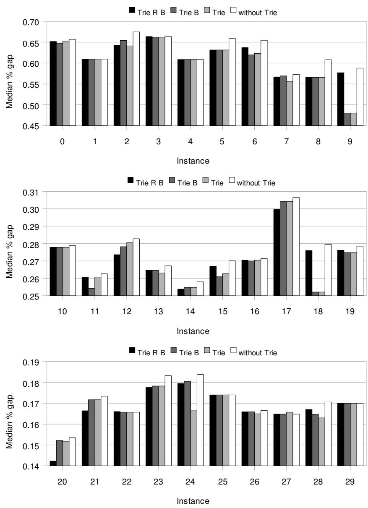  
Figure 6.1: Comparison of different variants of the Trie (Trie R B = with random mapping and upper bounds, Trie $\mathrm { B = }$ only with upper bounds, Trie = only the Trie)

Wilcoxon signed-rank tests on the median objective values obtained by the different variants of the Trie show that there is no significant difference between the three variants of the Trie. The p-values are in the range of 0.1148 to 0.3886 which does not indicate a strong significance compared to the p-values obtained with a Wilcoxon signed-rank test for the Trie variants and the original GA where the p-values are in the range of $1 0 ^ { - 6 }$ to $1 0 ^ { - 5 }$ .

# 6.2.2 Size of the Trie

The size of the Trie is another important performance indicator. The last column of Tables 6.3 and 6.4 shows the average maximum size of the Trie in Megabytes. The difference of the sizes of the Trie for the instances from ORLibrary and the other 500 variable instances is very large. Since the depth of the Trie is defined by the number of items and the number of solutions inserted into the Trie does not vary heavily, the size of the Trie can only differ that much if the structure of the instances and thus the structure of the generated solutions differ.

The size of the Trie is influenced most by the length of the prefix that most solutions share. Figure 6.2 illustrates this phenomenon. Two Tries with each 8 solutions of a problem instance with 6 items are shown. In Figure 6.2a the different solutions do not share a common prefix as they do in Figure 6.2b. Thus the Trie in Figure 6.2a occupies more memory. For problem instances that are strongly correlated (i.e. the profit of an item is correlated to the resource consumption) the utility ratios are less significant than for weakly correlated instances. The more significant the utility ratios are, the higher will the probability be that items with a high utility ratio will be packed. Figure 6.3 shows the utility ratios of all 500 items in decreasing order for two instances of equal size of the two different instance sets. These two plots show how the range of the utility ratios for the different types of instances differs. Obviously the instances of the OR-Library are much less correlated than the Osorio style instances which is a reason why the Osorio style instances are so much harder to solve.

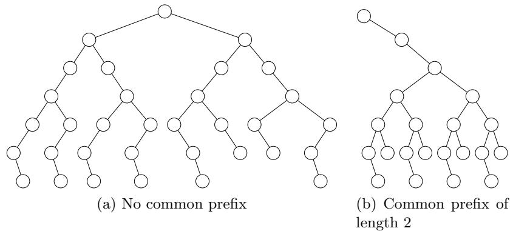  
Figure 6.2: Difference of Trie sizes

20   

<table><tr><td colspan="2"></td><td colspan="3">Trie R B</td><td colspan="3">Trie B</td><td colspan="3">Trie</td><td colspan="3">without Trie</td></tr><tr><td>prob.</td><td>α</td><td>median</td><td>mean</td><td>dev</td><td>median</td><td>mean</td><td>dev</td><td>median</td><td>mean</td><td>dev</td><td>median</td><td>mean</td><td>dev</td></tr><tr><td>0 1</td><td>0.25</td><td>0.6517</td><td>0.6459</td><td>0.0449</td><td>0.6474</td><td>0.6353</td><td>0.0464</td><td>0.6526</td><td>0.6452</td><td>0.0450</td><td>0.6568</td><td>0.6602</td><td>0.0239</td></tr><tr><td></td><td>0.25</td><td>0.6095</td><td>0.6204</td><td>0.0265</td><td>0.6095</td><td>0.6136</td><td>0.0193</td><td>0.6095</td><td>0.6105</td><td>0.0175</td><td>0.6095</td><td>0.6175</td><td>0.0305</td></tr><tr><td></td><td>2 0.25</td><td>0.6429</td><td>0.6496</td><td>0.0425</td><td>0.6540</td><td>0.6558</td><td>0.0413</td><td>0.6412</td><td>0.6418</td><td>0.0342</td><td>0.6745</td><td>0.6646</td><td>0.0402</td></tr><tr><td></td><td>3 0.25</td><td>0.6636</td><td>0.6673</td><td>0.0229</td><td>0.6619</td><td>0.6627</td><td>0.0222</td><td>0.6619</td><td>0.6598</td><td>0.0161</td><td>0.6636</td><td>0.6677</td><td>0.0250</td></tr><tr><td></td><td>4 0.25</td><td>0.6084</td><td>0.6073</td><td>0.0250</td><td>0.6084</td><td>0.6023</td><td>0.0115</td><td>0.6084</td><td>0.6011</td><td>0.0201</td><td>0.6084</td><td>0.6122</td><td>0.0184</td></tr><tr><td></td><td>5 0.25</td><td>0.6312</td><td>0.6496</td><td>0.0280</td><td>0.6312</td><td>0.6427</td><td>0.0206</td><td>0.6312</td><td>0.6470</td><td>0.0246</td><td>0.6587</td><td>0.6624</td><td>0.0253</td></tr><tr><td></td><td>6 0.25</td><td>0.6371</td><td>0.6432</td><td>0.0397</td><td>0.6196</td><td>0.6222</td><td>0.0532</td><td>0.6231</td><td>0.6230</td><td>0.0502</td><td>0.6545</td><td>0.6458</td><td>0.0619</td></tr><tr><td></td><td>7 0.25</td><td>0.5667</td><td>0.5670</td><td>0.0308</td><td>0.5693</td><td>0.5653</td><td>0.0257</td><td>0.5562</td><td>0.5590</td><td>0.0261</td><td>0.5728</td><td>0.5678</td><td>0.0300</td></tr><tr><td></td><td>8 0.25</td><td>0.5657</td><td>0.5485</td><td>0.0964</td><td>0.5657</td><td>0.5330</td><td>0.1005</td><td>0.5657</td><td>0.5280</td><td>0.0941</td><td>0.6079</td><td>0.5901</td><td>0.0806</td></tr><tr><td>9</td><td>0.25</td><td>0.5768</td><td>0.5463</td><td>0.0647</td><td>0.4800</td><td>0.5308</td><td>0.0630</td><td>0.4800</td><td>0.5119</td><td>0.0536</td><td>0.5879</td><td>0.5747</td><td>0.0728</td></tr><tr><td>10</td><td>0.50</td><td>0.2779</td><td>0.2801</td><td>0.0096</td><td>0.2779</td><td>0.2815</td><td>0.0080</td><td>0.2779</td><td>0.2811</td><td>0.0121</td><td>0.2788</td><td>0.2877</td><td>0.0124</td></tr><tr><td>11</td><td>0.50</td><td>0.2607</td><td>0.2558</td><td>0.0218</td><td>0.2542</td><td>0.2544</td><td>0.0191</td><td>0.2607</td><td>0.2586</td><td>0.0195</td><td>0.2626</td><td>0.2616</td><td>0.0222</td></tr><tr><td>12</td><td>0.50</td><td>0.2736</td><td>0.2725</td><td>0.0146</td><td>0.2782</td><td>0.2777</td><td>0.0124</td><td>0.2805</td><td>0.2764</td><td>0.0146</td><td>0.2828</td><td>0.2809</td><td>0.0145</td></tr><tr><td>13</td><td>0.50</td><td>0.2645</td><td>0.2666</td><td>0.0148</td><td>0.2645</td><td>0.2606</td><td>0.0101</td><td>0.2631</td><td>0.2573</td><td>0.0104</td><td>0.2672</td><td>0.2736</td><td>0.0143</td></tr><tr><td>14</td><td>0.50</td><td>0.2538</td><td>0.2568</td><td>0.0131</td><td>0.2548</td><td>0.2579</td><td>0.0124</td><td>0.2548</td><td>0.2591</td><td>0.0106</td><td>0.2580</td><td>0.2627</td><td>0.0140</td></tr><tr><td>15</td><td>0.50</td><td>0.2669</td><td>0.2634</td><td>0.0132</td><td>0.2609</td><td>0.2603</td><td>0.0142</td><td>0.2627</td><td>0.2628</td><td>0.0125</td><td>0.2701</td><td>0.2726</td><td>0.0166</td></tr><tr><td>16</td><td>0.50</td><td>0.2705</td><td>0.2595</td><td>0.0192</td><td>0.2700</td><td>0.2581</td><td>0.0180</td><td>0.2705</td><td>0.2574</td><td>0.0201</td><td>0.2714</td><td>0.2676</td><td>0.0171</td></tr><tr><td>17</td><td>0.50</td><td>0.2996</td><td>0.3005</td><td>0.0150</td><td>0.3042</td><td>0.3025</td><td>0.0180</td><td>0.3042</td><td>0.3027</td><td>0.0173</td><td>0.3065</td><td>0.3064</td><td>0.0176</td></tr><tr><td>18</td><td>0.50</td><td>0.2760</td><td>0.2726</td><td>0.0190</td><td>0.2521</td><td>0.2620</td><td>0.0168</td><td>0.2521</td><td>0.2651</td><td>0.0181</td><td>0.2796</td><td>0.2729</td><td>0.0187</td></tr><tr><td>19</td><td>0.50</td><td>0.2762</td><td>0.2783</td><td>0.0162</td><td>0.2748</td><td>0.2762</td><td>0.0115</td><td>0.2748</td><td>0.2752</td><td>0.0090</td><td>0.2785</td><td>0.2837</td><td>0.0166</td></tr><tr><td>20</td><td>0.75</td><td>0.1423</td><td>0.1491</td><td>0.0157</td><td>0.1522</td><td>0.1500</td><td>0.0126</td><td>0.1516</td><td>0.1497</td><td>0.0139</td><td>0.1535</td><td>0.1545</td><td>0.0129</td></tr><tr><td>21</td><td>0.75</td><td>0.1664</td><td>0.1690</td><td>0.0058</td><td>0.1717</td><td>0.1709</td><td>0.0062</td><td>0.1717</td><td>0.1708</td><td>0.0063</td><td>0.1734</td><td>0.1724</td><td>0.0073</td></tr><tr><td>22</td><td>0.75</td><td>0.1660</td><td>0.1657</td><td>0.0030</td><td>0.1657</td><td>0.1640</td><td>0.0039</td><td>0.1657</td><td>0.1654</td><td>0.0025</td><td>0.1657</td><td>0.1655</td><td>0.0055</td></tr><tr><td>23</td><td>0.75</td><td>0.1776</td><td>0.1764</td><td>0.0066</td><td>0.1783</td><td>0.1792</td><td>0.0067</td><td>0.1783</td><td>0.1794</td><td>0.0078</td><td>0.1832</td><td>0.1815</td><td>0.0075</td></tr><tr><td>24</td><td>0.75</td><td>0.1795</td><td>0.1785</td><td>0.0105</td><td>0.1805</td><td>0.1777</td><td>0.0119</td><td>0.1664</td><td>0.1742</td><td>0.0105</td><td>0.1838</td><td>0.1817</td><td>0.0117</td></tr><tr><td>25</td><td>0.75</td><td>0.1740</td><td>0.1715</td><td>0.0046</td><td>0.1740</td><td>0.1727</td><td>0.0034</td><td>0.1740</td><td>0.1731</td><td>0.0019</td><td>0.1740</td><td>0.1730</td><td>0.0027</td></tr><tr><td>26</td><td>0.75</td><td>0.1659</td><td>0.1654</td><td>0.0062</td><td>0.1659</td><td>0.1648</td><td>0.0075</td><td>0.1649</td><td>0.1638</td><td>0.0073</td><td>0.1665</td><td>0.1666</td><td>0.0058</td></tr><tr><td>27</td><td>0.75</td><td>0.1648</td><td>0.1642</td><td>0.0038</td><td>0.1648</td><td>0.1648</td><td>0.0023</td><td>0.1657</td><td>0.1643</td><td>0.0042</td><td>0.1648</td><td>0.1650</td><td>0.0025</td></tr><tr><td>28</td><td>0.75</td><td>0.1670</td><td>0.1664</td><td>0.0109</td><td>0.1647</td><td>0.1667</td><td>0.0115</td><td>0.1630</td><td>0.1639</td><td>0.0098</td><td>0.1706</td><td>0.1712 0.0138</td></table>

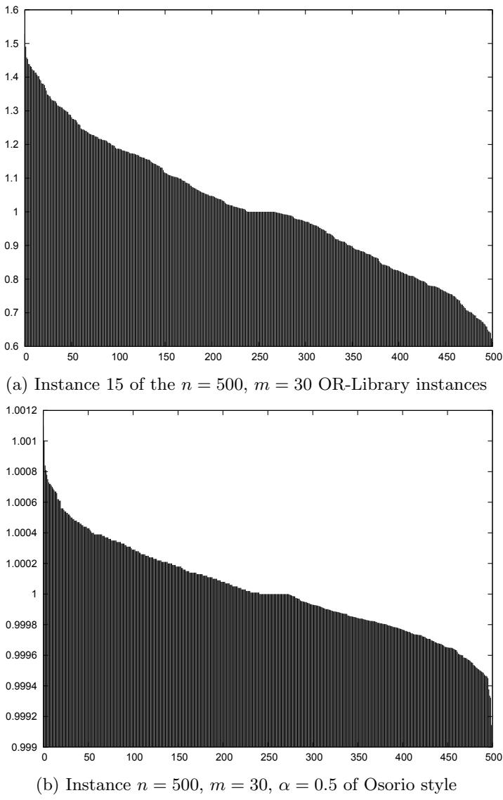  
Figure 6.3: Utility ratios of instances of different type

Figure 6.4 shows the number of occurrences of the items in the last 700000 solutions that were generated in order of decreasing utility ratios for the two instances discussed above. The much smaller significance of the utility ratios for the Osorio style instances also becomes clear in this figure. This figure also explains the much shorter prefix that many or most solutions share and thus, the larger size of the Trie.

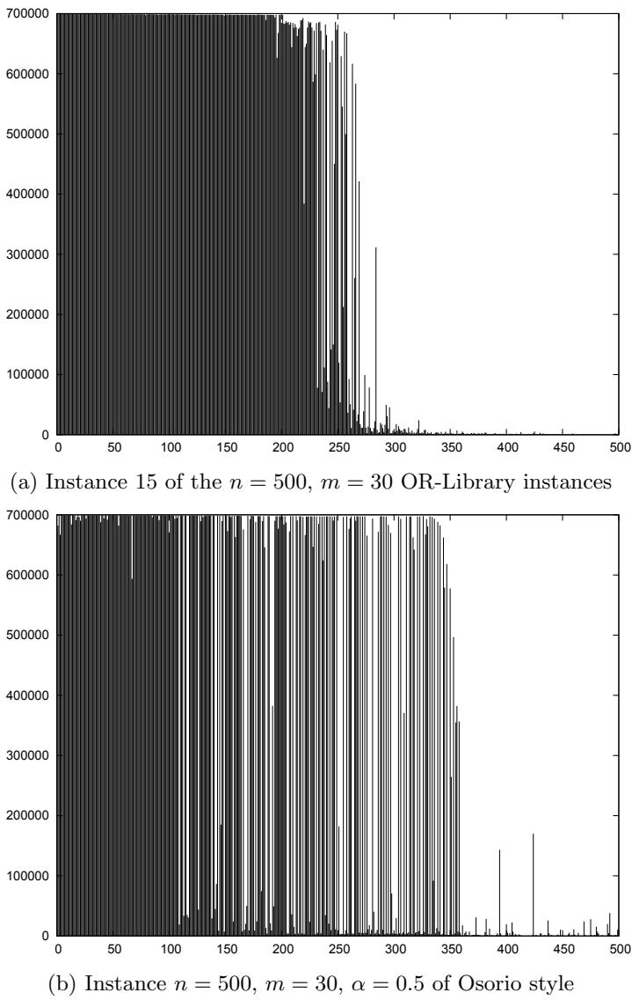  
Figure 6.4: Number of occurrences of items in the last 700000 solutions ordered according to decreasing utility ratios

# 6.2.3 Computation Time

Obviously, the effort for inserting each solution into the Trie and searching for an alternative solution in case a duplicate solution is encountered slows down the genetic algorithm. However, this additional computation time is spent for finding new solutions on the boundary of the feasible region.

Table 6.6: Average runtime for the 30 OR-Library instances   

<table><tr><td colspan="2" rowspan="2">prob.</td><td rowspan="2">α</td><td colspan="3">GA</td><td colspan="3">GA with Trie</td></tr><tr><td>time</td><td>#solutions</td><td>t/s (ms)</td><td>time</td><td>#solutions</td><td>t/s (ms)</td></tr><tr><td>0</td><td>0.25</td><td></td><td>69.11</td><td>450834</td><td>0.1533</td><td>173.23</td><td>1000000</td><td>0.1732</td></tr><tr><td></td><td>1 0.25</td><td></td><td>69.98</td><td>430032</td><td>0.1627</td><td>177.05</td><td>1000000</td><td>0.1770</td></tr><tr><td></td><td>2</td><td>0.25</td><td>66.89</td><td>453433</td><td>0.1475</td><td>171.97</td><td>1000000</td><td>0.1720</td></tr><tr><td></td><td>3</td><td>0.25</td><td>68.01</td><td>429858</td><td>0.1582</td><td>178.85</td><td>1000000</td><td>0.1788</td></tr><tr><td></td><td>4</td><td>0.25</td><td>67.26</td><td>433835</td><td>0.1550</td><td>176.41</td><td>1000000</td><td>0.1764</td></tr><tr><td></td><td>5</td><td>0.25</td><td>69.12</td><td>461223</td><td>0.1499</td><td>175.86</td><td>1000000</td><td>0.1759</td></tr><tr><td></td><td>6</td><td>0.25</td><td>67.34</td><td>458551</td><td>0.1468</td><td>172.14</td><td>1000000</td><td>0.1721</td></tr><tr><td></td><td>7</td><td>0.25</td><td>70.31</td><td>456527</td><td>0.1540</td><td>175.49</td><td>1000000</td><td>0.1755</td></tr><tr><td></td><td>8</td><td>0.25</td><td>67.85</td><td>440398</td><td>0.1541</td><td>172.88</td><td>1000000</td><td>0.1729</td></tr><tr><td>9</td><td></td><td>0.25</td><td>67.03</td><td>430714</td><td>0.1556</td><td>171.19</td><td>1000000</td><td>0.1712</td></tr><tr><td>10</td><td>0.50</td><td></td><td>76.90</td><td>494549</td><td>0.1555</td><td>170.48</td><td>1000000</td><td>0.1705</td></tr><tr><td>11</td><td>0.50</td><td></td><td>74.77</td><td>509549</td><td>0.1467</td><td>167.21</td><td>1000000</td><td>0.1672</td></tr><tr><td>12</td><td>0.50</td><td></td><td>73.66</td><td>523326</td><td>0.1408</td><td>164.42</td><td>1000000</td><td>0.1644</td></tr><tr><td>13</td><td>0.50</td><td></td><td>77.99</td><td>477733</td><td>0.1632</td><td>173.83</td><td>1000000</td><td>0.1738</td></tr><tr><td>14</td><td>0.50</td><td></td><td>75.27</td><td>494637</td><td>0.1522</td><td>168.26</td><td>1000000</td><td>0.1683</td></tr><tr><td>15</td><td>0.50</td><td></td><td>76.97</td><td>541805</td><td>0.1421</td><td>166.97</td><td>1000000</td><td>0.1670</td></tr><tr><td>16</td><td>0.50</td><td>76.61</td><td></td><td>480393</td><td>0.1595</td><td>171.41</td><td>1000000</td><td>0.1714</td></tr><tr><td>17</td><td>0.50</td><td>75.17</td><td></td><td>539292</td><td>0.1394</td><td>164.69</td><td>1000000</td><td>0.1647</td></tr><tr><td>18</td><td></td><td>78.36</td><td></td><td>488849</td><td>0.1603</td><td>171.86</td><td>1000000</td><td>0.1719</td></tr><tr><td>19</td><td>0.50</td><td>77.17</td><td></td><td>511657</td><td>0.1508</td><td>170.19</td><td>1000000</td><td>0.1702</td></tr><tr><td>20</td><td>0.50</td><td>74.14</td><td></td><td>554411</td><td>0.1337</td><td>152.10</td><td>1000000</td><td></td></tr><tr><td>21</td><td>0.75</td><td>72.53</td><td></td><td>567653</td><td>0.1278</td><td>149.79</td><td>1000000</td><td>0.1521 0.1498</td></tr><tr><td>22</td><td>0.75</td><td></td><td></td><td>527001</td><td>0.1423</td><td>155.50</td><td>1000000</td><td>0.1555</td></tr><tr><td>23</td><td>0.75</td><td>75.00 73.33</td><td></td><td>573695</td><td>0.1278</td><td>150.13</td><td>1000000</td><td>0.1501</td></tr><tr><td>24</td><td>0.75</td><td>73.71</td><td></td><td>561633</td><td>0.1312</td><td>151.61</td><td>1000000</td><td>0.1516</td></tr><tr><td>25</td><td>0.75</td><td>77.73</td><td></td><td>552030</td><td>0.1408</td><td>157.65</td><td>1000000</td><td>0.1577</td></tr><tr><td>26</td><td>0.75</td><td>73.90</td><td></td><td>572731</td><td>0.1290</td><td>150.99</td><td>1000000</td><td>0.1510</td></tr><tr><td>27</td><td>0.75</td><td>74.54</td><td></td><td>519794</td><td>0.1434</td><td>156.46</td><td>1000000</td><td>0.1565</td></tr><tr><td>28</td><td>0.75</td><td>73.98</td><td>575665</td><td></td><td>0.1285</td><td>150.40</td><td>1000000</td><td>0.1504</td></tr><tr><td>29</td><td>0.75</td><td>75.30</td><td></td><td></td><td></td><td>154.44</td><td>1000000</td><td>0.1544</td></tr><tr><td></td><td>0.75 0.25</td><td>68.29</td><td></td><td>548697 444540.91</td><td>0.1372 0.1537</td><td>174.51</td><td>1000000</td><td>0.1745</td></tr><tr><td></td><td>0.50</td><td>76.29</td><td></td><td>506179.56</td><td>0.1510</td><td>168.93</td><td>1000000</td><td>0.1689</td></tr><tr><td></td><td>0.75</td><td>74.42</td><td>555331.53</td><td></td><td>0.1342</td><td>152.91</td><td>1000000</td><td></td></tr><tr><td></td><td></td><td></td><td></td><td></td><td></td><td></td><td></td><td>0.1529</td></tr></table>

Table 6.6 compares the average computation time of the original algorithm with the computation time of the archive-enhanced version. The column ‘#solutions’ lists the average number of unique solutions that were generated per run by the genetic algorithm. For the original algorithms this number can only be estimated by subtracting the number of duplicates that are identified by the archive from the number of solutions generated (106). To obtain the number of duplicates that are only detected by the archive and are not detected by the original algorithm, the number of duplicates that were detected with the original algorithm is subtracted from the number of duplicates detected by the archive. The resulting number of unique solutions generated by the original algorithm is however only an estimate that has been calculated on the average values obtained for 50 runs for each instance. For the archive-enhanced version the number of unique solutions is $1 0 ^ { 6 }$ . The column ‘t/s’ indicates the average time spent for generating and evaluating one solution. Obviously the time for generating a solution is slightly higher. However, the bounding procedure that is used in the archive (see section 4.5) eliminates solutions from the searchspace without generating and evaluating them. Thus, the number of solutions that are contained in the completed regions of the archive is usually higher than the $1 0 ^ { 6 }$ solutions unique solutions that are evaluated. The number of solutions that are eliminated by the bounding procedure without explicitly generating and evaluating them is hard to be estimated reasonably.

# Chapter 7

# Conclusion

In this thesis a genetic algorithm enhanced with a complete solution archive based on a Trie is presented. Besides inserting each solution into the archive a special procedure searches for alternative unvisited solutions if duplicates are detected on insertion. Furthermore a bounding procedure eliminates regions of the search space by computing upper bounds based on the surrogate LP relaxation at each level of the Trie. The genetic algorithm that is enhanced by the archive uses a repair operator to ensure that each solution that is generated is located on the boundary of the feasible region. The procedure that searches for alternative solutions ensures that only new boundary solutions are generated. Computational results show that the number of duplicate solutions generated by the original genetic algorithm is significant for many instances. For those instances the genetic algorithm generates more unique solutions and thus evaluates a larger portion of the search space. The quality of the solutions obtained by the genetic algorithm could be slightly improved by the use of the solution archive.

# 7.1 Suggestions for future work

Strongly correlated instances are harder to solve than weakly correlated instances. For those instances the original genetic algorithm does not produce as many duplicates as for strongly correlated ones. Especially large scale instances with more than 1000 items pose a handicap for the solution archive. The ratio of duplicate solutions generated with the original algorithm decreases as the size of the instance increases. Thus the benefit of the solution archive decreases as well. Furthermore, the size of the solution archive grows with the number of items. Thus, for very large instances the number of solutions that can be inserted in the archive is limited. For such instances the archive enhanced version cannot produce as many solutions as the original version.

Improvements of the data structure may reduce the amount of memory that is needed by the solution archive. For example, there may (and in general are) be many solutions contained in the Trie that differ only at few places. A set of such solutions may contain much redundancy that may be reduced by some means resulting in a more compact representation of the solutions in the Trie.

The bounding procedure that is used to eliminate regions of the Trie where no optimal solution can be located might also be improved probably.

# Bibliography

[BBM93a] D. Beasley, D.R. Bull, and R.R. Martin. An Overview of Genetic Algorithms: Part 2, Research Topics. University Computing, 15(4):170–181, 1993.   
[BBM93b] D. Beasley, D.R. Bull, and R.R. Martin. An overview of genetic algorithms: Part 1, fundamentals. University Computing, 15(2):58–69, 1993.   
[BD02] D. Bertsimas and R. Demir. An Approximate Dynamic Programming Approach to Multidimensional Knapsack Problems. Management Science, 48(4):550–565, 2002.   
[Bea90] J.E. Beasley. Or-library, 1990. http://people.brunel.ac.uk/ \~mastjjb/jeb/info.html.   
[BM80] E. Balas and C.H. Martin. Pivot and complement-a heuristic for 0-1 programming. Management Science, 26(1):86–96, 1980.   
[BMM01] G.J. Beaujon, S.P. Marin, and G.C. McDonald. Balancing and optimizing a portfolio of r & d projects. Naval Research Logistics, 48(1):18–40, 2001.   
[BYFA08] S. Balev, N. Yanev, A. Fr´eville, and R. Andonov. A dynamic programming based reduction procedure for the multidimensional 0- 1 knapsack problem. European Journal of Operational Research, 127(1):63–76, 2008.   
[Cab70] A.V. Cabot. An enumeration algorithm for knapsack problems. Operations Research, 18(2):306–311, 1970.   
[CB98] P.C. Chu and J.E. Beasley. A genetic algorithm for the multidimensional knapsack problem. Journal of Heuristics, 4(1):63–86, 1998.   
[Dav91] L. Davis. Handbook of genetic algorithms. Van Nostrand Reinhold New York, 1991.   
[DV93] F. Dammeyer and S. Voß. Dynamic tabu list management using the reverse elimination method. Annals of Operations Research, 41(2):29–46, 1993.   
[EMT95] LF Escudero, S. Martello, and P. Toth. A framework for tightening 0-1 programs based on extensions of pure 0-1 kp and ss problems. Integer Programming and Combinatorial Optimization: 4th International IPCO Conference, Copenhagen, Denmark, May 29-31, 1995: Proceedings, 1995.   
[FH05] A. Fr´eville and S.¨I. Hanafi. The multidimensional 0-1 knapsack problem—bounds and computational aspects. Annals of Operations Research, 139(1):195–227, 2005.   
[Fre60] E. Fredkin. Trie memory. Communications of the ACM, 3(9):490–499, 1960.   
[Fr´e04] A. Fr´eville. The multidimensional 0-1 knapsack problem: An overview. European Journal of Operational Research, 127(1):1– 21, 2004.   
[G+89] D.E. Goldberg et al. Genetic algorithms in search, optimization, and machine learning. Addison-Wesley, 1989.   
[GG66] P.C. Gilmore and R.E. Gomory. The theory and computation of knapsack functions. Operations Research, 14(6):1045–1074, 1966.   
[Glo65] F. Glover. A multiphase-dual algorithm for the zero-one integer programming problem. Operations Research, 13(6):879–919, 1965.   
[Got00] J. Gottlieb. On the effectivity of evolutionary algorithms for the multidimensional knapsack problem. In AE ’99: Selected Papers from the 4th European Conference on Artificial Evolution, volume 1829 of Lecture Notes in Computer Science, pages 23–37. Springer-Verlag, 2000.   
[GP82] B. Gavish and H. Pirkul. Allocation of databases and processors in a distributed computing system. Management of Distributed Data Processing, 31:215–231, 1982.   
[GP85] B. Gavish and H. Pirkul. Efficient algorithms for solving multiconstraint zero-one knapsack problems to optimality. Mathematical Programming, 31(1):78–105, 1985.   
[Gre67] C.J. Green. Two algorithms for solving the independent multidimensional knapsack problem. Management Sciences Report 110, Carnegie Institute of Technology, Graduate School for Industrial Administration, Pittsburgh, USA, 1967.   
[GSV73] C.E. Gearing, W.W. Swart, and T. Var. Determining the optimal investment policy for the tourism sector of a developing country. Management Science, 20(4):487–497, 1973.   
[Gus97] D. Gusfield. Algorithms on strings, trees, and sequences. Cambridge University Press New York, 1997.   
[HLM96] A. Hoff, A. Løkketangen, and I. Mittet. Genetic algorithms for $0 / 1$ multidimensional knapsack problems. Proceedings Norsk Informatikk Konferanse, pages 291–301, 1996.   
[Hol75] J.H. Holland. Adaptation in Natural and Artificial Systems. Ann Arbor: University of Michigan Press, 1975.   
[KBH94] S. Khuri, T. B¨ack, and J. Heitk¨otter. The zero/one multiple knapsack problem and genetic algorithms. Proceedings of the 1994 ACM symposium on Applied computing, pages 188–193, 1994.   
[Knu73] D.E. Knuth. The Art of Computer Programming: Sorting and Searching, vol. 3. Addison Wesley, 1973.   
[KPP04] H. Kellerer, U. Pferschy, and D. Pisinger. Knapsack Problems. Springer, 2004.   
[Kra99] J. Kratica. Improving performances of the genetic algorithm by caching. Computers and artificial intelligence, 18(3):271–283, 1999.   
[LM79] R. Loulou and E. Michaelides. New greedy-like heuristics for the multidimensional 0-1 knapsack problem. Operations Research, 27(6):1101–1114, 1979.   
[LS55] J.H. Lorie and L.J. Savage. Three problems in rationing capital. The Journal of Business, 28(4):229–239, 1955.   
[LS67] C.E. Lemke and K. Spielberg. Direct search algorithms for zero-one and mixed-integer programming. Operations Research, 15(5):892–914, 1967.   
[MCS01] H. Meier, N. Christofides, and G. Salkin. Capital budgeting under uncertainty-an integrated approach using contingent claims analysis and integer programming. Operations Research, 49(2):196–206, 2001.   
[MM57] H.M. Markowitz and A.S. Manne. On the solution of discrete programming problems. Econometrica, 25(1):84–110, 1957.   
[OGH02] M.A. Osorio, F. Glover, and P. Hammer. Cutting and Surrogate Constraint Analysis for Improved Multidimensional Knapsack Solutions. Annals of Operations Research, 117(1):71–93, 2002.   
[PF99] R.J. Povinelli and X. Feng. Improving genetic algorithms performance by hashing fitness values. Artificial Neural Networks in Engineering, pages 399–404, 1999.   
[Pov00] R.J. Povinelli. Improving computational performance of genetic algorithms: A comparison of techniques. Late Breaking Papers of Genetic and Evolutionary Computation Conf.(GECCO-2000), pages 297–302, 2000.   
[PRP06] J. Puchinger, G.R. Raidl, and U. Pferschy. The core concept for the multidimensional knapsack problem. In Jens Gottlieb and G¨unther R. Raidl, editors, EvoCOP, volume 3906 of Lecture Notes in Computer Science, pages 195–208. Springer, 2006.   
[RG99] G.R. Raidl and J. Gottlieb. On the importance of phenotypic duplicate elimination in decoder-based evolutionary algorithms. Late Breaking Papers at the 1999 Genetic and Evolutionary Computation Conference, pages 204–211, 1999.   
[RG05] G.R. Raidl and J. Gottlieb. Empirical Analysis of Locality, Heritability and Heuristic Bias in Evolutionary Algorithms: A Case Study for the Multidimensional Knapsack Problem. Evolutionary Computation, 13(4):441–475, 2005.   
[Ron95] S. Ronald. Preventing diversity loss in a routing genetic algorithm with hash tagging. Complexity International, 2, 1995.   
[Shi79] W. Shih. A branch and bound method for the multiconstraint zero-one knapsack problem. The Journal of the Operational Research Society, 30(4):369–378, 1979.   
[ST68] S. Senju and Y. Toyoda. An approach to linear programming with 0-1 variables. Management Science, 15(4):196–207, 1968.   
[VH01] M. Vasquez and J.K. Hao. A hybrid approach for the 0–1 multidimensional knapsack problem. Proceedings of the 17th International Joint Conference on Artificial Intelligence, pages 328–333, 2001.   
[VV05] M. Vasquez and Y. Vimont. Improved results on the 0-1 multidimensional knapsack problem. European Journal of Operational Research, 127(1):70–81, 2005.