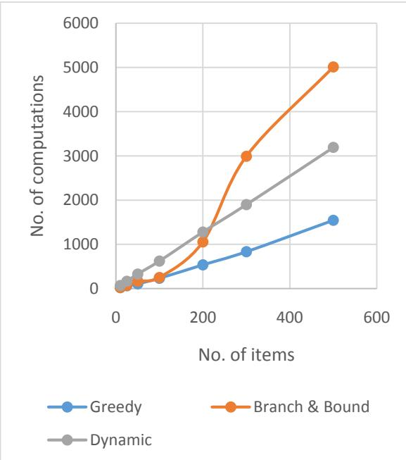
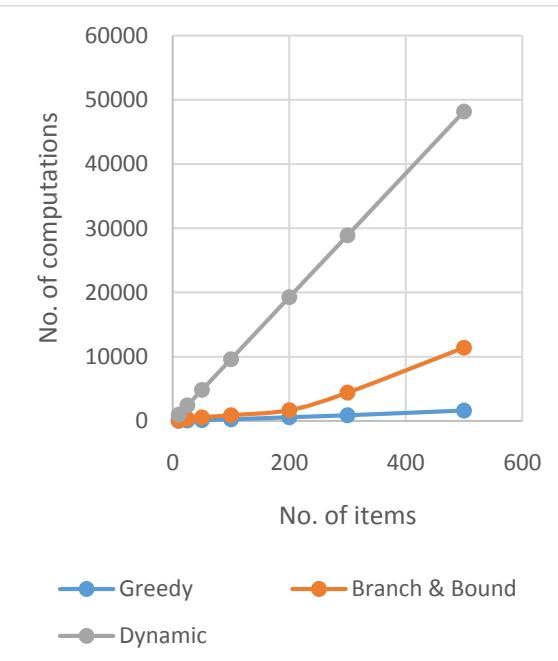
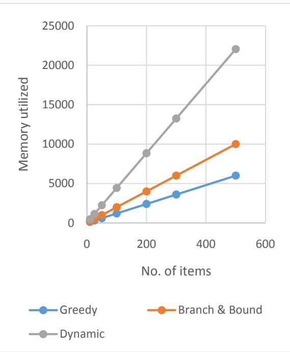
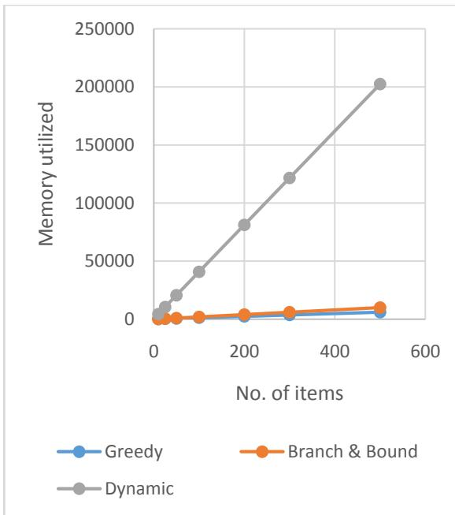

# A Study of Performance Analysis on Knapsack Problem

Pushpa S .K. Information Science Department BMS Institute of Technology Bangalore, India

Mrunal T .V. Information Science Department BMS Institute of Technology Bangalore, India

C .Suhas Information Science Department BMS Institute of Technology Bangalore, India

# ABSTRACT

The Knapsack problem is a problem in combinatorial optimization, where we find the optimal solution of the given problem such that it satisfies the given constraint. Knapsack problems appear in real-world decision-making processes in a wide variety of fields, such as finding the least wasteful way to cut raw materials, selection of investments and portfolios, selection of assets for asset-backed securitization, and generating keys for the MerkleHellman and other knapsack cryptosystems [12].

There are various ways to solve the knapsack problem. In this paper, we present Greedy Algorithm, Dynamic Programming, Branch and Bound Technique to solve the Knapsack problem, along with the analysis of its efficiency, and accuracy. The Greedy, Branch and Bound techniques are modified in pursuance of potency. The Greedy technique is altered to work for a 0/1 Knapsack problem. A recursive method is used for the Branch and Bound technique to expedite the computations and to reduce the memory consumed.

# General Terms

Capacity, Items, Profit, Weight

# Keywords

Knapsack, Maximize, Optimal solution, Efficiency

# 1. INTRODUCTION

The knapsack problem or rucksack problem is a problem, to determine the number of each item to include in a collection so that the total weight is less than or equal to a given limit and the total value is as large as possible. It derives its name from the problem faced by someone who is constrained by a fixedsize knapsack and must fill it with the most valuable items. The problem often arises in resource allocation where there are financial constraints and is studied in fields such as combinatorics, computer science, complexity theory, cryptography, applied mathematics, and daily fantasy sports [12].

The knapsack problem is interesting from the perspective of computer science for many reasons. The decision problem form of the knapsack problem is NP-complete, thus there is no known algorithm both correct and fast (polynomialtime) on all cases. While the decision problem is NP-complete, the optimization problem is NP-hard, its resolution is at least as difficult as the decision problem, and there is no known polynomial algorithm which can tell, given a solution, whether it is optimal [2].

# Definition

The 0-1 knapsack problem,restricts the number of copies of each kind of item Xto zero or one.

Given a set of $N$ items numbered from 1 up to $N _ { ; }$ ,each with a weight $W _ { i }$ and a value $V _ { i } ,$ along with a maximum weight capacity $M$

Maximize:

$$
\sum _ { i = 1 } ^ { N } V i X i
$$

Subject to:

$$
\sum _ { i = 1 } ^ { N } W i X i \leq M ,
$$

$X i \in \{ 0 , 1 \} .$

Here $X _ { i }$ represents the number of instances of item $i$ to include in the knapsack. Informally, the problem is to maximize the sum of the values of the items in the knapsack so that the sum of the weights is less than or equal to the knapsack's capacity.

# 2. METHODOLOGY

# 2.1 Greedy Algorithm

2.1.1 Introduction

There are several Greedy techniques to solve a Knapsack problem. The most efficient technique follows the following procedure:

Compute the profit-weight ratio of for the given items.   
Sort the array containing the ratio of the items in decreasing order.   
Place the item with the highest ratio into the Knapsack if it does not exceed the capacity of the Knapsack, else proceed to the next item.

# 2.1.2 Algorithm

Algorithm GreedyKnapsack( M, N, W, P, MP )

/Purpose: To find the maximum profit of the Knapsack using greedy technique.

// Input: M is the capacity of the Knapsack.

N is the number of items.

W is an array consisting of weight of all N items sorted in decreasing order of profit-weight ratio.

$\mathrm { P }$ is the array consisting of profit of all N items.

/Output: MP, the maximum profit.

$\mathbf { f o r } i \gets 1$ to ndo

$\mathbf { M P  M P + P _ { i } }$

end for

# returnMP

# 2.1.3 Complexity:

This method uses two steps to solve the problem:

1) Time minimum required to sort the array: $\mathbf { O } ( \mathbf { N } ^ { * } \mathbf { l o g } ( \mathbf { N } ) )$

2) Time required to choose the feasible set of items and find the maximum profit:

$$
\begin{array} { r } { \sum _ { 1 } ^ { N } \mathbf { 1 } = \mathbf { N } \approx \mathbf { O } ( \mathbf { N } ) } \end{array}
$$

Hence the required time complexity is: ${ \bf O } ( { \bf N } ^ { \star } { \bf l o g } ( { \bf N } ) ) + { \bf O } ( { \bf N } ) \approx$ $\mathbf { O } ( \mathbf { N } ^ { * } \mathbf { l o g } ( \mathbf { N } ) )$ .

# 2.1.4 Correctness

The greedy technique is one of the most efficient techniques to solve the knapsack problem, but the major drawback is its correctness. The greedy technique produces suboptimum solutions, which might not always lead to the optimum solution.

P:9854

W: 232 2

Capacity: 6

The optimum solution to the above problem is 18, but when the greedy technique is used, it results in 17.

To overcome this drawback, we present different techniques to solve this problem.

# 2.2 Dynamic Programming

# 2.2.1 Introduction

Dynamic Programming is a technique for solving problems whose solutions satisfy recurrence relations with overlapping sub-problems. Typically, these sub-problems arise from a recurrence relating solution to a given problem with solution to its smaller sub-problems of the same type. Rather than solving the sub-problems again and again, dynamic programming suggests in solving each of the smaller sub-problems only once and recording the results in a table from which we can then obtain a solution to the original problem.

The solution to the given knapsack problem is achieved in dynamic programming by finding the recurrence relation that expresses a solution to an instance of the knapsack problem in terms of solutions to its smaller sub-instances [1].

Let us consider an instance defined by the first i items, $1 \leq i \leq$ N, and the knapsack capacity $j ,$

$1 \le j \le \mathbf { M }$ Let $\mathrm { V } [ i , j ]$ be the value of an optimal solution to this instance, i.e., the value of the most valuable subset of the first $i _ { ; }$ . items that fit the knapsack of capacity $j$ .

Thus the required initial condition:

The recursive condition:

$$
\begin{array} { r l r } & { \mathsf { V } [ i , } & { j ] } \\ & { \{ \mathop { \bf m a x } \{ \boldsymbol { \mathsf { V } } [ i - 1 , j ] , \boldsymbol { \mathsf { V } } [ i - 1 , j - \boldsymbol { \mathsf { W i } } ] + \boldsymbol { \mathsf { P i } } \} j - \boldsymbol { \mathsf { W i } } \ge \mathbf { 0 } } \\ & { \qquad } & { \boldsymbol { \mathsf { V } } [ i - 1 , j ] j - \boldsymbol { \mathsf { W i } } < 0 } \end{array}
$$

# 2.2.2 Algorithm:

Algorithm DynamicKnapsack( N, M, W, P, V)

// Purpose: To find the maximum profit of the Knapsack using dynamic programming.

// Input: M is the capacity of the Knapsack.

N is the number of objects.

/Output: The optimal solution.

$\mathbf { f o r } i \gets 0$ to $_ \mathrm { N }$ do

$$
\mathbf { i f } ( \mathbf { \nabla } i = 0 \mathrm { o r } j = 0 \mathbf { \Gamma }
$$

$$
{ \mathrm { V } } [ i , j ] = 0
$$

$$
\mathsf { V } [ i , j ] = \mathsf { V } [ i - 1 , j ]
$$

else

$$
\operatorname { V } [ i , j ] = \operatorname* { m a x } \ \{ \operatorname { V } [ i - 1 , j ] , \ \operatorname { V } [ i - 1 ,
$$

$$
\mathrm { \Delta _ { j - \mathrm { W _ { i } \mathrm { J } + P _ { i } \mathrm { \Delta _ { j } } } } }
$$

# end if

# end for

end for

returnV[N, M]

2.2.3Complexity:

The basic operation is computing the value of $\mathrm { V } [ i , j ]$ The number of times this is being executed can be calculated as shown below:

$$
\begin{array} { r l } & { \sum _ { \mathbf { 0 } } ^ { \mathbf { N } } \sum _ { \mathbf { 0 } } ^ { \mathbf { M } } \mathbf { \delta 1 } = \mathbf { \delta M } - \mathbf { 0 } + 1 } \\ & { \qquad \quad = \mathbf { \delta } ( \mathbf { M } + 1 ) \sum _ { \mathbf { 0 } } ^ { N } \mathbf { \delta 1 } } \\ & { \qquad \quad = \mathbf { \delta } ( \mathbf { M } + 1 ) \left( \mathbf { N } + 1 \right) } \\ & { \qquad \quad = \mathbf { \delta M N } + \mathbf { N } + 1 } \end{array}
$$

# Hence the time complexity of the dynamic knapsack algorithm is given by $\mathbf { \Theta } \Theta$ ( MN ).

# 2.2.4Correctness:

The dynamic programming always produces the optimum solution. This is illustrated below:

Initial conditions:

$$
\begin{array} { r l } & { \mathrm { , ~ } \quad \mathrm { V } [ i , j ] = 0 , \mathrm { i f } i \mathrm { o r } j = 0 ; } \\ & { \mathrm { , ~ } \quad \mathrm { V } [ i , j ] = - \infty , \mathrm { i f } j < 0 ; } \end{array}
$$

To form the remaining table dynamically, we use the following two conditions:

$$
\mathsf { V } [ i , j ] = \mathsf { V } [ i - 1 , j ] ;
$$

$\backslash \backslash$ Leavingith element. $\mathsf { V } [ \textit { i } , \textit { j } ] = \operatorname* { m a x } \left\{ \mathrm { V } [ \textit { i - } 1 , \textit { j } ] , \mathrm { V } [ \textit { i - } 1 ,  { j - } \mathrm { W } _ { \mathrm { i } } ] + \mathrm { P } _ { \mathrm { i } } \right\}$ | Including the ith element, when $j \leq \mathrm { W _ { i } }$ .

Hence, the solution is obtained in each sub-problem is the suboptimum solution, which eventually leads to the optimal solution.

# 2.3 Branch and Bound

# 2.3.1 Introduction

Branch and bound is a technique used only to solve optimization problems. It is an improvement over exhaustive search, because unlike it, branch and bound constructs candidate solutions one component at a time and evaluates the partly constructed solutions. If no potential values of the remaining components can lead to a solution, the remaining components are not generated at all. This approach makes it possible to solve some large instances of difficult combinatorial problems, though, in the worst case, it still has an exponential complexity [3].

Branch and bound is based on the construction of a 'state space tree'. A node's bound value is compared with the value of the best seen solution so far. If the bound value is not better than the best seen solution so far, i.e., not smaller for minimization and not larger for maximization, the node is non-promising and can be terminated because no solution obtained from it can yield a better solution than the one already available. This is the principle idea of the branch-and-bound technique [3].

To solve the knapsack problem in this technique, the upper bound $( u b )$ has to be calculated. This can be computed by adding the total profit of the items that are already selected, say $p$ , the product of the remaining capacity of the knapsack, $\mathbf { M } \mathbf { - } w$ and the best profit-weight ratio, which is $\mathrm { P _ { i + 1 } / W _ { i + 1 } }$ [1].

In the algorithm described below, a recursive function is used to reduce the total amount of data consumed by the program, instead of the original branch and bound algorithm which generates all the nodes of the state space-tree, and places it in the priority queue.

# 2.3.2 Algorithm:

Algorithm Branch&BoundKnapsack( N, M, W, P, i , w, p )

/ Purpose: To find the maximum profit of the Knapsack using branch and bound technique.

// Input: M is the capacity of the Knapsack.

N is the number of items.

W is an array consisting of weight of all N items sorted in decreasing order of profit-weight ratio.

P is the array consisting of profit of all N items sorted in decreasing order of profit-weight ratio.

idenotes the index pointing to the above arrays $i \gets$ 1 initially).

pdenotes the current sum of profit ( $p \gets 0$ initially).

wdenotes the current sum of weight ( $w  0$ initially).

//Output: The optimal solution.

$$
\begin{array} { l } { \mathbf d \mathbf { 0 } w = w + \mathbf { W } _ { \mathrm { i } } } \\ { p = p + \mathrm { P _ { i } } } \\ { i \xleftarrow { } i + 1 } \end{array}
$$

# end while

$$
u b { = } p + \left( \mathrm { \textbf { M } } { - } w \right) \left( \mathrm { \textbf { P } } _ { \mathrm { i + 1 } } / \mathrm { \textbf { W } } _ { \mathrm { i + 1 } } \right)
$$

//

Find the upper bound.

$$
\mathbf { i f } ( u b \geq p )
$$

$$
\mathbf { i f } ( i < \mathrm { N } )
$$

Branch&BoundKnapsack( N, M, W, P, (i +1) , w, p )

# end if

# 2.3.3 Complexity

During the worst case scenario, all the nodes of the tree are formed, and hence can go up to $( 2 ^ { \mathrm { N } } { - } 1 )$ nodes. But this method is more efficient than the Exhaustive Search method, in which $\mathrm { ~ N ~ } ^ { * } \ 2 ^ { \mathrm { N } }$ iterations take place for every problem. Hence the required time complexity is ${ \bf O } ( 2 ^ { { \bf N } } )$ .

# 2.3.4 Correctness

Since the tree is formed by finding the upper-bound of each node, and then finding the profit of each node whenever the solution is feasible, the optimal solution always lies within the generated nodes. Since we select the node with the highest profit value within the given constraint, this technique always produces the optimal solution.

# 3. ANALYSIS

A 1998 study of the Stony Brook University Algorithm Repository showed that, out of 75 algorithmic problems, the knapsack problem was the 18th most popular and the 4th most needed after kd-trees , suffix trees , and the bin packing problem[12].

Aspects such as the capacity and the number of items of the knapsack play a vital role in the computation of the number of basic operations and the total memory consumed by the algorithms used. Hence, the analysis of the above algorithms have been made by varying the number of inputs and the capacity of the knapsack.

First, the No. of computations, i.e. the number of basic operations in the algorithms have been computed. Then, the total memory consumed by the data structures used in the algorithms have been computed. The results are presented below.

# $\mathbf { 3 . 1 N 0 } .$ of computations

The analysis of the number of computations is done by generating the number of basic operations made by the algorithms by varying the number of items, and using random values for the profit and weight of each item included. The capacity of the knapsack is kept constant at each case. The results obtained are tabulated and are presented below:

1. Varying the number of Items and having fixed Capacity $= 1 0$

Table. 1   
Table. 1 suggests that the number of computations of the three techniques increase with different rates with the increase in the number of items.   

<table><tr><td rowspan=1 colspan=1>No. of items</td><td rowspan=1 colspan=1>Greedy</td><td rowspan=1 colspan=1>Branch &amp;Bound</td><td rowspan=1 colspan=1>Dynamic</td></tr><tr><td rowspan=1 colspan=1>10</td><td rowspan=1 colspan=1>22</td><td rowspan=1 colspan=1>28</td><td rowspan=1 colspan=1>73</td></tr><tr><td rowspan=1 colspan=1>25</td><td rowspan=1 colspan=1>65</td><td rowspan=1 colspan=1>77</td><td rowspan=1 colspan=1>168</td></tr><tr><td rowspan=1 colspan=1>50</td><td rowspan=1 colspan=1>110</td><td rowspan=1 colspan=1>168</td><td rowspan=1 colspan=1>329</td></tr><tr><td rowspan=1 colspan=1>100</td><td rowspan=1 colspan=1>235</td><td rowspan=1 colspan=1>253</td><td rowspan=1 colspan=1>623</td></tr><tr><td rowspan=1 colspan=1>200</td><td rowspan=1 colspan=1>538</td><td rowspan=1 colspan=1>1057</td><td rowspan=1 colspan=1>1279</td></tr><tr><td rowspan=1 colspan=1>300</td><td rowspan=1 colspan=1>835</td><td rowspan=1 colspan=1>2993</td><td rowspan=1 colspan=1>1899</td></tr><tr><td rowspan=1 colspan=1>500</td><td rowspan=1 colspan=1>1545</td><td rowspan=1 colspan=1>5012</td><td rowspan=1 colspan=1>3192</td></tr></table>

The graph of Table. 1 is plotted below, with the No. of items on the X-axis and the No. of computations on the Y-axis:

  
Graph. 1

The above graph shows that the Branch & Bound technique has a non-linear rate of increase in the No. of computations. For small capacities, Dynamic Programming technique has the better efficiency, in terms of the number of basic operations.

2. Varying the number of Items and having fixed Capacity $= 1 0 0$

Table. 2   

<table><tr><td rowspan=1 colspan=1>No. of items</td><td rowspan=1 colspan=1>Greedy</td><td rowspan=1 colspan=1>Branch &amp;Bound</td><td rowspan=1 colspan=1>Dynamic</td></tr><tr><td rowspan=1 colspan=1>10</td><td rowspan=1 colspan=1>27</td><td rowspan=1 colspan=1>78</td><td rowspan=1 colspan=1>973</td></tr><tr><td rowspan=1 colspan=1>25</td><td rowspan=1 colspan=1>82</td><td rowspan=1 colspan=1>342</td><td rowspan=1 colspan=1>2418</td></tr><tr><td rowspan=1 colspan=1>50</td><td rowspan=1 colspan=1>134</td><td rowspan=1 colspan=1>576</td><td rowspan=1 colspan=1>4829</td></tr><tr><td rowspan=1 colspan=1>100</td><td rowspan=1 colspan=1>266</td><td rowspan=1 colspan=1>913</td><td rowspan=1 colspan=1>9623</td></tr><tr><td rowspan=1 colspan=1>200</td><td rowspan=1 colspan=1>582</td><td rowspan=1 colspan=1>1687</td><td rowspan=1 colspan=1>19279</td></tr><tr><td rowspan=1 colspan=1>300</td><td rowspan=1 colspan=1>888</td><td rowspan=1 colspan=1>4425</td><td rowspan=1 colspan=1>28899</td></tr><tr><td rowspan=1 colspan=1>500</td><td rowspan=1 colspan=1>1614</td><td rowspan=1 colspan=1>11417</td><td rowspan=1 colspan=1>48192</td></tr></table>

Table.2 suggests that the number of computations of the Dynamic Programming technique increases with a high rate with increase in the number of items, for higher capacities, but it remains constant in the Greedy, Branch & Bound techniques.

This demonstrates the time complexity of the latter two techniques, which are independent of the capacity of the knapsack.

The graph of Table. 2 is plotted below, with the No. of items on the X-axis and the No. of computations on the Y-axis:

  
Graph. 2

# 3.2 Memory required

The analysis of the memory required for the algorithms is made by varying the total capacity of the knapsack, and the total number of items available. The total memory consumption of each of the algorithms is computed in various cases, and are presented below:

1. Varying the number of Items and having fixed Capacity $= 1 0$

Table. 3   

<table><tr><td rowspan=1 colspan=1>No. ofitems</td><td rowspan=1 colspan=1>Greedy</td><td rowspan=1 colspan=1>Branch &amp;Bound</td><td rowspan=1 colspan=1>Dynamic</td></tr><tr><td rowspan=1 colspan=1>10</td><td rowspan=1 colspan=1>120</td><td rowspan=1 colspan=1>200</td><td rowspan=1 colspan=1>480</td></tr><tr><td rowspan=1 colspan=1>25</td><td rowspan=1 colspan=1>300</td><td rowspan=1 colspan=1>500</td><td rowspan=1 colspan=1>1140</td></tr><tr><td rowspan=1 colspan=1>50</td><td rowspan=1 colspan=1>600</td><td rowspan=1 colspan=1>1000</td><td rowspan=1 colspan=1>2240</td></tr><tr><td rowspan=1 colspan=1>100</td><td rowspan=1 colspan=1>1200</td><td rowspan=1 colspan=1>2000</td><td rowspan=1 colspan=1>4440</td></tr><tr><td rowspan=1 colspan=1>200</td><td rowspan=1 colspan=1>2400</td><td rowspan=1 colspan=1>4000</td><td rowspan=1 colspan=1>8840</td></tr><tr><td rowspan=1 colspan=1>300</td><td rowspan=1 colspan=1>3600</td><td rowspan=1 colspan=1>6000</td><td rowspan=1 colspan=1>13240</td></tr><tr><td rowspan=1 colspan=1>500</td><td rowspan=1 colspan=1>6000</td><td rowspan=1 colspan=1>10000</td><td rowspan=1 colspan=1>22040</td></tr></table>

Table. 3 shows that the Dynamic Programming technique has the highest memory requirement. This illustrates the working of this technique, using memoization, the process of storing solutions to the sub-problems instead of recomputing them.

The graph of Table.3is plotted below, with the No. of items on the $\mathrm { X }$ -axis and the Memory utilized by the algorithm on the Yaxis:

  
Graph. 3

The rate of increase of the memory utilization with the increase in the number of items is linear for all the three techniques, as shown in Graph. 3.

2 Varying the number of Items and having fixed Capacity $=$ 100

Table. 4   

<table><tr><td rowspan=1 colspan=1>No. ofitems</td><td rowspan=1 colspan=1>Greedy</td><td rowspan=1 colspan=1>Branch &amp;Bound</td><td rowspan=1 colspan=1>Dynamic</td></tr><tr><td rowspan=1 colspan=1>10</td><td rowspan=1 colspan=1>120</td><td rowspan=1 colspan=1>200</td><td rowspan=1 colspan=1>4400</td></tr><tr><td rowspan=1 colspan=1>25</td><td rowspan=1 colspan=1>300</td><td rowspan=1 colspan=1>500</td><td rowspan=1 colspan=1>10500</td></tr><tr><td rowspan=1 colspan=1>50</td><td rowspan=1 colspan=1>600</td><td rowspan=1 colspan=1>1000</td><td rowspan=1 colspan=1>20600</td></tr><tr><td rowspan=1 colspan=1>100</td><td rowspan=1 colspan=1>1200</td><td rowspan=1 colspan=1>2000</td><td rowspan=1 colspan=1>40800</td></tr><tr><td rowspan=1 colspan=1>200</td><td rowspan=1 colspan=1>2400</td><td rowspan=1 colspan=1>4000</td><td rowspan=1 colspan=1>81200</td></tr><tr><td rowspan=1 colspan=1>300</td><td rowspan=1 colspan=1>3600</td><td rowspan=1 colspan=1>6000</td><td rowspan=1 colspan=1>121600</td></tr><tr><td rowspan=1 colspan=1>500</td><td rowspan=1 colspan=1>6000</td><td rowspan=1 colspan=1>10000</td><td rowspan=1 colspan=1>202400</td></tr></table>

Table. 4 consists of the memory utilization of the algorithms for a high capacity $( = ~ 1 0 0 )$ . The table above shows that the memory utilized by the Dynamic programming technique is very high compared to the other algorithms at high capacities. This proves that this technique is inefficient when the capacity of the knapsack is high.

The graph of Table.4is plotted below, with the No. of items on the X-axis and the Memory utilized by the algorithm on the Yaxis:

  
Graph. 4

# 4. CONCLUSION

The most efficient technique is the Greedy Algorithm, but it is inappropriate under certain conditions since it does not result in the optimal solution.

The Dynamic programming technique proves to be very efficient in terms of number of computations for lesser capacities, but as the capacity of the knapsack increases, this technique proves to be inefficient. The memory utilized by this technique is also the highest among the three approaches considered.

Thus, the most efficient approach for the Knapsack Problem is the Recursive Branch and Bound technique. It is simple and is easy to apply, and can be applied to solve the knapsack problem under all the circumstances.

For future work, genetic algorithms could be applied for the given problem, and a comparative analysis of the performance of the original algorithms and the modified algorithms could be implemented.

# 5. REFERENCES

[1] Levitin, Anany. The Design and Analysis of Algorithms. New Jersey: Pearson Education Inc., 2003.   
[2] Knapsack problem- Wikipedia, the free encyclopedia. https://en.wikipedia.org/wiki/Knapsack_problem.   
[3] Hristakeva, Maya and DiptiSrestha. Different Approaches to Solve the 0/1 Knapsack Problem", MICS 2005 proceedings.www.micsymposium.org/mics_2005/papers/ paper102.pdf.   
[4] Martello, Silvano; Toth, Paolo (1990). Knapsack problems: Algorithms and computer interpretations. Wiley-Interscience.   
[5] Gossett, Eric. Discreet Mathematics with Proof. New Jersey: Pearson Education Inc., 2003.   
[6] 0/1KNAPSACKPROBLEMhttp://www.swatijain.tripod.c om/knapsack2.htm   
[7] CSCI 5454, CU Boulder. Crowd Source Lecture. DharanijaRamaswamyThatham, Pate Motter. 1 April, 2013. 1. Knapsack Problem.http://tuvalu.santafe.edu/\~aaronc/courses/5454/cs ci5454_spring2013_CSL2.   
[8] Knapsack Problem- Wiki Groups.http://wiki.gametheorylabs.com/groups/kb/wiki/fa 460/Knapsack_Problem.html.   
[9] Dynamic Programming, 0/1 Knapsack Problem. Dr. Steve Goddard.http://www.cse.unl.edu/\~goddard/Courses/CSCE 310J/Lectures/Lecture8-DynamicProgramming.pdf.   
[10] S. Dasgupta, C. H. Papadimitriou and U. V. Vazirani. Algorithms.   
[11] David Pisinger. "What are the hard Knapsack Problems?" Computers & Operations Research 32 (2005)www.dcs.gla.ac.uk/\~pat/cpM/jchoco/knapsack/pap ers/hardInstances.pdf.   
[12] The Info List- Knapsack Problem.http://theinfolist.com/php/SummaryGet.php?Find Go=Knapsack%20Problem.   
[13] S. P. Sajjan, Ravi kumarRoogi, Vijay kumarBadiger, SharanuAmaragatti. "A New Approach To Solve Knapsack Problem".http://www.computerscijournal.org/vol7no2/anew-approach-to-solve-knapsack-problem/.   
[14] Sanjay Rajopadhye, joint work with R. Andonov and V. Poirriez, Université de Valenciennes. "Parallel and VLSI Implementation of the Knapsack Problem".http://www.irisa.fr/cosi/Rajopadhye/knapsack.ht ml.